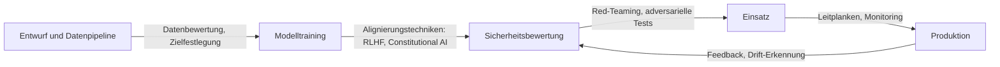

# KI-Sicherheit

## Definition

KI-Sicherheit ist das Forschungs- und Engineering-Feld, das sich damit befasst, dass KI-Systeme das tun, was wir beabsichtigen, und unter einem breiten Spektrum von Bedingungen sicher bleiben. Es umfasst drei Kernprobleme: Ausrichtung (Systeme, die menschliche Werte und Absichten korrekt repräsentieren und verfolgen), Robustheit (konsistentes Verhalten unter Verteilungsverschiebung, gegnerischen Eingaben und Randfällen) und Interpretierbarkeit (Verstehen, warum ein System eine bestimmte Ausgabe produziert hat). Diese Probleme verstärken sich gegenseitig: Robustheit ist schwerer ohne Interpretierbarkeit zu erreichen, und Interpretierbarkeit unterstützt die Überprüfung von Ausrichtungsgarantien.

KI-Sicherheit überschneidet sich mit [KI-Ethik](/docs/ai-ethics) — Ethik liefert den normativen Rahmen (welche Werte sollten Systeme anstreben), während Sicherheit das technische Problem angeht (wie man sicherstellt, dass sie es tun). [Bias in KI](/docs/bias-in-ai) ist ein Schnittpunkt: Verzerrte Ausgaben können sowohl ein Ausrichtungs- als auch ein Fairness-Problem sein. Für [LLMs](/docs/llms) und [Agenten](/docs/agents) bieten RLHF (Reinforcement Learning from Human Feedback), constitutional AI und skalierbare Überwachung die wichtigsten Werkzeuge; [erklärbare KI](/docs/xai) unterstützt Auditing und Debugging.

In der Praxis erstreckt sich Sicherheit über den gesamten Modell-Lebenszyklus. Während des Trainings umfasst dies Datenqualität, Ziele und Regularisierung. Während der Bewertung umfasst dies Red-Teaming, kontroverse Eingaben und Bewertung des Grenzverhaltens. Beim Einsatz umfasst dies Leitplanken, Monitoring und Mechanismen zum Eingreifen. Für Agenten-Systeme fügt die zunehmende Autonomie weitere Sicherheitsdimensionen hinzu: ob der Agent seine eigenen Einschränkungen korrekt versteht, korrekturbereit bleibt und Machtanhäufung oder irreversible Aktionen vermeidet.

## Funktionsweise

### Kernkomponenten der Sicherheit

**Ausrichtung** stellt sicher, dass ein Modell das beabsichtigte Ziel — nicht einen Proxy-Fehler oder eine Fehleroptimierung — verfolgt. RLHF trainiert Modelle, menschliche Präferenzen zu bevorzugen; Constitutional AI nutzt explizite Prinzipien; skalierbare Überwachung schlägt vor, zuverlässige KI-Assistenten zu nutzen, um menschliche Reviewer zu skalieren.

**Robustheit** testet das Systemverhalten unter veränderten Bedingungen. Gegnerisches Testen sucht nach Eingaben, die Ausfälle erzwingen. Poisoning-Tests prüfen, ob Trainingsdaten kompromittiert wurden. Distribution-Shift-Bewertungen messen die Degradation, wenn Eingaben von Trainingsdaten abweichen.



### Red-Teaming und Monitoring

Red-Teaming simuliert gegnerische Nutzung durch aktiven Versuch, das Modell zum Scheitern zu bringen. Automatisiertes Red-Teaming nutzt andere Modelle als Gegner, um die Abdeckung zu skalieren. Produktions-Monitoring erkennt unerwartete Verhaltensweisen, ungewöhnliche Ausgabemuster und Missbrauche.

## Wann verwenden / Wann NICHT verwenden

| Verwenden wenn | Vermeiden wenn |
|----------------|----------------|
| KI wird in Entscheidungsbereichen mit hohem Risiko eingesetzt (Kredit, Gesundheit, Justiz) | Das System erzeugt nur interne Empfehlungen ohne direkte Aktion |
| Modelle oder Agenten interagieren mit nicht-vertrauenswürdigen Eingaben oder öffentlichen Benutzern | Vollständige menschliche Überprüfung aller Ausgaben ist garantiert |
| Systeme führen irreversible Aktionen aus oder kontrollieren kritische Infrastruktur | Anwendung ist ein Low-Stakes-Prototyp mit eingeschränkter Bereitstellung |
| Regulierungskonformität oder externe Audits erforderlich sind | Risikoprofil ist sehr niedrig und vollständig durch bestehende Tests abgedeckt |

## Vergleiche

| Technik | Zielt auf | Typische Ergebnisse |
|---------|----------|---------------------|
| RLHF | Ausrichtung | Modelle, die menschliche Präferenzen folgen |
| Constitutional AI | Ausrichtung | Auf Prinzipien befolgenden Modellen |
| Adversarisches Testen | Robustheit | Identifizierte Randfälle und Fehlermodi |
| Red-Teaming | Sicherheitsüberprüfung | Missbrauch-Szenarien und Schutzmaßnahmen |
| Monitoring | Sicherheit zur Laufzeit | Melde für Drift und Missbrauch |

## Vor- und Nachteile

| Vorteile | Nachteile |
|----------|-----------|
| Reduziert das Risiko katastrophaler oder böswilliger Verwendung | Safety Engineering fügt Entwicklungszeit und -kosten hinzu |
| Schafft nachweisbare Garantien für Regulator und Auditor | Formale Ausrichtungsgarantien bleiben ein offenes Forschungsproblem |
| Leitplanken verbessern die Benutzererfahrung durch Ablehnen von Missbrauch | Übermäßig strenge Filter können nützliche Ausgaben ablehnen |
| Monitoring erkennt Probleme frühzeitig vor Eskalation | Verteilte oder agentenbasierte Systeme sind schwerer zu überwachen |

## Codebeispiele

### Einfache Ausgabe-Überprüfung mit regelbasierter Leitplanke (Python)

```python
import re

BLOCKED_PATTERNS = [
    r"\b(ssn|social security)\b",
    r"\b\d{3}-\d{2}-\d{4}\b",  # SSN format
    r"\bcredit.?card\b",
]

def check_output_safety(text: str) -> tuple[bool, str]:
    """Gibt (is_safe, reason) zurück."""
    lower = text.lower()
    for pattern in BLOCKED_PATTERNS:
        if re.search(pattern, lower):
            return False, f"Blockiertes Muster erkannt: {pattern}"
    return True, "OK"

response = "Ihre SSN ist 123-45-6789."
safe, reason = check_output_safety(response)
print(f"Sicher: {safe}, Grund: {reason}")
# Sicher: False, Grund: Blockiertes Muster erkannt: \b\d{3}-\d{2}-\d{4}\b
```

### Einfaches Prompt-Moderations-Wrapper

```python
from anthropic import Anthropic

client = Anthropic()

SYSTEM_PROMPT = """Du bist ein hilfreicher Assistent. Du musst:
- Keine schädlichen, illegalen oder täuschenden Inhalte erzeugen
- Klarmachen, wenn eine Anfrage außerhalb deiner Fähigkeiten liegt
- Nie so tun, als ob du ein Mensch wärst, wenn direkt gefragt
"""

def safe_chat(user_message: str) -> str:
    response = client.messages.create(
        model="claude-opus-4-5",
        max_tokens=1024,
        system=SYSTEM_PROMPT,
        messages=[{"role": "user", "content": user_message}],
    )
    return response.content[0].text

print(safe_chat("Hilf mir, diesen Fehler zu verstehen."))
```

## Praktische Ressourcen

- [Anthropic – KI-Sicherheitsforschung](https://www.anthropic.com/research) — Forschung zu Ausrichtung, constitutional AI und skalierbarer Überwachung
- [OpenAI – Sicherheit und Verantwortung](https://openai.com/safety) — Sicherheitspraktiken und Engagement
- [NIST AI Risk Management Framework](https://www.nist.gov/system/files/documents/2023/01/26/AI%20RMF%201.0.pdf) — Regierungsrahmen für KI-Risikomanagement
- [Alignment Forum](https://www.alignmentforum.org/) — Gemeinschaft für technische Ausrichtungsforschung

## Siehe auch

- [KI-Ethik](/docs/ai-ethics)
- [Erklärbare KI](/docs/xai)
- [Bias in KI](/docs/bias-in-ai)
- [Autonome Agenten](/docs/autonomous-agents)
