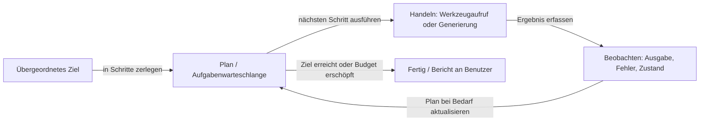
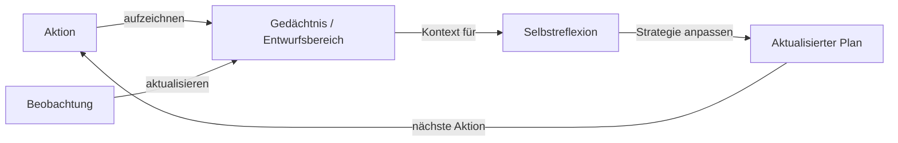

# Autonome Agenten

## Definition

Autonome Agenten verfolgen Ziele über ausgedehnte Zeiträume mit begrenztem menschlichen Input. Sie planen, nutzen Werkzeuge und passen sich an, wenn sich Umgebung oder Aufgabe ändern (z. B. Coding-Agenten, Forschungsassistenten). Im Gegensatz zu Single-Turn-Agenten, die eine Aufgabe in einer kurzen Schleife erledigen, halten autonome Agenten über viele Iterationen hinweg Zustände aufrecht und treffen eigenständige Entscheidungen darüber, wann sie fortfahren, wann sie erneut versuchen und wann sie um Klärung bitten sollen.

Sie befinden sich am „hohen Autonomie"-Ende des [Agenten](/docs/agents)-Spektrums: Anstatt eines Benutzer-Turns und einer Antwort führen sie lange Schleifen aus (Planen → Handeln → Beobachten → Neu planen), bis das Ziel erreicht oder ein Budget-/Schritt-Limit erreicht ist. Dies erfordert nicht nur effektive Werkzeugnutzung, sondern auch **Gedächtnis** (Verfolgung von dem, was versucht wurde und was funktioniert hat), **Planung** (Zerlegung des Ziels in eine Aufgabensequenz) und **Selbstreflexion** (Erkennen, wann ein Ansatz scheitert, und Versuchen von etwas anderem).

[Subagenten](/docs/subagents) und [Reasoning-Muster](/docs/reasoning-patterns) (z. B. ReAct, ToT) werden oft innerhalb autonomer Agenten verwendet, um einzelne Planungs- und Aktionsschritte zu strukturieren. Sicherheit und Aufsicht sind auf dieser Autonomiestufe kritische Anliegen: Autonome Agenten können irreversible Aktionen ausführen (Dateien löschen, E-Mails senden, Code ausführen) und müssen mit Genehmigungsgattern, Rollback-Mechanismen und menschlichen Kontrollpunkten konzipiert werden.

## Funktionsweise

### Plan–Handeln–Beobachten-Schleife



### Gedächtnis und Neuplanung



Der Agent beginnt mit einem **Ziel** (z. B. „Feature X implementieren"). Er **plant** (möglicherweise in Schritte oder Teilaufgaben aufgeteilt), dann **handelt** er (Werkzeugaufrufe, Code-Bearbeitungen, Suche). Der **Beobachtungs**-Schritt erfasst Ergebnisse (Werkzeugausgaben, Fehler, Zustandsänderungen) und speist sie für die nächste Iteration in den **Plan** zurück. Die Schleife kombiniert Planung, Gedächtnis (was versucht wurde, was funktioniert hat), Werkzeugnutzung und oft Reflexion (z. B. Selbstkritik oder Fehleranalyse). Sie läuft, bis eine Stoppbedingung erfüllt ist: Aufgabe erledigt, Schritt-/Budget-Limit erreicht oder ein menschlicher Kontrollpunkt ausgelöst.

## Wann verwenden / Wann NICHT verwenden

| Szenario | Autonome Agenten verwenden | Autonome Agenten nicht verwenden |
|---|---|---|
| Langfristige Coding-Aufgaben (implementieren, testen, iterieren) | Ja — passt sich an Testfehler und Kompilierungsfehler an | Nein — für einzelne Datei-Bearbeitungen reicht ein einfacher Agent |
| Forschungsaufgaben, die iteratives Informationssammeln erfordern | Ja — sucht, liest und synthetisiert über viele Schritte | Nein — wenn die Antwort ein einzelner Abruf ist |
| Datenpipelines, die sich an Schemaänderungen anpassen müssen | Ja — erkennt und verarbeitet unerwartete Eingabeformate | Nein — deterministische Pipelines sind zuverlässiger bei stabilen Schemas |
| Sicherheitskritische oder irreversible Aktionen | Nein — hohe Autonomie + Irreversibilität ist gefährlich | Ja — menschliche Genehmigung vor destruktiven Aktionen erforderlich |
| Einfache, vorhersehbare, einstufige Aufgaben | Nein — Autonomie-Overhead ist unnötig | Ja — ein direkter LLM-Aufruf oder eine einfache Kette ist schneller und günstiger |

## Vergleiche

| Agententyp | Horizont | Menschlicher Input | Planung | Gedächtnis | Sicherheitsbedenken |
|---|---|---|---|---|---|
| Single-Turn-Agent | Kurz (1 Schleife) | Pro Anfrage | Keine | Keine | Niedrig |
| ReAct-Agent | Mittel (N Schritte) | Pro Anfrage | Implizit | Kontextfenster | Niedrig–mittel |
| Subagenten-System | Mittel–lang | Wurzelebene | Delegiert | Pro Subagent | Mittel |
| Autonomer Agent | Lang (offen) | Minimal / Kontrollpunkte | Explizit | Persistent | Hoch |

## Vor- und Nachteile

| Vorteile | Nachteile |
|---|---|
| Bewältigt offene, langfristige Aufgaben ohne Schritt-für-Schritt-Anleitung | Schwer vorhersehbares oder begrenztes Verhalten |
| Passt sich dynamisch an Fehler und Umgebungsänderungen an | Kann irreversible oder unbeabsichtigte Aktionen ausführen |
| Reduziert manuelle Eingriffe bei komplexen Workflows erheblich | Das Debuggen erfordert die Inspektion langer, mehrstufiger Traces |
| Kann Subagenten und Reasoning-Muster für Teilaufgaben kombinieren | Die Kosten skalieren mit der Anzahl der Schritte und Werkzeugaufrufe |

## Code-Beispiele

```python
from openai import OpenAI

client = OpenAI()

SYSTEM = """You are an autonomous research agent. 
For each task:
1. Identify what information you need.
2. Use tools to gather it step by step.
3. Reflect on what you've found and whether you need more.
4. Produce a final answer when you are confident.
Always explain your reasoning before taking each action."""

def autonomous_agent(goal: str, max_steps: int = 8) -> str:
    messages = [
        {"role": "system", "content": SYSTEM},
        {"role": "user", "content": f"Goal: {goal}"},
    ]
    memory = []

    for step in range(max_steps):
        response = client.chat.completions.create(
            model="gpt-4o-mini",
            messages=messages,
        )
        reply = response.choices[0].message.content
        messages.append({"role": "assistant", "content": reply})
        memory.append(f"Step {step + 1}: {reply[:200]}")

        # Check if agent believes it's done
        if any(phrase in reply.lower() for phrase in ["final answer:", "in conclusion:", "task complete"]):
            return reply

        # Simulate an observation / environment response
        messages.append({
            "role": "user",
            "content": "Continue. What is your next step based on what you've found so far?",
        })

    return messages[-2]["content"]  # last agent message

result = autonomous_agent("Explain the key components of a production RAG system.")
print(result)
```

## Praktische Ressourcen

- [From Prototypes to Agents with ADK – Google Codelabs](https://codelabs.developers.google.com/your-first-agent-with-adk#0) — Autonome Agenten mit Googles ADK erstellen und bereitstellen
- [LangChain – Autonome Agenten](https://python.langchain.com/docs/concepts/agents/) — Langfristige Agentenmuster mit Gedächtnis und Planung
- [AutoGPT](https://github.com/Significant-Gravitas/AutoGPT) — Referenz-Open-Source-Agent mit Planung und Gedächtnis
- [SWE-agent](https://github.com/princeton-nlp/SWE-agent) — Autonomer Coding-Agent, der GitHub-Issues löst

## Siehe auch

- [Agenten](/docs/agents)
- [Subagenten](/docs/subagents)
- [Multi-Agenten-Systeme](/docs/agents/multi-agent-systems)
- [Reasoning-Muster](/docs/reasoning-patterns)
