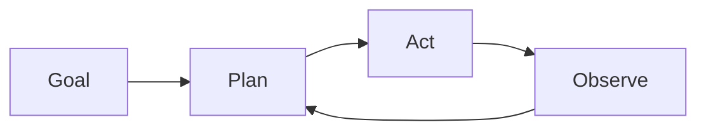

# Autonome Agenten

## Definition

Autonome Agenten verfolgen Ziele über längere Zeiträume mit begrenztem menschlichem Eingriff. They plan, use tools, and adapt wenn die environment or task changes (z. B. Programmierung agents, research assistants).

Sie befinden sich at the “hohe Autonomie” Ende des [agents](/docs/agents) Spektrums: anstatt one user turn and one response, they run long loops (plan → act → observe → replan) until the goal is met or a limit is hit. [Subagents](/docs/subagents) and [Schlussfolgern patterns](/docs/reasoning-patterns) (z. B. ReAct, ToT) werden oft used inside autonomous agents to structure planning and action.

## Funktionsweise

The agent starts from a **goal** (z. B. “Feature X implementieren”). It **plans** (possibly Aufteilung in Schritte oder Teilaufgaben), then **acts** (Tool-Aufrufe, code edits, search). The **observe** step captures results (tool outputs, errors, state) and feeds back into **plan** für den next iteration. The loop combines planning, memory (what was tried, what worked), tool use, and often reflection (z. B. self-critique). It runs until a stopping condition: task done, step/budget limit, or human-in-the-loop check. Safety and oversight (z. B. approval gates, rollback) are important when autonomy is high.

## Anwendungsfälle

Autonome Agenten eignen sich für langfristige, mehrstufige Arbeit, bei der das System ohne schrittweisen menschlichen Input planen, handeln und sich anpassen muss.

- Langfristige Coding-Agenten, die planen, bearbeiten und testen
- Recherche-Assistenten, die Quellen sammeln, zusammenfassen und iterieren
- Datenpipelines, die sich anpassen, wenn sich Eingaben oder Schemata ändern

## Externe Dokumentation

- [From Prototypes to Agents with ADK – Google Codelabs](https://codelabs.developers.google.com/your-first-agent-with-adk#0)
- [LangChain – Autonomous agents](https://python.langchain.com/docs/concepts/agents/)

## Siehe auch

- [Agents](/docs/agents)
- [Subagents](/docs/subagents)
- [Reasoning patterns](/docs/reasoning-patterns)
