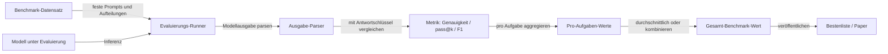

# Benchmarks

## Definition

Benchmarks sind standardisierte Datensätze und Evaluierungsprotokolle, die eine reproduzierbare, vergleichbare Bewertung von KI-Modellen ermöglichen. Durch die Festlegung von Aufgaben, Eingaben, Ausgaben und Bewertungsregeln erlauben Benchmarks Forschern, Ingenieuren und Praktikern, Modelle über Forschungsgruppen und die Zeit hinweg fair zu vergleichen. Ein Benchmark-Ergebnis ist nicht nur eine Zahl — es ist eine Behauptung, dass unter denselben Bedingungen, mit denselben Datenaufteilungen und Metriken, Modell A Modell B um einen bestimmten Abstand bei einer bestimmten Aufgabe übertrifft. Diese Vergleichbarkeit macht Benchmarks zur primären Währung des Fortschritts in der KI-Forschung.

Bekannte Benchmarks umfassen das gesamte Spektrum der KI-Fähigkeiten. Für das **natürliche Sprachverstehen** aggregieren GLUE und SuperGLUE Aufgaben wie textuelle Entailment, Frage-Antwort und Koreferenzauflösung. Für **breites Wissen und Reasoning** testet MMLU (Massive Multitask Language Understanding) Modelle über 57 Fächer von MINT bis Recht. Für **Code-Generierung** misst HumanEval, ob ein Modell Python-Funktionen schreiben kann, die Unit-Tests bestehen. Für **Bildverarbeitung** sind ImageNet-Klassifizierung und COCO-Erkennung kanonisch. Jeder Benchmark kodiert Annahmen darüber, was „Intelligenz" bedeutet — daher sollte die Modellauswahl immer berücksichtigen, ob der Benchmark tatsächlich den Ziel-Anwendungsfall widerspiegelt.

Benchmarks stützen sich auf [Evaluierungsmetriken](/docs/evaluation-metrics) für die Bewertung und verwenden feste Trainings-/Validierungs-/Testaufteilungen, damit Testset-Lecks die Ergebnisse nicht aufblähen. Ein bekanntes Versagensmuster ist Benchmark-Overfitting: Da die Forschungsgemeinschaft Modelle darauf trainiert, einen bestimmten Benchmark zu maximieren, können diese Modelle durch Abkürzungslernen hohe Werte erzielen statt echter Fähigkeiten. Deshalb betont die hochmoderne Evaluierung jetzt Kontaminationserkennung, zurückgehaltene Benchmarks und dynamische Evaluierungssets — und deshalb sollten Benchmark-Ergebnisse immer durch domänenspezifische und menschliche Evaluierung ergänzt werden, bevor [LLMs](/docs/llms) in der Produktion eingesetzt werden.

## Funktionsweise

### Benchmark-Ausführungspipeline



### Shot-Einstellungen und Evaluierungsprotokolle

Benchmarks werden typischerweise in Zero-Shot- (keine Beispiele im Prompt) oder Few-Shot- (k Beispiele im Prompt) Einstellungen ausgeführt. Die Anzahl der Shots beeinflusst die Ergebnisse erheblich, daher ist die Angabe der Shot-Einstellung für die Reproduzierbarkeit obligatorisch. Multiple-Choice-Benchmarks (wie MMLU) messen die Log-Wahrscheinlichkeit jeder Antwortauswahl; Freitext-Benchmarks (wie HumanEval) erfordern funktionale Korrektheit, die durch Ausführen von Code überprüft wird.

### Kontamination und Zuverlässigkeit

Datenkontamination — wenn Benchmark-Testdaten im Trainingskorpus eines Modells erscheinen — bläht die Ergebnisse auf. Moderne Evaluierungsbemühungen begegnen diesem Problem durch zeitliche Aufteilungen (Testdaten sind neuer als der Trainings-Cutoff), dynamische Benchmarks (Fragen werden auf Anfrage generiert) und Kontaminationserkennungsmethoden, die auf n-Gramm-Überlappung zwischen Trainings- und Testsets prüfen.

## Wann verwenden / Wann NICHT verwenden

| Verwenden wenn | Vermeiden wenn |
|----------|------------|
| Modelle für ein neues Projekt verglichen werden und ein standardisierter Ausgangspunkt gewünscht wird | Der Benchmark Ihre Domäne, Sprache oder Aufgabentyp nicht abdeckt |
| Fortschritte in der Forschung oder Entwicklung über mehrere Modellversionen verfolgt werden | Sie die tatsächliche benutzerseitige Qualität kennen müssen, nicht nur die Benchmark-Genauigkeit |
| Ergebnisse in Papers oder technischen Berichten für Reproduzierbarkeit berichtet werden | Der Benchmark für das zu evaluierende Modell bekanntermaßen kontaminiert ist |
| Ein Basismodell für die Feinabstimmung einer Produktionsanwendung ausgewählt wird | Ihre Aufgabe hochspezialisiert ist — eine benutzerdefinierte Evaluierung wäre informativer |

## Vergleiche

| Benchmark | Domäne | Aufgabentyp | Primäre Metrik |
|-----------|--------|-----------|---------------|
| GLUE / SuperGLUE | NLP | Klassifizierung, QA, Entailment | Durchschnittliche Genauigkeit |
| MMLU | Wissen / Reasoning | Multiple Choice (57 Fächer) | Genauigkeit |
| HumanEval | Code-Generierung | Python-Funktionssynthese | pass@k |
| HELM | Umfassend | Mehrere NLP + Robustheit | Aggregierte Metriken |
| COCO | Computer Vision | Objekterkennung, Bildunterschriften | AP, CIDEr |
| SWE-bench | Software-Engineering | GitHub-Issue-Lösung | % gelöst |

## Vor- und Nachteile

| Vorteile | Nachteile |
|------|------|
| Ermöglicht reproduzierbare, faire Vergleiche über Modelle und Methoden | Hohe Benchmark-Werte garantieren keine Leistung in der realen Welt |
| Community-weite Akzeptanz macht den Fortschritt leicht verfolgbar | Benchmarks werden gesättigt; Modelle overfitting durch Trainingsdaten-Kontamination |
| Feste Protokolle reduzieren Berichtsmehrdeutigkeit | Aufgabenabdeckung ist eng — kein einzelner Benchmark erfasst die gesamte Fähigkeit |
| Weit unterstützt durch Evaluierungs-Frameworks und Bestenlisten | Ergebnisse sind sensibel gegenüber Prompt-Format, Shot-Einstellung und Dekodierungsparametern |

## Code-Beispiele

### MMLU mit dem lm-evaluation-harness ausführen (Shell + Python)

```bash
# Install the evaluation harness
pip install lm-eval

# Evaluate a model on MMLU (5-shot) using the CLI
lm_eval \
  --model hf \
  --model_args pretrained=mistralai/Mistral-7B-v0.1 \
  --tasks mmlu \
  --num_fewshot 5 \
  --output_path ./results/mmlu_mistral7b.json \
  --batch_size 8
```

```python
# Parse and summarize results
import json

with open("./results/mmlu_mistral7b.json") as f:
    results = json.load(f)

tasks = results["results"]
scores = {task: data["acc,none"] for task, data in tasks.items() if "acc,none" in data}
avg_score = sum(scores.values()) / len(scores)

print(f"MMLU average accuracy: {avg_score:.3f}")
print("\nTop 5 tasks by score:")
for task, score in sorted(scores.items(), key=lambda x: x[1], reverse=True)[:5]:
    print(f"  {task}: {score:.3f}")
```

## Praktische Ressourcen

- [Papers with Code – Bestenlisten](https://paperswithcode.com/) — Live-Benchmark-Bestenlisten für alle KI-Aufgaben
- [MMLU (Hendrycks et al., 2021)](https://arxiv.org/abs/2009.03300) — Breiter Wissens-Benchmark über 57 Fächer
- [HumanEval (Chen et al., 2021)](https://github.com/openai/human-eval) — Code-Generierungs-Benchmark mit 164 Python-Problemen
- [HELM (Liang et al., 2022)](https://crfm.stanford.edu/helm/) — Ganzheitliches Evaluierungs-Framework für Genauigkeit, Robustheit und Fairness
- [lm-evaluation-harness](https://github.com/EleutherAI/lm-evaluation-harness) — Open-Source-Framework zum Ausführen standardisierter LLM-Benchmarks

## Siehe auch

- [Evaluierungsmetriken](/docs/evaluation-metrics)
- [LLMs](/docs/llms)
