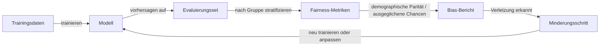

# Bias in KI

## Definition

Bias in KI bezeichnet systematische Fehler oder unfaire Ergebnisse in KI-Systemen, die bestimmte Personengruppen unverhältnismäßig stark betreffen — typischerweise entlang der Linien von Rasse, Geschlecht, Alter, sozioökonomischem Status oder anderen geschützten Merkmalen. Diese Vorurteile können greifbare Schäden verursachen: ungerechtfertigt abgelehnte Kreditanträge, aufgrund von Namen herausgefilterte Lebensläufe, verpasste medizinische Diagnosen für unterrepräsentierte Bevölkerungsgruppen oder Gesichtserkennung, die bei dunklen Hauttönen versagt. Das Verstehen von Bias erfordert einen Blick auf die gesamte Pipeline, von der Datenerhebung und -kennzeichnung über das Modelltraining bis hin zur Bereitstellung und Feedback-Schleifen.

Bias gelangt an mehreren Stellen in Systeme. Historischer Bias in Trainingsdaten kodiert vergangene Diskriminierung — wenn ein Unternehmen historisch weniger Frauen im Engineering eingestellt hat, wird ein auf diesen Daten trainiertes Modell das Muster replizieren. Messbias tritt auf, wenn die in der Datenerhebung verwendeten Proxys über Gruppen hinweg unterschiedlich genau sind; zum Beispiel kodiert die Verwendung der Postleitzahl als Proxy für Kreditwürdigkeit Wohnraumtrennung. Label-Bias tritt auf, wenn menschliche Annotatoren ihre eigenen Annahmen in Aufgaben wie Toxizitätserkennung oder Stimmungskennzeichnung einbringen. Repräsentationsbias entsteht, wenn bestimmte Gruppen in den Trainingsdaten einfach unterrepräsentiert sind, was zu schlechterer Leistung für diese Gruppen führt.

Bias liegt an der Schnittstelle von [KI-Ethik](/docs/ai-ethics) und [KI-Sicherheit](/docs/ai-safety). [Evaluierungsmetriken](/docs/evaluation-metrics) bieten die quantitativen Werkzeuge zur Erkennung und Messung von Bias, während [Explainable AI](/docs/xai) helfen kann, zu identifizieren, wo im Reasoning eines Modells Bias auftritt. In regulierten Bereichen — Einstellung, Kreditvergabe, Gesundheitswesen, Strafjustiz — sind Bias-Erkennung und -Minderung gesetzliche Anforderungen, keine optionalen Best Practices. Bias-Audits sollten vor der Bereitstellung durchgeführt und in der Produktion kontinuierlich überwacht werden.

## Funktionsweise

### Quellen von Bias

Bias gelangt in Pipelines durch schiefe oder nicht repräsentative Trainingsdaten, Proxy-Variablen, die mit geschützten Merkmalen korrelieren, biased menschliche Labels und Feedback-Schleifen, bei denen Modellausgaben zukünftige Datenerhebungen beeinflussen. Jede Quelle erfordert unterschiedliche Erkennungs- und Minderungsstrategien.

### Erkennung mit Fairness-Metriken



### Minderungsstrategien

Minderungsstrategien fallen in drei Kategorien. **Vor-Verarbeitungs**-Methoden modifizieren die Trainingsdaten: Umgewichtung von Stichproben, Resampling unterrepräsentierter Gruppen oder Erhebung zusätzlicher repräsentativer Daten. **Verarbeitungs**-Methoden modifizieren das Trainingsziel: Hinzufügen von Fairness-Einschränkungen, Verwendung von adversarischem Debiasing, bei dem ein Hilfsklassifikator versucht, geschützte Merkmale aus den Modellrepräsentationen vorherzusagen. **Nach-Verarbeitungs**-Methoden passen Modellausgaben an: gruppenspezifische Entscheidungsschwellen, um Raten über Gruppen hinweg anzugleichen, ohne neu zu trainieren.

## Wann verwenden / Wann NICHT verwenden

| Verwenden wenn | Vermeiden wenn |
|----------|------------|
| Modellentscheidungen Menschen in regulierten oder sensiblen Bereichen betreffen (Einstellung, Kreditvergabe, Gesundheitswesen) | Die Modellausgabe keine Auswirkungen auf Menschen oder ihre Chancen hat |
| Bereitstellung in großem Maßstab, bei der kleine Fehlerraten-Disparitäten großen aggregierten Schaden verursachen | Kein Zugang zu demographischen Daten für stratifizierte Evaluierung vorhanden |
| Auditing eines Modells vor oder nach der Bereitstellung | Die Ground-Truth-Labels selbst zu biased sind, um als faire Referenzen zu dienen |
| Durch Regulierung erforderlich, Nichtdiskriminierung nachzuweisen | Alle Vorhersagen von Experten überprüft werden, die falsche Entscheidungen überstimmen können |

## Vergleiche

| Fairness-Metrik | Was sie misst | Wann zu verwenden |
|----------------|-----------------|-------------|
| Demographische Parität | Gleiche positive Vorhersageraten über Gruppen | Wenn gleiche Repräsentation das Ziel ist |
| Ausgeglichene Chancen | Gleiche TPR und FPR über Gruppen | Wenn die Konsequenzen von Fehlern gleich sein sollen |
| Kalibrierung | Vorhergesagte Wahrscheinlichkeiten stimmen mit tatsächlichen Raten pro Gruppe überein | Wenn Scorewerte für Entscheidungen verwendet werden |
| Individuelle Fairness | Ähnliche Individuen erhalten ähnliche Vorhersagen | Wenn Konsistenz von Fall zu Fall erforderlich ist |

## Vor- und Nachteile

| Vorteile | Nachteile |
|------|------|
| Reduziert diskriminierende Schäden für betroffene Gruppen | Fairness-Metriken sind mathematisch inkompatibel — das Erfüllen einer verletzt oft eine andere |
| Baut rechtliche und ethische Konformitätsnachweise auf | Minderung kann die Gesamtgenauigkeit reduzieren |
| Ermöglicht proaktive Erkennung vor der Bereitstellung | Erfordert demographische Daten, die möglicherweise nicht verfügbar oder sensibel sind |
| Unterstützt transparente Berichterstattung und Rechenschaftspflicht | Feedback-Schleifen-Bias ist ohne longitudinale Überwachung schwer zu erkennen |

## Code-Beispiele

### Demographische Parität mit scikit-learn berechnen (Python)

```python
import numpy as np
from sklearn.metrics import confusion_matrix

def demographic_parity_difference(y_pred: np.ndarray, groups: np.ndarray) -> float:
    """
    Compute demographic parity difference between two groups.
    Returns the difference in positive prediction rates.
    A value of 0 indicates perfect parity.
    """
    unique_groups = np.unique(groups)
    rates = {}
    for g in unique_groups:
        mask = groups == g
        rates[g] = y_pred[mask].mean()

    values = list(rates.values())
    diff = max(values) - min(values)
    print(f"Positive prediction rates by group: {rates}")
    print(f"Demographic parity difference: {diff:.4f}")
    return diff

# Example usage
np.random.seed(42)
y_pred = np.random.randint(0, 2, size=1000)
groups = np.random.choice(["A", "B"], size=1000, p=[0.6, 0.4])

demographic_parity_difference(y_pred, groups)
```

## Praktische Ressourcen

- [Fairness and Machine Learning (Barocas, Hardt, Narayanan)](https://fairmlbook.org/) — Umfassendes kostenloses Lehrbuch über Fairness-Konzepte und -Metriken
- [Google – Responsible AI – Fairness](https://ai.google.dev/responsible-ai) — Praktische Fairness-Richtlinien und Werkzeuge
- [IBM AI Fairness 360](https://aif360.res.ibm.com/) — Open-Source-Toolkit für Bias-Erkennung und -Minderung
- [Microsoft Fairlearn](https://fairlearn.org/) — Python-Bibliothek für Fairness-Bewertung und -Minderung
- [NIST Special Publication on Bias in AI](https://www.nist.gov/artificial-intelligence) — US-Regierungsrichtlinien zu KI-Bias

## Siehe auch

- [KI-Ethik](/docs/ai-ethics)
- [KI-Sicherheit](/docs/ai-safety)
- [Evaluierungsmetriken](/docs/evaluation-metrics)
