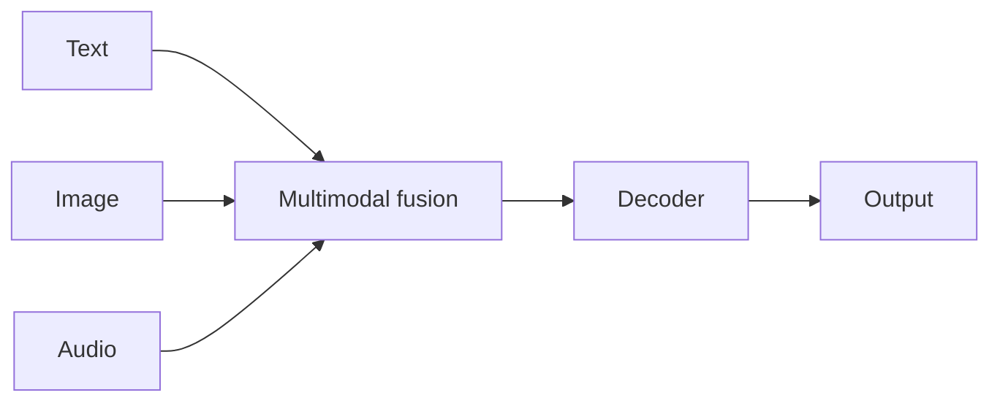

# Case study: Gemini

## Definition

Gemini ist Googles Familie von [LLMs](/docs/llms) mit **nativer Multimodalität**: Text, Bild, Audio und Video in einem Modell. Es folgt auf frühere Google-Modelle (z. B. [BART](/docs/case-studies/bart) in der Encoder-Decoder-Linie) und wird in mehreren Skalierungsstufen (Nano, Pro, Ultra) für unterschiedliche Latenz- und Fähigkeits-Trade-offs angeboten.

Gemini wird in Google-Produkten (Search, Workspace, Vertex AI, Android) trainiert und eingesetzt. Anwendungsfall: Chat, [multimodales](/docs/multimodal-ai) Verstehen und Generieren, Programmierung und [agenten](/docs/agents)-artiger Werkzeugeinsatz.

## Funktionsweise

**Multimodale Eingaben** (Text, Bild, Audio, Video) werden kodiert und in einem einheitlichen [Transformer](/docs/transformers)-Stack fusioniert. Der **Decoder** generiert Text (oder strukturierte Ausgabe), konditioniert auf allen Modalitäten. **Skalierungsstufen**: kleinere Modelle (z. B. Nano) für [Edge](/docs/edge-reasoning) und On-Device; größere (Pro, Ultra) für maximale Leistungsfähigkeit in der Cloud. **Integration**: Dieselben Modelle betreiben Gemini in Search, Workspace und den Vertex AI APIs. [Prompt Engineering](/docs/prompt-engineering) und [RAG](/docs/rag) oder Werkzeuge erweitern den Einsatz in Anwendungen.

## Anwendungsfälle

Gemini eignet sich, wenn multimodales Verstehen oder Generieren benötigt wird und eine optionale Integration in Googles Stack gewünscht ist.

- Chat und Assistenten mit Bild-, Dokument- oder Videoverständnis
- Multimodale Suche, Zusammenfassung und Inhaltsgenerierung
- Programmierung und Reasoning über API oder Google-Produkte

## Externe Dokumentation

- [Google AI – Gemini](https://ai.google.dev/gemini-api) — API und Übersicht
- [Google – Gemini models](https://deepmind.google/technologies/gemini/) — Modellstufen und Fähigkeiten

## Siehe auch

- [LLMs](/docs/llms)
- [Multimodale KI](/docs/multimodal-ai)
- [BART](/docs/case-studies/bart) — Vorgänger in der Encoder-Decoder-Linie
