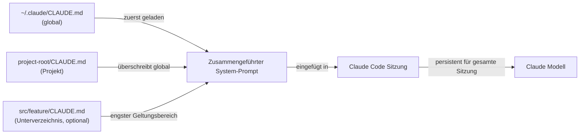

# CLAUDE.md Konfiguration

## Definition

`CLAUDE.md` ist eine Markdown-Datei, die Claude Code zu Beginn jeder Sitzung automatisch liest. Ihr Inhalt wird in den System-Prompt eingefügt, wodurch das Modell persistente, projektbewusste Anweisungen erhält, ohne dass der Entwickler diese in jedem Gespräch wiederholen muss. Betrachten Sie es als das „Einarbeitungsdokument", das jede Sitzung erhält: Es teilt Claude mit, was das Projekt ist, wie es strukturiert ist, welche Konventionen zu befolgen sind und welche Verhaltensweisen zu vermeiden sind.

Die Datei ist absichtlich in einfachem Markdown statt in einem proprietären Format geschrieben, was bedeutet, dass sie menschenlesbar, versionskontrollierbar und von jedem Entwickler im Team bearbeitbar ist. Da sie zusammen mit dem Code im Repository liegt, entwickelt sie sich mit dem Projekt weiter: Wenn sich der Tech-Stack ändert, wenn neue Konventionen eingeführt werden oder wenn ein neuer Entwickler dazukommt und eine Einarbeitung benötigt, ist die `CLAUDE.md` die einzige Wahrheitsquelle dafür, wie Claude sich in dieser Codebasis verhalten soll.

Es gibt zwei verschiedene Geltungsbereiche für `CLAUDE.md`-Dateien. Eine **projektbezogene** Datei liegt im Stammverzeichnis des Repositorys (oder einem beliebigen Unterverzeichnis) und gilt nur für dieses Projekt. Eine **globale** Datei liegt unter `~/.claude/CLAUDE.md` und gilt für jede Claude Code-Sitzung unabhängig vom Projekt. Die beiden Geltungsbereiche sind additiv: Beide werden gleichzeitig geladen, wobei projektbezogene Anweisungen Vorrang haben, wenn sie mit globalen in Konflikt stehen.

## Funktionsweise

### Datei-Erkennung und Ladereihenfolge

Wenn Claude Code eine Sitzung startet, durchläuft es den Verzeichnisbaum vom aktuellen Arbeitsverzeichnis aufwärts und sucht nach `CLAUDE.md`-Dateien. In übergeordneten Verzeichnissen gefundene Dateien werden zuerst geladen (breitester Geltungsbereich), dann Dateien im aktuellen Verzeichnis und seinen Unterverzeichnissen (engster Geltungsbereich). Die globale Datei unter `~/.claude/CLAUDE.md` wird immer zuerst geladen und bietet eine Grundlage, die Projektdateien überschreiben können. Diese hierarchische Ladereihenfolge bedeutet, dass ein Monorepo eine `CLAUDE.md` auf Root-Ebene für gemeinsame Konventionen und pro-Paket-`CLAUDE.md`-Dateien für paketspezifische Regeln haben kann – beide gelten während einer Sitzung gleichzeitig.

### Einbettung in den System-Prompt

Der Inhalt aller gefundenen `CLAUDE.md`-Dateien wird verkettet und dem System-Prompt vor jedem Gesprächszug vorangestellt. Dies bedeutet, dass Claude bei jeder einzelnen Anfrage Zugriff auf die Anweisungen hat, nicht nur bei der ersten. Da die Anweisungen Teil des System-Prompts sind und nicht der Benutzernachricht, verbrauchen sie keinen Gesprächskontext, der sonst für Code und Tool-Ergebnisse verwendet würde. Die Anweisungen bleiben für die gesamte Sitzung bestehen und werden vom Kontextverwaltungssystem nicht zusammengefasst oder komprimiert.

### Was in CLAUDE.md gehört

Eine gut geschriebene `CLAUDE.md` beantwortet die Fragen, die ein neues Teammitglied stellen würde, bevor es die Codebasis anfasst: Was ist dieses Projekt? Welche Sprache und welches Framework werden verwendet? Wie ist der Code organisiert? Was sind die Test- und Formatierungskonventionen? Gibt es Muster zu befolgen oder Anti-Muster zu vermeiden? Gibt es Befehle, die Claude ausführen soll oder nicht? Die Datei sollte spezifisch genug sein, um umsetzbar zu sein, aber prägnant genug, damit das Modell alles verinnerlichen kann. Vermeiden Sie es, es mit Informationen aufzufüllen, die Claude bereits kennt (z. B. TypeScript erklären), und konzentrieren Sie sich auf projektspezifische Fakten.

### CLAUDE.md aktuell halten

Da `CLAUDE.md` bei jeder Anfrage eingefügt wird, beeinträchtigen veraltete Anweisungen aktiv die Leistung – Claude könnte veraltete Konventionen befolgen oder veraltete Muster verwenden. Die empfohlene Praxis besteht darin, `CLAUDE.md`-Aktualisierungen als Teil der normalen Entwicklung zu behandeln: Wenn ein großes Refactoring die Projektstruktur ändert, aktualisieren Sie die Datei im selben Commit. Code-Reviews sollten `CLAUDE.md`-Änderungen genau wie jede andere Konfigurationsänderung einschließen. Teams mit CI-Pipelines können die Datei linten (z. B. prüfen, ob referenzierte Pfade noch existieren), um veraltete Einträge frühzeitig zu erkennen.



## Wann verwenden / Wann NICHT verwenden

| Verwenden wenn | Vermeiden wenn |
|---|---|
| Sie möchten, dass Claude immer bestimmte Coding-Standards befolgt (z. B. `const` statt `let` verwenden, funktionale Komponenten bevorzugen) | Anweisungen sich häufig pro Aufgabe ändern – verwenden Sie In-Session-Prompts für einmalige Anfragen |
| Sie Tech-Stack-Kontext bereitstellen müssen, der sonst eine Neuerklärung erfordern würde (z. B. „wir verwenden Zod für Schema-Validierung, nicht Yup") | Die Datei Geheimnisse oder Anmeldedaten enthalten würde – verwenden Sie dafür Umgebungsvariablen |
| Sie Claude daran hindern möchten, gefährliche Befehle auszuführen (z. B. „niemals `DROP TABLE` oder `rm -rf` ausführen") | Die Anweisungen allgemeine Best Practices sind, die Claude standardmäßig bereits befolgt |
| Ihr Projekt nicht offensichtliche Architekturentscheidungen hat, die beeinflussen, wie Code geschrieben werden soll | Das Projekt ein einmaliges Skript ohne gemeinsame Konventionen ist, die es wert wären, dokumentiert zu werden |
| Sie über mehrere Projekte hinweg arbeiten und einen persönlichen Basisstil in Ihrer globalen `~/.claude/CLAUDE.md` möchten | Verschiedene Teammitglieder widersprüchliche Präferenzen haben – lösen Sie diese zuerst im Code-Review |

## Code-Beispiele

```markdown
# CLAUDE.md — my-app Projektanweisungen

## Projektübersicht
Dies ist eine Full-Stack-Webanwendung: React + TypeScript Frontend, Node.js + Express Backend,
PostgreSQL-Datenbank verwaltet mit Prisma ORM. Das Monorepo ist strukturiert als:

- `packages/web/` — React Frontend (Vite, React Router v6, Tailwind CSS)
- `packages/api/` — Express REST API (TypeScript, Zod für Request-Validierung)
- `packages/shared/` — Gemeinsame TypeScript-Typen, die von beiden Paketen verwendet werden

## Tech-Stack Konventionen

### Frontend (packages/web)
- Verwende nur funktionale Komponenten mit Hooks — keine Klassen-Komponenten
- Bevorzuge benannte Exporte gegenüber Standard-Exporten für Komponenten
- State-Management: Zustand für globalen State, React Query für Server-State
- Styling: Tailwind Utility-Klassen; keine Inline-Styles oder CSS-Module
- Verwende `zod`-Schemas importiert aus `packages/shared` zur Validierung von API-Antworten

### Backend (packages/api)
- Alle Route-Handler liegen in `src/routes/`; verwende Express Router, eine Datei pro Ressource
- Validiere alle Request-Bodies und Query-Params mit Zod, bevor du auf sie zugreifst
- Verwende Prismas generierten Client — schreibe niemals rohe SQL, es sei denn Prisma kann die Abfrage nicht ausdrücken
- Gib Fehler als `{ error: string, code: string }` JSON-Objekte zurück, niemals als HTML

## Code-Stil
- TypeScript Strict-Modus ist aktiviert — verwende niemals `any` oder `// @ts-ignore`
- Verwende standardmäßig `const`; verwende `let` nur, wenn eine Neuzuweisung erforderlich ist
- Bevorzuge frühzeitige Returns gegenüber verschachtelten Bedingungen
- Alle async-Funktionen müssen Fehler mit try/catch oder `.catch()` behandeln
- Importiere nicht mehr als zwei Ebenen tief aus `../../..` — verwende Pfad-Aliase (`@web/`, `@api/`, `@shared/`)

## Testing
- Tests liegen neben Quelldateien als `*.test.ts` — nicht in einem separaten `tests/`-Verzeichnis
- Verwende Vitest für alle Tests (nicht Jest)
- Schreibe Unit-Tests für alle Utility-Funktionen; Integrationstests für alle API-Routen
- Führe Tests aus mit: `pnpm test` (führt alle Pakete aus) oder `pnpm --filter @app/api test` (einzelnes Paket)

## Git-Konventionen
- Verwende Conventional Commits: `feat:`, `fix:`, `chore:`, `docs:`, `refactor:`, `test:`
- Eine logische Änderung pro Commit — bündle keine nicht zusammenhängenden Änderungen
- Branch-Namen: `feat/description`, `fix/description`, `chore/description`

## Befehle, die du frei ausführen darfst
- `pnpm install`, `pnpm build`, `pnpm test`, `pnpm lint`, `pnpm format`
- `prisma generate`, `prisma migrate dev`, `prisma studio`
- `git status`, `git diff`, `git log`

## Befehle, die NIEMALS ohne explizite Benutzerbestätigung ausgeführt werden dürfen
- Jedes `prisma migrate reset` oder `prisma db push --force-reset` — diese zerstören Daten
- Jedes `DROP TABLE`, `DELETE FROM` ohne eine WHERE-Klausel
- `rm -rf` auf einem anderen Verzeichnis als `node_modules` oder Build-Artefakten
```

```bash
# Globale CLAUDE.md unter ~/.claude/CLAUDE.md (gilt für alle Projekte)
# Gut für persönliche Stilpräferenzen und Sicherheitsregeln, die alle Projekte umfassen

# Beispiel globale Anweisungen:
cat ~/.claude/CLAUDE.md
```

```markdown
# Globale Claude Code Anweisungen (alle Projekte)

## Meine persönlichen Standardeinstellungen
- Ich bevorzuge TypeScript gegenüber JavaScript in allen neuen Dateien
- Verwende einfache Anführungszeichen für Strings in JavaScript/TypeScript
- Erkläre, was du tun wirst, bevor du große Änderungen vornimmst (mehr als 3 Dateien)
- Beim Schreiben von Commit-Nachrichten immer Conventional Commits Format verwenden

## Sicherheitsregeln (alle Projekte)
- Committe niemals direkt zu `main` oder `master` — erstelle immer zuerst einen Feature-Branch
- Führe niemals Datenbank-Migrationsbefehle aus, ohne mir zuerst die Migrationsdatei zu zeigen
- Frage, bevor du neue Abhängigkeiten installierst — ich möchte Paketgröße und Lizenz überprüfen
```

## Praktische Ressourcen

- [Claude Code Dokumentation — CLAUDE.md](https://docs.anthropic.com/en/docs/claude-code/memory) — Offizieller Leitfaden zu CLAUDE.md-Dateispeicherorten, Ladereihenfolge und Best Practices.
- [Claude Code Einstellungsreferenz](https://docs.anthropic.com/en/docs/claude-code/settings) — Vollständige Einstellungsreferenz einschließlich aller Konfigurationsoptionen neben CLAUDE.md.
- [Claude Code Schnellstart](https://docs.anthropic.com/en/docs/claude-code/quickstart) — Einstiegsleitfaden, der die anfängliche CLAUDE.md-Einrichtung abdeckt.

## Siehe auch

- [Claude Code Übersicht](/docs/claude-code)
- [Claude Code Skills](/docs/claude-code/skills)
- [Kontextverwaltung](/docs/claude-code/context-management)
