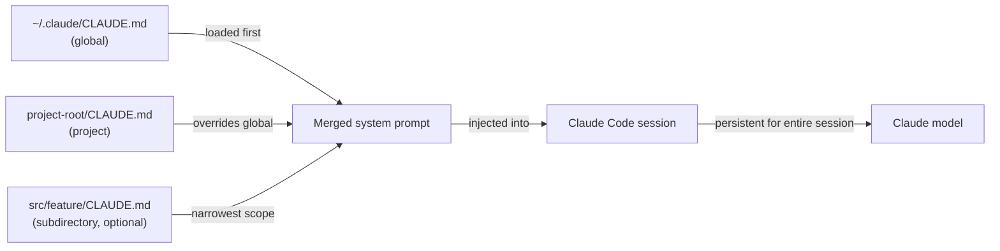

# CLAUDE.md-Konfiguration

## Definition

`CLAUDE.md` ist eine Markdown-Datei, die Claude Code automatisch zu Beginn jeder Sitzung liest. Ihr Inhalt wird in den System-Prompt eingefügt und gibt dem Modell persistente, projektbewusste Anweisungen, ohne dass der Entwickler diese in jedem Gespräch wiederholen muss. Stellen Sie sie sich als das "Einarbeitungsdokument" vor, das jede Sitzung erhält: Es sagt Claude, was das Projekt ist, wie es strukturiert ist, welche Konventionen zu befolgen sind und welche Verhaltensweisen zu vermeiden sind.

Die Datei ist bewusst in einfachem Markdown statt in einem proprietären Format geschrieben, was bedeutet, dass sie menschenlesbar, versionierbar und von jedem Entwickler im Team bearbeitbar ist. Da sie neben dem Code im Repository liegt, entwickelt sie sich mit dem Projekt: Wenn sich der Tech-Stack ändert, wenn neue Konventionen eingeführt werden oder wenn ein neuer Entwickler beitritt und Einarbeitung benötigt, ist die `CLAUDE.md` die einzige Quelle der Wahrheit dafür, wie sich Claude in dieser Codebasis verhalten soll.

Es gibt zwei verschiedene Geltungsbereiche für `CLAUDE.md`-Dateien. Eine **Projektebene**-Datei liegt im Stammverzeichnis des Repositories (oder in einem beliebigen Unterverzeichnis) und gilt nur für dieses Projekt. Eine **globale** Datei liegt unter `~/.claude/CLAUDE.md` und gilt für jede Claude-Code-Sitzung unabhängig vom Projekt. Die beiden Bereiche sind additiv: Beide werden gleichzeitig geladen, wobei Projektebenen-Anweisungen bei Konflikten mit globalen Vorrang haben.

## Funktionsweise

### Datei-Entdeckung und Ladereihenfolge

Wenn Claude Code eine Sitzung startet, durchläuft es den Verzeichnisbaum vom aktuellen Arbeitsverzeichnis aufwärts und sucht nach `CLAUDE.md`-Dateien. Dateien in übergeordneten Verzeichnissen werden zuerst geladen (breitester Geltungsbereich), dann Dateien im aktuellen Verzeichnis und seinen Unterverzeichnissen (engster Geltungsbereich). Die globale Datei unter `~/.claude/CLAUDE.md` wird immer zuerst geladen und bietet eine Basis, die Projektdateien überschreiben können. Dieses hierarchische Laden bedeutet, dass ein Monorepo eine `CLAUDE.md` auf der Stammebene für gemeinsame Konventionen und paketspezifische `CLAUDE.md`-Dateien für paketspezifische Regeln haben kann – beide gelten gleichzeitig während einer Sitzung.

### Einbindung in den System-Prompt

Der Inhalt aller gefundenen `CLAUDE.md`-Dateien wird verkettet und dem System-Prompt vor jedem Gesprächszug vorangestellt. Das bedeutet, Claude hat bei jeder einzelnen Anfrage Zugang zu den Anweisungen, nicht nur beim ersten. Da die Anweisungen Teil des System-Prompts und nicht der Benutzernachricht sind, verbrauchen sie keinen Gesprächskontext, der sonst für Code und Tool-Ergebnisse verwendet würde. Die Anweisungen bleiben für die gesamte Sitzung bestehen und werden vom Kontextverwaltungssystem nicht zusammengefasst oder komprimiert.

### Was in CLAUDE.md gehört

Eine gut geschriebene `CLAUDE.md` beantwortet die Fragen, die ein neues Teammitglied stellen würde, bevor es die Codebasis anfasst: Was ist dieses Projekt? Welche Sprache und welches Framework werden verwendet? Wie ist der Code organisiert? Was sind die Test- und Formatierungskonventionen? Gibt es Muster zu befolgen oder Anti-Muster zu vermeiden? Gibt es Befehle, die Claude ausführen darf oder nicht? Die Datei sollte spezifisch genug sein, um handlungsfähig zu sein, aber prägnant genug, dass das Modell alles verinnerlichen kann. Vermeiden Sie Auffüllen mit Informationen, die Claude bereits kennt (z. B. Erklären, was TypeScript ist), und konzentrieren Sie sich auf projektspezifische Fakten.

### CLAUDE.md aktuell halten

Da `CLAUDE.md` bei jeder Anfrage eingefügt wird, beeinträchtigen veraltete Anweisungen aktiv die Leistung – Claude könnte veraltete Konventionen befolgen oder veraltete Muster verwenden. Die empfohlene Praxis ist, `CLAUDE.md`-Updates als Teil der normalen Entwicklung zu behandeln: Wenn ein größeres Refactoring die Projektstruktur ändert, aktualisieren Sie die Datei im gleichen Commit. Code-Reviews sollten `CLAUDE.md`-Änderungen genau wie andere Konfigurationsänderungen einschließen. Teams mit CI-Pipelines können die Datei linten (z. B. prüfen, ob referenzierte Pfade noch existieren), um veraltete Einträge frühzeitig zu erkennen.



## Wann verwenden / Wann NICHT verwenden

| Verwenden wenn | Vermeiden wenn |
|---|---|
| Claude immer bestimmte Coding-Standards befolgen soll (z. B. `const` über `let` verwenden, funktionale Komponenten bevorzugen) | Anweisungen sich häufig pro Aufgabe ändern — verwenden Sie In-Session-Prompts für einmalige Anfragen |
| Sie Tech-Stack-Kontext bereitstellen müssen, der sonst erneut erklärt werden müsste (z. B. "wir verwenden Zod zur Schema-Validierung, nicht Yup") | Die Datei Geheimnisse oder Anmeldedaten enthalten würde — verwenden Sie Umgebungsvariablen dafür |
| Claude daran hindern wollen, gefährliche Befehle auszuführen (z. B. "niemals `DROP TABLE` oder `rm -rf` ausführen") | Die Anweisungen allgemeine Best Practices sind, die Claude standardmäßig bereits befolgt |
| Ihr Projekt nicht offensichtliche Architekturentscheidungen hat, die beeinflussen, wie Code geschrieben werden soll | Das Projekt ein einmaliges Skript ohne gemeinsame Konventionen ist, die es wert wären, dokumentiert zu werden |
| Sie über mehrere Projekte hinweg arbeiten und einen persönlichen Basisstil in Ihrer globalen `~/.claude/CLAUDE.md` wollen | Verschiedene Teammitglieder widersprüchliche Präferenzen haben — lösen Sie diese zuerst im Code-Review |

## Codebeispiele

```markdown
# CLAUDE.md — my-app project instructions

## Project overview
This is a full-stack web app: React + TypeScript frontend, Node.js + Express backend,
PostgreSQL database managed with Prisma ORM. The monorepo is structured as:

- `packages/web/` — React frontend (Vite, React Router v6, Tailwind CSS)
- `packages/api/` — Express REST API (TypeScript, Zod for request validation)
- `packages/shared/` — Shared TypeScript types used by both packages

## Tech stack conventions

### Frontend (packages/web)
- Use functional components with hooks only — no class components
- Prefer named exports over default exports for components
- State management: Zustand for global state, React Query for server state
- Styling: Tailwind utility classes; no inline styles or CSS modules
- Use `zod` schemas imported from `packages/shared` to validate API responses

### Backend (packages/api)
- All route handlers live in `src/routes/`; use Express Router, one file per resource
- Validate all request bodies and query params with Zod before accessing them
- Use Prisma's generated client — never write raw SQL unless Prisma cannot express the query
- Return errors as `{ error: string, code: string }` JSON objects, never as HTML

## Code style
- TypeScript strict mode is enabled — never use `any` or `// @ts-ignore`
- Use `const` by default; only use `let` when reassignment is required
- Prefer early returns over nested conditionals
- All async functions must handle errors with try/catch or `.catch()`
- Do not import from `../../..` more than two levels deep — use path aliases (`@web/`, `@api/`, `@shared/`)

## Testing
- Tests live alongside source files as `*.test.ts` — not in a separate `tests/` directory
- Use Vitest for all tests (not Jest)
- Write unit tests for all utility functions; integration tests for all API routes
- Run tests with: `pnpm test` (runs all packages) or `pnpm --filter @app/api test` (single package)

## Git conventions
- Use conventional commits: `feat:`, `fix:`, `chore:`, `docs:`, `refactor:`, `test:`
- One logical change per commit — do not bundle unrelated changes
- Branch names: `feat/description`, `fix/description`, `chore/description`

## Commands you may run freely
- `pnpm install`, `pnpm build`, `pnpm test`, `pnpm lint`, `pnpm format`
- `prisma generate`, `prisma migrate dev`, `prisma studio`
- `git status`, `git diff`, `git log`

## Commands to NEVER run without explicit user confirmation
- Any `prisma migrate reset` or `prisma db push --force-reset` — these destroy data
- Any `DROP TABLE`, `DELETE FROM` without a WHERE clause
- `rm -rf` on any directory other than `node_modules` or build artifacts
```

```bash
# Global CLAUDE.md at ~/.claude/CLAUDE.md (applies to all projects)
# Good for personal style preferences and safety rules that span every project

# Example global instructions:
cat ~/.claude/CLAUDE.md
```

```markdown
# Global Claude Code instructions (all projects)

## My personal defaults
- I prefer TypeScript over JavaScript in all new files
- Use single quotes for strings in JavaScript/TypeScript
- Explain what you are going to do before making large changes (more than 3 files)
- When writing commit messages, always use conventional commits format

## Safety rules (all projects)
- Never commit directly to `main` or `master` — always create a feature branch first
- Never run database migration commands without showing me the migration file first
- Ask before installing new dependencies — I want to review package size and license
```

## Praktische Ressourcen

- [Claude-Code-Dokumentation — CLAUDE.md](https://docs.anthropic.com/en/docs/claude-code/memory) — Offizieller Leitfaden zu CLAUDE.md-Dateispeicherorten, Ladereihenfolge und Best Practices.
- [Claude-Code-Einstellungsreferenz](https://docs.anthropic.com/en/docs/claude-code/settings) — Vollständige Einstellungsreferenz einschließlich aller Konfigurationsoptionen neben CLAUDE.md.
- [Claude-Code-Schnellstart](https://docs.anthropic.com/en/docs/claude-code/quickstart) — Erste-Schritte-Leitfaden, der die anfängliche CLAUDE.md-Einrichtung abdeckt.

## Siehe auch

- [Claude-Code-Übersicht](/docs/claude-code)
- [Claude-Code-Skills](/docs/claude-code/skills)
- [Kontextverwaltung](/docs/claude-code/context-management)
