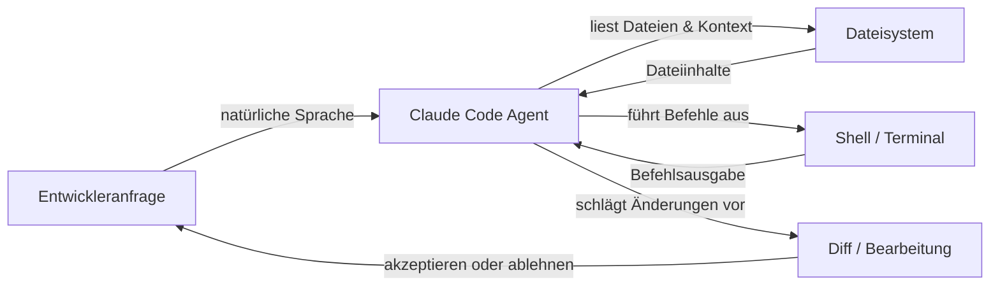

# Claude Code

## Definition

Claude Code ist Anthropics KI-gestützter Coding-Agent – ein zweckgebundenes Tool, das Claudes Reasoning-Fähigkeiten direkt in den Entwickler-Workflow integriert. Im Gegensatz zu chatorientierten KI-Tools ist Claude Code für den **agentischen Betrieb** konzipiert: Es kann autonom mehrstufige Aufgaben planen und ausführen, große Codebasen navigieren, Shell-Befehle ausführen, Dateien bearbeiten, Git-Operationen verwalten und seine eigene Ausgabe iterieren – ohne dass bei jedem Schritt eine menschliche Anleitung erforderlich ist.

Das Tool ist in mehreren Umgebungen verfügbar: als **Befehlszeilenschnittstelle (CLI)**, die in jedem Terminal läuft, als Erweiterung für **VS Code** und **JetBrains** IDEs mit Inline-Bearbeitung und visuellen Diffs sowie über die **Web-App** unter claude.ai/code für browserbasierte Sitzungen. Diese Präsenz in mehreren Umgebungen bedeutet, dass Entwickler Claude Code dort einsetzen können, wo sie bereits arbeiten, ohne zu einem dedizierten Editor wechseln zu müssen.

Der Kernfunktionsumfang deckt den gesamten Coding-Lebenszyklus ab: **Code-Generierung** (Gerüst neuer Dateien, Schreiben von Funktionen, Generieren von Tests), **Refactoring** (Umstrukturierung von bestehendem Code unter Beibehaltung des Verhaltens), **Debugging** (Fehlerdiagnose mit vollständigem Kontext), **Git-Operationen** (Staging, Commits, Lesen von Diffs, Interpretation der Historie) und **Dateiverwaltung** (Lesen, Schreiben, Suchen und Organisieren von Projektdateien). Da Claude Code mit Zugriff auf den gesamten Projektbaum und ein Terminal arbeitet, bewältigt es Aufgaben, die dateiübergreifendes Verständnis und sequentiellen Tool-Einsatz erfordern, auf natürliche Weise.

## Funktionsweise

### Installation und Authentifizierung

Claude Code wird als npm-Paket installiert (`npm install -g @anthropic-ai/claude-code`) und erfordert ein Claude-Abonnement (Pro, Teams oder Enterprise) oder API-Zugriff über Amazon Bedrock oder Google Vertex AI. Nach dem Ausführen von `claude` in einem Terminal wird die Authentifizierung über OAuth oder einen in der lokalen Konfiguration gespeicherten API-Schlüssel gehandhabt. Die CLI liest das Projektverzeichnis, sucht nach `CLAUDE.md`-Anweisungsdateien und startet eine interaktive Sitzung, in der der Benutzer Anfragen in natürlicher Sprache eingibt.

### Agentische Aufgabenausführungsschleife

Wenn Claude Code eine Aufgabe erhält, folgt es einer internen Plan-Act-Observe-Schleife. Zunächst liest es relevante Dateien, um Kontext aufzubauen, gibt dann Tool-Aufrufe (Dateilesungen, Shell-Befehle, Code-Bearbeitungen) der Reihe nach aus, beobachtet jedes Ergebnis und passt seinen Plan entsprechend an. Diese Schleife läuft autonom weiter, bis die Aufgabe abgeschlossen ist oder Claude feststellt, dass eine Klärung erforderlich ist. Der Agent behält den vollständigen Gesprächsverlauf über alle Gesprächszüge bei, sodass er auf frühere Erkenntnisse zurückgreifen und redundante Operationen vermeiden kann.

### IDE-Integrationen

In VS Code und JetBrains wird Claude Code als integriertes Panel mit einer Chat-Oberfläche und Inline-Diff-Ansichten angezeigt. Wenn Claude Code-Änderungen vorschlägt, erscheinen diese als nebeneinander angeordnete Diffs, die der Entwickler akzeptieren, ablehnen oder teilweise anwenden kann. Die Erweiterung hat Zugriff auf dasselbe Dateisystem und Terminal wie die CLI, sodass die Funktionalitäten gleichwertig sind – der Unterschied ist ergonomisch, nicht funktional. Inline-Bearbeitungsverknüpfungen (ausgelöst durch Tastaturkürzel) ermöglichen es Entwicklern, gezielte Bearbeitungen anzufordern, ohne zu einem Chat-Panel wechseln zu müssen.

### Kontext und Tool-Nutzung

Claude Code verwendet einen Satz integrierter Tools: `Read`, `Edit`, `Write`, `Bash`, `Glob` und `Grep`. Diese entsprechen direkt den Aktionen, die ein Entwickler beim Untersuchen und Modifizieren einer Codebasis durchführen würde. Jeder Tool-Aufruf ist für den Benutzer in der Sitzung sichtbar, was das Reasoning des Agenten nachvollziehbar macht. Dateikontext wird bei Bedarf geladen, nicht vorab, was hilft, das Kontextfenster effizient zu verwalten. Anweisungen auf Projektebene in `CLAUDE.md`-Dateien werden automatisch in den System-Prompt eingefügt, um das Verhalten zu steuern.



## Wann verwenden / Wann NICHT verwenden

| Verwenden wenn | Vermeiden wenn |
|---|---|
| Sie einen Agenten benötigen, der mehrstufige Aufgaben autonom ausführt (z. B. „Paginierung zu allen Listenendpunkten hinzufügen") | Sie nur einen einzelnen Autocomplete-Vorschlag benötigen – ein einfacheres Inline-Tool ist schneller |
| Sie eine unbekannte Codebasis mit Fragen in natürlicher Sprache erkunden möchten | Die Codebasis vertrauliche Geheimnisse enthält, die niemals von einer externen KI gelesen werden sollten |
| Sie git-bewusste Operationen benötigen: Diffs zusammenfassen, Commit-Nachrichten schreiben, PRs überprüfen | Ihr Projekt eine Offline- oder Air-Gap-Entwicklung ohne API-Zugriff erfordert |
| Sie IDE-Integration mit visuellen Diffs und Inline-Bearbeitungen möchten | Sie vollständig lokale/Open-Source-KI ohne Cloud-Abhängigkeit bevorzugen |
| Sie Aufgaben vom Terminal aus ausführen und native CLI-KI-Unterstützung wünschen | Sie eine detaillierte Pro-Token-Kostenverfolgung im kostenlosen Tarif benötigen |

## Vergleiche

| Kriterium | Claude Code | Cursor | GitHub Copilot |
|---|---|---|---|
| **Autonomiegrad** | Hoch – vollständige agentische Schleife mit mehrstufiger Planung und Ausführung | Mittel – KI-gestützter Editor mit Agenten-Modus, aber primär editorbasiert | Niedrig bis mittel – Inline-Vervollständigungen und Chat; Copilot Workspace fügt Planung hinzu |
| **IDE-Unterstützung** | VS Code, JetBrains, plus eigenständige CLI und Web | Proprietärer Fork von VS Code only | VS Code, Visual Studio, JetBrains, Neovim und mehr |
| **Preismodell** | Im Claude Pro/Teams-Abonnement enthalten oder pay-per-token über API | Abonnement ($20/Mo Hobby, $40/Mo Pro); kein kostenloses Tier über Testversion hinaus | Kostenlos für Einzelpersonen; $10/Mo Pro; Teams- und Enterprise-Tarife |
| **Agentische Fähigkeiten** | Nativ: führt Shell-Befehle aus, bearbeitet Dateien, nutzt Git, schleift autonom | Wachsend: Agenten-Modus verfügbar, führt Terminal-Befehle aus | Begrenzt: Copilot Workspace für Planung; Standardmodus ist reaktiv |
| **Kontext-Handling** | Explizites werkzeugbasiertes Dateiladen; unterstützt `CLAUDE.md` für persistente Anweisungen | Cursor Rules (`.cursorrules`) + Codebase-Indexierung mit Embeddings | Copilot-Kontext kommt aus offenen Dateien und ausgewähltem Code; keine persistenten Projektregeln |

Siehe auch die dedizierten Artikel: [Cursor](/docs/tools/cursor) und [GitHub Copilot](/docs/tools/github-copilot).

## Code-Beispiele

```bash
# Claude Code global installieren
npm install -g @anthropic-ai/claude-code

# Eine interaktive Sitzung in Ihrem Projektverzeichnis starten
cd ~/projects/my-app
claude

# --- Innerhalb der Claude Code CLI-Sitzung ---

# Eine Frage zur Codebasis stellen
> How is authentication handled in this project?

# Claude bitten, eine gezielte Änderung vorzunehmen
> Add input validation to the POST /users endpoint in src/routes/users.ts

# Claude bitten, einen Fehler mit Kontext zu beheben
> The test in tests/auth.test.ts is failing with "Cannot read property 'id' of undefined". Fix it.

# Claude bitten, ein dateiübergreifendes Refactoring durchzuführen
> Rename the UserProfile component to ProfileCard across all files that import it

# Git-bewusste Operationen nutzen
> Write a conventional commit message for the changes currently staged in git

# Einen Slash-Befehl ausführen, um den Gesprächskontext zu löschen
> /clear

# Eine mehrstufige agentische Aufgabe ausführen
> Create a new Express route for GET /health that returns server uptime and version from package.json, add a unit test for it, and stage both files

# Die Sitzung beenden
> /exit
```

## Praktische Ressourcen

- [Claude Code Dokumentation — Anthropic](https://docs.anthropic.com/en/docs/claude-code) — Offizielle Dokumentation zur Installation, CLI-Nutzung, IDE-Integrationen und Konfiguration.
- [Claude Code Schnellstart](https://docs.anthropic.com/en/docs/claude-code/quickstart) — Schritt-für-Schritt-Anleitung zum Installieren, Authentifizieren und Ausführen Ihrer ersten Sitzung.
- [Claude Code GitHub-Repository](https://github.com/anthropics/claude-code) — Quellcode, Issue-Tracker und Release-Notizen für die CLI und Erweiterungen.
- [Anthropic Claude Code Produktseite](https://www.anthropic.com/claude-code) — Überblick und Anwendungsbeispiele von Anthropic.
- [Skills-Repository](https://github.com/EmersonBraun/skills) — Kuratierte Sammlung wiederverwendbarer KI-Skills für Claude Code und andere KI-Coding-Assistenten

## Siehe auch

- [CLAUDE.md Konfiguration](/docs/claude-code/claude-md)
- [Claude Code Skills](/docs/claude-code/skills)
- [Cursor](/docs/tools/cursor)
- [GitHub Copilot](/docs/tools/github-copilot)
