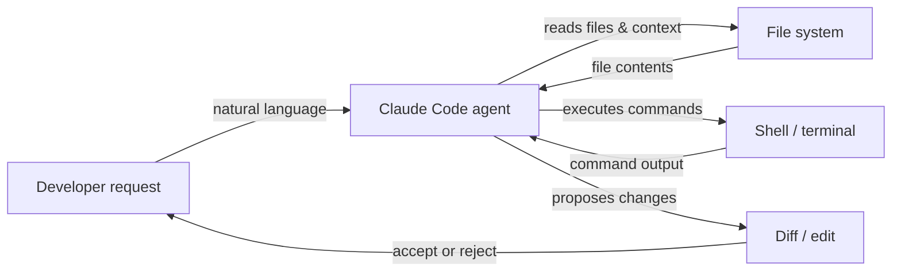

# Claude Code

## Definition

Claude Code ist Anthropics KI-gestützter Coding-Agent – ein zweckgebautes Tool, das Claudes Schlussfolgerungsfähigkeiten direkt in den Entwickler-Workflow bringt. Im Gegensatz zu chatorientierten KI-Tools ist Claude Code für den **agentischen Betrieb** konzipiert: Es kann mehrstufige Aufgaben autonom planen und ausführen, in großen Codebasen navigieren, Shell-Befehle ausführen, Dateien bearbeiten, Git-Operationen verwalten und auf seine eigene Ausgabe iterieren, ohne bei jedem Schritt ständige menschliche Führung zu benötigen.

Es ist in mehreren Umgebungen verfügbar: als **Befehlszeilenschnittstelle (CLI)**, die in jedem Terminal läuft, als Erweiterung für **VS Code** und **JetBrains**-IDEs mit Inline-Bearbeitung und visuellen Diffs, und über die **Web-App** unter claude.ai/code für browserbasierte Sitzungen. Diese Multi-Umgebungs-Präsenz bedeutet, dass Entwickler Claude Code dort verwenden können, wo sie bereits arbeiten, anstatt zu einem dedizierten toolspezifischen Editor wechseln zu müssen.

Das Kernfähigkeitsset deckt den vollständigen Coding-Lebenszyklus ab: **Codegenerierung** (Gerüstbau neuer Dateien, Schreiben von Funktionen, Generieren von Tests), **Refactoring** (Umstrukturierung vorhandenen Codes unter Beibehaltung des Verhaltens), **Debugging** (Diagnose von Fehlern mit vollem Kontext), **Git-Operationen** (Staging, Committen, Lesen von Diffs, Interpretieren der Geschichte) und **Dateiverwaltung** (Lesen, Schreiben, Suchen und Organisieren von Projektdateien). Da Claude Code Zugang zum gesamten Projektbaum und einem Terminal hat, verarbeitet es Aufgaben, die dateiübergreifendes Verständnis und sequenziellen Tool-Einsatz erfordern, auf natürliche Weise.

## Funktionsweise

### Installation und Authentifizierung

Claude Code wird als npm-Paket installiert (`npm install -g @anthropic-ai/claude-code`) und erfordert ein Claude-Abonnement (Pro, Teams oder Enterprise) oder API-Zugang über Amazon Bedrock oder Google Vertex AI. Nach dem Ausführen von `claude` in einem Terminal wird die Authentifizierung über OAuth oder einen in der lokalen Konfiguration gespeicherten API-Schlüssel abgewickelt. Die CLI liest das Projektverzeichnis, findet alle `CLAUDE.md`-Anweisungsdateien und startet eine interaktive Sitzung, in der der Benutzer Anfragen in natürlicher Sprache eingibt.

### Agentische Aufgabenausführungsschleife

Bei einer Aufgabe folgt Claude Code einer internen Plan-Akt-Beobachten-Schleife. Es liest zuerst relevante Dateien, um Kontext aufzubauen, dann gibt es sequenziell Tool-Aufrufe aus (Dateilesen, Shell-Befehle, Code-Bearbeitungen), beobachtet jedes Ergebnis und passt seinen Plan entsprechend an. Diese Schleife läuft autonom weiter, bis die Aufgabe abgeschlossen ist oder Claude bestimmt, dass Klärung benötigt wird. Der Agent behält den vollständigen Gesprächsverlauf über Runden hinweg bei, sodass er auf frühere Erkenntnisse verweisen und redundante Operationen vermeiden kann.

### IDE-Integrationen

In VS Code und JetBrains erscheint Claude Code als integriertes Panel mit einer Chat-Schnittstelle und Inline-Diff-Ansichten. Wenn Claude Code-Änderungen vorschlägt, erscheinen diese als Side-by-Side-Diffs, die der Entwickler akzeptieren, ablehnen oder teilweise anwenden kann. Die Erweiterung hat Zugang zum gleichen Dateisystem und Terminal wie die CLI, daher sind die Fähigkeiten äquivalent – der Unterschied ist ergonomisch, nicht funktional. Inline-Bearbeitungsverknüpfungen (ausgelöst durch eine Tastenkombination) ermöglichen es Entwicklern, gezielte Bearbeitungen anzufordern, ohne zu einem Chat-Panel wechseln zu müssen.

### Kontext und Tool-Nutzung

Claude Code verwendet eine Reihe von eingebauten Tools: `Read`, `Edit`, `Write`, `Bash`, `Glob` und `Grep`. Diese entsprechen direkt den Aktionen, die ein Entwickler beim Untersuchen und Modifizieren einer Codebasis vornehmen würde. Jeder Tool-Aufruf ist für den Benutzer in der Sitzung sichtbar, was das Schlussfolgern des Agenten nachvollziehbar macht. Dateikontext wird bei Bedarf geladen, anstatt vorgeladen zu werden, was die Verwaltung des Kontextfensters effizient hält. Anweisungen auf Projektebene in `CLAUDE.md`-Dateien werden automatisch in den System-Prompt eingefügt, um das Verhalten zu steuern.



## Wann verwenden / Wann NICHT verwenden

| Verwenden wenn | Vermeiden wenn |
|---|---|
| Sie einen Agenten benötigen, der mehrstufige Aufgaben autonom ausführt (z. B. "Paginierung zu allen Listenendpunkten hinzufügen") | Sie nur eine einzige Autovervollständigungsvorschlag benötigen — ein einfacheres Inline-Tool ist schneller |
| Sie eine unbekannte Codebasis mit Fragen in natürlicher Sprache erkunden möchten | Die Codebasis sensible Geheimnisse enthält, die niemals von einer externen KI gelesen werden sollten |
| Sie Git-bewusste Operationen benötigen: Diffs zusammenfassen, Commit-Nachrichten schreiben, PRs überprüfen | Ihr Projekt Offline- oder Air-Gap-Entwicklung ohne API-Zugang erfordert |
| Sie IDE-Integration mit visuellen Diffs und Inline-Bearbeitungen wollen | Sie vollständig lokale/Open-Source-KI ohne Cloud-Abhängigkeit bevorzugen |
| Sie Aufgaben aus dem Terminal ausführen und CLI-native KI-Unterstützung wollen | Sie detailliertes per-Token-Kosten-Tracking auf der kostenlosen Stufe benötigen |

## Vergleiche

| Kriterium | Claude Code | Cursor | GitHub Copilot |
|---|---|---|---|
| **Autonomieniveau** | Hoch — vollständige agentische Schleife mit mehrstufiger Planung und Ausführung | Mittel — KI-gestützter Editor mit Agentenmodus, aber primär editor-zentriert | Niedrig bis mittel — Inline-Vervollständigungen und Chat; Copilot Workspace fügt Planung hinzu |
| **IDE-Unterstützung** | VS Code, JetBrains, plus eigenständige CLI und Web | Proprietärer Fork von VS Code nur | VS Code, Visual Studio, JetBrains, Neovim und mehr |
| **Preismodell** | Im Claude-Pro/Teams-Abonnement enthalten oder pay-per-Token über API | Abonnement (20 $/Mo Hobby, 40 $/Mo Pro); keine kostenlose Stufe außer Test | Kostenlos für Einzelpersonen; 10 $/Mo Pro; Teams und Enterprise-Stufen |
| **Agentische Fähigkeiten** | Nativ: führt Shell-Befehle aus, bearbeitet Dateien, verwendet Git, schleift autonom | Wachsend: Agentenmodus verfügbar, führt Terminal-Befehle aus | Begrenzt: Copilot Workspace für Planung; Standardmodus ist reaktiv |
| **Kontextverarbeitung** | Explizites Tool-basiertes Dateiladen; unterstützt `CLAUDE.md` für persistente Anweisungen | Cursor Rules (`.cursorrules`) + Codebasis-Indexierung mit Einbettungen | Copilot-Kontext kommt aus offenen Dateien und ausgewähltem Code; keine persistenten Projektregeln |

Siehe auch die dedizierten Artikel: [Cursor](/docs/tools/cursor) und [GitHub Copilot](/docs/tools/github-copilot).

## Codebeispiele

```bash
# Install Claude Code globally
npm install -g @anthropic-ai/claude-code

# Start an interactive session in your project directory
cd ~/projects/my-app
claude

# --- Inside the Claude Code CLI session ---

# Ask a question about the codebase
> How is authentication handled in this project?

# Ask Claude to make a targeted change
> Add input validation to the POST /users endpoint in src/routes/users.ts

# Ask Claude to fix a bug with context
> The test in tests/auth.test.ts is failing with "Cannot read property 'id' of undefined". Fix it.

# Ask Claude to perform a cross-file refactor
> Rename the UserProfile component to ProfileCard across all files that import it

# Use git-aware operations
> Write a conventional commit message for the changes currently staged in git

# Run a slash command to clear conversation context
> /clear

# Run a multi-step agentic task
> Create a new Express route for GET /health that returns server uptime and version from package.json, add a unit test for it, and stage both files

# Exit the session
> /exit
```

## Praktische Ressourcen

- [Claude-Code-Dokumentation — Anthropic](https://docs.anthropic.com/en/docs/claude-code) — Offizielle Dokumentation zu Installation, CLI-Nutzung, IDE-Integrationen und Konfiguration.
- [Claude-Code-Schnellstart](https://docs.anthropic.com/en/docs/claude-code/quickstart) — Schritt-für-Schritt-Anleitung zur Installation, Authentifizierung und Durchführung Ihrer ersten Sitzung.
- [Claude-Code-GitHub-Repository](https://github.com/anthropics/claude-code) — Quellcode, Issue-Tracker und Release-Notizen für die CLI und Erweiterungen.
- [Anthropic Claude Code-Produktseite](https://www.anthropic.com/claude-code) — Überblick und Anwendungsbeispiele von Anthropic.
- [Skills-Repository](https://github.com/EmersonBraun/skills) — Kuratierte Sammlung wiederverwendbarer KI-Skills für Claude Code und andere KI-Coding-Assistenten

## Siehe auch

- [CLAUDE.md-Konfiguration](/docs/claude-code/claude-md)
- [Claude-Code-Skills](/docs/claude-code/skills)
- [Cursor](/docs/tools/cursor)
- [GitHub Copilot](/docs/tools/github-copilot)
