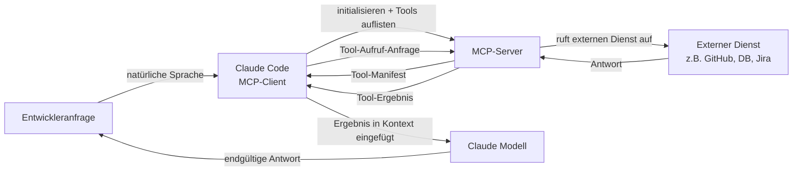

# MCP-Plugins und Integrationen

## Definition

Das Model Context Protocol (MCP) ist ein offener Standard, der von Anthropic entwickelt wurde und definiert, wie KI-Modelle mit externen Datenquellen und Tools kommunizieren. Im Kontext von Claude Code sind MCP-Server Plugins, die den Satz der für Claude verfügbaren Tools über seine integrierten Fähigkeiten hinaus erweitern (Dateisystemzugriff, Shell-Befehle, Git). Mit MCP kann Claude Datenbanken abfragen, externe APIs aufrufen, im Web surfen, Jira-Tickets lesen, Grafana-Dashboards abfragen, mit GitHub interagieren und alles andere tun, was ein MCP-Server implementiert – alles über dieselbe natürliche Sprachschnittstelle wie integrierte Tools.

MCP folgt einer Client-Server-Architektur. Claude Code fungiert als **MCP-Client**: Es erkennt verfügbare MCP-Server aus der Konfiguration, stellt beim Sitzungsstart Verbindungen zu ihnen her und fragt die Liste der Tools ab, die sie bereitstellen. Jeder MCP-Server stellt einen Satz von **Tools** (Funktionen mit JSON-Schema-Eingabedefinitionen, strukturell identisch mit integrierten Tools), optionale **Ressourcen** (schreibgeschützte Datenquellen wie Dokumentation oder Datenbankschemata) und optionale **Prompts** (wiederverwendbare Prompt-Vorlagen) bereit. Wenn Claude entscheidet, ein MCP-Tool aufzurufen, leitet Claude Code den Aufruf an den entsprechenden Server weiter, führt die Operation aus und gibt das Ergebnis als Tool-Ergebnis an das Modell zurück.

Der Hauptvorteil von MCP gegenüber Ad-hoc-Tool-Integrationen ist die Standardisierung. Vor MCP hatte jeder KI-Assistent sein eigenes proprietäres Plugin-Format. MCP definiert ein universelles Protokoll, sodass ein einmal geschriebener MCP-Server mit jedem MCP-kompatiblen Client funktioniert – Claude Code, Claude Desktop oder jedem anderen MCP-Client. Das bedeutet, dass das Ökosystem der verfügbaren Integrationen schnell wächst, und der Aufbau einer neuen Integration erfordert kein Verständnis der Claude-spezifischen Interna.

## Funktionsweise

### MCP-Server-Typen und Transporte

MCP-Server gibt es in zwei Transport-Varianten. **Stdio-Server** laufen als lokale Subprozesse: Claude Code startet den Serverprozess beim Sitzungsstart und kommuniziert über stdin/stdout mit JSON-RPC. Stdio-Server sind der häufigste Typ für lokale Tools (Datenbankclients, Dateiprozessoren, spezialisierte Code-Analyse). **SSE (Server-Sent Events) Server** laufen als persistente HTTP-Server und kommunizieren über eine Netzwerkverbindung. SSE-Server sind besser für Remote-Dienste, gemeinsam genutzte Team-Infrastruktur oder Server geeignet, die den Zustand über mehrere Client-Verbindungen hinweg aufrechterhalten müssen.

### Konfiguration und Erkennung

MCP-Server werden in Claude Codes Einstellungsdatei konfiguriert, typischerweise unter `~/.claude/settings.json` für globale Konfiguration oder `.claude/settings.json` für projektspezifische Server. Jeder Server-Eintrag gibt einen Namen, Transporttyp und den Befehl (für stdio) oder die URL (für SSE) an, die benötigt wird, um den Server zu starten oder sich mit ihm zu verbinden. Claude Code liest diese Konfiguration beim Sitzungsstart, initialisiert Verbindungen zu allen konfigurierten Servern und ruft ihre Tool-Manifeste ab. Die Tools aller verbundenen MCP-Server erscheinen in der Tool-Liste des Modells neben integrierten Tools – aus der Perspektive des Modells gibt es keinen Unterschied.

### Tool-Aufruf-Flow

Wenn Claude entscheidet, ein MCP-Tool aufzurufen, fungiert Claude Code als Vermittler: Es serialisiert die Tool-Aufruf-Argumente zu JSON, sendet eine `tools/call`-Anfrage an den MCP-Server über den konfigurierten Transport, wartet auf die Antwort, deserialisiert das Ergebnis und gibt es als `tool_result`-Block an das Modell zurück. Der gesamte Roundtrip ist für das Modell transparent – es sieht einfach ein Tool-Ergebnis, genau wie bei einem integrierten Tool-Aufruf. MCP-Server können Text, Bilder oder strukturierte Daten zurückgeben, die Claude Code alle entsprechend an das Modell weiterleitet.

### Authentifizierung und Sicherheit

MCP-Server handhaben ihre eigene Authentifizierung. Ein GitHub MCP-Server zum Beispiel liest ein GitHub Personal Access Token aus einer Umgebungsvariable, die im `env`-Feld des Server-Eintrags konfiguriert ist. Claude Code übergibt die konfigurierte Umgebung an den Subprozess, verwaltet aber keine Geheimnisse selbst – es liegt in der Verantwortung des MCP-Servers, sich bei externen Diensten zu authentifizieren. Da MCP-Server Code mit den Berechtigungen des lokalen Benutzers ausführen, sollte Sorgfalt walten, wenn Drittanbieter-MCP-Server verwendet werden: Überprüfen Sie den Code des Servers oder vertrauen Sie dem Herausgeber, bevor Sie ihn Ihrer Konfiguration hinzufügen.



## Wann verwenden / Wann NICHT verwenden

| Verwenden wenn | Vermeiden wenn |
|---|---|
| Sie Claude mit einem externen Dienst interagieren lassen möchten (GitHub, Jira, Slack, Datenbanken) | Die Aufgabe mit integrierten Tools erledigt werden kann (Dateisystem, Shell) – keine Notwendigkeit, Komplexität hinzuzufügen |
| Ihr Team einen gemeinsamen Satz von Tools hat und eine standardisierte Integrationsschicht möchte | Sie sich in einer sicherheitssensiblen Umgebung befinden, in der externer Tool-Zugriff streng kontrolliert werden muss |
| Sie Claude Zugriff auf private Datenquellen geben möchten (interne APIs, proprietäre Datenbanken) | Sie eine schnelle einmalige Integration benötigen – ein Shell-Skript, das über das Bash-Tool aufgerufen wird, ist einfacher |
| Sie ein wiederverwendbares Tool erstellen, das über mehrere KI-Clients hinweg funktionieren soll | Der MCP-Server, den Sie verwenden möchten, aus einer nicht vertrauenswürdigen Quelle stammt – überprüfen Sie zuerst den Code |
| Sie möchten, dass Claude Live-Zugriff auf den Systemzustand hat (Metriken, Logs, Error-Tracking) | Der externe Dienst Rate-Limits hat, die durch Claudes autonome Tool-Aufrufe überschritten werden könnten |

## Code-Beispiele

```json
// ~/.claude/settings.json — MCP-Server-Konfiguration
{
  "mcpServers": {
    // GitHub MCP-Server — gibt Claude Zugriff auf Repos, Issues, PRs
    "github": {
      "command": "npx",
      "args": ["-y", "@modelcontextprotocol/server-github"],
      "env": {
        "GITHUB_PERSONAL_ACCESS_TOKEN": "${GITHUB_TOKEN}"
      }
    },

    // PostgreSQL MCP-Server — gibt Claude Lesezugriff auf Ihr Datenbankschema und Abfragefähigkeit
    "postgres": {
      "command": "npx",
      "args": ["-y", "@modelcontextprotocol/server-postgres", "postgresql://localhost/mydb"],
      "env": {
        "PGPASSWORD": "${DB_PASSWORD}"
      }
    },

    // Filesystem MCP-Server (erweitert) — gibt Claude Zugriff auf Verzeichnisse außerhalb des Projektstamms
    "filesystem": {
      "command": "npx",
      "args": [
        "-y",
        "@modelcontextprotocol/server-filesystem",
        "/Users/me/projects",
        "/Users/me/documents/specs"
      ]
    },

    // Benutzerdefinierter interner MCP-Server (stdio, lokale Binärdatei)
    "internal-tools": {
      "command": "/usr/local/bin/my-mcp-server",
      "args": ["--config", "/etc/my-mcp/config.json"],
      "env": {
        "INTERNAL_API_KEY": "${INTERNAL_API_KEY}"
      }
    },

    // Remote SSE-Server — gemeinsam genutzte Team-Infrastruktur
    "team-server": {
      "url": "https://mcp.internal.mycompany.com/sse",
      "headers": {
        "Authorization": "Bearer ${TEAM_MCP_TOKEN}"
      }
    }
  }
}
```

```typescript
// Benutzerdefinierter MCP-Server — TypeScript-Implementierung mit dem offiziellen MCP SDK
// Dieses Beispiel erstellt einen MCP-Server, der eine interne Metriken-API umhüllt

import { McpServer } from "@modelcontextprotocol/sdk/server/mcp.js";
import { StdioServerTransport } from "@modelcontextprotocol/sdk/server/stdio.js";
import { z } from "zod";

// Den MCP-Server mit einem Namen und einer Version initialisieren
const server = new McpServer({
  name: "metrics-server",
  version: "1.0.0",
});

// Ein Tool definieren: get_error_rate
// Die Beschreibung ist entscheidend — Claude verwendet sie, um zu entscheiden, wann dieses Tool aufgerufen werden soll
server.tool(
  "get_error_rate",
  "Get the error rate for a service over a specified time window. Use this when the user asks about errors, reliability, or service health.",
  {
    // Zod-Schema — das SDK konvertiert dies automatisch in JSON-Schema
    service: z.string().describe("The service name, e.g. 'api', 'frontend', 'worker'"),
    window: z
      .enum(["1h", "6h", "24h", "7d"])
      .describe("Time window for the metric. Defaults to 1h."),
  },
  async ({ service, window }) => {
    // In der Produktion würde dies Ihre Metriken-API aufrufen (Prometheus, Datadog usw.)
    const response = await fetch(
      `https://metrics.internal.mycompany.com/api/error-rate?service=${service}&window=${window}`,
      { headers: { Authorization: `Bearer ${process.env.METRICS_API_KEY}` } }
    );

    if (!response.ok) {
      return {
        content: [{ type: "text", text: `Error fetching metrics: ${response.statusText}` }],
        isError: true,
      };
    }

    const data = await response.json();
    return {
      content: [
        {
          type: "text",
          text: JSON.stringify({
            service,
            window,
            error_rate: data.errorRate,
            total_requests: data.totalRequests,
            error_count: data.errorCount,
            timestamp: new Date().toISOString(),
          }, null, 2),
        },
      ],
    };
  }
);

// Ein Tool definieren: list_services
server.tool(
  "list_services",
  "List all services that have metrics available for monitoring.",
  {},
  async () => {
    const response = await fetch("https://metrics.internal.mycompany.com/api/services", {
      headers: { Authorization: `Bearer ${process.env.METRICS_API_KEY}` },
    });
    const services = await response.json();
    return {
      content: [{ type: "text", text: JSON.stringify(services, null, 2) }],
    };
  }
);

// Den Server mit stdio-Transport starten (für lokale Subprozess-Nutzung)
const transport = new StdioServerTransport();
await server.connect(transport);
```

```bash
# Das MCP SDK zum Erstellen benutzerdefinierter Server installieren
npm install @modelcontextprotocol/sdk zod

# Den benutzerdefinierten Server lokal für Tests kompilieren und ausführen
npx ts-node metrics-server.ts

# Den benutzerdefinierten Server zur Claude Code-Konfiguration hinzufügen
cat >> ~/.claude/settings.json << 'EOF'
# (zum mcpServers-Objekt in Ihrer bestehenden settings.json hinzufügen)
"metrics": {
  "command": "node",
  "args": ["/path/to/metrics-server.js"],
  "env": {
    "METRICS_API_KEY": "your-api-key-here"
  }
}
EOF

# Innerhalb einer Claude Code-Sitzung die MCP-Tools natürlich verwenden:
claude
> What is the current error rate for the api service?
> List all services and show me the error rates for any that exceed 1% in the last hour
> Compare error rates across all services for the past 24 hours
```

## Praktische Ressourcen

- [MCP-Dokumentation — Anthropic](https://docs.anthropic.com/en/docs/mcp) — Offizielle MCP-Spezifikation, Protokollübersicht und Client/Server-Architektur.
- [MCP TypeScript SDK](https://github.com/modelcontextprotocol/typescript-sdk) — Offizielles SDK zum Erstellen von MCP-Servern und -Clients in TypeScript/JavaScript.
- [MCP-Server-Repository](https://github.com/modelcontextprotocol/servers) — Offizielle Sammlung von Referenz-MCP-Servern: Dateisystem, GitHub, PostgreSQL, Google Drive, Slack und mehr.
- [Claude Code MCP-Integrationsleitfaden](https://docs.anthropic.com/en/docs/claude-code/mcp) — Claude Code-spezifischer Leitfaden zur Konfiguration und Verwendung von MCP-Servern in Sitzungen.
- [MCP-Spezifikation](https://spec.modelcontextprotocol.io) — Vollständige Protokollspezifikation zur Implementierung benutzerdefinierter Clients oder Server.

## Siehe auch

- [Claude Code Übersicht](/docs/claude-code)
- [Claude Code Skills](/docs/claude-code/skills)
- [Anthropic Tool Use](/docs/agents/anthropic-tool-use)
