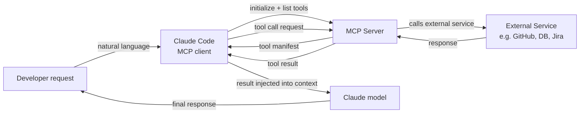

# MCP-Plugins und Integrationen

## Definition

Das Model Context Protocol (MCP) ist ein offener Standard, der von Anthropic entwickelt wurde und definiert, wie KI-Modelle mit externen Datenquellen und Tools kommunizieren. Im Kontext von Claude Code sind MCP-Server Plugins, die den Satz verfügbarer Tools für Claude über seine eingebauten Fähigkeiten (Dateisystemzugang, Shell-Befehle, Git) hinaus erweitern. Mit MCP kann Claude Datenbanken abfragen, externe APIs aufrufen, im Web surfen, Jira-Tickets lesen, Grafana-Dashboards abfragen, mit GitHub interagieren und alles andere tun, was ein MCP-Server implementiert – alles über dieselbe natürlichsprachige Schnittstelle wie eingebaute Tools.

MCP folgt einer Client-Server-Architektur. Claude Code fungiert als **MCP-Client**: Es entdeckt verfügbare MCP-Server aus der Konfiguration, verbindet sich beim Sitzungsstart mit ihnen und fragt sie nach der Liste der bereitgestellten Tools. Jeder MCP-Server stellt einen Satz von **Tools** bereit (Funktionen mit JSON-Schema-Eingabedefinitionen, identisch in der Struktur mit eingebauten Tools), optionale **Ressourcen** (schreibgeschützte Datenquellen wie Dokumentation oder Datenbankschemata) und optionale **Prompts** (wiederverwendbare Prompt-Vorlagen). Wenn Claude entscheidet, ein MCP-Tool aufzurufen, leitet Claude Code den Aufruf an den entsprechenden Server weiter, führt die Operation aus und gibt das Ergebnis als Tool-Ergebnis an das Modell zurück.

Der Hauptvorteil von MCP gegenüber Ad-hoc-Tool-Integrationen ist die Standardisierung. Vor MCP hatte jeder KI-Assistent sein eigenes proprietäres Plugin-Format. MCP definiert ein universelles Protokoll, sodass ein einmal geschriebener MCP-Server mit jedem MCP-kompatiblen Client funktioniert – Claude Code, Claude Desktop oder einem anderen MCP-Client. Das bedeutet, dass das Ökosystem verfügbarer Integrationen schnell wächst und das Aufbauen einer neuen Integration kein Verständnis der Claude-spezifischen Interna erfordert.

## Funktionsweise

### MCP-Server-Typen und Transporte

MCP-Server gibt es in zwei Transport-Varianten. **stdio-Server** laufen als lokale Unterprozesse: Claude Code startet den Serverprozess beim Sitzungsbeginn und kommuniziert über stdin/stdout mittels JSON-RPC. stdio-Server sind der häufigste Typ für lokale Tools (Datenbank-Clients, Dateiprozessoren, spezialisierte Code-Analyse). **SSE-(Server-Sent-Events-)Server** laufen als persistente HTTP-Server und kommunizieren über eine Netzwerkverbindung. SSE-Server eignen sich besser für Remote-Dienste, gemeinsam genutzte Team-Infrastruktur oder Server, die Zustände über mehrere Client-Verbindungen hinweg aufrechterhalten müssen.

### Konfiguration und Entdeckung

MCP-Server werden in Claude Codes Einstellungsdatei konfiguriert, typischerweise unter `~/.claude/settings.json` für die globale Konfiguration oder `.claude/settings.json` für projektspezifische Server. Jeder Server-Eintrag gibt einen Namen, den Transport-Typ und den Befehl (für stdio) oder die URL (für SSE) an, die zum Starten oder Verbinden mit dem Server benötigt wird. Claude Code liest diese Konfiguration beim Sitzungsstart, initialisiert Verbindungen zu allen konfigurierten Servern und ruft ihre Tool-Manifeste ab. Die Tools aller verbundenen MCP-Server erscheinen in der Tool-Liste des Modells neben eingebauten Tools – aus der Perspektive des Modells gibt es keinen Unterschied.

### Tool-Aufruf-Ablauf

Wenn Claude entscheidet, ein MCP-Tool aufzurufen, fungiert Claude Code als Vermittler: Es serialisiert die Tool-Aufruf-Argumente zu JSON, sendet eine `tools/call`-Anfrage an den MCP-Server über den konfigurierten Transport, wartet auf die Antwort, deserialisiert das Ergebnis und gibt es als `tool_result`-Block an das Modell zurück. Der gesamte Umlauf ist für das Modell transparent – es sieht einfach ein Tool-Ergebnis, genau wie bei einem eingebauten Tool-Aufruf. MCP-Server können Text, Bilder oder strukturierte Daten zurückgeben, die Claude Code alle entsprechend an das Modell weiterleitet.

### Authentifizierung und Sicherheit

MCP-Server verwalten ihre eigene Authentifizierung. Ein GitHub-MCP-Server liest beispielsweise ein persönliches GitHub-Zugriffstoken aus einer Umgebungsvariablen, die im `env`-Feld des Server-Eintrags konfiguriert ist. Claude Code übergibt die konfigurierte Umgebung an den Unterprozess, verwaltet Geheimnisse selbst jedoch nicht – es ist die Verantwortung des MCP-Servers, sich bei externen Diensten zu authentifizieren. Da MCP-Server Code mit den Berechtigungen des lokalen Benutzers ausführen, sollte bei der Verwendung von Drittanbieter-MCP-Servern Vorsicht walten: Überprüfen Sie den Code des Servers oder vertrauen Sie dem Herausgeber, bevor Sie ihn zu Ihrer Konfiguration hinzufügen.



## Wann verwenden / Wann NICHT verwenden

| Verwenden wenn | Vermeiden wenn |
|---|---|
| Claude mit einem externen Dienst interagieren soll (GitHub, Jira, Slack, Datenbanken) | Die Aufgabe mit eingebauten Tools (Dateisystem, Shell) erledigt werden kann — fügen Sie keine unnötige Komplexität hinzu |
| Ihr Team einen gemeinsamen Satz von Tools hat und Sie eine standardisierte Integrationsschicht wollen | Sie sich in einer sicherheitssensiblen Umgebung befinden, in der externer Tool-Zugang streng kontrolliert werden muss |
| Sie Claude Zugang zu privaten Datenquellen geben wollen (interne APIs, proprietäre Datenbanken) | Sie eine schnelle einmalige Integration benötigen — ein Shell-Skript, das über das Bash-Tool aufgerufen wird, ist einfacher |
| Sie ein wiederverwendbares Tool aufbauen, das über mehrere KI-Clients hinweg funktionieren soll | Der MCP-Server, den Sie verwenden möchten, aus einer nicht vertrauenswürdigen Quelle stammt — überprüfen Sie zuerst seinen Code |
| Sie möchten, dass Claude Live-Zugang zum Systemzustand hat (Metriken, Logs, Fehlerverfolgung) | Der externe Dienst Ratenlimits hat, die durch Claudes autonome Tool-Aufrufe überschritten werden könnten |

## Codebeispiele

```json
// ~/.claude/settings.json — MCP server configuration
{
  "mcpServers": {
    // GitHub MCP server — gives Claude access to repos, issues, PRs
    "github": {
      "command": "npx",
      "args": ["-y", "@modelcontextprotocol/server-github"],
      "env": {
        "GITHUB_PERSONAL_ACCESS_TOKEN": "${GITHUB_TOKEN}"
      }
    },

    // PostgreSQL MCP server — gives Claude read access to your database schema and query capability
    "postgres": {
      "command": "npx",
      "args": ["-y", "@modelcontextprotocol/server-postgres", "postgresql://localhost/mydb"],
      "env": {
        "PGPASSWORD": "${DB_PASSWORD}"
      }
    },

    // Filesystem MCP server (extended) — gives Claude access to directories beyond the project root
    "filesystem": {
      "command": "npx",
      "args": [
        "-y",
        "@modelcontextprotocol/server-filesystem",
        "/Users/me/projects",
        "/Users/me/documents/specs"
      ]
    },

    // Custom internal MCP server (stdio, local binary)
    "internal-tools": {
      "command": "/usr/local/bin/my-mcp-server",
      "args": ["--config", "/etc/my-mcp/config.json"],
      "env": {
        "INTERNAL_API_KEY": "${INTERNAL_API_KEY}"
      }
    },

    // Remote SSE server — shared team infrastructure
    "team-server": {
      "url": "https://mcp.internal.mycompany.com/sse",
      "headers": {
        "Authorization": "Bearer ${TEAM_MCP_TOKEN}"
      }
    }
  }
}
```

```typescript
// Custom MCP server — TypeScript implementation using the official MCP SDK
// This example creates an MCP server that wraps an internal metrics API

import { McpServer } from "@modelcontextprotocol/sdk/server/mcp.js";
import { StdioServerTransport } from "@modelcontextprotocol/sdk/server/stdio.js";
import { z } from "zod";

// Initialize the MCP server with a name and version
const server = new McpServer({
  name: "metrics-server",
  version: "1.0.0",
});

// Define a tool: get_error_rate
// The description is critical — Claude uses it to decide when to call this tool
server.tool(
  "get_error_rate",
  "Get the error rate for a service over a specified time window. Use this when the user asks about errors, reliability, or service health.",
  {
    // Zod schema — the SDK converts this to JSON Schema automatically
    service: z.string().describe("The service name, e.g. 'api', 'frontend', 'worker'"),
    window: z
      .enum(["1h", "6h", "24h", "7d"])
      .describe("Time window for the metric. Defaults to 1h."),
  },
  async ({ service, window }) => {
    // In production, this would call your metrics API (Prometheus, Datadog, etc.)
    const response = await fetch(
      `https://metrics.internal.mycompany.com/api/error-rate?service=${service}&window=${window}`,
      { headers: { Authorization: `Bearer ${process.env.METRICS_API_KEY}` } }
    );

    if (!response.ok) {
      return {
        content: [{ type: "text", text: `Error fetching metrics: ${response.statusText}` }],
        isError: true,
      };
    }

    const data = await response.json();
    return {
      content: [
        {
          type: "text",
          text: JSON.stringify({
            service,
            window,
            error_rate: data.errorRate,
            total_requests: data.totalRequests,
            error_count: data.errorCount,
            timestamp: new Date().toISOString(),
          }, null, 2),
        },
      ],
    };
  }
);

// Define a tool: list_services
server.tool(
  "list_services",
  "List all services that have metrics available for monitoring.",
  {},
  async () => {
    const response = await fetch("https://metrics.internal.mycompany.com/api/services", {
      headers: { Authorization: `Bearer ${process.env.METRICS_API_KEY}` },
    });
    const services = await response.json();
    return {
      content: [{ type: "text", text: JSON.stringify(services, null, 2) }],
    };
  }
);

// Start the server with stdio transport (for local subprocess use)
const transport = new StdioServerTransport();
await server.connect(transport);
```

```bash
# Install the MCP SDK for building custom servers
npm install @modelcontextprotocol/sdk zod

# Compile and run the custom server locally for testing
npx ts-node metrics-server.ts

# Add the custom server to your Claude Code configuration
cat >> ~/.claude/settings.json << 'EOF'
# (add to the mcpServers object in your existing settings.json)
"metrics": {
  "command": "node",
  "args": ["/path/to/metrics-server.js"],
  "env": {
    "METRICS_API_KEY": "your-api-key-here"
  }
}
EOF

# Inside a Claude Code session, use the MCP tools naturally:
claude
> What is the current error rate for the api service?
> List all services and show me the error rates for any that exceed 1% in the last hour
> Compare error rates across all services for the past 24 hours
```

## Praktische Ressourcen

- [MCP-Dokumentation — Anthropic](https://docs.anthropic.com/en/docs/mcp) — Offizielle MCP-Spezifikation, Protokollübersicht und Client/Server-Architektur.
- [MCP TypeScript SDK](https://github.com/modelcontextprotocol/typescript-sdk) — Offizielles SDK zum Erstellen von MCP-Servern und -Clients in TypeScript/JavaScript.
- [MCP-Server-Repository](https://github.com/modelcontextprotocol/servers) — Offizielle Sammlung von Referenz-MCP-Server-Implementierungen: Dateisystem, GitHub, PostgreSQL, Google Drive, Slack und mehr.
- [Claude-Code-MCP-Integrationsleitfaden](https://docs.anthropic.com/en/docs/claude-code/mcp) — Claude-Code-spezifischer Leitfaden für die Konfiguration und Verwendung von MCP-Servern in Sitzungen.
- [MCP-Spezifikation](https://spec.modelcontextprotocol.io) — Vollständige Protokollspezifikation für die Implementierung benutzerdefinierter Clients oder Server.

## Siehe auch

- [Claude-Code-Übersicht](/docs/claude-code)
- [Claude-Code-Skills](/docs/claude-code/skills)
- [Anthropic Tool Use](/docs/agents/anthropic-tool-use)
