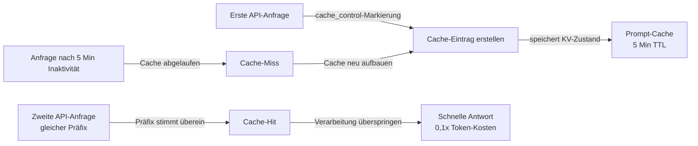

# Prompt-Caching

## Definition

Prompt-Caching ist eine Funktion der Claude API, die es ermöglicht, wiederholte Teile eines Prompts – den System-Prompt, Tool-Definitionen, Dokumentkontext oder lange Gesprächspräfixe – einmal zu verarbeiten und über mehrere nachfolgende API-Aufrufe hinweg wiederzuverwenden. Anstatt identische Token-Sequenzen bei jeder Anfrage erneut zu verarbeiten, liest das Modell sie aus einem Cache, was die Latenz reduziert und die Kosten der gecachten Token senkt. In Claude Code arbeitet Prompt-Caching automatisch im Hintergrund, um lange Sitzungen und wiederholte Tool-Nutzung schneller und günstiger zu machen.

Der Kerngedanke hinter Prompt-Caching ist, dass sich zwischen API-Aufrufen in einer Coding-Sitzung das meiste wenig ändert: eine neue Benutzernachricht, ein neues Tool-Ergebnis oder eine aktualisierte Datei. Die großen, stabilen Teile – der System-Prompt mit Projektanweisungen, die Definitionen aller verfügbaren Tools und der angesammelte Gesprächsverlauf – bleiben für die meisten Züge unverändert. Diese stabilen Teile bei jeder Anfrage redundant zu verarbeiten ist verschwenderisch. Prompt-Caching eliminiert diese Verschwendung, indem verarbeitete Key-Value-Zustände gespeichert und wiederverwendet werden, wenn der Prompt-Präfix übereinstimmt.

Aus der Perspektive eines Entwicklers ist Prompt-Caching in Claude Code-Sitzungen weitgehend transparent – es geschieht automatisch ohne Konfiguration. Das Verständnis dafür ist am wichtigsten, wenn direkt auf der Claude API aufgebaut wird, langlebige Agenten-Schleifen entworfen werden oder unerwartet hohe Latenz oder Kosten behoben werden. In diesen Kontexten kann das Wissen, wie Prompts für optimale Cache-Nutzung strukturiert werden, erhebliche Einsparungen bringen: Gecachte Eingabe-Token werden zu einem Bruchteil der Kosten regulärer Eingabe-Token abgerechnet, und Cache-Hits eliminieren die Verarbeitungslatenz für gecachte Teile vollständig.

## Funktionsweise

### Cache-Kontroll-Markierungen

Prompt-Caching verwendet explizite `cache_control`-Annotationen, um anzugeben, wo im Prompt ein Cache-Checkpoint erstellt werden soll. Wenn die API eine Anfrage mit `{"type": "ephemeral"}` Cache-Kontrolle auf einem Content-Block verarbeitet, speichert sie den verarbeiteten Zustand aller Token bis einschließlich dieses Blocks. Bei nachfolgenden Anfragen mit demselben Präfix erkennt die API den Cache-Hit und überspringt die Verarbeitung dieser Token. Ein Prompt kann bis zu vier aktive Cache-Checkpoints gleichzeitig haben, was Entwicklern ermöglicht, den System-Prompt separat von Tool-Definitionen und vom Gesprächsverlauf zu cachen.

### Cache-Lebensdauer und Invalidierung

Der ephemere Cache hat eine Time-to-Live von ungefähr fünf Minuten Inaktivität. Wenn kein API-Aufruf innerhalb dieses Fensters auf einen gecachten Präfix verweist, wird der Cache-Eintrag verworfen und muss bei der nächsten Anfrage neu aufgebaut werden. Das bedeutet, dass Prompt-Caching für hochfrequente Anwendungsfälle am effektivsten ist: interaktive Coding-Sitzungen, bei denen Anfragen alle paar Sekunden ankommen, Agenten-Schleifen, die viele Tool-Aufrufe in schneller Folge ausführen, oder Batch-Verarbeitungs-Pipelines, die viele Dokumente mit einem gemeinsamen System-Prompt verarbeiten. Für niederfrequente Workflows, bei denen zwischen Anfragen Minuten vergehen, kann der Cache ablaufen und keinen Nutzen bieten.

### Was gecacht werden soll

Die höchstwertigen Kandidaten für das Caching sind Inhalte, die groß, stabil und häufig wiederverwendet werden. Der System-Prompt ist der offensichtlichste Kandidat: In Claude Code enthält er Projektanweisungen aus CLAUDE.md, Tool-Definitionen und Verhaltensrichtlinien – oft tausende Token, die bei jedem Zug identisch sind. Tool-Definitionen (JSON-Schemas für alle verfügbaren Tools) sind ein weiterer starker Kandidat. In RAG- oder dokumentenschweren Workflows können große Referenzdokumente, die zu Beginn einer Sitzung geladen werden, gecacht werden, sodass nachfolgende Fragen zu diesen Dokumenten nur die marginalen Kosten der neuen Frage verursachen, nicht die Kosten des erneuten Lesens der Dokumente.

### Cache-Hit-Erkennung und Nutzungsberichte

Die API-Antwort enthält ein `usage`-Objekt, das zwischen regulären Eingabe-Token, Cache-Erstellungs-Token und Cache-Lese-Token unterscheidet. Cache-Erstellungs-Token werden zum 1,25-fachen des Basistarifs berechnet (die einmaligen Kosten des Schreibens in den Cache). Cache-Lese-Token werden zum 0,1-fachen des Basistarifs berechnet – ein 90% Rabatt gegenüber regulären Eingabe-Token. Die Überwachung dieser Felder ermöglicht es Entwicklern, die tatsächliche Cache-Effektivität zu messen: Das Verhältnis von Cache-Lese-Token zu Gesamt-Eingabe-Token gibt an, wie viel des Prompts aus dem Cache bedient wird.



## Wann verwenden / Wann NICHT verwenden

| Verwenden wenn | Vermeiden wenn |
|---|---|
| Ihr System-Prompt groß ist (>1.000 Token) und über viele Anfragen hinweg konstant ist | Ihre Prompts sich bei jeder Anfrage erheblich ändern – kein stabiler Präfix zum Cachen |
| Sie eine Agenten-Schleife mit vielen sequentiellen Tool-Aufrufen in einer einzelnen Sitzung ausführen | Anfragen selten sind (>5 Min zwischen Zügen) – der Cache läuft ab, bevor er wiederverwendet werden kann |
| Sie große Referenzdokumente (Spezifikationen, Codebasen) beim Sitzungsstart laden | Ihr Anwendungsfall Single-Shot-Anfragen ohne wiederholten Kontext ist |
| Sie die Latenz bei der ersten benutzersichtbaren Antwort in einer interaktiven Sitzung reduzieren möchten | Sie testen oder debuggen und deterministische Token-Zahlen pro Anfrage wünschen |
| Sie Kosten in einem Produktionssystem mit hohem API-Aufrufvolumen optimieren | Der Overhead der Strukturierung von cache_control-Markierungen bei niedrigem Volumen die Einsparungen überwiegt |

## Code-Beispiele

```python
import anthropic

client = anthropic.Anthropic()

# Beispiel: Einen großen System-Prompt und Tool-Definitionen cachen
# Der System-Prompt ist bei jeder Anfrage gleich — für das Caching markieren

SYSTEM_PROMPT = """
You are a senior software engineer working on a large TypeScript monorepo.
The project uses React on the frontend, Node.js/Express on the backend, and PostgreSQL.
[... imagine 2000+ tokens of detailed project instructions here ...]
""" * 10  # Einen großen System-Prompt simulieren

# Tool-Definitionen für den Coding-Agenten — über alle Anfragen hinweg stabil
TOOLS = [
    {
        "name": "read_file",
        "description": "Read a file from the project directory",
        "input_schema": {
            "type": "object",
            "properties": {
                "path": {"type": "string", "description": "Relative file path"}
            },
            "required": ["path"]
        }
    },
    {
        "name": "write_file",
        "description": "Write content to a file",
        "input_schema": {
            "type": "object",
            "properties": {
                "path": {"type": "string"},
                "content": {"type": "string"}
            },
            "required": ["path", "content"]
        }
    },
    # ... weitere Tools
]

def make_request(messages: list, turn_number: int) -> dict:
    """
    Eine Claude API-Anfrage mit aktiviertem Prompt-Caching stellen.
    Der System-Prompt und die Tools sind mit cache_control markiert, sodass sie
    einmal verarbeitet und bei nachfolgenden Aufrufen in derselben Sitzung wiederverwendet werden.
    """
    response = client.messages.create(
        model="claude-opus-4-5",
        max_tokens=4096,
        # Den System-Prompt mit cache_control für das Caching markieren
        system=[
            {
                "type": "text",
                "text": SYSTEM_PROMPT,
                # Dies weist die API an, alles bis zu diesem Punkt zu cachen
                "cache_control": {"type": "ephemeral"}
            }
        ],
        # Tool-Definitionen auch für das Caching markieren
        tools=[
            {**tool, "cache_control": {"type": "ephemeral"}} if i == len(TOOLS) - 1 else tool
            for i, tool in enumerate(TOOLS)
        ],
        messages=messages
    )

    # Cache-Nutzung in der Antwort inspizieren
    usage = response.usage
    print(f"Zug {turn_number} Token-Nutzung:")
    print(f"  Eingabe-Token:        {usage.input_tokens:>8}")
    print(f"  Cache-Erstellung:     {usage.cache_creation_input_tokens:>8}  (1,25x Kosten)")
    print(f"  Cache-Lesen:          {usage.cache_read_input_tokens:>8}  (0,1x Kosten)")
    print(f"  Ausgabe-Token:        {usage.output_tokens:>8}")

    # Effektive Kosteneinsparungen berechnen
    if usage.cache_read_input_tokens > 0:
        savings_pct = (usage.cache_read_input_tokens / usage.input_tokens) * 100 * 0.9
        print(f"  Geschätzte Einsparungen:   {savings_pct:.1f}% bei Eingabe-Token in diesem Zug")

    return response

# Eine mehrzügige Coding-Sitzung simulieren
messages = []

# Zug 1 — Kaltstart, Cache wird aufgebaut
messages.append({"role": "user", "content": "What files exist in the src/ directory?"})
response1 = make_request(messages, turn_number=1)
# Ausgabe: cache_creation_input_tokens > 0, cache_read_input_tokens = 0
messages.append({"role": "assistant", "content": response1.content})

# Zug 2 — System-Prompt und Tools sind jetzt gecacht
messages.append({"role": "user", "content": "Read the main entry point file"})
response2 = make_request(messages, turn_number=2)
# Ausgabe: cache_read_input_tokens > 0, erhebliche Kosteneinsparungen

# Zug 3 — immer noch Cache-Hits auf System-Prompt + Tools
messages.append({"role": "user", "content": "Explain how the authentication middleware works"})
response3 = make_request(messages, turn_number=3)
# Ausgabe: fortlaufende Cache-Hits, wachsende cache_read_input_tokens
```

```bash
# Prompt-Caching in Claude Code-Sitzungen beobachten
# Claude Code wendet Caching automatisch an — verwenden Sie den Verbose-Modus, um Token-Zahlen zu sehen

# Eine Sitzung mit Verbose-Ausgabe starten, um die Token-Nutzung zu inspizieren
claude --verbose

# Innerhalb der Sitzung mehrere Anfragen nacheinander ausführen
> List all TypeScript files in src/
> Read src/index.ts
> Explain the main function

# Mit --verbose druckt Claude Code die Token-Nutzung pro Zug einschließlich Cache-Statistiken
# Sie sehen cache_creation_input_tokens in Zug 1 ansteigen, dann
# cache_read_input_tokens in nachfolgenden Zügen wachsen
```

## Praktische Ressourcen

- [Prompt-Caching-Dokumentation — Anthropic](https://docs.anthropic.com/en/docs/build-with-claude/prompt-caching) — Vollständige offizielle Referenz: Cache-Kontrollformat, Token-Preise, TTL und unterstützte Modelle.
- [Prompt-Caching Cookbook](https://github.com/anthropics/anthropic-cookbook/blob/main/misc/prompt_caching.ipynb) — Jupyter-Notebook mit funktionierenden Beispielen einschließlich Kostenberechnung und Cache-Hit-Messung.
- [Claude API-Preise](https://www.anthropic.com/pricing) — Aktuelle Token-Tarife für Eingabe-, Cache-Erstellungs- und Cache-Lese-Token für alle Modelle.
- [Anthropic Nutzungsüberwachung](https://console.anthropic.com/usage) — Konsolen-Dashboard zur Inspektion von Token-Nutzungsaufschlüsselungen pro API-Schlüssel.

## Siehe auch

- [Claude Code Übersicht](/docs/claude-code)
- [Kontextverwaltung](/docs/claude-code/context-management)
- [Denkmodi und Aufwand](/docs/claude-code/thinking-modes)
