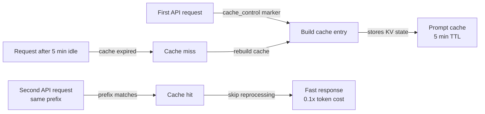

# Prompt-Caching

## Definition

Prompt-Caching ist eine Funktion der Claude-API, die es ermöglicht, wiederholte Teile eines Prompts – den System-Prompt, Tool-Definitionen, Dokumentkontext oder lange Gesprächspräfixe – einmalig zu verarbeiten und über mehrere nachfolgende API-Aufrufe hinweg wiederzuverwenden. Anstatt identische Token-Sequenzen bei jeder Anfrage neu zu verarbeiten, liest das Modell sie aus einem Cache, was die Latenz reduziert und die Kosten für gecachte Tokens senkt. In Claude Code funktioniert Prompt-Caching automatisch im Hintergrund, um lange Sitzungen und wiederholten Tool-Einsatz schneller und günstiger zu machen.

Die Kernidee hinter Prompt-Caching ist, dass das meiste, was sich zwischen API-Aufrufen in einer Coding-Sitzung ändert, klein ist: eine neue Benutzernachricht, ein neues Tool-Ergebnis oder eine aktualisierte Datei. Die großen, stabilen Teile – der System-Prompt mit Projektanweisungen, die Definitionen aller verfügbaren Tools und der angesammelte Gesprächsverlauf – bleiben für die meisten Runden unverändert. Diese stabilen Teile bei jeder Anfrage redundant zu verarbeiten ist verschwenderisch. Prompt-Caching eliminiert diese Verschwendung, indem verarbeitete Key-Value-Zustände gespeichert und wiederverwendet werden, wenn das Prompt-Präfix übereinstimmt.

Aus Entwicklerperspektive ist Prompt-Caching in Claude-Code-Sitzungen größtenteils transparent – es geschieht automatisch ohne Konfiguration. Es ist am wichtigsten zu verstehen, wenn man direkt auf der Claude-API aufbaut, langlaufende Agenten-Schleifen entwirft oder unerwartet hohe Latenz oder Kosten behebt. In diesen Kontexten kann das Wissen, wie man Prompts für optimale Cache-Nutzung strukturiert, zu erheblichen Einsparungen führen: Gecachte Eingabe-Tokens werden zu einem Bruchteil der Kosten regulärer Eingabe-Tokens abgerechnet, und Cache-Treffer eliminieren die Verarbeitungslatenz für gecachte Teile vollständig.

## Funktionsweise

### Cache-Steuerungsmarkierungen

Prompt-Caching verwendet explizite `cache_control`-Annotationen, um zu markieren, wo im Prompt ein Cache-Checkpoint erstellt werden soll. Wenn die API eine Anfrage mit `{"type": "ephemeral"}` Cache-Steuerung auf einem Inhaltsblock verarbeitet, speichert sie den verarbeiteten Zustand aller Tokens bis einschließlich dieses Blocks. Bei nachfolgenden Anfragen mit demselben Präfix erkennt die API den Cache-Treffer und überspringt die erneute Verarbeitung dieser Tokens. Ein Prompt kann bis zu vier aktive Cache-Checkpoints gleichzeitig haben, was Entwicklern ermöglicht, den System-Prompt separat von Tool-Definitionen und vom Gesprächsverlauf zu cachen.

### Cache-Lebensdauer und Invalidierung

Der Ephemere Cache hat eine Time-to-Live von etwa fünf Minuten Inaktivität. Wenn kein API-Aufruf ein gecachtes Präfix innerhalb dieses Fensters referenziert, wird der Cache-Eintrag entfernt und muss bei der nächsten Anfrage neu aufgebaut werden. Das bedeutet, dass Prompt-Caching am effektivsten für Hochfrequenz-Anwendungsfälle ist: interaktive Coding-Sitzungen, bei denen Anfragen alle paar Sekunden eintreffen, Agenten-Schleifen, die viele Tool-Aufrufe in rascher Folge ausführen, oder Stapelverarbeitungs-Pipelines, die viele Dokumente mit einem gemeinsamen System-Prompt verarbeiten. Für Niedrigfrequenz-Workflows, bei denen Minuten zwischen Anfragen vergehen, kann der Cache ablaufen und keinen Nutzen bringen.

### Was zu cachen ist

Die wertvollsten Kandidaten für das Caching sind Inhalte, die groß, stabil und häufig wiederverwendet werden. Der System-Prompt ist der offensichtlichste Kandidat: In Claude Code enthält er Projektanweisungen aus CLAUDE.md, Tool-Definitionen und Verhaltensrichtlinien – oft Tausende von Tokens, die bei jedem Zug identisch sind. Tool-Definitionen (JSON-Schemas für alle verfügbaren Tools) sind ein weiterer starker Kandidat. In RAG- oder dokumentenintensiven Workflows können große Referenzdokumente, die zu Beginn einer Sitzung geladen werden, gecacht werden, sodass nachfolgende Fragen zu diesen Dokumenten nur die marginalen Kosten der neuen Frage verursachen, nicht die Kosten des erneuten Lesens der Dokumente.

### Cache-Treffer-Erkennung und Nutzungsberichte

Die API-Antwort enthält ein `usage`-Objekt, das zwischen regulären Eingabe-Tokens, Cache-Erstellungs-Tokens und Cache-Lese-Tokens unterscheidet. Cache-Erstellungs-Tokens werden zum 1,25-fachen des Basiskurses berechnet (die einmaligen Kosten des Schreibens in den Cache). Cache-Lese-Tokens werden zum 0,1-fachen des Basiskurses berechnet – ein Rabatt von 90 % gegenüber regulären Eingabe-Tokens. Die Überwachung dieser Felder ermöglicht es Entwicklern, die tatsächliche Cache-Effektivität zu messen: Das Verhältnis von Cache-Lese-Tokens zu Gesamt-Eingabe-Tokens gibt an, wie viel des Prompts aus dem Cache bedient wird.



## Wann verwenden / Wann NICHT verwenden

| Verwenden wenn | Vermeiden wenn |
|---|---|
| Ihr System-Prompt groß ist (>1.000 Tokens) und über viele Anfragen konstant bleibt | Ihre Prompts sich bei jeder Anfrage erheblich ändern — kein stabiles Präfix zum Cachen |
| Sie eine Agenten-Schleife mit vielen sequenziellen Tool-Aufrufen in einer einzigen Sitzung ausführen | Anfragen selten sind (>5 Minuten zwischen Runden) — der Cache läuft ab, bevor er wiederverwendet werden kann |
| Sie große Referenzdokumente (Spezifikationen, Codebasen) beim Sitzungsstart laden | Ihr Anwendungsfall Einzelschuss-Anfragen ohne wiederholten Kontext ist |
| Sie die Latenz bei der ersten benutzersichtbaren Antwort in einer interaktiven Sitzung reduzieren möchten | Sie testen oder debuggen und deterministische Token-Anzahlen pro Anfrage wollen |
| Sie Kosten in einem Produktionssystem mit hohem API-Aufrufvolumen optimieren | Der Overhead der Strukturierung von cache_control-Markierungen bei niedrigem Volumen die Einsparungen überwiegt |

## Codebeispiele

```python
import anthropic

client = anthropic.Anthropic()

# Example: caching a large system prompt and tool definitions
# The system prompt is the same on every request — mark it for caching

SYSTEM_PROMPT = """
You are a senior software engineer working on a large TypeScript monorepo.
The project uses React on the frontend, Node.js/Express on the backend, and PostgreSQL.
[... imagine 2000+ tokens of detailed project instructions here ...]
""" * 10  # simulating a large system prompt

# Tool definitions for the coding agent — stable across all requests
TOOLS = [
    {
        "name": "read_file",
        "description": "Read a file from the project directory",
        "input_schema": {
            "type": "object",
            "properties": {
                "path": {"type": "string", "description": "Relative file path"}
            },
            "required": ["path"]
        }
    },
    {
        "name": "write_file",
        "description": "Write content to a file",
        "input_schema": {
            "type": "object",
            "properties": {
                "path": {"type": "string"},
                "content": {"type": "string"}
            },
            "required": ["path", "content"]
        }
    },
    # ... more tools
]

def make_request(messages: list, turn_number: int) -> dict:
    """
    Make a Claude API request with prompt caching enabled.
    The system prompt and tools are marked with cache_control so they are
    processed once and reused on subsequent calls in the same session.
    """
    response = client.messages.create(
        model="claude-opus-4-5",
        max_tokens=4096,
        # Mark the system prompt for caching with cache_control
        system=[
            {
                "type": "text",
                "text": SYSTEM_PROMPT,
                # This tells the API to cache everything up to this point
                "cache_control": {"type": "ephemeral"}
            }
        ],
        # Mark tool definitions for caching too
        tools=[
            {**tool, "cache_control": {"type": "ephemeral"}} if i == len(TOOLS) - 1 else tool
            for i, tool in enumerate(TOOLS)
        ],
        messages=messages
    )

    # Inspect cache usage in the response
    usage = response.usage
    print(f"Turn {turn_number} token usage:")
    print(f"  Input tokens:        {usage.input_tokens:>8}")
    print(f"  Cache creation:      {usage.cache_creation_input_tokens:>8}  (1.25x cost)")
    print(f"  Cache read:          {usage.cache_read_input_tokens:>8}  (0.1x cost)")
    print(f"  Output tokens:       {usage.output_tokens:>8}")

    # Calculate effective cost savings
    if usage.cache_read_input_tokens > 0:
        savings_pct = (usage.cache_read_input_tokens / usage.input_tokens) * 100 * 0.9
        print(f"  Estimated savings:   {savings_pct:.1f}% on input tokens this turn")

    return response

# Simulate a multi-turn coding session
messages = []

# Turn 1 — cold start, cache is built
messages.append({"role": "user", "content": "What files exist in the src/ directory?"})
response1 = make_request(messages, turn_number=1)
# Output: cache_creation_input_tokens > 0, cache_read_input_tokens = 0
messages.append({"role": "assistant", "content": response1.content})

# Turn 2 — system prompt and tools are now cached
messages.append({"role": "user", "content": "Read the main entry point file"})
response2 = make_request(messages, turn_number=2)
# Output: cache_read_input_tokens > 0, significant cost savings

# Turn 3 — still cache-hitting on system prompt + tools
messages.append({"role": "user", "content": "Explain how the authentication middleware works"})
response3 = make_request(messages, turn_number=3)
# Output: continued cache hits, growing cache_read_input_tokens
```

```bash
# Observing prompt caching in Claude Code sessions
# Claude Code automatically applies caching — use verbose mode to see token counts

# Start a session with verbose output to inspect token usage
claude --verbose

# Inside the session, run several requests in sequence
> List all TypeScript files in src/
> Read src/index.ts
> Explain the main function

# With --verbose, Claude Code prints token usage per turn including cache statistics
# You'll see cache_creation_input_tokens spike on turn 1, then
# cache_read_input_tokens grow on subsequent turns
```

## Praktische Ressourcen

- [Prompt-Caching-Dokumentation — Anthropic](https://docs.anthropic.com/en/docs/build-with-claude/prompt-caching) — Vollständige offizielle Referenz: Cache-Steuerungsformat, Token-Preise, TTL und unterstützte Modelle.
- [Prompt-Caching-Cookbook](https://github.com/anthropics/anthropic-cookbook/blob/main/misc/prompt_caching.ipynb) — Jupyter-Notebook mit funktionierenden Beispielen einschließlich Kostenberechnung und Cache-Treffer-Messung.
- [Claude-API-Preisgestaltung](https://www.anthropic.com/pricing) — Aktuelle Token-Raten für Eingabe-, Cache-Erstellungs- und Cache-Lese-Tokens über alle Modelle hinweg.
- [Anthropic-Nutzungsüberwachung](https://console.anthropic.com/usage) — Konsolen-Dashboard zur Inspektion von Token-Nutzungsaufschlüsselungen pro API-Schlüssel.

## Siehe auch

- [Claude-Code-Übersicht](/docs/claude-code)
- [Kontextverwaltung](/docs/claude-code/context-management)
- [Denkmodi und Aufwand](/docs/claude-code/thinking-modes)
