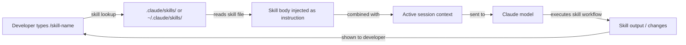

# Claude-Code-Skills

## Definition

Skills sind wiederverwendbare, aufrufbare Prompt-Dateien, die das Standardverhalten von Claude Code erweitern. Ein Skill ist eine Markdown-Datei mit YAML-Frontmatter, die einen benannten Befehl definiert: Wenn ein Entwickler `/skill-name` in einer Claude-Code-Sitzung eingibt, wird der Inhalt des Skills als Anweisung eingefügt – was einen gängigen, komplexen oder teamspezifischen Workflow effektiv in einen einzigen Slash-Befehl verwandelt.

Das gedankliche Modell ähnelt Shell-Aliasen oder Makefile-Targets, aber für KI-gestützte Workflows. Anstatt bei jedem Mal, wenn Claude einem bestimmten Prozess folgen soll (Code-Review-Checkliste, Release-Notiz-Generierung, Architekturdokumentation, Sicherheitsaudit), einen langen, sorgfältig ausgearbeiteten Prompt zu wiederholen, schreiben Sie ihn einmal als Skill, committen ihn ins Repository und rufen ihn mit einem kurzen Befehl auf. Skills sind versionierbar, teilbar und mit CLAUDE.md-Anweisungen kombinierbar.

Skills unterscheiden sich von CLAUDE.md-Anweisungen in einem wichtigen Punkt: CLAUDE.md ist immer aktiv und gilt für jede Interaktion, während Skills opt-in und explizit aufgerufen werden. Das macht Skills für schwergewichtige oder kontextspezifische Workflows geeignet, die nicht bei jeder Anfrage ausgeführt werden sollten, während CLAUDE.md besser für leichtgewichtige Konventionen und Einschränkungen geeignet ist, die immer in Kraft sein sollten.

## Funktionsweise

### Skill-Dateiformat

Eine Skill-Datei ist eine `.md`-Datei mit YAML-Frontmatter. Das Frontmatter muss mindestens ein `description`-Feld enthalten, das Claude erklärt, was der Skill tut. Der Hauptteil der Datei ist der Prompt, der beim Aufrufen des Skills eingefügt wird. Der Dateiname (ohne `.md`) wird zum Slash-Befehlsnamen: Eine Datei namens `code-review.md` wird als `/code-review` aufgerufen. Skill-Namen können Bindestriche, aber keine Leerzeichen enthalten.

### Skill-Verzeichnisse

Claude Code sucht Skills in zwei Orten. **Projekt-Skills** liegen in `.claude/skills/` relativ zum Projektstamm und sind nur bei der Arbeit in diesem Projekt verfügbar. **Globale Skills** liegen in `~/.claude/skills/` und sind in jeder Claude-Code-Sitzung verfügbar. Projekt-Skills haben Vorrang vor globalen Skills mit demselben Namen, was Teams ermöglicht, persönliche Skills mit projektspezifischen Versionen zu überschreiben. Sie können Claude Code auch über die Konfiguration auf ein benutzerdefiniertes Skills-Verzeichnis verweisen.

### Skill-Aufruf

Innerhalb einer Claude-Code-Sitzung löst das Eingeben von `/skill-name` den Skill aus. Claude Code findet die entsprechende Skill-Datei, liest ihren Hauptteil und fügt den Inhalt als Benutzerprompt an diesem Punkt im Gespräch ein. Der Skill kann auf bereits in der Sitzung vorhandenen Kontext verweisen (zuvor gelesene Dateien, frühere Tool-Ausgaben) und kann seine eigenen Tool-Aufrufe ausgeben (Dateien lesen, Befehle ausführen), um zusätzliche Informationen zu sammeln, bevor er eine Ausgabe produziert. Skills können Inline-Argumente nach dem Befehlsnamen akzeptieren: `/generate-test src/utils/format.ts` übergibt den Dateipfad als Kontext.

### Skills mit CLAUDE.md kombinieren

Skills und CLAUDE.md arbeiten zusammen. CLAUDE.md etabliert die Projektbasis (Konventionen, verbotene Muster, Tech-Stack), und Skills bieten aufrufbare Workflows auf dieser Basis. Ein `code-review`-Skill kann beispielsweise Claude anweisen, "zu prüfen, ob alle Änderungen den Konventionen in CLAUDE.md entsprechen" – er muss diese Konventionen nicht wiederholen, da sie bereits im System-Prompt sind. Diese Trennung der Belange hält jede Datei fokussiert und vermeidet Duplikationen.



## Wann verwenden / Wann NICHT verwenden

| Verwenden wenn | Vermeiden wenn |
|---|---|
| Sie einen mehrstufigen Workflow haben, den Sie regelmäßig wiederholen (z. B. Changelogs schreiben, eine Review-Checkliste ausführen) | Die Aufgabe wirklich einmalig ist und nicht wiederholt wird — tippen Sie den Prompt einfach direkt |
| Sie einen komplexen Prozess über ein Team hinweg standardisieren wollen (z. B. Sicherheitsüberprüfung, PR-Zusammenfassung-Format) | Die Anweisungen in CLAUDE.md gehören, weil sie für jede Sitzung gelten, nicht nur auf Abruf |
| Der Workflow kontextabhängig ist und von der Annahme von Argumenten profitiert (z. B. `/document src/api/users.ts`) | Der Skill Dokumentation duplizieren würde, die bereits in CLAUDE.md vorhanden ist |
| Sie Best Practices für Prompts über Projekte hinweg über Ihr globales Skills-Verzeichnis teilen möchten | Der Workflow externe Tool-Integrationen jenseits der eingebauten Tools von Claude erfordert |
| Sie eine Skill-Bibliothek für Ihr Team aufbauen und versionierbare, überprüfbare Prompt-Dateien wollen | Sie Skills automatisch auslösen müssen — Skills werden manuell aufgerufen, nicht ereignisgesteuert |

## Codebeispiele

```markdown
<!-- File: .claude/skills/code-review.md -->
---
description: Perform a thorough code review on staged or recently changed files. Checks correctness, security, performance, test coverage, and project conventions.
---

You are conducting a code review. Follow these steps:

1. **Identify changed files**: Run `git diff --name-only HEAD` to list recently changed files.
   If there are staged changes, also run `git diff --cached --name-only`.

2. **Read each changed file** and the corresponding test file if it exists.

3. **Review for the following categories** (report findings under each heading):

   ### Correctness
   - Are there logic errors, off-by-one errors, or unhandled edge cases?
   - Does the code handle null/undefined inputs safely?

   ### Security
   - Is any user input used in SQL queries without parameterization? Flag immediately.
   - Are secrets or credentials hardcoded? Flag immediately.
   - Is authentication/authorization enforced on all new API routes?

   ### Performance
   - Are there N+1 query patterns in database access code?
   - Are expensive operations inside loops that could be moved outside?

   ### Test coverage
   - Do the tests cover the happy path, error paths, and edge cases?
   - Are there any new code paths with zero test coverage?

   ### Conventions
   - Does the code follow the project conventions in CLAUDE.md?
   - Are imports organized correctly? Are there unused imports?

4. **Summarize**: Provide an overall verdict (Approve / Request Changes / Needs Discussion)
   and a prioritized list of action items.
```

```markdown
<!-- File: .claude/skills/generate-changelog.md -->
---
description: Generate a changelog entry for changes since the last git tag. Follows Keep a Changelog format.
---

Generate a changelog entry for inclusion in CHANGELOG.md.

1. Run `git describe --tags --abbrev=0` to find the most recent tag.
2. Run `git log <tag>..HEAD --oneline` to list all commits since that tag.
3. Read the commit messages and group them into these categories:
   - **Added** — new features
   - **Changed** — changes to existing functionality
   - **Deprecated** — features that will be removed in a future release
   - **Removed** — features that were removed
   - **Fixed** — bug fixes
   - **Security** — security-related changes

4. Write the changelog entry in Keep a Changelog format:

   ## [Unreleased] - YYYY-MM-DD

   ### Added
   - ...

   ### Fixed
   - ...

Use concise, user-facing language. Omit chore/refactor/docs commits that don't affect users.
Output only the Markdown text — I will paste it into CHANGELOG.md manually.
```

```bash
# Invoke skills inside a Claude Code session

# Start a session
claude

# Trigger the code review skill (no arguments)
> /code-review

# Trigger the changelog skill
> /generate-changelog

# A skill that accepts an argument — document a specific file
> /document src/services/payment.ts

# List available skills (Claude will search .claude/skills/ and ~/.claude/skills/)
> /help

# Skills can be combined with regular instructions in the same turn
> /code-review and also check that the PR title follows conventional commits format
```

```markdown
<!-- File: ~/.claude/skills/explain-error.md (global skill, available in all projects) -->
---
description: Explain a compiler or runtime error in plain language and suggest fixes. Paste the error message after the command.
---

The user has provided an error message. Analyze it and respond with:

1. **Plain language explanation**: What does this error mean? Why does it occur?
2. **Most likely cause**: Given the error message and any stack trace, what is the most probable root cause?
3. **Suggested fixes**: Provide 2-3 concrete fixes, ranked by likelihood. Show code snippets where relevant.
4. **How to verify**: How can the developer confirm the fix worked?

If the error references a file path, read that file to provide more specific advice.
```

## Praktische Ressourcen

- [Claude-Code-Speicher- und Skills-Dokumentation](https://docs.anthropic.com/en/docs/claude-code/memory) — Offizielle Referenz für Skill-Dateiformat, Verzeichnisse und Aufruf.
- [Claude-Code-Einstellungen](https://docs.anthropic.com/en/docs/claude-code/settings) — Konfigurationsoptionen einschließlich benutzerdefinierter Skill-Verzeichnispfade.
- [Anthropic Claude Code GitHub](https://github.com/anthropics/claude-code) — Quellcode und von der Community beigesteuerte Beispiele.
- [Claude-Code-Slash-Befehls-Referenz](https://docs.anthropic.com/en/docs/claude-code/cli-reference) — Vollständige Liste eingebauter Slash-Befehle neben dem benutzerdefinierten Skill-System.
- [Skills-Repository](https://github.com/EmersonBraun/skills) — Kuratierte Sammlung wiederverwendbarer KI-Skills für Claude Code und andere KI-Coding-Assistenten

## Siehe auch

- [Claude-Code-Übersicht](/docs/claude-code)
- [CLAUDE.md-Konfiguration](/docs/claude-code/claude-md)
- [MCP-Plugins und Integrationen](/docs/claude-code/mcp-plugins)
