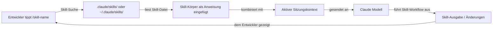

# Claude Code Skills

## Definition

Skills sind wiederverwendbare, aufrufbare Prompt-Dateien, die das Verhalten von Claude Code über seine Standards hinaus erweitern. Ein Skill ist eine Markdown-Datei mit YAML-Frontmatter, die einen benannten Befehl definiert: Wenn ein Entwickler `/skill-name` innerhalb einer Claude Code-Sitzung tippt, wird der Inhalt des Skills als Anweisung eingefügt – was einen gängigen, komplexen oder teamspezifischen Workflow in einen einzelnen Slash-Befehl verwandelt.

Das mentale Modell ähnelt Shell-Aliasen oder Makefile-Targets, aber für KI-gestützte Workflows. Anstatt jedes Mal einen langen, sorgfältig ausgearbeiteten Prompt zu wiederholen, wenn Claude einem bestimmten Prozess folgen soll (Code-Review-Checkliste, Release-Notes-Generierung, Architekturdokumentation, Sicherheitsaudit), schreiben Sie ihn einmal als Skill, committen ihn ins Repository und rufen ihn mit einem kurzen Befehl auf. Skills sind versionskontrolliert, gemeinsam nutzbar und mit CLAUDE.md-Anweisungen kompositionierbar.

Skills unterscheiden sich von CLAUDE.md-Anweisungen auf eine wichtige Weise: CLAUDE.md ist immer aktiv und gilt für jede Interaktion, während Skills opt-in sind und explizit aufgerufen werden. Dies macht Skills geeignet für schwergewichtige oder kontextspezifische Workflows, die nicht bei jeder Anfrage ausgeführt werden sollten, während CLAUDE.md besser für leichtgewichtige Konventionen und Einschränkungen geeignet ist, die immer in Kraft sein sollen.

## Funktionsweise

### Skill-Dateiformat

Eine Skill-Datei ist eine `.md`-Datei mit YAML-Frontmatter. Das Frontmatter muss mindestens ein `description`-Feld enthalten, das Claude mitteilt, was der Skill tut. Der Körper der Datei ist der Prompt, der eingefügt wird, wenn der Skill aufgerufen wird. Der Dateiname (ohne `.md`) wird zum Slash-Befehlsnamen: Eine Datei namens `code-review.md` wird als `/code-review` aufgerufen. Skill-Namen dürfen Bindestriche, aber keine Leerzeichen enthalten.

### Skill-Verzeichnisse

Claude Code sucht Skills in zwei Speicherorten. **Projektskills** liegen in `.claude/skills/` relativ zum Projektstamm und sind nur beim Arbeiten in diesem Projekt verfügbar. **Globale Skills** liegen in `~/.claude/skills/` und sind in jeder Claude Code-Sitzung verfügbar. Projektskills haben Vorrang vor globalen Skills mit demselben Namen, was Teams ermöglicht, persönliche Skills durch projektspezifische Versionen zu überschreiben. Sie können Claude Code auch über die Konfiguration auf ein benutzerdefiniertes Skills-Verzeichnis hinweisen.

### Skill-Aufruf

Innerhalb einer Claude Code-Sitzung löst das Tippen von `/skill-name` den Skill aus. Claude Code findet die entsprechende Skill-Datei, liest ihren Körper und fügt den Inhalt als Benutzeranweisung an diesem Punkt im Gespräch ein. Der Skill kann auf Kontext zurückgreifen, der bereits in der Sitzung vorhanden ist (zuvor gelesene Dateien, frühere Tool-Ausgaben), und kann eigene Tool-Aufrufe ausgeben (Dateien lesen, Befehle ausführen), um zusätzliche Informationen zu sammeln, bevor die Ausgabe produziert wird. Skills können Inline-Argumente nach dem Befehlsnamen akzeptieren: `/generate-test src/utils/format.ts` übergibt den Dateipfad als Kontext.

### Skills mit CLAUDE.md kombinieren

Skills und CLAUDE.md arbeiten zusammen. CLAUDE.md legt die Projektbasis fest (Konventionen, verbotene Muster, Tech-Stack), und Skills bieten aufrufbare Workflows auf dieser Basis. Ein `code-review`-Skill zum Beispiel kann Claude anweisen, „zu überprüfen, dass alle Änderungen mit den Konventionen in CLAUDE.md übereinstimmen" – er muss diese Konventionen nicht wiederholen, da sie bereits im System-Prompt sind. Diese Trennung der Belange hält jede Datei fokussiert und vermeidet Duplikation.



## Wann verwenden / Wann NICHT verwenden

| Verwenden wenn | Vermeiden wenn |
|---|---|
| Sie einen mehrstufigen Workflow haben, den Sie regelmäßig wiederholen (z. B. Changelogs schreiben, eine Review-Checkliste ausführen) | Die Aufgabe wirklich einmalig ist und nicht wiederholt wird – tippen Sie den Prompt direkt |
| Sie einen komplexen Prozess über ein Team hinweg standardisieren möchten (z. B. Sicherheitsreview, PR-Zusammenfassungsformat) | Die Anweisungen in CLAUDE.md gehören, weil sie für jede Sitzung gelten, nicht nur auf Abruf |
| Der Workflow kontextabhängig ist und von der Akzeptanz von Argumenten profitiert (z. B. `/document src/api/users.ts`) | Der Skill Dokumentation duplizieren würde, die bereits in CLAUDE.md vorhanden ist |
| Sie Prompt-Best-Practices über Projekte hinweg über Ihr globales Skills-Verzeichnis teilen möchten | Der Workflow externe Tool-Integrationen erfordert, die über Claudes integrierte Tools hinausgehen |
| Sie eine Skill-Bibliothek für Ihr Team erstellen und versionskontrollierte, überprüfbare Prompt-Dateien möchten | Sie Skills automatisch auslösen müssen – Skills werden manuell aufgerufen, nicht ereignisgesteuert |

## Code-Beispiele

```markdown
<!-- Datei: .claude/skills/code-review.md -->
---
description: Führe ein gründliches Code-Review für gestagte oder kürzlich geänderte Dateien durch. Überprüft Korrektheit, Sicherheit, Leistung, Testabdeckung und Projektkonventionen.
---

Du führst ein Code-Review durch. Befolge diese Schritte:

1. **Geänderte Dateien identifizieren**: Führe `git diff --name-only HEAD` aus, um kürzlich geänderte Dateien aufzulisten.
   Falls es gestagte Änderungen gibt, führe auch `git diff --cached --name-only` aus.

2. **Jede geänderte Datei lesen** und die entsprechende Testdatei, falls sie existiert.

3. **Für die folgenden Kategorien überprüfen** (Befunde unter jeder Überschrift berichten):

   ### Korrektheit
   - Gibt es Logikfehler, Off-by-One-Fehler oder unbehandelte Grenzfälle?
   - Behandelt der Code null/undefined-Eingaben sicher?

   ### Sicherheit
   - Wird Benutzereingabe ohne Parametrisierung in SQL-Abfragen verwendet? Sofort kennzeichnen.
   - Sind Geheimnisse oder Anmeldedaten hartcodiert? Sofort kennzeichnen.
   - Wird Authentifizierung/Autorisierung auf allen neuen API-Routen erzwungen?

   ### Leistung
   - Gibt es N+1-Abfragemuster im Datenbankzugriffscode?
   - Gibt es teure Operationen in Schleifen, die nach außen verlagert werden könnten?

   ### Testabdeckung
   - Decken die Tests den Happy Path, Fehlerpfade und Grenzfälle ab?
   - Gibt es neue Code-Pfade mit null Testabdeckung?

   ### Konventionen
   - Entspricht der Code den Projektkonventionen in CLAUDE.md?
   - Sind Importe korrekt organisiert? Gibt es unbenutzte Importe?

4. **Zusammenfassen**: Gib ein Gesamturteil (Genehmigen / Änderungen anfordern / Diskussion erforderlich)
   und eine priorisierte Liste von Aktionspunkten.
```

```markdown
<!-- Datei: .claude/skills/generate-changelog.md -->
---
description: Generiere einen Changelog-Eintrag für Änderungen seit dem letzten Git-Tag. Folgt dem Keep a Changelog-Format.
---

Generiere einen Changelog-Eintrag zur Aufnahme in CHANGELOG.md.

1. Führe `git describe --tags --abbrev=0` aus, um den neuesten Tag zu finden.
2. Führe `git log <tag>..HEAD --oneline` aus, um alle Commits seit diesem Tag aufzulisten.
3. Lies die Commit-Nachrichten und gruppiere sie in diese Kategorien:
   - **Added** — neue Funktionen
   - **Changed** — Änderungen an bestehender Funktionalität
   - **Deprecated** — Funktionen, die in einer zukünftigen Version entfernt werden
   - **Removed** — Funktionen, die entfernt wurden
   - **Fixed** — Fehlerbehebungen
   - **Security** — sicherheitsbezogene Änderungen

4. Schreibe den Changelog-Eintrag im Keep a Changelog-Format:

   ## [Unreleased] - YYYY-MM-DD

   ### Added
   - ...

   ### Fixed
   - ...

Verwende prägnante, benutzerseitige Sprache. Lasse chore/refactor/docs-Commits weg, die keine Auswirkungen auf Benutzer haben.
Gib nur den Markdown-Text aus — ich füge ihn manuell in CHANGELOG.md ein.
```

```bash
# Skills innerhalb einer Claude Code-Sitzung aufrufen

# Eine Sitzung starten
claude

# Den Code-Review-Skill auslösen (ohne Argumente)
> /code-review

# Den Changelog-Skill auslösen
> /generate-changelog

# Ein Skill, der ein Argument akzeptiert — eine spezifische Datei dokumentieren
> /document src/services/payment.ts

# Verfügbare Skills auflisten (Claude durchsucht .claude/skills/ und ~/.claude/skills/)
> /help

# Skills können mit regulären Anweisungen im selben Zug kombiniert werden
> /code-review and also check that the PR title follows conventional commits format
```

```markdown
<!-- Datei: ~/.claude/skills/explain-error.md (globaler Skill, in allen Projekten verfügbar) -->
---
description: Erkläre einen Compiler- oder Laufzeitfehler in einfacher Sprache und schlage Fixes vor. Füge die Fehlermeldung nach dem Befehl ein.
---

Der Benutzer hat eine Fehlermeldung bereitgestellt. Analysiere sie und antworte mit:

1. **Erklärung in einfacher Sprache**: Was bedeutet dieser Fehler? Warum tritt er auf?
2. **Wahrscheinlichste Ursache**: Angesichts der Fehlermeldung und eines etwaigen Stack-Trace, was ist die wahrscheinlichste Hauptursache?
3. **Vorgeschlagene Fixes**: Gib 2–3 konkrete Fixes, nach Wahrscheinlichkeit geordnet. Zeige Code-Snippets, wo relevant.
4. **Wie zu überprüfen**: Wie kann der Entwickler bestätigen, dass der Fix funktioniert hat?

Falls der Fehler auf einen Dateipfad verweist, lies diese Datei, um spezifischeren Rat zu geben.
```

## Praktische Ressourcen

- [Claude Code Speicher- und Skills-Dokumentation](https://docs.anthropic.com/en/docs/claude-code/memory) — Offizielle Referenz für Skill-Dateiformat, Verzeichnisse und Aufruf.
- [Claude Code Einstellungen](https://docs.anthropic.com/en/docs/claude-code/settings) — Konfigurationsoptionen einschließlich benutzerdefinierter Skills-Verzeichnispfade.
- [Anthropic Claude Code GitHub](https://github.com/anthropics/claude-code) — Quellcode und von der Community beigetragene Beispiele.
- [Claude Code Slash-Befehlsreferenz](https://docs.anthropic.com/en/docs/claude-code/cli-reference) — Vollständige Liste der eingebauten Slash-Befehle neben dem benutzerdefinierten Skill-System.
- [Skills-Repository](https://github.com/EmersonBraun/skills) — Kuratierte Sammlung wiederverwendbarer KI-Skills für Claude Code und andere KI-Coding-Assistenten

## Siehe auch

- [Claude Code Übersicht](/docs/claude-code)
- [CLAUDE.md Konfiguration](/docs/claude-code/claude-md)
- [MCP-Plugins und Integrationen](/docs/claude-code/mcp-plugins)
