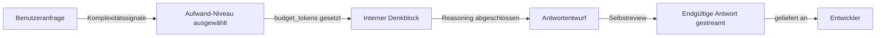

# Denkmodi und Aufwand

## Definition

Erweitertes Denken ist eine Funktion von Claude-Modellen, die es dem Modell ermöglicht, ein Problem Schritt für Schritt in einem dedizierten internen Notizblock durchzudenken, bevor es seine endgültige Antwort produziert. Im Gegensatz zur sichtbaren Ausgabe ist dieser Denkprozess für die interne Überlegung des Modells konzipiert – er bringt Zwischenkonklusionen zum Vorschein, wertet Alternativen aus, korrigiert eigene Fehler und arbeitet auf eine wohlüberlegte Antwort hin. Das Ergebnis sind Antworten, die bei komplexen Aufgaben genauer sind, bei mehrdeutigen Problemen besser begründet sind und weniger anfällig für oberflächliche Mustererkennung-Fehler sind.

In Claude Code manifestiert sich erweitertes Denken als **Aufwand-Niveau**-Einstellung, die steuert, wie viel rechnerische Arbeit das Modell vor der Antwort leistet. Antworten mit niedrigem Aufwand sind schnell und für einfache, eindeutige Aufgaben geeignet (Code formatieren, kurze Funktionen erklären). Antworten mit hohem Aufwand investieren mehr Reasoning-Budget und sind besser für komplexe Architekturentscheidungen, schwierige Debugging-Sitzungen oder Aufgaben geeignet, bei denen Fehler kostspielig sind. Der Kompromiss ist immer Geschwindigkeit versus Tiefe: Mehr Denken kostet mehr Zeit und verbraucht mehr Token.

Es ist wichtig, erweitertes Denken von Chain-of-Thought-Prompting zu unterscheiden. Chain-of-Thought fordert das Modell auf, seine Arbeit in der Ausgabe zu zeigen – das Reasoning ist Teil des Antworttextes. Erweitertes Denken hingegen findet in einem separaten `thinking`-Block statt, den das Modell intern verarbeitet. In Claude Code-Sitzungen können Sie manchmal `<thinking>`-Blöcke in der rohen API-Ausgabe beobachten, obwohl die Benutzeroberfläche von Claude Code typischerweise nur die endgültige Antwort anzeigt. Das interne Denken unterliegt nicht denselben Einschränkungen wie die Ausgabe und ist für die Reasoning-Qualität statt für die Lesbarkeit optimiert.

## Funktionsweise

### Denkblöcke und Budget-Token

Wenn erweitertes Denken aktiviert ist, erhält das Modell einen zusätzlichen Parameter: `budget_tokens`. Diese Ganzzahl gibt die maximale Anzahl von Token an, die das Modell für sein internes Reasoning verwenden darf, bevor es die endgültige Antwort produziert. Ein Budget von 1.000 Token ermöglicht kurze Überlegungen; ein Budget von 10.000 Token ermöglicht tiefe, mehrstufige Analysen. Das Modell verbraucht nicht immer sein volles Budget – es hört auf zu denken, wenn es eine zufriedenstellende Schlussfolgerung erreicht. Ein höheres Budget als nötig zu setzen fügt Latenz ohne proportionale Qualitätsgewinne hinzu; das richtige Budget hängt von der Aufgabenkomplexität ab.

### Aufwand-Niveaus in Claude Code

Claude Code übersetzt das abstrakte Konzept der Budget-Token in benannte Aufwand-Niveaus, über die leichter zu urteilen ist:

- **Niedriger Aufwand (Standard für einfache Aufgaben)**: minimales Denkbudget, schnelle Antworten, geeignet für Code-Formatierung, einfache Erklärungen, Einzeldatei-Bearbeitungen und Suchoperationen.
- **Mittlerer Aufwand**: moderates Denkbudget, die Standardeinstellung für die meisten interaktiven Coding-Sitzungen; balanciert Geschwindigkeit und Qualität für typische Entwicklungsaufgaben.
- **Hoher Aufwand / Max**: großes Denkbudget, reserviert für komplexe Aufgaben – schwer reproduzierbare Probleme debuggen, Systeme entwerfen, Sicherheitsauswirkungen analysieren oder jede Aufgabe, bei der eine falsche Antwort teuer zu beheben wäre.

### Wann das Modell denkt

Nicht jede Antwort löst erweitertes Denken aus. Claude Code verwendet Heuristiken, um zu bestimmen, wann zusätzliches Reasoning basierend auf Aufgabenkomplexitätssignalen gerechtfertigt ist: die Länge und Mehrdeutigkeit der Anfrage, die Anzahl der beteiligten Dateien, ob die Aufgabe irreversible Änderungen beinhaltet und ob der Benutzer ausdrücklich eine sorgfältige Analyse angefordert hat. Benutzer können auch den gewünschten Aufwand explizit signalisieren, indem sie Phrasen wie „denk sorgfältig darüber nach" oder „nimm dir Zeit" in ihren Anfragen hinzufügen – diese werden vom Modell als Signale erkannt, mehr Reasoning-Budget zu investieren.

### Streaming und Latenz

Erweitertes Denken interagiert mit Streaming auf vorhersehbare Weise: Das Modell beginnt erst mit dem Streaming seiner sichtbaren Ausgabe, nachdem es sein internes Reasoning abgeschlossen hat. Das bedeutet, dass Anfragen mit hohem Aufwand eine längere anfängliche Pause haben, bevor die Ausgabe beginnt, aber das erste Token des tatsächlichen Inhalts vollständig geformt statt schrittweise unsicher eintrifft. In der CLI und den IDE-Integrationen von Claude Code zeigt sich dies als kurzer „Thinking..."-Indikator vor dem Start der Antwort. Für interaktive Sitzungen ist diese Verzögerung bei komplexen Aufgaben in der Regel den Aufwand wert; für enge Feedback-Schleifen ist es vorzuziehen, den Aufwand niedrig zu halten.



## Wann verwenden / Wann NICHT verwenden

| Verwenden wenn | Vermeiden wenn |
|---|---|
| Einen komplexen, schwer reproduzierbaren Fehler mit vielen möglichen Grundursachen debuggen | Nach einem einfachen Einzeiler oder einer schnellen Syntaxkorrektur fragen – niedriger Aufwand ist schneller und ausreichend |
| Eine Systemarchitektur mit erheblichen Kompromissen entwerfen oder überprüfen | Interaktive Hin-und-Her-Sitzungen, bei denen jeder Zug ein kleiner Schritt ist – Latenz summiert sich |
| Sicherheitsauswirkungen einer Code-Änderung vor dem Mergen analysieren | Boilerplate oder Gerüst generieren, das etablierten Mustern folgt |
| Aufgaben, bei denen eine falsche Antwort erhebliche Nacharbeit zur Behebung erfordern würde | In CI-Pipelines laufen, wo Determinismus und Geschwindigkeit wichtiger sind als Reasoning-Tiefe |
| Jede Aufgabe, die Sie einem Senior Engineer geben würden, der dafür bekannt ist, „vor dem Coding zu denken" | Sie unter engen Token-Budget-Einschränkungen arbeiten – Denk-Token zählen gegen Ihre Nutzung |

## Vor- und Nachteile

| | Vorteile | Nachteile |
|---|---|---|
| **Hoher Aufwand** | Bessere Genauigkeit bei komplexen Aufgaben; erkennt Grenzfälle; produziert gut begründete Erklärungen | Höhere Latenz; mehr Token verbraucht; längere Pause vor dem ersten Ausgabe-Token |
| **Niedriger Aufwand** | Schnelle Antworten; gut für enge interaktive Schleifen; niedrigere Token-Kosten | Kann Grenzfälle bei komplexen Aufgaben übersehen; kann oberflächliche Analysen bei mehrdeutigen Problemen produzieren |
| **Auto-Aufwand** | Keine Konfiguration erforderlich; Modell kalibriert sich auf Aufgabenkomplexität | Weniger vorhersehbares Verhalten; kann bei wirklich schwierigen Aufgaben, die einfach erscheinen, zu wenig investieren |

## Code-Beispiele

```bash
# Claude Code CLI — gewünschtes Aufwand-Niveau durch natürliche Sprache signalisieren

# Niedriger Aufwand (schnell): einfache, klar definierte Aufgaben
> Format this function to match our Prettier config

# Mittlerer Aufwand (Standard): typische Coding-Aufgaben
> Refactor the UserService class to use dependency injection

# Hoher Aufwand: komplexe Aufgaben — "denk sorgfältig", "nimm dir Zeit" oder "analysiere tiefgründig" hinzufügen
> Think carefully: this WebSocket handler occasionally drops messages under high load.
  Analyze all the possible race conditions and ordering issues in src/ws/handler.ts
  before suggesting a fix.

# Hoher Aufwand: Architekturentscheidungen
> Take your time to analyze the trade-offs between using Redis Pub/Sub versus
  a message queue like RabbitMQ for our notification service. Consider our
  current scale (10k concurrent users) and the team's operational experience.

# Hoher Aufwand: Sicherheitsreview
> Analyze src/auth/jwt.ts carefully for security vulnerabilities. Think through
  all the attack vectors — token forgery, replay attacks, expiry bypass —
  before giving me your assessment.
```

```json
// Claude Code settings.json — Standard-Denkverhalten konfigurieren
// Speicherort: ~/.claude/settings.json oder .claude/settings.json im Projektstamm
{
  "thinking": {
    "defaultEffort": "medium",
    "maxBudgetTokens": 8000,
    "enableForComplexTasks": true
  }
}
```

```python
# Erweitertes Denken direkt über die Anthropic API verwenden (für benutzerdefinierte Integrationen)
import anthropic

client = anthropic.Anthropic()

# Anfrage mit hohem Aufwand: komplexe Architekturfrage
response = client.messages.create(
    model="claude-opus-4-5",
    max_tokens=16000,
    # thinking-Block aktiviert erweitertes Reasoning; budget_tokens steuert die Tiefe
    thinking={
        "type": "enabled",
        "budget_tokens": 10000  # bis zu 10k Token für internes Reasoning erlauben
    },
    messages=[{
        "role": "user",
        "content": (
            "Analyze the following database schema for potential performance issues "
            "at 1M+ rows. Consider indexing strategies, query patterns, and normalization "
            "trade-offs. Schema: [paste schema here]"
        )
    }]
)

# Der Antwortinhalt kann sowohl Denkblöcke als auch Textblöcke enthalten
for block in response.content:
    if block.type == "thinking":
        # Internes Reasoning — nützlich für das Debugging des Modellverhaltens
        print(f"[THINKING]: {block.thinking[:200]}...")
    elif block.type == "text":
        # Endgültige Antwort — der Teil, der dem Benutzer gezeigt werden soll
        print(f"[RESPONSE]: {block.text}")

# Anfrage mit niedrigem Aufwand: einfache, schnelle Aufgabe (Denken deaktiviert oder minimales Budget)
quick_response = client.messages.create(
    model="claude-haiku-4-5",  # Haiku für schnelle, einfache Aufgaben
    max_tokens=1024,
    # Kein thinking-Block für einfache Anfragen — schneller und günstiger
    messages=[{
        "role": "user",
        "content": "Convert this array of objects to a Map keyed by id: [{id: 1, name: 'a'}, {id: 2, name: 'b'}]"
    }]
)
print(quick_response.content[0].text)
```

## Praktische Ressourcen

- [Erweitertes Denken Dokumentation — Anthropic](https://docs.anthropic.com/en/docs/build-with-claude/extended-thinking) — Vollständige Referenz zu Denkblöcken, Budget-Token, Streaming-Verhalten und API-Parametern.
- [Erweitertes Denken Cookbook](https://github.com/anthropics/anthropic-cookbook/tree/main/extended_thinking) — Praktische Notebooks, die erweitertes Denken für komplexe Reasoning-Aufgaben demonstrieren.
- [Claude Modellvergleich](https://docs.anthropic.com/en/docs/about-claude/models) — Modellkarten-Details einschließlich welche Modelle erweitertes Denken unterstützen und ihre relativen Fähigkeiten.
- [Claude Code Einstellungsreferenz](https://docs.anthropic.com/en/docs/claude-code/settings) — Wo Standard-Aufwand-Niveaus und Denkverhalten in Claude Code konfiguriert werden.

## Siehe auch

- [Claude Code Übersicht](/docs/claude-code)
- [Prompt-Caching](/docs/claude-code/prompt-caching)
- [Kontextverwaltung](/docs/claude-code/context-management)
