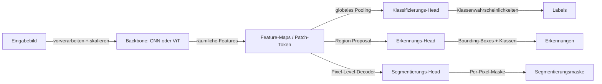

# Computer Vision (CV)

## Definition

Computer Vision ist das KI-Gebiet, das Maschinen in die Lage versetzt, aussagekräftige Informationen aus Bildern und Videos zu extrahieren. Das Aufgabenspektrum reicht von einfacher Bildklassifizierung (ein Bild als „Katze" oder „Hund" bezeichnen) bis zu komplexem räumlichem Verständnis (alle Objekte in einer Szene erkennen und segmentieren), zeitlichem Reasoning (Objekte über Videoframes hinweg verfolgen) und Generierung (fotorealistische Bilder oder Videos aus Prompts erstellen). CV liegt einer großen Bandbreite von Anwendungen zugrunde: medizinische Bilddiagnostik, autonome Fahrzeuge, Satellitenüberwachung, industrielle Qualitätskontrolle und Augmented Reality.

Die Kernbausteine moderner CV sind [Convolutional Neural Networks (CNNs)](/docs/neural-networks/cnn) und Vision Transformer (ViTs). CNNs nutzen die räumliche Struktur von Bildern durch erlernbare Faltungsfilter, die lokale Muster wie Kanten und Texturen erkennen und schrittweise zu komplexen hochrangigen Features aufbauen. ViTs behandeln Bilder als Sequenzen von Patches fester Größe und wenden Self-Attention darüber an — denselben Mechanismus wie Sprach-Transformer — mit starker Leistung insbesondere bei großem Maßstab. In der Praxis verwenden die meisten Produktions-Pipelines ein auf einem großen Datensatz (ImageNet oder einem größeren proprietären Datensatz) vortrainiertes Backbone als Feature-Extraktor, fügen dann einen leichtgewichtigen aufgabenspezifischen Head hinzu und fine-tunen auf der Zieldomäne.

CV überschneidet sich zunehmend mit anderen Modalitäten. [Multimodale KI](/docs/multimodal-ai)-Systeme wie CLIP und GPT-4V kombinieren Vision und Sprache und ermöglichen Aufgaben wie visuelles Frage-Antwort und bildgesteuertes Textgenerieren. Generative CV nutzt [Diffusionsmodelle](/docs/diffusion-models) oder GANs zur Bildsynthese, für Stiltransfers oder zur Bildbearbeitung aus Textanweisungen. Video-Verständnis erweitert Still-Bild-CV, um zeitliche Dynamik zu handhaben, was Architekturen wie 3D-CNNs oder Video-Transformer erfordert, die Sequenzen von Frames gemeinsam verarbeiten.

## Funktionsweise

### Backbone-Feature-Extraktion

Das Bild wird vorverarbeitet (skaliert, normalisiert) und durch ein Backbone-Netzwerk geleitet. CNNs wenden sukzessive Faltungsschichten an, die jeweils Feature-Maps mit abnehmender räumlicher Auflösung, aber zunehmender Kanaltiefe erzeugen. ViTs teilen das Bild in sich nicht überschneidende Patches, projizieren jedes in ein Embedding und verarbeiten die Sequenz mit Transformer-Blöcken. Das Backbone gibt eine reichhaltige räumliche Feature-Darstellung aus.

### Task Heads



### Training und Transfer Learning

Backbones werden auf großen Datensätzen mit überwachten (ImageNet-Labels) oder selbst-überwachten Zielen (MAE Masked Image Modeling, CLIP Contrastive Learning) vortrainiert. Fine-Tuning hängt einen Task-Head an und aktualisiert Gewichte auf dem Zieldatensatz, oft mit einer niedrigeren Lernrate für Backbone-Schichten. Datenaugmentierung (zufällige Ausschnitte, Spiegelungen, Farbverzerrung, Mixup) ist unerlässlich, um Overfitting zu verhindern.

## Wann verwenden / Wann NICHT verwenden

| Verwenden wenn | Vermeiden wenn |
|----------|------------|
| Eingabedaten Bilder, Videos oder 3D-Punktwolken sind | Daten tabellarisch oder nur Text sind — ein Sprachmodell oder klassisches ML ist angemessener |
| Aufgaben Wahrnehmung beinhalten: visuell klassifizieren, erkennen, segmentieren oder verfolgen | Ground-Truth-Kennzeichnung für Ihre Domäne nicht durchführbar oder kostspielig ist |
| Vortrainierte visuelle Backbones genutzt werden sollen (Transfer Learning) | Echtzeit-Einschränkungen zu eng für neuronale Netzwerk-Inferenz auf dem Gerät sind |
| Generative Aufgaben das Erzeugen oder Bearbeiten von Bildern erfordern | Symbolische oder regelbasierte Bildverarbeitung ausreicht (z. B. einfaches Schwellenwertverfahren) |

## Vergleiche

| Architektur | Am besten für | Typische Verwendung |
|-------------|----------|-------------|
| ResNet / EfficientNet (CNN) | Klassifizierung, Transfer Learning | Medizinische Bildgebung, allgemeine Klassifizierung |
| YOLO / Faster R-CNN | Echtzeit-Objekterkennung | Autonome Fahrzeuge, Überwachung |
| Mask R-CNN | Instanzsegmentierung | Robotik, medizinische Segmentierung |
| ViT / DINOv2 | Großmaßstäbliches Repräsentationslernen | Foundation-Modelle, aufgabenübergreifende Features |
| Stable Diffusion | Bilderzeugung und -bearbeitung | Kreativwerkzeuge, synthetische Daten |

## Vor- und Nachteile

| Vorteile | Nachteile |
|------|------|
| Vortrainierte Backbones übertragen gut über Domänen | Erfordert große beschriftete Datensätze für Fine-Tuning in spezialisierten Domänen |
| Starkes Ökosystem offener Modelle (torchvision, timm, Ultralytics) | Inferenz kann rechenintensiv für Echtzeit- oder Edge-Bereitstellungen sein |
| Vision Transformer erzielen modernsten Stand im großen Maßstab | ViTs benötigen mehr Daten, um CNNs zu übertreffen; CNNs bei kleinem Maßstab noch wettbewerbsfähig |
| Generative Modelle ermöglichen synthetische Datenaugmentierung | Generierte Bilder stimmen möglicherweise nicht mit der realen Verteilung überein; Evaluierung ist schwierig |

## Code-Beispiele

### Objekterkennung mit Ultralytics YOLOv8 (Python)

```python
from ultralytics import YOLO
from PIL import Image

# Load a pretrained YOLOv8 model
model = YOLO("yolov8n.pt")  # nano variant — fast and lightweight

# Run inference on an image
results = model("https://ultralytics.com/images/bus.jpg")

# Print detections
for result in results:
    for box in result.boxes:
        cls_id = int(box.cls[0])
        conf = float(box.conf[0])
        xyxy = box.xyxy[0].tolist()
        label = model.names[cls_id]
        print(f"{label} ({conf:.2f}): {[round(c, 1) for c in xyxy]}")
```

## Praktische Ressourcen

- [CS231n – Convolutional Neural Networks for Visual Recognition](https://cs231n.github.io/) — Stanford-Kurs, grundlegendes Curriculum für CV
- [PyTorch – Vision-Tutorials](https://pytorch.org/vision/stable/index.html) — Offizielle Tutorials und Model Zoo (torchvision)
- [Ultralytics YOLO Docs](https://docs.ultralytics.com/) — Praktischer Leitfaden zur Echtzeit-Objekterkennung
- [timm – PyTorch Image Models](https://timm.fast.ai/) — Bibliothek mit 400+ vortrainierten Vision-Modellen
- [Papers with Code – Computer Vision](https://paperswithcode.com/area/computer-vision) — Benchmarks und modernste Modelle

## Siehe auch

- [CNN](/docs/neural-networks/cnn)
- [Multimodale KI](/docs/multimodal-ai)
- [Diffusionsmodelle](/docs/diffusion-models)
