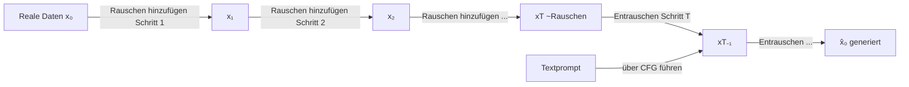

# Diffusionsmodelle

## Definition

Diffusionsmodelle sind eine Klasse generativer Modelle, die lernen, Daten zu erzeugen, indem sie einen graduellen Verrauschungsprozess umkehren. Während des Trainings lernt das Modell, Rauschen vorherzusagen und zu entfernen, das schrittweise über viele Zeitschritte zu realen Daten hinzugefügt wurde. Bei der Inferenz, ausgehend von reinem Gaußschen Rauschen, entrauscht das Modell iterativ, um eine Probe aus der Zieldatenverteilung zu erzeugen. Dieser Ansatz ist zum dominierenden Paradigma für hochwertige Bilderzeugung geworden, mit bahnbrechenden Systemen wie DALL·E 2, Stable Diffusion und Imagen.

Die wichtigste theoretische Erkenntnis kommt aus Score Matching und stochastischen Differentialgleichungen: Das Modell lernt die **Score-Funktion** (Gradient des Log-Dichte) der Datenverteilung bei jedem Rauschwert. Der Forward- (Verrauschungs-) Prozess ist festgelegt und hat eine geschlossene Form, daher ist das Training unkompliziert — nimm einen realen Datenpunkt, korumpiere ihn auf einen zufälligen Rauschwert, trainiere ein U-Net (oder Transformer), um das hinzugefügte Rauschen vorherzusagen. Der Verlust ist ein einfaches mittleres quadratisches Fehler zwischen vorhergesagtem und tatsächlichem Rauschen.

Im Gegensatz zu [GANs](/docs/gans) ist das Diffusions-Training stabil ohne adversarische Dynamik. Im Gegensatz zu [VAEs](/docs/vaes) sind Proben scharf und vielfältig, weil die Generierung eine reichhaltige Trajektorie durch die Datenmannigfaltigkeit verfolgt, anstatt aus einem Flaschenhals-Latent zu dekodieren. Der wichtigste praktische Kompromiss ist die Inferenzgeschwindigkeit: Der Umkehrprozess erfordert viele Entrauschungsschritte (50–1000 für DDPM). **Destillation** (z. B. Consistency Models) und effiziente Scheduler (DDIM, DPM-Solver) haben dies auf nur 1–4 Schritte ohne wesentlichen Qualitätsverlust reduziert. Siehe [Fallstudie: DALL-E](/docs/case-studies/dall-e).

## Funktionsweise

### Forward-Prozess (Daten → Rauschen)

Eine reale Probe **x₀** wird durch Hinzufügen von Gaußschem Rauschen über T Zeitschritte schrittweise korrumpiert, um **x₁, x₂, …, xT** zu erzeugen. Nach genug Schritten ist xT ungefähr reines Gaußsches Rauschen. Der Forward-Prozess hat eine geschlossene Form: Für jeden Zeitschritt t kann man xₜ direkt aus x₀ berechnen, ohne alle Zwischenschritte auszuführen.

### Umkehrprozess (Rauschen → Daten)

Ein neuronales Netzwerk (typischerweise ein U-Net mit Attention-Schichten) lernt, das Rauschen εθ(xₜ, t) vorherzusagen, das bei Schritt t hinzugefügt wurde. Das Training minimiert die Differenz zwischen vorhergesagtem und tatsächlichem Rauschen. Bei der Generierung startet das Modell von zufälligem **xT** und wendet das Entrauschungsnetzwerk iterativ an, um **x₀** wiederherzustellen.

### Konditionierung und Guidance

Für bedingte Generierung (z. B. Text-zu-Bild) trainiert **Classifier-Free Guidance (CFG)** das Modell sowohl mit als auch ohne die Bedingung und mischt dann den bedingten und unbedingten Score bei der Inferenz. Höherer Guidance-Gewicht erhöht die Prompt-Treue auf Kosten der Vielfalt.



### Latente Diffusion

Stable Diffusion führt den Diffusionsprozess im **Latenzraum** eines vortrainierten VAE-Encoders durch, nicht im Pixelraum. Dies reduziert die Rechenleistung drastisch bei gleichzeitiger Qualitätserhaltung. Der VAE-Encoder komprimiert das Bild; das Diffusionsmodell entrauscht im Latenzraum; der VAE-Decoder rekonstruiert das endgültige Bild.

## Wann verwenden / Wann NICHT verwenden

| Szenario | Diffusion verwenden | Diffusion vermeiden |
|---|---|---|
| Hochwertige, vielfältige Bilderzeugung | Ja — modernste Qualität und Vielfalt | Nein — wenn Inferenzgeschwindigkeit kritisch und Qualität niedriger sein kann |
| Text-zu-Bild oder Text-zu-Audio-Generierung | Ja — Konditionierung über CFG ist flexibel und leistungsstark | Nein — wenn ein schneller Single-Forward-Pass-Generator benötigt wird |
| Bildbearbeitung und Inpainting | Ja — Diffusion unterstützt natürlich maskiertes Entrauschen | Nein — wenn GAN-basierte Bearbeitungs-Pipeline bereits etabliert ist |
| Echtzeit-Generierung (z. B. Spiel-Assets) | Nein — Mehrschritt-Inferenz fügt Latenz hinzu | — |
| Tabellarische oder niedrigdimensionale Daten | Nein — Overkill; einfachere Modelle funktionieren besser | — |

## Vergleiche

| Modell | Probenqualität | Vielfalt | Trainingsstabilität | Inferenzgeschwindigkeit |
|---|---|---|---|---|
| Diffusion | Ausgezeichnet | Ausgezeichnet | Stabil | Langsam (viele Schritte) |
| GAN | Hoch (scharf) | Niedrig (Mode Collapse) | Schwierig | Schnell (1 Schritt) |
| VAE | Mittel (unscharf) | Gut | Stabil | Schnell |
| Flow-basiert | Hoch | Gut | Stabil | Mittel |

## Vor- und Nachteile

| Vorteile | Nachteile |
|---|---|
| Stabiles Training — keine adversarische Dynamik | Langsame Inferenz — erfordert viele Entrauschungsschritte |
| Ausgezeichnete Probenvielfalt und -abdeckung | Hohe Rechenkosten sowohl für Training als auch für Sampling |
| Flexible Konditionierung (Text, Klasse, Bild) | Erfordert sorgfältige Abstimmung des Rauschplans |
| Starke theoretische Grundlagen im Score Matching | Latente Diffusion fügt VAE-Kompressionsartefakte hinzu |

## Code-Beispiele

Text-zu-Bild-Generierung mit der Hugging Face Diffusers Bibliothek:

```python
from diffusers import StableDiffusionPipeline
import torch

# Load Stable Diffusion v1.5 (fp16 for GPU efficiency)
pipe = StableDiffusionPipeline.from_pretrained(
    "runwayml/stable-diffusion-v1-5",
    torch_dtype=torch.float16,
)
pipe = pipe.to("cuda")

# Generate an image from a text prompt
prompt = "A photorealistic mountain landscape at golden hour, 4K"
negative_prompt = "blurry, low quality, artifacts"

image = pipe(
    prompt=prompt,
    negative_prompt=negative_prompt,
    num_inference_steps=50,    # Denoising steps
    guidance_scale=7.5,        # CFG strength
    height=512,
    width=512,
).images[0]

image.save("output.png")
```

## Praktische Ressourcen

- [Denoising Diffusion Probabilistic Models (Ho et al., 2020)](https://arxiv.org/abs/2006.11239) — Grundlegendes DDPM-Paper, das das moderne Trainingsziel etabliert
- [Hugging Face Diffusers](https://huggingface.co/docs/diffusers/) — Produktionsbibliothek für Diffusions-Pipelines, Fine-Tuning und Inferenz
- [DDIM (Song et al., 2020)](https://arxiv.org/abs/2010.02502) — Deterministisches Sampling, das Schritte von 1000 auf 50 ohne Neutraining reduziert
- [Classifier-Free Guidance (Ho & Salimans, 2022)](https://arxiv.org/abs/2207.12598) — Die Schlüsseltechnik hinter bedingter Generierung in modernen Diffusionsmodellen

## Siehe auch

- [GANs](/docs/gans)
- [VAEs](/docs/vaes)
- [Fallstudie: DALL-E](/docs/case-studies/dall-e)
