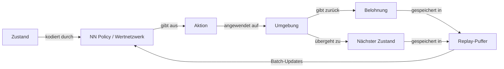

# Deep Reinforcement Learning (DRL)

## Definition

Deep Reinforcement Learning (DRL) erweitert das klassische [Reinforcement Learning](/docs/rl), indem handgefertigtes Feature-Engineering und tabellarische Wertfunktionen durch tiefe [neuronale Netze](/docs/neural-networks) ersetzt werden. Dies ermöglicht RL-Algorithmen, hochdimensionale Zustandsräume zu handhaben — wie rohe Pixel von einem Spielbildschirm oder Gelenkwinkel von einem Roboter — die bisher unhandhabbar waren. Das neuronale Netz fungiert als universeller Funktionsapproximator für die Policy, die Wertfunktion oder beide.

Der entscheidende Durchbruch kam mit DQN (Mnih et al., 2015), das Q-Learning mit einem Convolutional Network, Experience Replay und Target Networks kombinierte, um auf 49 Atari-Spielen Leistung auf menschlichem Niveau zu erreichen. Seitdem hat das Feld eine reichhaltige Familie von Algorithmen hervorgebracht: wertbasierte (DQN, Rainbow), Policy-Gradient- (REINFORCE, A3C) und Actor-Critic-Algorithmen (PPO, SAC, TD3). Jede Familie macht unterschiedliche Kompromisse zwischen Stichprobeneffizienz, Stabilität und Anwendbarkeit auf kontinuierliche versus diskrete Aktionsräume.

Das Training von Deep-RL-Agenten ist ohne spezifische Stabilisierungstechniken notorisch instabil. **Experience Replay** bricht zeitliche Korrelationen auf, indem Übergänge in einem Puffer gespeichert und zufällige Mini-Batches abgerufen werden. **Target Networks** sind langsam aktualisierte Kopien des Wertnetzwerks, die stabile Regressionsziele liefern. **Vorteilsschätzung** (z. B. GAE) reduziert die Varianz bei Policy-Gradient-Updates. Moderne Algorithmen wie PPO und SAC integrieren diese Ideen standardmäßig, was sie zu zuverlässigen Baselines für kontinuierliche Steuerung, Robotik und LLM-Ausrichtung (RLHF, DPO) macht.

## Funktionsweise

### Neuronales Netzwerk Policy und Wertfunktionen

Der Zustand (z. B. ein Bild, Sensorvektor oder Token-Embedding) wird durch ein neuronales Netzwerk kodiert, das entweder Aktionswahrscheinlichkeiten (Policy-Netzwerk) oder erwartete Renditen (Wertnetzwerk) ausgibt. Bei Actor-Critic-Methoden können beide Heads ein Backbone teilen.



### Experience Replay

Übergänge (Zustand, Aktion, Belohnung, nächster Zustand, fertig) werden in einem **Replay-Puffer** gespeichert. Zufällige Mini-Batches werden für jedes Gradient-Update abgerufen, was schädliche zeitliche Korrelationen aufbricht und die Dateneffizienz verbessert.

### Target Networks

Eine Kopie des Wertnetzwerks — langsam aktualisiert (Polyak-Mittelwertbildung) oder periodisch — liefert stabile Regressionsziele. Ohne dies können Gradient-Updates oszillieren, da sich das Ziel bei jedem Schritt ändert.

### Vorteilsschätzung

Policy-Gradient-Methoden berechnen den Vorteil A(s, a) = Q(s, a) − V(s), um dem Agenten zu sagen, um wie viel besser eine Aktion als der Durchschnitt war. **Generalized Advantage Estimation (GAE)** tauscht Bias gegen Varianz mit einem Hyperparameter λ und ist Standard in PPO.

### Schlüsselalgorithmen

| Algorithmus | Familie | Aktionsraum | Schlüsseleigenschaft |
|---|---|---|---|
| DQN | Wertbasiert | Diskret | Experience Replay + Target Networks |
| PPO | Actor-Critic | Beides | Abgeschnittene Policy-Updates für Stabilität |
| SAC | Actor-Critic | Kontinuierlich | Entropie-Maximierung für Exploration |
| TD3 | Actor-Critic | Kontinuierlich | Zwillingscritic reduziert Überschätzungsbias |

## Wann verwenden / Wann NICHT verwenden

| Szenario | DRL verwenden | DRL vermeiden |
|---|---|---|
| Hochdimensionale Beobachtungen (Pixel, Sensoren) | Ja — neuronale Netze verarbeiten rohe Eingaben | Nein — tabellarisches RL bei kleinem Zustandsraum |
| Simulator für sicheres Versuch-und-Irrtum verfügbar | Ja — DRL benötigt Millionen von Proben | Nein — nur reale Welt mit begrenzten Interaktionen |
| Komplexe, langfristige Steuerungsaufgaben | Ja — PPO/SAC exzelliert bei kontinuierlicher Steuerung | Nein — Imitation Learning ist schneller, wenn Expertendaten vorhanden sind |
| Begrenztes Rechnen oder Interpretierbarkeit erforderlich | Nein — DRL ist rechenintensiv und undurchsichtig | — |
| Einfaches regelbasiertes oder niedrig-D-Problem | Nein — klassisches RL oder Optimierung reicht aus | — |

## Vergleiche

| Methode | Zustandsraum | Stabilität | Stichprobeneffizienz | Typische Verwendung |
|---|---|---|---|---|
| Tabellarisches Q-Learning | Klein diskret | Hoch | Niedrig | Spielzeugumgebungen |
| DQN | Hochdim. diskret | Mittel | Niedrig-mittel | Atari-Spiele |
| PPO | Beliebig | Hoch | Mittel | Robotik, RLHF |
| SAC | Kontinuierlich | Hoch | Höher | Roboter-Manipulation |

## Vor- und Nachteile

| Vorteile | Nachteile |
|---|---|
| Verarbeitet rohe Pixel und hochdimensionale Eingaben | Extrem stichprobenineeffizient gegenüber überwachtem Lernen |
| Modernster Stand bei Spielen, Robotik und LLM-Ausrichtung | Hyperparameter-Sensitivität; instabil ohne Tricks |
| PPO/SAC sind robuste, allzweck-Baselines | Fehlspezifizierte Belohnung führt zu unerwartetem Verhalten |
| Skaliert mit Rechenleistung und Modellkapazität | Erfordert Simulator oder großes Umgebungsinteraktionsbudget |

## Code-Beispiele

Minimale PPO-Trainingsschleife mit Stable-Baselines3:

```python
from stable_baselines3 import PPO
from stable_baselines3.common.env_util import make_vec_env

# Vectorized environment for parallel rollout collection
env = make_vec_env("LunarLander-v2", n_envs=4)

model = PPO(
    policy="MlpPolicy",
    env=env,
    learning_rate=3e-4,
    n_steps=2048,        # Steps per rollout per env
    batch_size=64,
    n_epochs=10,         # Gradient epochs per rollout
    gamma=0.99,
    gae_lambda=0.95,
    clip_range=0.2,      # PPO clipping parameter
    verbose=1,
)

model.learn(total_timesteps=500_000)
model.save("ppo_lunar_lander")

# Evaluate
obs = env.reset()
for _ in range(1000):
    action, _ = model.predict(obs, deterministic=True)
    obs, rewards, dones, info = env.step(action)
```

## Praktische Ressourcen

- [Spinning Up in Deep RL (OpenAI)](https://spinningup.openai.com/) — Prägnante Algorithmuserklärungen mit PyTorch-Implementierungen von PPO, SAC, DDPG und TD3
- [Stable-Baselines3](https://stable-baselines3.readthedocs.io/) — Gut getestete, produktionsreife DRL-Implementierungen mit einheitlicher API
- [CleanRL](https://docs.cleanrl.dev/) — Einzeldatei, lesbare Implementierungen von DQN, PPO, SAC und mehr
- [DeepMind Lab / dm_control](https://github.com/deepmind/dm_control) — Kontinuierliche Steuerungsumgebungen für DRL-Benchmarking

## Siehe auch

- [RL](/docs/rl)
- [Neuronale Netze](/docs/neural-networks)
