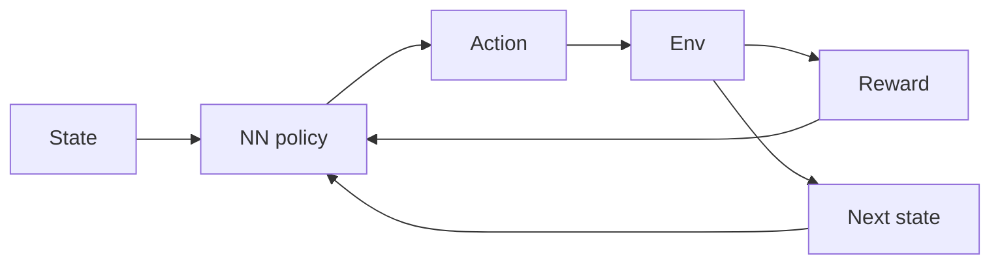

# Deep Reinforcement Learning (DRL)

## Definition

Deep RL kombiniert bestärkendes Lernen mit tiefen neuronalen Netzen to handle high-dimensional state and action spaces. Examples: DQN, A3C, PPO, SAC.

[Neural networks](/docs/neural-networks) approximieren die Wertfunktion und/oder Politik, sodass [RL](/docs/rl) can scale to raw pixels, high-D controls, and large discrete actions. Training is unstable without tricks (experience replay, target networks, advantage estimation); modern algorithms (PPO, SAC) are widely used in robotics and [LLM](/docs/llms) alignment (RLHF, DPO).

## Funktionsweise

The **state** (z. B. Bild, Vektor) wird in ein **neuronale Netzwerk-Policy** (or Wertnetzwerk) das ausgibt an **action**. The **env** returns **reward** and **next state**; the agent uses this experience to update the policy (z. B. policy gradient or Q-learning with function approximation). **Experience replay** (store transitions, sample batches) and **target networks** (slow-moving copy of the network) stabilize training. **Advantage estimation** (z. B. GAE) reduces variance in policy gradients. PPO and SAC are common for continuous control; DQN and variants for discrete actions.

## Anwendungsfälle

Deep RL is used wenn die Entscheidung problem is complex and you can learn from Versuch und Irrtum (Simulation oder reale Umgebung).

- High-dimensional control (z. B. robotics, autonomous driving)
- Game AI and simulation (z. B. DQN, PPO in complex environments)
- LLM alignment via policy optimization (z. B. RLHF, DPO)

## Externe Dokumentation

- [Spinning Up in Deep RL (OpenAI)](https://spinningup.openai.com/)
- [Stable-Baselines3 – DRL algorithms](https://stable-baselines3.readthedocs.io/)

## Siehe auch

- [RL](/docs/rl)
- [Neural networks](/docs/neural-networks)
