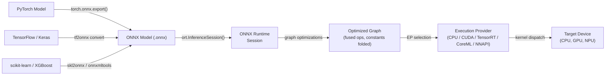

# ONNX Runtime

## Definition

ONNX Runtime (ORT) ist eine Open-Source-, plattformübergreifende Inferenz- und Trainingsbeschleunigungsbibliothek, die von Microsoft entwickelt wurde. Ihr primärer Zweck ist die Ausführung von Modellen im Format **Open Neural Network Exchange (ONNX)** – einer framework-agnostischen Zwischendarstellung für maschinelle Lernmodelle – mit hoher Leistung über eine breite Palette von Hardware-Zielen und Betriebssystemen. ORT ist an kein einzelnes Trainings-Framework gebunden: Modelle aus PyTorch, TensorFlow, scikit-learn, LightGBM, XGBoost und anderen können alle nach ONNX exportiert und über dieselbe Laufzeit-API ausgeführt werden, was es zu einer der interoperabelsten verfügbaren Inferenzlösungen macht.

Im Kern lädt ORT einen ONNX-Graphen, wendet eine umfangreiche Reihe von Optimierungen auf Graphenebene an (Constant Folding, Knotenfusion, Layout-Transformation) und leitet Operationen an den besten verfügbaren Ausführungsanbieter für die aktuelle Hardware weiter. Die **Execution Provider (EP)**-Abstraktion ermöglicht es ORT, Untergraphen an CPUs, NVIDIA-GPUs über CUDA oder TensorRT, AMD-GPUs über ROCm, Intel-Hardware über OpenVINO, Apple Silicon über CoreML, Android über NNAPI und Windows über DirectML weiterzuleiten – alles über eine einheitliche API-Oberfläche. Das macht ORT für ein Bereitstellungsspektrum geeignet, das von Cloud-Servern bis hin zu Windows-Laptops und Mobilgeräten reicht.

ONNX Runtime ist besonders wertvoll in Enterprise- und Produktionsumgebungen, in denen eine einzige Bereitstellungspipeline Modelle aus verschiedenen Frameworks bedienen muss. Es ist das Inferenz-Backend, das Azure-ML-Endpunkte, Hugging Faces Optimum-Bibliothek, Windows ML und viele Produktions-Empfehlungs- und Ranking-Systeme antreibt. Die Trainingserweiterung (ORT Training) ermöglicht auch beschleunigtes Fine-Tuning großer Transformer-Modelle, aber Inferenz ist der primäre Anwendungsfall.

## Funktionsweise



### ONNX-Format und Modellinteroperabilität

ONNX stellt ein Modell als gerichteten azyklischen Berechnungsgraphen dar, bei dem Knoten standardisierte Operatoren sind (z. B. `Conv`, `MatMul`, `LayerNormalization`), die in der ONNX-Operatorspezifikation definiert sind, und Kanten typisierte Tensoren tragen. Das Format ist versioniert: Jede ONNX-Opset-Version (aktuell 21) definiert den vollständigen Satz unterstützter Operatoren und ihre Semantik. Exporter aus jedem Framework ordnen framework-spezifische Ops ihren ONNX-Äquivalenten zu; wenn keine direkte Zuordnung vorhanden ist, können `custom_op`-Erweiterungen registriert werden. Die protobuf-serialisierte `.onnx`-Datei enthält die Graphentopologie, Operatornamen, Tensorformen und konstante Gewichtswerte, was das Format eigenständig und portabel macht.

### Graphoptimierungen

Wenn eine `InferenceSession` erstellt wird, wendet ORT drei Ebenen der Graphoptimierung an, gesteuert durch die `GraphOptimizationLevel`-Einstellung. Ebene 1 (grundlegend) führt sichere Umschreibungen durch: Constant Folding, redundante Knotenelimination, Formableitung und Identitätsentfernung. Ebene 2 (erweitert) fügt Operationsfusion hinzu: `Conv + BatchNorm`, `Conv + Relu`, `Transpose + MatMul` und ähnliche Muster werden zu einzelnen Kerneln zusammengefügt, um Zwischenspeicherzuweisungen und Kernel-Startaufwand zu eliminieren. Ebene 3 (Layout-Optimierung) restrukturiert Tensor-Speicherlayouts, um das zu entsprechen, was Ausführungsanbieter bevorzugen (z. B. NHWC für GPU-Konvolutionen). Optimierte Graphen können für die Inspektion oder zur Überspringung der Neuoptimierung bei nachfolgenden Ladevorgängen zurück nach `.onnx` serialisiert werden.

### Ausführungsanbieter

Der Execution-Provider-Mechanismus ist ORTs primärer Erweiterbarkeits- und Leistungshebel. Wenn eine Sitzung mit einem bestimmten EP erstellt wird, fragt ORT, welche Knoten der EP verarbeiten kann, partitioniert den Graphen und ersetzt beanspruchte Untergraphen durch EP-spezifische `ComputeKernel`-Implementierungen. Der **CPU-EP** verwendet MLAS (Microsoft Linear Algebra Subprograms), eine handvektorisierte BLAS-Implementierung mit AVX-512- und NEON-Unterstützung. Der **CUDA-EP** lagert Konvolutionen und GEMMs an cuDNN und cuBLAS aus. Der **TensorRT-EP** wendet TensorRTs Schichtfusion und Präzisionskalibrierung für FP16 und INT8 an und erzielt den höchsten Durchsatz auf NVIDIA-GPUs. Der **CoreML-EP** delegiert an Apples Neural Engine auf macOS und iOS. Der **DirectML-EP** unterstützt hardwarebeschleunigte Inferenz auf jeder DirectX-12-fähigen GPU unter Windows, einschließlich AMD und Intel integrierter Grafik.

### Quantisierung in ONNX Runtime

ORT unterstützt INT8-Inferenz durch das **QDQ-(Quantize-Dequantize-)** Knotenmuster: Der ONNX-Graph enthält explizite `QuantizeLinear`- und `DequantizeLinear`-Knoten, die die Präzisionsgrenzen darstellen. Statische Quantisierung erfordert einen Kalibrierungsdatensatz zur Berechnung von Eingabe-/Ausgabeskalen; das `onnxruntime.quantization`-Python-Paket bietet `quantize_static`- und `quantize_dynamic`-Funktionen. ORT akzeptiert auch QAT-exportierte Modelle, bei denen Q/DQ-Knoten während des Trainings eingefügt wurden. Hardware-INT8-Beschleunigung wird nur aktiviert, wenn der Ausführungsanbieter sie unterstützt (CUDA-EP erfordert CUDA 11+, TensorRT-EP unterstützt INT8 nativ über Kalibrierungstabellen). Der `ORTQuantizer` in Hugging Face Optimum bietet eine hochstufige Schnittstelle für die End-to-End-Quantisierung von Transformer-Modellen.

### Mobile und Edge-Bereitstellung

ORT Mobile ist ein schlanker Build von ONNX Runtime für Android und iOS, der ungenutzte Operatoren und EP-Bibliotheken entfernt und die Binärgröße auf ~1-3 MB komprimiert reduziert. Das `onnxruntime-mobile`-Python-Paket bereitet Modelle für Mobilgeräte vor, indem Gewichte vorgepackt und Trainingszeit-Metadaten entfernt werden. Auf Android delegiert der NNAPI-EP an den Hardware-Beschleuniger. Auf iOS und macOS verwendet der CoreML-EP die Apple Neural Engine. ORT läuft auch auf Raspberry Pi (ARM Linux) über den CPU-EP, und experimentelle Unterstützung für WebAssembly-Ziele ist vorhanden. Das `ort`-npm-Paket ermöglicht ORT in Node.js und Browser-Kontexten über WASM.

## Wann verwenden / Wann NICHT verwenden

| Verwenden wenn | Vermeiden wenn |
|---|---|
| Sie framework-agnostische Inferenz benötigen — Modelle aus PyTorch, TF und scikit-learn über eine einzige Runtime bedienen | Ihr Bereitstellungsziel ein Mikrocontroller mit \<256 KB RAM ist (TFLM deckt dies besser ab) |
| Sie Enterprise-ML-Pipelines auf Windows/Azure aufbauen, wo Microsoft-Tooling bereits vorhanden ist | Sie tiefe Android-Hardware-Delegation mit reifem Tooling heute benötigen (TFLite ist für Android bewährter) |
| Sie NVIDIA-TensorRT-Beschleunigung ohne direkte Verwaltung der TensorRT-API benötigen | Ihr Modell benutzerdefinierte Ops verwendet, die kein ONNX-Äquivalent haben und nicht praktisch zu registrieren sind |
| Sie Browser-/WASM-Inferenz für dasselbe Modell wollen, das serverseitig läuft | Ihr Team PyTorch-nativ ist und die engstmögliche Schleife von Training zu Mobile wünscht (PyTorch Mobile / ExecuTorch kann einfacher sein) |
| Plattformübergreifende Portabilität ein erstklassiges Anliegen ist (gleiches Modell auf Windows, Linux, macOS, Android, iOS) | Sie Echtzeit-Training oder Online-Lernen am Edge benötigen (ORT Training existiert, fügt aber erhebliche Komplexität hinzu) |

## Vergleiche

Vergleich von ONNX Runtime mit TFLite und PyTorch Mobile für Edge- und plattformübergreifende Bereitstellung.

| Kriterium | ONNX Runtime | TensorFlow Lite | PyTorch Mobile |
|---|---|---|---|
| Plattformunterstützung | Windows, Linux, macOS, Android, iOS, WASM, Cloud — breiteste Abdeckung | Android, iOS, eingebettetes Linux, Mikrocontroller (TFLM) | Android, iOS; ExecuTorch erweitert auf eingebettet und bare-metal |
| Modellkonvertierung | Jedes Framework → ONNX-Export (interoperabelster Pfad, mehrere Konverter) | TF/Keras → TFLite-Konverter (ausgereift, nur TF-Ökosystem) | PyTorch → TorchScript oder ExecuTorch (PyTorch-nativ, weniger Reibung für PT-Benutzer) |
| On-Device-Leistung | CPU-EP mit MLAS ist wettbewerbsfähig; TensorRT/CUDA-EPs führen für GPU; CoreML/NNAPI-EPs für Mobile | Ausgezeichnet auf Android über NNAPI/GPU-Delegat; best-in-class für Mikrocontroller | XNNPACK auf ARM-CPUs; Vulkan GPU; ExecuTorch NPU-Delegation |
| Ökosystem | Framework-agnostisch; Hugging Face Optimum; Windows ML; Azure ML; starke Enterprise-Übernahme | Ausgereift: MediaPipe, TF Hub, Model Garden; größte Mobile-ML-Community | Stark in Forschung; Hugging Face; wachsende ExecuTorch-Community |
| Quantisierungsunterstützung | INT8 über QDQ-Knoten; dynamisches und statisches PTQ; QAT; Hardware-INT8 über EP | Umfassend: dynamischer Bereich, INT8, FP16, QAT mit vollen INT8-Pfaden | PTQ (dynamisch + statisch INT8) und QAT über torch.ao.quantization |

## Vor- und Nachteile

| Vorteile | Nachteile |
|------|------|
| Framework-agnostisch: jedes ONNX-exportierbare Modell funktioniert mit derselben Runtime | ONNX-Export kann bei Modellen mit nicht unterstützten oder benutzerdefinierten Ops fehlschlagen |
| Breiteste Ausführungsanbieter-Abdeckung: CPU, CUDA, TensorRT, DirectML, CoreML, NNAPI, OpenVINO | Debugging von ONNX-Graphen ist schwieriger als natives Framework-Debugging |
| Starke Windows- und Azure-Integration; erstklassiger Bürger im Microsoft-ML-Stack | Mehr Betriebskomplexität als TFLite für reine Android/iOS-Szenarien |
| Hugging Face Optimum bietet hochstufige Quantisierung und Optimierung für Transformer | ONNX-Opset-Versionierung kann Kompatibilitätsreibung zwischen Exportern und ORT-Versionen erzeugen |
| Wettbewerbsfähige CPU-Leistung über MLAS mit AVX-512- und NEON-Vektorisierung | Mobile Binärgröße ist größer als TFLite, wenn alle EPs enthalten sind |

## Codebeispiele

```python
import numpy as np
import torch
import torch.nn as nn
import onnxruntime as ort

# ── 1. Define a simple model in PyTorch ───────────────────────────────────────
class SimpleClassifier(nn.Module):
    """Minimal classifier for demonstration."""

    def __init__(self, input_dim: int = 784, num_classes: int = 10):
        super().__init__()
        self.net = nn.Sequential(
            nn.Linear(input_dim, 128),
            nn.ReLU(),
            nn.Linear(128, 64),
            nn.ReLU(),
            nn.Linear(64, num_classes),
        )

    def forward(self, x: torch.Tensor) -> torch.Tensor:
        return self.net(x)


model = SimpleClassifier()
# Switch to inference mode: disables dropout, BatchNorm uses running statistics
model.train(False)

# ── 2. Export PyTorch model to ONNX ──────────────────────────────────────────
dummy_input = torch.randn(1, 784)  # batch=1, flattened 28x28 image

torch.onnx.export(
    model,
    dummy_input,
    "model.onnx",
    opset_version=17,                         # target ONNX opset
    input_names=["input"],
    output_names=["logits"],
    dynamic_axes={
        "input":  {0: "batch_size"},          # allow variable batch size
        "logits": {0: "batch_size"},
    },
    do_constant_folding=True,                 # fold constant sub-expressions during export
)
print("Exported model.onnx")

# ── 3. Apply INT8 post-training dynamic quantization ─────────────────────────
from onnxruntime.quantization import quantize_dynamic, QuantType

quantize_dynamic(
    "model.onnx",
    "model_int8.onnx",
    weight_type=QuantType.QInt8,              # quantize weights to INT8
)
print("Quantized model saved as model_int8.onnx")

# ── 4. Run inference with ONNX Runtime ───────────────────────────────────────
# SessionOptions allow controlling graph optimization level and thread counts
sess_options = ort.SessionOptions()
sess_options.graph_optimization_level = ort.GraphOptimizationLevel.ORT_ENABLE_ALL

# Providers list is checked in order; falls back to CPU if GPU is unavailable
providers = ["CUDAExecutionProvider", "CPUExecutionProvider"]
session = ort.InferenceSession("model_int8.onnx", sess_options, providers=providers)

print(f"Active execution provider: {session.get_providers()[0]}")

# Prepare a batch of random inputs as float32 numpy arrays
batch = np.random.randn(4, 784).astype(np.float32)
input_name = session.get_inputs()[0].name
output_name = session.get_outputs()[0].name

outputs = session.run([output_name], {input_name: batch})
logits = outputs[0]                          # shape (4, 10)
predicted_classes = np.argmax(logits, axis=1)
print(f"Batch predictions: {predicted_classes}")
```

## Praktische Ressourcen

- [ONNX-Runtime-Dokumentation](https://onnxruntime.ai/docs/) — Offizielle Referenz zu Installation, Ausführungsanbietern, Graphoptimierung, Quantisierung und mobiler Bereitstellung für alle unterstützten Plattformen.
- [ONNX-Runtime Python-API-Referenz](https://onnxruntime.ai/docs/api/python/api_summary.html) — Detaillierte API-Dokumentation für `InferenceSession`, `SessionOptions`, Ausführungsanbieter und das Quantisierungs-Unterpaket.
- [Hugging Face Optimum](https://huggingface.co/docs/optimum/onnxruntime/overview) — Hochstufige Bibliothek, die ORT für Transformer-Modelloptimierung umhüllt, mit `ORTModelForXxx`-Klassen und `ORTQuantizer` für Ein-Schritt-Modellexport und INT8-Quantisierung.
- [ONNX-Modell-Zoo](https://github.com/onnx/models) — Kuratiertes Repository vortrainierter ONNX-Modelle in den Bereichen Computer Vision, NLP, Sprache und klassisches ML; nützlich für ORT-Leistungs-Benchmarking und als Bereitstellungsvorlagen.
- [ONNX-Runtime Mobile-Bereitstellungsleitfaden](https://onnxruntime.ai/docs/tutorials/mobile/) — Schritt-für-Schritt-Tutorial zum Aufbau einer minimalen ORT-Android- oder iOS-Anwendung, einschließlich Modellvorbereitung und NNAPI/CoreML-EP-Konfiguration.

## Siehe auch

- [TensorFlow Lite](/docs/edge-ai/tflite)
- [PyTorch Mobile](/docs/edge-ai/pytorch-mobile)
- [PyTorch](/docs/frameworks/pytorch)
- [TensorFlow](/docs/frameworks/tensorflow)
