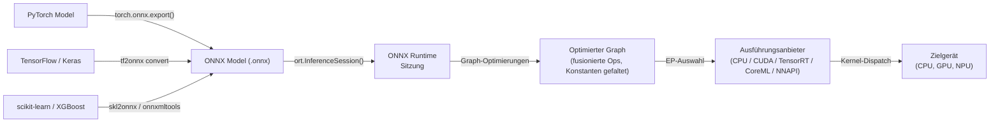

# ONNX Runtime

## Definition

ONNX Runtime (ORT) ist eine Open-Source-, plattformübergreifende Inferenz- und Trainingsbeschleunigungsbibliothek, die von Microsoft entwickelt wurde. Ihr Hauptzweck ist die Ausführung von Modellen im **Open Neural Network Exchange (ONNX)**-Format – eine Framework-agnostische Zwischenrepräsentation für maschinelle Lernmodelle – mit hoher Leistung über eine breite Palette von Hardware-Zielen und Betriebssystemen hinweg. ORT ist an kein einzelnes Trainings-Framework gebunden: Modelle aus PyTorch, TensorFlow, scikit-learn, LightGBM, XGBoost und anderen können alle in ONNX exportiert und über dieselbe Runtime-API ausgeführt werden, was es zu einer der interoperabelsten verfügbaren Inferenzlösungen macht.

Im Kern lädt ORT ein ONNX-Graph, wendet eine umfangreiche Reihe von Graph-Level-Optimierungen an (Constant-Folding, Node-Fusion, Layout-Transformation) und leitet Operationen an den am besten verfügbaren Ausführungsanbieter für die aktuelle Hardware weiter. Die **Execution Provider (EP)**-Abstraktion ermöglicht ORT, Subgraphen an CPUs, NVIDIA GPUs über CUDA oder TensorRT, AMD GPUs über ROCm, Intel-Hardware über OpenVINO, Apple Silicon über CoreML, Android über NNAPI und Windows über DirectML weiterzuleiten – alles über eine einheitliche API-Oberfläche. Dies macht ORT für ein Bereitstellungsspektrum geeignet, das von Cloud-Servern über Windows-Laptops bis hin zu Mobilgeräten reicht.

ONNX Runtime ist besonders wertvoll in Unternehmens- und Produktionsumgebungen, in denen eine einzelne Bereitstellungs-Pipeline Modelle aus verschiedenen Frameworks bedienen muss. Es ist das Inferenz-Backend, das Azure ML-Endpunkte, die Optimum-Bibliothek von Hugging Face, Windows ML und viele Produktionsempfehlungs- und Ranking-Systeme antreibt. Seine Trainingserweiterung (ORT Training) ermöglicht auch beschleunigtes Fine-Tuning großer Transformer-Modelle, aber Inferenz ist sein primärer Anwendungsfall.

## Funktionsweise



### ONNX-Format und Modell-Interoperabilität

ONNX repräsentiert ein Modell als gerichteten azyklischen Berechnungsgraph, in dem Knoten standardisierte Operatoren sind (z. B. `Conv`, `MatMul`, `LayerNormalization`), die in der ONNX-Operatorspezifikation definiert sind, und Kanten typisierte Tensoren übertragen. Das Format ist versioniert: Jede ONNX-Opset-Version (aktuell 21) definiert den vollständigen Satz unterstützter Operatoren und ihre Semantik. Exporteure aus jedem Framework ordnen Framework-spezifische Ops ihren ONNX-Äquivalenten zu; wenn eine direkte Zuordnung nicht vorhanden ist, können `custom_op`-Erweiterungen registriert werden. Die protobuf-serialisierte `.onnx`-Datei enthält die Graph-Topologie, Operatornamen, Tensor-Formen und konstante Gewichtswerte, was das Format selbstenthalten und portabel macht.

### Graph-Optimierungen

Wenn eine `InferenceSession` erstellt wird, wendet ORT drei Ebenen von Graph-Optimierungen an, die durch die `GraphOptimizationLevel`-Einstellung gesteuert werden. Stufe 1 (Basic) führt sichere Umschreibungen durch: Constant-Folding, Eliminierung redundanter Knoten, Shape-Inferenz und Identitätsentfernung. Stufe 2 (Extended) fügt Operations-Fusion hinzu: `Conv + BatchNorm`, `Conv + Relu`, `Transpose + MatMul` und ähnliche Muster werden zu einzelnen Kerneln fusioniert, um Zwischenspeicherzuweisungen und Kernel-Launch-Overhead zu eliminieren. Stufe 3 (Layout-Optimierung) restrukturiert Tensor-Speicher-Layouts, um die Präferenzen der Ausführungsanbieter anzupassen (z. B. NHWC für GPU-Konvolutionen). Optimierte Graphen können zur Inspektion oder zur Umgehung der erneuten Optimierung bei nachfolgenden Ladevorgängen wieder in `.onnx` serialisiert werden.

### Ausführungsanbieter

Der Execution-Provider-Mechanismus ist ORTs primärer Erweiterbarkeits- und Leistungshebel. Wenn eine Sitzung mit einem bestimmten EP erstellt wird, fragt ORT ab, welche Knoten der EP handhaben kann, partitioniert den Graph und ersetzt beanspruchte Subgraphen durch EP-spezifische `ComputeKernel`-Implementierungen. Der **CPU EP** verwendet MLAS (Microsoft Linear Algebra Subprograms), eine handvektorisierte BLAS-Implementierung mit AVX-512- und NEON-Unterstützung. Der **CUDA EP** verlagert Konvolutionen und GEMMs an cuDNN und cuBLAS. Der **TensorRT EP** wendet TensorRTs Layer-Fusion und Präzisionskalibrierung für FP16 und INT8 an, was den höchsten Durchsatz auf NVIDIA GPUs ergibt. Der **CoreML EP** delegiert an Apples Neural Engine auf macOS und iOS. Der **DirectML EP** unterstützt hardwarebeschleunigte Inferenz auf jeder DirectX 12-fähigen GPU unter Windows, einschließlich AMD und Intel integrierter Grafik.

### Quantisierung in ONNX Runtime

ORT unterstützt INT8-Inferenz durch das **QDQ (Quantize-Dequantize)**-Knotenmuster: Der ONNX-Graph enthält explizite `QuantizeLinear`- und `DequantizeLinear`-Knoten, die die Präzisionsgrenzen darstellen. Statische Quantisierung erfordert ein Kalibrierungsdataset zur Berechnung von Eingabe-/Ausgabe-Skalen; das Python-Paket `onnxruntime.quantization` bietet `quantize_static`- und `quantize_dynamic`-Funktionen. ORT akzeptiert auch QAT-exportierte Modelle, bei denen Q/DQ-Knoten während des Trainings eingefügt wurden. Hardware-INT8-Beschleunigung wird nur aktiviert, wenn der Ausführungsanbieter sie unterstützt (CUDA EP erfordert CUDA 11+, TensorRT EP handhabt INT8 nativ über Kalibrierungstabellen). Der `ORTQuantizer` in Hugging Face Optimum bietet eine High-Level-Schnittstelle zur End-to-End-Quantisierung von Transformer-Modellen.

### Mobile- und Edge-Bereitstellung

ORT Mobile ist ein schlankes Build von ONNX Runtime für Android und iOS, das unbenutzte Operatoren und EP-Bibliotheken entfernt und die Binärgröße auf ~1–3 MB komprimiert reduziert. Das Python-Paket `onnxruntime-mobile` bereitet Modelle für Mobilgeräte vor, indem es Gewichte vorverpackt und Trainingszeit-Metadaten entfernt. Auf Android delegiert der NNAPI EP an den Hardware-Beschleuniger. Auf iOS und macOS verwendet der CoreML EP die Apple Neural Engine. ORT läuft auch auf Raspberry Pi (ARM Linux) über den CPU EP, und experimentelle Unterstützung existiert für WebAssembly-Ziele. Das npm-Paket `ort` ermöglicht ORT in Node.js- und Browser-Kontexten über WASM.

## Wann verwenden / Wann NICHT verwenden

| Verwenden wenn | Vermeiden wenn |
|---|---|
| Sie Framework-agnostische Inferenz benötigen — Modelle aus PyTorch, TF und scikit-learn über eine Runtime bedienen | Ihr Bereitstellungsziel ein Mikrocontroller mit \<256 KB RAM ist (TFLM deckt dies besser ab) |
| Sie Enterprise-ML-Pipelines unter Windows/Azure aufbauen, wo Microsoft-Tooling bereits vorhanden ist | Sie tiefe Android-Hardware-Delegation mit ausgereiftem Tooling benötigen (TFLite ist für Android ausgereifter) |
| Sie NVIDIA TensorRT-Beschleunigung ohne direkte Verwaltung der TensorRT-API benötigen | Ihr Modell benutzerdefinierte Ops verwendet, die kein ONNX-Äquivalent haben und sich nicht praktisch registrieren lassen |
| Sie Browser/WASM-Inferenz für dasselbe Modell wünschen, das serverseitig läuft | Ihr Team PyTorch-nativ ist und die engstmögliche Schleife vom Training zu Mobile wünscht (PyTorch Mobile / ExecuTorch kann einfacher sein) |
| Plattformübergreifende Portabilität ein erstklassiges Anliegen ist (dasselbe Modell auf Windows, Linux, macOS, Android, iOS) | Sie Echtzeit-Training oder Online-Lernen am Edge benötigen (ORT Training existiert, fügt aber erhebliche Komplexität hinzu) |

## Vergleiche

Vergleich von ONNX Runtime mit TFLite und PyTorch Mobile für Edge- und plattformübergreifende Bereitstellung.

| Kriterium | ONNX Runtime | TensorFlow Lite | PyTorch Mobile |
|---|---|---|---|
| Plattformunterstützung | Windows, Linux, macOS, Android, iOS, WASM, Cloud — breiteste Abdeckung | Android, iOS, eingebettetes Linux, Mikrocontroller (TFLM) | Android, iOS; ExecuTorch fügt eingebettete und Bare-Metal-Ziele hinzu |
| Modellkonvertierung | Beliebiges Framework → ONNX-Export (interoperabelster Weg, mehrere Konverter) | TF/Keras → TFLite Converter (ausgereift, nur TF-Ökosystem) | PyTorch → TorchScript oder ExecuTorch (PyTorch-nativ, weniger Reibung für PT-Benutzer) |
| On-Device-Leistung | CPU EP mit MLAS ist wettbewerbsfähig; TensorRT/CUDA EPs führen für GPU; CoreML/NNAPI EPs für Mobile | Ausgezeichnet auf Android über NNAPI/GPU-Delegate; best-in-class für Mikrocontroller | XNNPACK auf ARM-CPUs; Vulkan GPU; ExecuTorch NPU-Delegation |
| Ökosystem | Framework-agnostisch; Hugging Face Optimum; Windows ML; Azure ML; starke Enterprise-Adoption | Ausgereift: MediaPipe, TF Hub, Model Garden; größte mobile ML-Community | Stark in der Forschung; Hugging Face; wachsende ExecuTorch-Community |
| Quantisierungsunterstützung | INT8 über QDQ-Knoten; dynamische und statische PTQ; QAT; Hardware-INT8 über EP | Umfassend: dynamischer Bereich, INT8, FP16, QAT mit vollen INT8-Pfaden | PTQ (dynamisch + statisch INT8) und QAT über torch.ao.quantization |

## Vor- und Nachteile

| Vorteile | Nachteile |
|---|---|
| Framework-agnostisch: jedes ONNX-exportierbare Modell funktioniert mit derselben Runtime | ONNX-Export kann bei Modellen mit nicht unterstützten oder benutzerdefinierten Ops fehlschlagen |
| Breiteste Ausführungsanbieter-Abdeckung: CPU, CUDA, TensorRT, DirectML, CoreML, NNAPI, OpenVINO | Das Debugging von ONNX-Graphen ist schwieriger als natives Framework-Debugging |
| Starke Windows- und Azure-Integration; erstklassiger Bürger im Microsoft ML-Stack | Mehr operative Komplexität als TFLite für reine Android/iOS-Szenarien |
| Hugging Face Optimum bietet High-Level-Quantisierung und Optimierung für Transformer | ONNX-Opset-Versionierung kann Kompatibilitätsreibung zwischen Exporteuren und ORT-Versionen erzeugen |
| Wettbewerbsfähige CPU-Leistung über MLAS mit AVX-512- und NEON-Vektorisierung | Mobile Binärgröße ist größer als TFLite, wenn alle EPs eingeschlossen sind |

## Code-Beispiele

```python
import numpy as np
import torch
import torch.nn as nn
import onnxruntime as ort

# ── 1. Ein einfaches Modell in PyTorch definieren ───────────────────────────
class SimpleClassifier(nn.Module):
    """Minimaler Klassifikator zur Demonstration."""

    def __init__(self, input_dim: int = 784, num_classes: int = 10):
        super().__init__()
        self.net = nn.Sequential(
            nn.Linear(input_dim, 128),
            nn.ReLU(),
            nn.Linear(128, 64),
            nn.ReLU(),
            nn.Linear(64, num_classes),
        )

    def forward(self, x: torch.Tensor) -> torch.Tensor:
        return self.net(x)


model = SimpleClassifier()
# In den Inferenzmodus wechseln: deaktiviert Dropout, BatchNorm verwendet laufende Statistiken
model.train(False)

# ── 2. PyTorch-Modell nach ONNX exportieren ──────────────────────────────
dummy_input = torch.randn(1, 784)  # batch=1, flattened 28x28 image

torch.onnx.export(
    model,
    dummy_input,
    "model.onnx",
    opset_version=17,                         # Ziel-ONNX-Opset
    input_names=["input"],
    output_names=["logits"],
    dynamic_axes={
        "input":  {0: "batch_size"},          # variable Batch-Größe erlauben
        "logits": {0: "batch_size"},
    },
    do_constant_folding=True,                 # konstante Teilausdrücke während des Exports falten
)
print("Exported model.onnx")

# ── 3. INT8 Post-Training Dynamic Quantisierung anwenden ─────────────────
from onnxruntime.quantization import quantize_dynamic, QuantType

quantize_dynamic(
    "model.onnx",
    "model_int8.onnx",
    weight_type=QuantType.QInt8,              # Gewichte auf INT8 quantisieren
)
print("Quantized model saved as model_int8.onnx")

# ── 4. Inferenz mit ONNX Runtime durchführen ───────────────────────────────
# SessionOptions ermöglichen die Steuerung der Graph-Optimierungsstufe und der Thread-Anzahl
sess_options = ort.SessionOptions()
sess_options.graph_optimization_level = ort.GraphOptimizationLevel.ORT_ENABLE_ALL

# Anbieter-Liste wird der Reihe nach geprüft; fällt auf CPU zurück, wenn GPU nicht verfügbar ist
providers = ["CUDAExecutionProvider", "CPUExecutionProvider"]
session = ort.InferenceSession("model_int8.onnx", sess_options, providers=providers)

print(f"Active execution provider: {session.get_providers()[0]}")

# Einen Batch zufälliger Eingaben als float32 numpy-Arrays vorbereiten
batch = np.random.randn(4, 784).astype(np.float32)
input_name = session.get_inputs()[0].name
output_name = session.get_outputs()[0].name

outputs = session.run([output_name], {input_name: batch})
logits = outputs[0]                          # shape (4, 10)
predicted_classes = np.argmax(logits, axis=1)
print(f"Batch predictions: {predicted_classes}")
```

## Praktische Ressourcen

- [ONNX Runtime Dokumentation](https://onnxruntime.ai/docs/) — offizielle Referenz zu Installation, Ausführungsanbietern, Graph-Optimierung, Quantisierung und mobiler Bereitstellung für alle unterstützten Plattformen.
- [ONNX Runtime Python API-Referenz](https://onnxruntime.ai/docs/api/python/api_summary.html) — detaillierte API-Dokumentation für `InferenceSession`, `SessionOptions`, Ausführungsanbieter und das Quantisierungs-Sub-Paket.
- [Hugging Face Optimum](https://huggingface.co/docs/optimum/onnxruntime/overview) — High-Level-Bibliothek, die ORT für Transformer-Modelloptimierung umhüllt und `ORTModelForXxx`-Klassen und `ORTQuantizer` für einstufigen Modellexport und INT8-Quantisierung bereitstellt.
- [ONNX Model Zoo](https://github.com/onnx/models) — kuratiertes Repository vortrainierter ONNX-Modelle für Computer Vision, NLP, Sprache und klassisches ML; nützlich für das Benchmarking der ORT-Leistung und als Bereitstellungsvorlagen.
- [ONNX Runtime Mobile-Bereitstellungsleitfaden](https://onnxruntime.ai/docs/tutorials/mobile/) — Schritt-für-Schritt-Tutorial zum Erstellen einer minimalen ORT Android- oder iOS-Anwendung, einschließlich Modellvorbereitung und NNAPI/CoreML EP-Konfiguration.

## Siehe auch

- [TensorFlow Lite](/docs/edge-ai/tflite)
- [PyTorch Mobile](/docs/edge-ai/pytorch-mobile)
- [PyTorch](/docs/frameworks/pytorch)
- [TensorFlow](/docs/frameworks/tensorflow)
