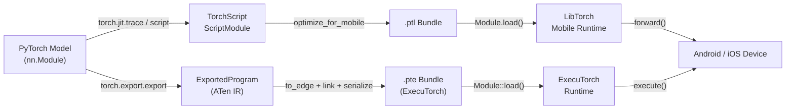

# PyTorch Mobile

## Definition

PyTorch Mobile ist die Familie von Tools und Laufzeitumgebungen, die PyTorch-trainierte Modelle auf Android- und iOS-Geräte bringt, ohne einen Server oder eine Cloud-Verbindung zu benötigen. Es bewahrt die PyTorch-Entwicklungserfahrung — Forscher und Ingenieure trainieren in der vertrauten Eager-Mode Python-API und exportieren dann ihre Modelle entweder über den **TorchScript**- oder den neueren **ExecuTorch**-Pfad für die On-Device-Bereitstellung. Diese enge Kopplung zwischen Trainings- und Deployment-Umgebungen reduziert die Angriffsfläche für numerische Diskrepanz-Bugs, die beim Wechsel zwischen Frameworks oft auftreten.

Der historische Deployment-Pfad konzentriert sich auf TorchScript, eine statisch typisierte Teilmenge von Python, die in ein plattformunabhängiges Format kompiliert und serialisiert werden kann (`.ptl` für Mobile). TorchScript unterstützt zwei Kompilierungsmodi: **Tracing**, bei dem ein Beispiel-Input durch das Modell geführt und der ausgeführte Pfad aufgezeichnet wird, und **Scripting**, bei dem Python-Kontrollfluss statisch analysiert wird. Beide erzeugen ein `ScriptModule`, das von der LibTorch C++ Laufzeit geladen werden kann, die in das Mobile-SDK eingebettet ist.

Google und Meta haben gemeinsam **ExecuTorch** als Framework der nächsten Generation für die Ausführung von PyTorch-Modellen am Edge entwickelt. ExecuTorch führt ein portables Ausführungsformat (`.pte`), eine minimale C++ Laufzeit (unter 50 KB für einfache Modelle) und erstklassige Unterstützung für die Delegation an Hardware-Backends einschließlich Qualcomm AI Engine, Apple Neural Engine, Arm Ethos NPUs und Cadence DSPs ein. ExecuTorch ist für den Produktionseinsatz konzipiert und löst die ursprüngliche PyTorch Mobile-Laufzeit für neue Projekte ab, die breite Hardware-Portabilität und minimale Binärgröße erfordern.

## Funktionsweise



### TorchScript Tracing und Scripting

Tracing (`torch.jit.trace`) führt einen Beispiel-Input durch das Modell und zeichnet die Abfolge der Tensor-Operationen auf, wodurch ein statischer Berechnungsgraph entsteht. Tracing ist einfach und deckt die meisten Standardarchitekturen ab, erfasst aber nur den Ausführungspfad für den angegebenen Input — datenabhängiger Kontrollfluss (if-Anweisungen, Schleifen, die mit Eingabewerten variieren) wird stillschweigend eingebettet. Scripting (`torch.jit.script`) analysiert den Python-Quellcode mit einem TorchScript-Typ-Checker und bewahrt den Kontrollfluss, wodurch es korrekt für Modelle mit Verzweigungslogik ist. In der Praxis sind hybride Ansätze üblich: das Top-Level-Modul scripten, während innere Submodule ohne dynamischen Kontrollfluss getracet werden.

### ExecuTorch Export-Pipeline

ExecuTorch verwendet `torch.export.export`, um eine strikte, seiteneffektfreie Darstellung des Modells in ATen IR zu erfassen — einen kanonischen Satz von PyTorch-Operatoren mit garantiert wohldefinierten Semantiken. Das exportierte Programm wird dann über `to_edge` auf die **Edge IR** heruntergestuft, die backend-spezifische Graph-Passes durchführt (Operator-Dekomposition, Layout-Propagierung). Backends (Delegation-Ziele) können Subgraphen während des `to_backend`-Schritts beanspruchen und diese durch hardware-spezifische Implementierungen ersetzen. Das finale Artefakt wird in ein `.pte`-Flatbuffer serialisiert, das von der ExecuTorch C++ Laufzeit geladen wird, die während der Inferenz keine dynamische Speicherallokierung erfordert.

### Optimierung: Quantisierung und Pruning

PyTorch bietet Post-Training-statische und dynamische Quantisierung durch `torch.quantization` (Legacy) und den neueren `torch.ao.quantization`-Namespace. Statische INT8-Quantisierung erfordert einen repräsentativen Kalibrierungsdatensatz und reduziert die Modellgröße um ~4x mit 2-3x Latenzverbesserung auf ARM-CPUs. Quantisierungs-bewusstes Training (QAT) fügt `FakeQuantize`-Knoten in den Forward-Graph während des Fine-Tunings ein, wodurch das Modell seine Gewichte an INT8-Präzision anpassen kann. Pruning (`torch.nn.utils.prune`) entfernt einzelne Gewichte oder ganze Kanäle basierend auf Magnitude- oder strukturierten Kriterien und reduziert die effektive Rechenlast vor der Quantisierung. Beide Techniken können kombiniert werden: zuerst prunen um Kanäle zu reduzieren, dann quantisieren um die Präzision zu reduzieren.

### Mobile-Laufzeit und Plattform-Integration

Das `.ptl`-Bundle, das von `optimize_for_mobile` erzeugt wird, umfasst Operator-Fusing-Optimierungen und entfernt ungenutzte Operatoren aus der Operator-Registry, was den Binär-Footprint reduziert. Das Android SDK (`pytorch_android`) wird auf Maven Central veröffentlicht und bietet eine Kotlin/Java-API. Das iOS SDK wird als CocoaPod oder Swift Package vertrieben und stellt Objective-C und Swift Bindings bereit. Beide SDKs umhüllen denselben LibTorch C++ Kern. ExecuTorch zielt auf dieselben Plattformen ab, bietet aber eine schlankere C-API und unterstützt auch Bare-Metal-Embedded-Ziele. Die `torch::executor::Module`-Klasse bietet eine minimale `execute()`-API, die direkt auf vorallokierten `EValue`-Tensoren arbeitet und JNI-artigen Overhead vermeidet.

### GPU- und NPU-Beschleunigung

Der GPU-Delegate von PyTorch Mobile für Android funktioniert über das Vulkan-Backend (`torch.backends.vulkan`), das Konvolutionen und Matrix-Multiplikationen auf die GPU auslagert. ExecuTorchs XNNPACK-Backend beschleunigt Gleitkomma- und INT8-Operationen auf ARM-CPUs über NEON-SIMD-Instruktionen und ist die empfohlene Standard-Option für CPU-Beschleunigung. Das Qualcomm AI Engine Direct-Backend und das Apple Core ML-Backend bieten NPU-Beschleunigung durch ExecuTorchs Delegations-API und erzielen typischerweise 5-15x Beschleunigungen gegenüber Referenz-CPU-Pfaden für Standard-Vision- und NLP-Modelle.

## Wann verwenden / Wann NICHT verwenden

| Verwenden wenn | Vermeiden wenn |
|---|---|
| Ihre Trainingscode-Basis PyTorch ist und Sie minimale Konvertierungs-Reibung möchten | Ihre Modelle aus TensorFlow/Keras stammen und der Konvertierungs-Overhead ein Problem ist |
| Sie auf Android oder iOS mit einem Python-vertrauten Workflow deployen müssen | Sie Mikrocontroller-Ziele mit &lt;256 KB RAM benötigen (TFLM ist besser geeignet) |
| Sie ExecuTorch für NPU-Delegation der nächsten Generation möchten (Qualcomm, Apple ANE) | Ihr Modell Python-Level-dynamischen Kontrollfluss verwendet, den TorchScript via Tracing nicht erfassen kann |
| Schnelle Iteration: dieselbe Modellklasse für Training und Mobile-Inferenz wiederverwenden | Sie ausgereifte Produktions-Tooling mit breiter Hardware-Delegate-Abdeckung heute benötigen (TFLite ist ausgereifter) |
| Sie auf dem Hugging Face-Ökosystem aufbauen (viele Modelle exportieren via TorchScript) | Die Binärgröße extrem eingeschränkt ist und der LibTorch-Laufzeit-Footprint (~3-8 MB komprimiert) zu groß ist |

## Vergleiche

Vergleich von PyTorch Mobile mit TFLite und ONNX Runtime für Edge-Deployment-Szenarien.

| Kriterium | PyTorch Mobile | TensorFlow Lite | ONNX Runtime |
|---|---|---|---|
| Plattformunterstützung | Android, iOS; ExecuTorch erweitert auf Embedded und Bare-Metal | Android, iOS, eingebettetes Linux, Mikrocontroller (TFLM) | Windows, Linux, macOS, Android, iOS, WebAssembly |
| Modellkonvertierung | torch.jit.trace / script (PyTorch-nativ) oder torch.export (ExecuTorch) | TFLite Converter von TF/Keras SavedModel | Beliebiges Framework → ONNX-Export (interoperabelster Pfad) |
| On-Device-Performance | XNNPACK auf ARM-CPUs; Vulkan GPU; ExecuTorch NPU-Delegation | Ausgezeichnet auf Android via NNAPI/GPU-Delegate; beste Leistung für Mikrocontroller | Wettbewerbsfähige CPU EP; CUDA/TensorRT EPs glänzen in GPU-fähigen Edge-Geräten |
| Ökosystem | Stark in Forschung; Hugging Face-Integration; wachsende ExecuTorch-Community | Ausgereift: MediaPipe, TF Hub, Model Garden; größte Mobile-ML-Community | Breite Enterprise-Unterstützung; framework-agnostisch; starke Microsoft/Azure-Integration |
| Quantisierungsunterstützung | PTQ (dynamisch + statisch INT8) und QAT via torch.ao.quantization; ExecuTorch backend-spezifische Quantisierung | Umfassend: Dynamic-Range, INT8, FP16, QAT mit vollständigen INT8-Pfaden | INT8 via QDQ-Knoten; Hardware-INT8 hängt vom Execution Provider ab |

## Vor- und Nachteile

| Vorteile | Nachteile |
|---|---|
| Nahtloser Workflow für PyTorch-Nutzer — dieselbe Modellklasse trainiert und deployt | LibTorch Mobile Binary fügt ~3-8 MB zur App-Größe komprimiert hinzu |
| ExecuTorch bietet eine moderne, erweiterbare Architektur für NPU-Delegation | TorchScript-Tracing übersieht stillschweigend datenabhängigen Kontrollfluss |
| Starke Hugging Face-Ökosystem-Integration | Weniger ausgereift als TFLite für Produktions-Android/iOS-Deployments |
| QAT ist gut in die Standard-Trainingsschleife integriert | Vulkan-GPU-Delegate-Abdeckung ist enger als TFLites GPU-Delegate |
| Aktive Entwicklung mit starker Meta- und Community-Unterstützung | ONNX-Interoperabilität erfordert einen zusätzlichen Konvertierungsschritt durch den ONNX-Exporter |

## Codebeispiele

```python
import torch
import torch.nn as nn

# ── 1. Define a simple convolutional model ────────────────────────────────────
class SmallCNN(nn.Module):
    """Minimal CNN for demonstration. Replace with your real model."""

    def __init__(self, num_classes: int = 10):
        super().__init__()
        self.features = nn.Sequential(
            nn.Conv2d(1, 16, kernel_size=3, padding=1),
            nn.ReLU(inplace=True),
            nn.MaxPool2d(2),
            nn.Conv2d(16, 32, kernel_size=3, padding=1),
            nn.ReLU(inplace=True),
            nn.AdaptiveAvgPool2d(1),
        )
        self.classifier = nn.Linear(32, num_classes)

    def forward(self, x: torch.Tensor) -> torch.Tensor:
        x = self.features(x)
        x = x.flatten(1)
        return self.classifier(x)

model = SmallCNN(num_classes=10)
model.eval()  # set model to inference mode (disables dropout, batch-norm tracks running stats)

# ── 2. Export with TorchScript tracing ───────────────────────────────────────
# Provide a representative input with the expected shape (batch=1, C=1, H=28, W=28)
example_input = torch.rand(1, 1, 28, 28)

# trace() records the ops executed for example_input
scripted_model = torch.jit.trace(model, example_input)

# optimize_for_mobile fuses ops and strips unused kernels for a smaller bundle
from torch.utils.mobile_optimizer import optimize_for_mobile

optimized_model = optimize_for_mobile(scripted_model)
optimized_model._save_for_lite_interpreter("model.ptl")
print("Saved model.ptl")

# ── 3. Apply post-training dynamic quantization ───────────────────────────────
quantized_model = torch.quantization.quantize_dynamic(
    model,
    qconfig_spec={nn.Linear, nn.Conv2d},  # quantize these layer types to INT8
    dtype=torch.qint8,
)
quantized_model.eval()

# Verify quantized inference produces sensible output
with torch.no_grad():
    output = quantized_model(example_input)
print(f"Output shape: {output.shape}, predicted class: {output.argmax(dim=1).item()}")

# ── 4. Load .ptl on Python (mirrors Android/iOS Module.load() behavior) ───────
loaded = torch.jit.load("model.ptl")
loaded.eval()
with torch.no_grad():
    result = loaded(example_input)
print(f"Loaded mobile model predicted class: {result.argmax(dim=1).item()}")
```

## Praktische Ressourcen

- [PyTorch Mobile Dokumentation](https://pytorch.org/mobile/home/) — offizieller Leitfaden zu TorchScript-Export, Android- und iOS-SDKs, Modelloptimierung und Performance-Profiling auf Geräten.
- [ExecuTorch Dokumentation](https://pytorch.org/executorch/) — die Dokumentation der nächsten Generation für Edge-Laufzeitumgebungen, die den Export-Pipeline, Backend-Delegation und Hardware-Integrations-Leitfäden für Qualcomm-, Apple- und ARM-Ziele abdeckt.
- [torch.ao.quantization Leitfaden](https://pytorch.org/docs/stable/quantization.html) — umfassende Referenz für PyTorchs Quantisierungs-API, die PTQ, QAT und den neueren `torch.ao`-Namespace für ExecuTorch-Workflows abdeckt.
- [PyTorch Android Demo-Apps](https://github.com/pytorch/android-demo-app) — Open-Source-Android-Apps, die Bildklassifizierung, Objekterkennung, Spracherkennung und NLP mit PyTorch Mobile demonstrieren; nützlich als Integrations-Templates.
- [ExecuTorch Tutorials](https://pytorch.org/executorch/stable/tutorials/export-to-executorch-tutorial.html) — schrittweise Tutorials zum Exportieren von Modellen durch die ExecuTorch-Pipeline und zum Ausführen mit der C++ Laufzeit.

## Siehe auch

- [TensorFlow Lite](/docs/edge-ai/tflite)
- [ONNX Runtime](/docs/edge-ai/onnx)
- [PyTorch](/docs/frameworks/pytorch)
- [Quantisierung](/docs/quantization)
