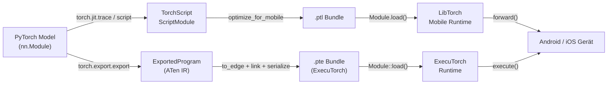

# PyTorch Mobile

## Definition

PyTorch Mobile ist die Familie von Tools und Runtimes, die PyTorch-trainierte Modelle ohne Server oder Cloud-Verbindung auf Android- und iOS-Geräte bringt. Es bewahrt die PyTorch-Entwicklungserfahrung – Forscher und Ingenieure trainieren in der vertrauten Eager-Mode-Python-API und exportieren ihre Modelle dann entweder über den **TorchScript**- oder den neueren **ExecuTorch**-Pfad für die On-Device-Bereitstellung. Diese enge Kopplung zwischen Trainings- und Bereitstellungsumgebungen reduziert die Angriffsfläche für numerische Diskrepanzfehler, die oft auftreten, wenn zwischen Frameworks gewechselt wird.

Der historische Bereitstellungspfad zentriert sich auf TorchScript, eine statisch-typisierte Teilmenge von Python, die kompiliert und in ein plattformunabhängiges Format serialisiert werden kann (`.ptl` für Mobile). TorchScript unterstützt zwei Kompilierungsmodi: **Tracing**, bei dem eine Beispieleingabe durch das Modell geleitet wird und der ausgeführte Pfad aufgezeichnet wird, und **Scripting**, bei dem Python-Kontrollfluss statisch analysiert wird. Beide erzeugen ein `ScriptModule`, das von der LibTorch C++ Runtime geladen werden kann, die im mobilen SDK eingebettet ist.

Google und Meta haben **ExecuTorch** gemeinsam als das Framework der nächsten Generation für die Ausführung von PyTorch-Modellen am Edge entwickelt. ExecuTorch führt ein portables Ausführungsformat (`.pte`), eine minimale C++ Runtime (unter 50 KB für einfache Modelle) und erstklassige Unterstützung für die Delegation an Hardware-Backends ein, einschließlich Qualcomm AI Engine, Apple Neural Engine, Arm Ethos NPUs und Cadence DSPs. ExecuTorch ist für den Produktionseinsatz konzipiert und ersetzt die ursprüngliche PyTorch Mobile Runtime für neue Projekte, die breite Hardware-Portabilität und minimale Binärgröße erfordern.

## Funktionsweise



### TorchScript Tracing und Scripting

Tracing (`torch.jit.trace`) führt eine Beispieleingabe durch das Modell und zeichnet die Sequenz der Tensor-Operationen auf, was einen statischen Berechnungsgraph erzeugt. Tracing ist einfach und deckt die meisten Standardarchitekturen ab, erfasst aber nur den Ausführungspfad für die gegebene Eingabe – datenabhängiger Kontrollfluss (if-Anweisungen, Schleifen, die mit Eingabewerten variieren) wird stillschweigend fest eingebacken. Scripting (`torch.jit.script`) analysiert den Python-Quellcode mit einem TorchScript-Typ-Checker und bewahrt den Kontrollfluss, was es für Modelle mit verzweigter Logik korrekt macht. In der Praxis sind Hybridansätze üblich: Das Top-Level-Modul scripten, während innere Sub-Module, die keinen dynamischen Kontrollfluss haben, getraced werden.

### ExecuTorch Export-Pipeline

ExecuTorch verwendet `torch.export.export`, um eine strikte, seiteneffektfreie Repräsentation des Modells in ATen IR zu erfassen – ein kanonischer Satz von PyTorch-Operatoren mit garantiert wohldefinierten Semantiken. Das exportierte Programm wird dann durch `to_edge` auf die **Edge IR** abgesenkt, was Backend-spezifische Graph-Passes durchführt (Operator-Dekompositionen, Layout-Propagation). Backends (Delegationsziele) können Subgraphen während des `to_backend`-Schritts beanspruchen und sie durch Hardware-spezifische Implementierungen ersetzen. Das finale Artefakt wird in ein `.pte`-Flatbuffer serialisiert, das von der ExecuTorch C++ Runtime geladen wird, die während der Inferenz keine dynamische Speicherzuweisung benötigt.

### Optimierung: Quantisierung und Pruning

PyTorch bietet Post-Training statische und dynamische Quantisierung über `torch.quantization` (legacy) und den neueren `torch.ao.quantization`-Namespace. Statische INT8-Quantisierung erfordert ein repräsentatives Kalibrierungsdataset und reduziert die Modellgröße um ~4x mit 2–3x Latenzverbesserung auf ARM-CPUs. Quantization-Aware Training (QAT) fügt `FakeQuantize`-Knoten in den Vorwärts-Graph während des Fine-Tunings ein, was es dem Modell ermöglicht, seine Gewichte an INT8-Präzision anzupassen. Pruning (`torch.nn.utils.prune`) entfernt individuelle Gewichte oder ganze Kanäle basierend auf Magnitude- oder strukturierten Kriterien, was die effektive Rechenlast vor der Quantisierung reduziert. Beide Techniken können kombiniert werden: zuerst prunen, um Kanäle zu reduzieren, dann quantisieren, um die Präzision zu reduzieren.

### Mobile Runtime und Plattform-Integration

Das `.ptl`-Bundle, das durch `optimize_for_mobile` erzeugt wird, enthält Operator-Fusions-Optimierungen und entfernt unbenutzte Operatoren aus der Operator-Registry, was den Binary-Footprint reduziert. Das Android SDK (`pytorch_android`) wird auf Maven Central veröffentlicht und stellt eine Kotlin/Java API bereit. Das iOS SDK wird als CocoaPod oder Swift Package verteilt und bietet Objective-C- und Swift-Bindungen. Beide SDKs umhüllen denselben LibTorch C++ Kern. ExecuTorch zielt auf dieselben Plattformen ab, stellt aber eine schlankere C-API bereit und unterstützt auch Bare-Metal-eingebettete Ziele. Die `torch::executor::Module`-Klasse bietet eine minimale `execute()`-API, die direkt auf vorzugewiesenen `EValue`-Tensoren operiert, um JNI-ähnlichen Overhead zu vermeiden.

### GPU- und NPU-Beschleunigung

PyTorch Mobiles GPU-Delegate für Android funktioniert über das Vulkan-Backend (`torch.backends.vulkan`), das Konvolutionen und Matrizenmultiplikationen auf die GPU verlagert. ExecuTorchs XNNPACK-Backend beschleunigt Gleitkomma- und INT8-Operationen auf ARM-CPUs über NEON-SIMD-Anweisungen und ist das empfohlene Standard für CPU-Beschleunigung. Das Qualcomm AI Engine Direct-Backend und das Apple Core ML-Backend bieten NPU-Beschleunigung über ExecuTorchs Delegations-API und erzielen typischerweise 5–15x Beschleunigungen gegenüber Referenz-CPU-Pfaden für Standard-Vision- und NLP-Modelle.

## Wann verwenden / Wann NICHT verwenden

| Verwenden wenn | Vermeiden wenn |
|---|---|
| Ihre Trainingscode-Basis PyTorch ist und Sie minimale Konvertierungsreibung möchten | Ihre Modelle in TensorFlow/Keras entstehen und der Konvertierungsaufwand ein Problem ist |
| Sie auf Android oder iOS mit einem Python-vertrauten Workflow bereitstellen müssen | Sie Mikrocontroller-Ziele mit \<256 KB RAM benötigen (TFLM ist besser geeignet) |
| Sie ExecuTorch für Next-Gen-Hardware-NPU-Delegation wünschen (Qualcomm, Apple ANE) | Ihr Modell Python-Ebene dynamischen Kontrollfluss verwendet, den TorchScript nicht über Tracing erfassen kann |
| Schnelle Iteration: dasselbe Modell für Training und mobiles Inferenz wiederverwenden | Sie ausgereifte Produktions-Tooling mit breiter Hardware-Delegate-Abdeckung heute benötigen (TFLite ist ausgereifter) |
| Sie auf dem Hugging Face-Ökosystem aufbauen (viele Modelle exportieren über TorchScript) | Die Binärgröße extrem eingeschränkt ist und der LibTorch-Runtime-Footprint (~3–8 MB komprimiert) zu groß ist |

## Vergleiche

Vergleich von PyTorch Mobile mit TFLite und ONNX Runtime für Edge-Bereitstellungsszenarien.

| Kriterium | PyTorch Mobile | TensorFlow Lite | ONNX Runtime |
|---|---|---|---|
| Plattformunterstützung | Android, iOS; ExecuTorch erweitert auf eingebettete und Bare-Metal-Ziele | Android, iOS, eingebettetes Linux, Mikrocontroller (TFLM) | Windows, Linux, macOS, Android, iOS, WebAssembly |
| Modellkonvertierung | torch.jit.trace / script (PyTorch-nativ) oder torch.export (ExecuTorch) | TFLite Converter von TF/Keras SavedModel | Beliebiges Framework → ONNX-Export (interoperabelster Weg) |
| On-Device-Leistung | XNNPACK auf ARM-CPUs; Vulkan GPU; ExecuTorch NPU-Delegation | Ausgezeichnet auf Android über NNAPI/GPU-Delegate; best-in-class für Mikrocontroller | Wettbewerbsfähiger CPU EP; CUDA/TensorRT EPs glänzen in GPU-fähigen Edge-Geräten |
| Ökosystem | Stark in der Forschung; Hugging Face-Integration; wachsende ExecuTorch-Community | Ausgereift: MediaPipe, TF Hub, Model Garden; größte mobile ML-Community | Breite Enterprise-Unterstützung; Framework-agnostisch; starke Microsoft/Azure-Integration |
| Quantisierungsunterstützung | PTQ (dynamisch + statisch INT8) und QAT über torch.ao.quantization; ExecuTorch Backend-spezifische Quantisierung | Umfassend: dynamischer Bereich, INT8, FP16, QAT mit vollen INT8-Pfaden | INT8 über QDQ-Knoten; Hardware-INT8 hängt vom Ausführungsanbieter ab |

## Vor- und Nachteile

| Vorteile | Nachteile |
|---|---|
| Nahtloser Workflow für PyTorch-Benutzer — dieselbe Modellklasse trainiert und bereitstellt | LibTorch Mobile Binary fügt der App-Größe komprimiert ~3–8 MB hinzu |
| ExecuTorch bietet eine moderne, erweiterbare Architektur für NPU-Delegation | TorchScript-Tracing übersieht stillschweigend datenabhängigen Kontrollfluss |
| Starke Hugging Face-Ökosystem-Integration | Weniger ausgereift als TFLite für Produktions-Android/iOS-Bereitstellungen |
| QAT ist gut in den Standardtrainings-Loop integriert | Vulkan-GPU-Delegate-Abdeckung ist schmaler als TFLites GPU-Delegate |
| Aktive Entwicklung mit starker Meta- und Community-Unterstützung | ONNX-Interoperabilität erfordert einen zusätzlichen Konvertierungsschritt über den ONNX-Exporter |

## Code-Beispiele

```python
import torch
import torch.nn as nn

# ── 1. Ein einfaches Faltungsmodell definieren ────────────────────────────
class SmallCNN(nn.Module):
    """Minimales CNN zur Demonstration. Durch Ihr echtes Modell ersetzen."""

    def __init__(self, num_classes: int = 10):
        super().__init__()
        self.features = nn.Sequential(
            nn.Conv2d(1, 16, kernel_size=3, padding=1),
            nn.ReLU(inplace=True),
            nn.MaxPool2d(2),
            nn.Conv2d(16, 32, kernel_size=3, padding=1),
            nn.ReLU(inplace=True),
            nn.AdaptiveAvgPool2d(1),
        )
        self.classifier = nn.Linear(32, num_classes)

    def forward(self, x: torch.Tensor) -> torch.Tensor:
        x = self.features(x)
        x = x.flatten(1)
        return self.classifier(x)


model = SmallCNN(num_classes=10)
model.eval()  # Modell in Inferenzmodus setzen

# ── 2. Mit TorchScript Tracing exportieren ───────────────────────────────
example_input = torch.rand(1, 1, 28, 28)

scripted_model = torch.jit.trace(model, example_input)

from torch.utils.mobile_optimizer import optimize_for_mobile

optimized_model = optimize_for_mobile(scripted_model)
optimized_model._save_for_lite_interpreter("model.ptl")
print("Saved model.ptl")

# ── 3. Post-Training Dynamic Quantisierung anwenden ───────────────────────
quantized_model = torch.quantization.quantize_dynamic(
    model,
    qconfig_spec={nn.Linear, nn.Conv2d},
    dtype=torch.qint8,
)
quantized_model.eval()

with torch.no_grad():
    output = quantized_model(example_input)
print(f"Output shape: {output.shape}, predicted class: {output.argmax(dim=1).item()}")

# ── 4. .ptl auf Python laden ──────────────────────────────────────────────
loaded = torch.jit.load("model.ptl")
loaded.eval()
with torch.no_grad():
    result = loaded(example_input)
print(f"Loaded mobile model predicted class: {result.argmax(dim=1).item()}")
```

## Praktische Ressourcen

- [PyTorch Mobile Dokumentation](https://pytorch.org/mobile/home/) — offizieller Leitfaden zum TorchScript-Export, den Android- und iOS-SDKs, Modelloptimierung und Leistungs-Profiling auf Geräten.
- [ExecuTorch Dokumentation](https://pytorch.org/executorch/) — die Next-Generation-Edge-Runtime-Dokumentation, die die Export-Pipeline, Backend-Delegation und Hardware-Integrationsanleitungen für Qualcomm, Apple und ARM-Ziele abdeckt.
- [torch.ao.quantization Leitfaden](https://pytorch.org/docs/stable/quantization.html) — umfassende Referenz für PyTorchs Quantisierungs-API.
- [PyTorch Android Demo-Apps](https://github.com/pytorch/android-demo-app) — Open-Source-Android-Apps als Integrations-Templates.
- [ExecuTorch Tutorials](https://pytorch.org/executorch/stable/tutorials/export-to-executorch-tutorial.html) — Schritt-für-Schritt-Tutorials zum Exportieren von Modellen durch die ExecuTorch-Pipeline.

## Siehe auch

- [TensorFlow Lite](/docs/edge-ai/tflite)
- [ONNX Runtime](/docs/edge-ai/onnx)
- [PyTorch](/docs/frameworks/pytorch)
- [Quantisierung](/docs/quantization)
