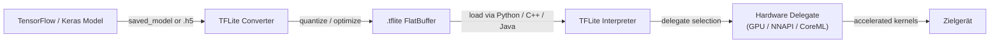

# TensorFlow Lite

## Definition

TensorFlow Lite (TFLite) ist Googles Open-Source-Framework für die Ausführung von maschinellen Lernmodellen auf ressourcenbeschränkten Geräten – Mobiltelefone, Tablets, eingebettete Systeme und Mikrocontroller. TFLite ist kein Trainings-Framework, sondern eine zweckgebundene **Inferenz-Runtime**: Modelle werden mit vollständigem TensorFlow trainiert, in das kompakte `.tflite`-Format konvertiert und dann ohne Serververbindung auf dem Gerät ausgeführt. Dieses Design ermöglicht es Anwendungen, ML-Aufgaben – Bildklassifikation, Objekterkennung, Spracherkennung, natürliches Sprachverständnis – vollständig offline und mit geringer Latenz durchzuführen.

Der Kern von TFLite ist ein Flat-Buffer-Modellformat, das den Speicherzuweisungsaufwand minimiert und keinen komplexen Runtime-Graph-Interpreter benötigt. Das Format entfernt Trainingszeitkonstrukte (Gradienten, Optimiererzustand) und behält nur die für die Vorwärtspass-Inferenz benötigten Operationen. Dies führt zu Modelldateien, die oft eine Größenordnung kleiner sind als ihre vollständigen TensorFlow-Pendants, was die Verteilung über App-Stores auch für Benutzer mit gemessenen Verbindungen praktisch macht.

TFLite zielt auf einen ungewöhnlich breiten Hardware-Bereich ab. Am oberen Ende läuft es auf Android- und iOS-Geräten und nutzt Hardware-Beschleuniger über seine **Delegate**-API. Am unteren Ende entfernt die TensorFlow Lite für Mikrocontroller (TFLM)-Variante die dynamische Speicherzuweisung vollständig und kann in Dutzenden von Kilobytes Flash passen, was die Bereitstellung auf Bare-Metal Cortex-M-Chips und ähnlichen ultrabeschränkten Zielen ermöglicht.

## Funktionsweise



### Modellkonvertierung

Der TFLite Converter (`tf.lite.TFLiteConverter`) akzeptiert SavedModel-Verzeichnisse, Keras `.h5`-Dateien oder konkrete TensorFlow-Funktionen und gibt ein `.tflite`-Flatbuffer aus. Während der Konvertierung wird der Graph eingefroren (Variablen werden zu Konstanten), unbenutzte Operationen werden bereinigt, und Operator-Fusion (z. B. Conv + ReLU → fusioniertes ConvReLU) reduziert den Kernel-Dispatch-Overhead. Der Converter unterstützt eine wachsende Anzahl von TensorFlow-Ops über den **select TF ops**-Mechanismus und fällt auf einen eingeschränkten Satz integrierter TFLite-Ops zurück, die garantiert auf jedem Ziel laufen. Post-Training-Quantisierung kann in dieser Phase angewendet werden, was das Modell verkleinert und Integer-only-Inferenzpfade freischaltet.

### Quantisierung

TFLite unterstützt vier Quantisierungsmodi: dynamische Bereichsquantisierung (nur Gewichte, Aktivierungen zur Laufzeit quantisiert), vollständige Integer-Quantisierung (Gewichte und Aktivierungen, erfordert ein repräsentatives Dataset zur Kalibrierung), Float16-Quantisierung (gut für GPU-Delegates) und Quantization-Aware Training (QAT, bei dem Fake-Quantisierungsknoten während des Trainings eingefügt werden, damit das Modell lernt, gegen Präzisionsreduzierung robust zu sein). Vollständige INT8-Quantisierung reduziert die Modellgröße typischerweise um 4x und die Latenz um 2–3x auf CPUs mit SIMD-Unterstützung. Quantisierung ist besonders wirkungsvoll auf mobilen Chipsätzen, denen schnelle FP32-Ausführungspfade fehlen.

### Interpreter und Op-Kernel

Der TFLite Interpreter lädt eine `.tflite`-Datei, weist Tensor-Speicher zu (alles in einer einzigen Arena, um Fragmentierung zu vermeiden) und führt Operationen in topologischer Reihenfolge aus. Jede Operation wird durch einen Kernel implementiert, der im Op-Resolver registriert ist; der MutableOpResolver ermöglicht es Anwendungen, nur die benötigten Ops einzuschließen, was die Binärgröße erheblich reduziert. Der Interpreter stellt eine minimale C++ API bereit (`AllocateTensors`, `Invoke`, `typed_input_tensor`, `typed_output_tensor`) und es gibt Higher-Level-Wrapper für Java/Kotlin (Android), Swift/ObjC (iOS) und Python. Der Python-Interpreter wird hauptsächlich zur Validierung und zum Benchmarking vor der Bereitstellung nativer Binärdateien verwendet.

### Delegates

Delegates sind TFLites Hardware-Beschleunigungs-Plugin-Schnittstelle. Wenn ein Delegate auf den Interpreter angewendet wird, inspiziert er den Modell-Graph und beansprucht die Subgraphen, die er beschleunigen kann, und ersetzt TFLites Referenz-CPU-Kernel durch optimierte Implementierungen. Der **GPU-Delegate** verlagert Konvolutionen und Matrizenmultiplikationen auf OpenGL ES oder Metal, was 2–7x Beschleunigungen bei typischen Vision-Modellen ergibt. Der **NNAPI-Delegate** leitet Operationen über Androids Neural Networks API an jeden vom Anbieter bereitgestellten Beschleuniger (DSP, NPU). Der **CoreML-Delegate** verwendet Apples CoreML auf iOS. Der **Hexagon-Delegate** zielt direkt auf Qualcomm DSPs ab. Delegates degradieren elegant: Nicht unterstützte Ops fallen automatisch auf CPU zurück.

### TFLite für Mikrocontroller

Der TFLM-Fork entfernt den Standard-C++-Allokator, Datei-I/O und dynamischen Dispatch. Modelle werden als C-Byte-Arrays in die Firmware kompiliert und die Inferenz läuft aus dem SRAM mit einem Puffer mit fester Größe. Unterstützte Ziele umfassen STM32, Arduino Nano 33 BLE Sense, SparkFun Edge und Sony Spresense. TFLM unterstützt eine Teilmenge von Operationen, die für Schlüsselworterkennung, Gestenerkennung und einfache Vision-Aufgaben bei Sub-Milliwatt-Leistungsbudgets ausreicht.

## Wann verwenden / Wann NICHT verwenden

| Verwenden wenn | Vermeiden wenn |
|---|---|
| Auf Android oder iOS ohne Cloud-Abhängigkeit bereitstellen | Ihr Modell Ops verwendet, die noch nicht vom TFLite-Op-Satz unterstützt werden |
| Sie \<100ms Latenz für Echtzeit-Inferenz auf Mobile benötigen | Sie dynamische Formen oder Kontrollfluss benötigen, der nicht in statischen TFLite-Graphen ausdrückbar ist |
| Auf eingebetteten Linux-Boards laufen (Raspberry Pi, Coral Edge TPU) | Ihr Team primär in PyTorch arbeitet und Modellkonvertierungsreibung ein Blocker ist |
| Binärgröße wichtig ist und Sie eine minimale Inferenz-Runtime möchten | Sie erweiterte Serving-Funktionen benötigen: Batching, Modell-Versionierung, A/B-Routing |
| Sie breite Hardware-Beschleunigung über die Delegate-API wünschen | Ihre Modellarchitektur sich während der Experimentierphase häufig ändert |

## Vergleiche

Vergleich von TFLite mit PyTorch Mobile und ONNX Runtime für Edge-Bereitstellungsszenarien.

| Kriterium | TensorFlow Lite | PyTorch Mobile | ONNX Runtime |
|---|---|---|---|
| Plattformunterstützung | Android, iOS, eingebettetes Linux, Mikrocontroller | Android, iOS (eingeschränkte eingebettete) | Windows, Linux, macOS, Android, iOS, WebAssembly |
| Modellkonvertierung | TF/Keras → TFLite Converter (ausgereift, gut dokumentiert) | PyTorch → TorchScript oder ExecuTorch (Python-nativ, weniger Reibung für PyTorch-Benutzer) | Beliebiges Framework → ONNX-Export → ORT (interoperabelst) |
| On-Device-Leistung | Ausgezeichnet auf Android über NNAPI/GPU-Delegate; best-in-class für Mikrocontroller | Gut auf Mobile; ExecuTorch bringt verbesserte Leistung und Portabilität | Wettbewerbsfähig mit CPU EP; CUDA/TensorRT EPs glänzen in Cloud/Edge-GPU-Szenarien |
| Ökosystem | Groß: TensorFlow Hub-Modelle, Model Garden, MediaPipe-Integration | Wachsend: stark in der Forschung, torchvision-Modelle, Hugging Face-Integration | Breit: jedes ONNX-kompatible Framework; stark in Enterprise und Microsoft-Stack |
| Quantisierungsunterstützung | Umfassend: dynamischer Bereich, INT8, FP16, QAT | PTQ und QAT über torch.quantization; ExecuTorch fügt mehr Backends hinzu | Unterstützt INT8 über QDQ-Knoten; hängt vom Ausführungsanbieter für Hardware-INT8 ab |

## Vor- und Nachteile

| Vorteile | Nachteile |
|---|---|
| Ausgereiftes Ökosystem mit umfangreichem mobilen Tooling und Dokumentation | Erfordert Konvertierungsschritt; nicht alle TensorFlow-Ops werden unterstützt |
| Ausgezeichnete Mikrocontroller-Unterstützung über TFLM | Das Debugging konvertierter Modelle ist schwieriger als im Eager-Mode TensorFlow |
| Hardware-Delegate-API deckt wichtige mobile Beschleuniger ab | ONNX-Interoperabilität erfordert Zwischenkonvertierung |
| Flat-Buffer-Format lädt sofort ohne Parsing-Overhead | Weniger flexibel als vollständiges TF für dynamische Modellarchitekturen |
| Starke Community, Google-Unterstützung und MediaPipe-Integration | PyTorch-Benutzer haben mehr Reibung als TFLite-native TF-Workflows |

## Code-Beispiele

```python
import numpy as np
import tensorflow as tf

# ── 1. Ein einfaches Keras-Modell erstellen und trainieren ──────────────
model = tf.keras.Sequential([
    tf.keras.layers.InputLayer(input_shape=(28, 28, 1)),
    tf.keras.layers.Conv2D(8, (3, 3), activation="relu"),
    tf.keras.layers.MaxPooling2D(),
    tf.keras.layers.Flatten(),
    tf.keras.layers.Dense(10, activation="softmax"),
])
model.compile(optimizer="adam", loss="sparse_categorical_crossentropy", metrics=["accuracy"])

# Dummy-Trainingsdaten — durch echtes Dataset ersetzen (z.B. MNIST)
x_train = np.random.rand(128, 28, 28, 1).astype(np.float32)
y_train = np.random.randint(0, 10, 128).astype(np.int32)
model.fit(x_train, y_train, epochs=1, verbose=0)

# ── 2. In TFLite mit vollständiger INT8-Quantisierung konvertieren ────────
def representative_dataset():
    """Gibt kleine Batches aus Trainingsdaten für die Kalibrierung zurück."""
    for i in range(0, len(x_train), 8):
        yield [x_train[i : i + 8]]

converter = tf.lite.TFLiteConverter.from_keras_model(model)
converter.optimizations = [tf.lite.Optimize.DEFAULT]
converter.representative_dataset = representative_dataset
converter.target_spec.supported_ops = [tf.lite.OpsSet.TFLITE_BUILTINS_INT8]
converter.inference_input_type = tf.int8
converter.inference_output_type = tf.int8

tflite_model = converter.convert()

# Die .tflite-Datei speichern
with open("model.tflite", "wb") as f:
    f.write(tflite_model)
print(f"Model size: {len(tflite_model) / 1024:.1f} KB")

# ── 3. Inferenz mit dem TFLite Interpreter durchführen ────────────────────
interpreter = tf.lite.Interpreter(model_content=tflite_model)
interpreter.allocate_tensors()

input_details = interpreter.get_input_details()
output_details = interpreter.get_output_details()

# Eine float32-Eingabe mit der Skalierung und dem Nullpunkt des Eingabetensors nach INT8 quantisieren
scale, zero_point = input_details[0]["quantization"]
sample = x_train[:1]  # shape (1, 28, 28, 1)
sample_int8 = (sample / scale + zero_point).astype(np.int8)

interpreter.set_tensor(input_details[0]["index"], sample_int8)
interpreter.invoke()

output = interpreter.get_tensor(output_details[0]["index"])
# Ausgabe dequantisieren
out_scale, out_zero = output_details[0]["quantization"]
probabilities = (output.astype(np.float32) - out_zero) * out_scale
predicted_class = np.argmax(probabilities)
print(f"Predicted class: {predicted_class}")
```

## Praktische Ressourcen

- [TensorFlow Lite offizieller Leitfaden](https://www.tensorflow.org/lite/guide) — umfassende Dokumentation zur Modellkonvertierung, Optimierung, Delegates und plattformspezifischen Bereitstellungsleitfäden für Android, iOS und eingebettetes Linux.
- [TFLite Model Maker](https://www.tensorflow.org/lite/models/modify/model_maker) — High-Level-API für Transfer-Learning, die direkt `.tflite`-Modelle ausgibt; nützlich für schnelles Prototyping mit benutzerdefinierten Datasets.
- [TFLite für Mikrocontroller](https://www.tensorflow.org/lite/microcontrollers) — der TFLM-Leitfaden, der erklärt, wie auf Cortex-M-Boards ohne OS-Abhängigkeit bereitgestellt wird; enthält Schlüsselworterkennung und Gestenerkennung Beispiele.
- [MediaPipe Solutions](https://developers.google.com/mediapipe/solutions) — Googles produktionsfertige Pipelines (Gesichtserkennung, Handverfolgung, Pose-Schätzung) auf TFLite aufgebaut; nützlich als Referenz für die Integration von TFLite in echte Anwendungen.
- [TFLite Leistungs-Benchmarks](https://www.tensorflow.org/lite/performance/benchmarks) — offizielle Latenz- und Genauigkeits-Benchmarks über mobile Chipsätze für gängige Vision-Modelle; nützlich für Hardware-Auswahl-Entscheidungen.

## Siehe auch

- [PyTorch Mobile](/docs/edge-ai/pytorch-mobile)
- [ONNX Runtime](/docs/edge-ai/onnx)
- [Infrastruktur](/docs/infrastructure)
- [Modellkomprimierung](/docs/model-compression)
