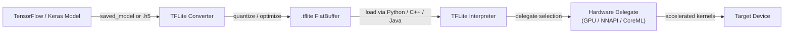

# TensorFlow Lite

## Definition

TensorFlow Lite (TFLite) ist Googles Open-Source-Framework zur Ausführung von Machine-Learning-Modellen auf ressourcenbeschränkten Geräten — Mobiltelefonen, Tablets, eingebetteten Systemen und Mikrocontrollern. Anstatt eines Trainings-Frameworks ist TFLite eine zweckgebundene **Inferenz-Laufzeitumgebung**: Modelle werden mit vollem TensorFlow trainiert, in das kompakte `.tflite`-Format konvertiert und dann ohne Serververbindung On-Device ausgeführt. Dieses Design ermöglicht es Anwendungen, ML-Aufgaben — Bildklassifizierung, Objekterkennung, Spracherkennung, natürliches Sprachverstehen — vollständig offline und mit geringer Latenz durchzuführen.

Der Kern von TFLite ist ein Flatbuffer-Modellformat, das den Speicherallokierungs-Overhead minimiert und die Notwendigkeit eines komplexen Laufzeit-Graph-Interpreters vermeidet. Das Format entfernt Trainingskonstrukte (Gradienten, Optimizer-Zustand) und behält nur die für die Forward-Pass-Inferenz benötigten Operationen. Dies führt zu Modelldateien, die oft eine Größenordnung kleiner sind als ihre vollen TensorFlow-Entsprechungen, was die Verteilung über App-Stores selbst für Nutzer mit gebührenpflichtigen Verbindungen praktisch macht.

TFLite zielt auf eine ungewöhnlich breite Hardware-Palette ab. Am oberen Ende läuft es auf Android- und iOS-Geräten und nutzt Hardware-Beschleuniger durch seine **Delegate**-API. Am unteren Ende entfernt die TensorFlow Lite for Microcontrollers (TFLM) Variante die dynamische Speicherallokierung vollständig und kann in wenige Kilobytes Flash passen, was den Einsatz auf Bare-Metal Cortex-M Chips und ähnlich stark eingeschränkten Zielen ermöglicht.

## Funktionsweise



### Modellkonvertierung

Der TFLite Converter (`tf.lite.TFLiteConverter`) akzeptiert SavedModel-Verzeichnisse, Keras `.h5`-Dateien oder konkrete TensorFlow-Funktionen und erzeugt einen `.tflite`-Flatbuffer. Während der Konvertierung wird der Graph eingefroren (Variablen werden zu Konstanten), ungenutzte Operationen werden entfernt und Operator-Fusing (z.B. Conv + ReLU → fused ConvReLU) reduziert den Kernel-Dispatch-Overhead. Der Converter unterstützt eine wachsende Menge an TensorFlow-Ops durch den **select TF ops**-Mechanismus, wobei auf einen eingeschränkten Satz von integrierten TFLite-Ops zurückgegriffen wird, die auf jedem Ziel ausgeführt werden können. Post-Training-Quantisierung kann in dieser Phase angewendet werden, was das Modell verkleinert und Integer-Only-Inferenzpfade ermöglicht.

### Quantisierung

TFLite unterstützt vier Quantisierungsmodi: Dynamische-Bereich-Quantisierung (nur Gewichte, Aktivierungen werden zur Laufzeit quantisiert), vollständige Integer-Quantisierung (Gewichte und Aktivierungen, erfordert einen repräsentativen Datensatz zur Kalibrierung), Float16-Quantisierung (gut für GPU-Delegates) und Quantisierungs-bewusstes Training (QAT, bei dem Pseudo-Quantisierungsknoten während des Trainings eingefügt werden, damit das Modell lernt, robust gegenüber Präzisionsreduzierung zu sein). Vollständige INT8-Quantisierung reduziert die Modellgröße typischerweise um 4x und die Latenz um 2-3x auf CPUs mit SIMD-Unterstützung. Quantisierung wirkt sich besonders stark auf mobile Chipsätze aus, denen schnelle FP32-Ausführungspfade fehlen.

### Interpreter und Op-Kernels

Der TFLite Interpreter lädt eine `.tflite`-Datei, allokiert Tensor-Speicher (alles in einer einzigen Arena zur Vermeidung von Fragmentierung) und führt Operationen in topologischer Reihenfolge aus. Jede Operation wird durch einen im Op-Resolver registrierten Kernel implementiert; der MutableOpResolver ermöglicht es Anwendungen, nur die benötigten Ops einzubinden, was die Binärgröße erheblich reduziert. Der Interpreter bietet eine minimale C++ API (`AllocateTensors`, `Invoke`, `typed_input_tensor`, `typed_output_tensor`) und übergeordnete Wrapper existieren für Java/Kotlin (Android), Swift/ObjC (iOS) und Python. Der Python-Interpreter wird hauptsächlich zur Validierung und zum Benchmarking vor der Bereitstellung nativer Binärdateien verwendet.

### Delegates

Delegates sind TFLites Hardware-Beschleunigungs-Plugin-Schnittstelle. Wenn ein Delegate auf den Interpreter angewendet wird, untersucht er den Modell-Graph und beansprucht die Subgraphen, die er beschleunigen kann, und ersetzt TFLites Referenz-CPU-Kernels durch optimierte Implementierungen. Der **GPU-Delegate** lagert Konvolutionen und Matrix-Multiplikationen auf OpenGL ES oder Metal aus, was bei typischen Vision-Modellen 2-7x Beschleunigungen ergibt. Der **NNAPI-Delegate** leitet Operationen durch Androids Neural Networks API zu einem vom Anbieter bereitgestellten Beschleuniger (DSP, NPU). Der **CoreML-Delegate** verwendet Apples CoreML auf iOS. Der **Hexagon-Delegate** zielt direkt auf Qualcomm-DSPs ab. Delegates degradieren gracefully: nicht unterstützte Ops fallen automatisch auf CPU zurück.

### TFLite für Mikrocontroller

Das TFLM-Fork entfernt den Standard-C++-Allokator, Datei-I/O und dynamisches Dispatch. Modelle werden als C-Byte-Arrays in die Firmware kompiliert und die Inferenz läuft aus dem SRAM mit einem Scratch-Buffer fixer Größe. Unterstützte Ziele umfassen STM32, Arduino Nano 33 BLE Sense, SparkFun Edge und Sony Spresense. TFLM unterstützt eine Teilmenge von Operationen, die für Keyword-Spotting, Gestenerkennung und einfache Vision-Aufgaben bei Sub-Milliwatt-Leistungsbudgets ausreicht.

## Wann verwenden / Wann NICHT verwenden

| Verwenden wenn | Vermeiden wenn |
|---|---|
| Bereitstellung auf Android oder iOS ohne Cloud-Abhängigkeit | Ihr Modell verwendet Ops, die noch nicht vom TFLite-Op-Satz unterstützt werden |
| Sie Sub-100ms-Latenz für Echtzeit-Inferenz auf Mobilgeräten benötigen | Sie dynamische Shapes oder Kontrollfluss benötigen, der in statischen TFLite-Graphen nicht ausdrückbar ist |
| Ausführung auf eingebetteten Linux-Boards (Raspberry Pi, Coral Edge TPU) | Ihr Team arbeitet hauptsächlich in PyTorch und Modellkonvertierungs-Overhead ist ein Hindernis |
| Binärgröße wichtig ist und Sie eine minimale Inferenz-Laufzeit möchten | Sie erweiterte Serving-Funktionen benötigen: Batching, Modell-Versionierung, A/B-Routing |
| Sie breite Hardware-Beschleunigung durch die Delegate-API möchten | Ihre Modellarchitektur sich während der Experimentierphase häufig ändert |

## Vergleiche

Vergleich von TFLite mit PyTorch Mobile und ONNX Runtime für Edge-Deployment-Szenarien.

| Kriterium | TensorFlow Lite | PyTorch Mobile | ONNX Runtime |
|---|---|---|---|
| Plattformunterstützung | Android, iOS, eingebettetes Linux, Mikrocontroller | Android, iOS (eingeschränkt eingebettet) | Windows, Linux, macOS, Android, iOS, WebAssembly |
| Modellkonvertierung | TF/Keras → TFLite Converter (ausgereift, gut dokumentiert) | PyTorch → TorchScript oder ExecuTorch (Pythonisch, weniger Reibung für PyTorch-Nutzer) | Beliebiges Framework → ONNX-Export → ORT (interoperabelster Pfad) |
| On-Device-Performance | Ausgezeichnet auf Android via NNAPI/GPU-Delegate; beste Leistung für Mikrocontroller | Gut auf Mobilgeräten; ExecuTorch bringt verbesserte Performance und Portabilität | Wettbewerbsfähig mit CPU EP; CUDA/TensorRT EPs glänzen in Cloud/Edge-GPU-Szenarien |
| Ökosystem | Groß: TensorFlow Hub-Modelle, Model Garden, MediaPipe-Integration | Wachsend: stark in Forschung, torchvision-Modelle, Hugging Face-Integration | Breit: jedes ONNX-kompatible Framework; stark im Enterprise- und Microsoft-Stack |
| Quantisierungsunterstützung | Umfassend: Dynamic-Range, INT8, FP16, QAT | PTQ und QAT via torch.quantization; ExecuTorch fügt mehr Backends hinzu | Unterstützt INT8 via QDQ-Knoten; abhängig vom Execution Provider für Hardware-INT8 |

## Vor- und Nachteile

| Vorteile | Nachteile |
|---|---|
| Ausgereiftes Ökosystem mit umfangreichem Mobile-Tooling und Dokumentation | Erfordert Konvertierungsschritt; nicht alle TensorFlow-Ops werden unterstützt |
| Ausgezeichnete Mikrocontroller-Unterstützung via TFLM | Das Debugging konvertierter Modelle ist schwieriger als in Eager-Mode TensorFlow |
| Hardware-Delegate-API deckt wichtige Mobile-Beschleuniger ab | ONNX-Interoperabilität erfordert eine Zwischenkonvertierung |
| Flatbuffer-Format lädt sofort ohne Parsing-Overhead | Weniger flexibel als volles TF für dynamische Modellarchitekturen |
| Starke Community, Google-Unterstützung und MediaPipe-Integration | PyTorch-Nutzer sehen sich mehr Reibung gegenüber als TFLite-native TF-Workflows |

## Codebeispiele

```python
import numpy as np
import tensorflow as tf

# ── 1. Build and train a simple Keras model ──────────────────────────────────
model = tf.keras.Sequential([
    tf.keras.layers.InputLayer(input_shape=(28, 28, 1)),
    tf.keras.layers.Conv2D(8, (3, 3), activation="relu"),
    tf.keras.layers.MaxPooling2D(),
    tf.keras.layers.Flatten(),
    tf.keras.layers.Dense(10, activation="softmax"),
])
model.compile(optimizer="adam", loss="sparse_categorical_crossentropy", metrics=["accuracy"])

# Dummy training data — replace with real dataset (e.g. MNIST)
x_train = np.random.rand(128, 28, 28, 1).astype(np.float32)
y_train = np.random.randint(0, 10, 128).astype(np.int32)
model.fit(x_train, y_train, epochs=1, verbose=0)

# ── 2. Convert to TFLite with full INT8 quantization ─────────────────────────
def representative_dataset():
    """Yields small batches from training data for calibration."""
    for i in range(0, len(x_train), 8):
        yield [x_train[i : i + 8]]

converter = tf.lite.TFLiteConverter.from_keras_model(model)
converter.optimizations = [tf.lite.Optimize.DEFAULT]
converter.representative_dataset = representative_dataset
converter.target_spec.supported_ops = [tf.lite.OpsSet.TFLITE_BUILTINS_INT8]
converter.inference_input_type = tf.int8
converter.inference_output_type = tf.int8

tflite_model = converter.convert()

# Persist the .tflite file
with open("model.tflite", "wb") as f:
    f.write(tflite_model)
print(f"Model size: {len(tflite_model) / 1024:.1f} KB")

# ── 3. Run inference with the TFLite Interpreter ─────────────────────────────
interpreter = tf.lite.Interpreter(model_content=tflite_model)
interpreter.allocate_tensors()

input_details = interpreter.get_input_details()
output_details = interpreter.get_output_details()

# Quantize a float32 input to INT8 using the input tensor's scale and zero-point
scale, zero_point = input_details[0]["quantization"]
sample = x_train[:1]  # shape (1, 28, 28, 1)
sample_int8 = (sample / scale + zero_point).astype(np.int8)

interpreter.set_tensor(input_details[0]["index"], sample_int8)
interpreter.invoke()

output = interpreter.get_tensor(output_details[0]["index"])
# Dequantize output
out_scale, out_zero = output_details[0]["quantization"]
probabilities = (output.astype(np.float32) - out_zero) * out_scale
predicted_class = np.argmax(probabilities)
print(f"Predicted class: {predicted_class}")
```

## Praktische Ressourcen

- [TensorFlow Lite offizielle Dokumentation](https://www.tensorflow.org/lite/guide) — umfassende Dokumentation zur Modellkonvertierung, Optimierung, Delegates und plattformspezifischen Deployment-Anleitungen für Android, iOS und eingebettetes Linux.
- [TFLite Model Maker](https://www.tensorflow.org/lite/models/modify/model_maker) — High-Level-API für Transfer Learning, die direkt `.tflite`-Modelle ausgibt; nützlich für schnelle Prototypenentwicklung mit benutzerdefinierten Datensätzen.
- [TFLite für Mikrocontroller](https://www.tensorflow.org/lite/microcontrollers) — der TFLM-Leitfaden, der erklärt, wie man auf Cortex-M-Boards ohne OS-Abhängigkeit deployt; enthält Keyword-Spotting- und Gestenerkennung-Beispiele.
- [MediaPipe Solutions](https://developers.google.com/mediapipe/solutions) — Googles produktionsreife Pipelines (Gesichtserkennung, Hand-Tracking, Pose-Estimation), die auf TFLite aufgebaut sind; nützlich als Referenz für die Integration von TFLite in echte Anwendungen.
- [TFLite Performance-Benchmarks](https://www.tensorflow.org/lite/performance/benchmarks) — offizielle Latenz- und Genauigkeits-Benchmarks für gängige Vision-Modelle auf mobilen Chipsätzen; nützlich für Hardware-Auswahlentscheidungen.

## Siehe auch

- [PyTorch Mobile](/docs/edge-ai/pytorch-mobile)
- [ONNX Runtime](/docs/edge-ai/onnx)
- [Infrastruktur](/docs/infrastructure)
- [Modellkomprimierung](/docs/model-compression)
