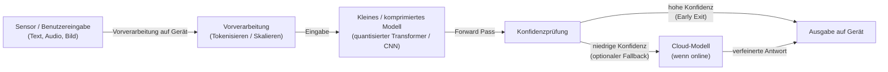

# Edge Reasoning

## Definition

Edge Reasoning bezeichnet die Durchführung von KI-Inferenz und leichtgewichtigem Reasoning auf **Edge-Geräten** — Smartphones, IoT-Gateways, Industriesensoren, Fahrzeugcomputer, Smart-Kameras und Wearables — anstatt Daten zur Verarbeitung an einen Cloud-Server weiterzuleiten. Das Ziel ist es, akzeptabel intelligentes Verhalten zu erzielen und dabei die harten Einschränkungen der Edge-Hardware zu respektieren: begrenztes DRAM (typischerweise 2–16 GB), batteriebegrenzte Rechenleistung, intermittierende oder keine Internetverbindung und strenge Latenzanforderungen in Millisekunden statt Sekunden.

Der Unterschied zur [lokalen Inferenz](/docs/local-inference) liegt im Umfang und der Hardware-Klasse: Lokale Inferenz zielt typischerweise auf Entwickler-Laptops, Workstations oder On-Premises-Server mit ausreichend Speicher und dedizierten GPUs. Edge Reasoning operiert auf deutlich eingeschränkterer Hardware — einem Mikrocontroller mit 256 KB RAM, einer NPU im SoC eines Telefons (Apple Neural Engine, Qualcomm Hexagon) oder einem stromsparenden ARM-Gerät ohne diskrete GPU. Nützliches Reasoning auf solcher Hardware zu erreichen erfordert eine Kombination aus kleinen oder destillierten [LLMs](/docs/llms), aggressiver [Quantisierung](/docs/quantization) und [Pruning](/docs/pruning), hardware-bewussten Laufzeitumgebungen (TFLite, ONNX Runtime Mobile, Core ML) und Reasoning-Strategien wie Early Exit und Speculative Decoding.

Anwendungen reichen von offline-fähigen Sprachassistenten und Wearables bis hin zu autonomen Fahrzeugen, die ohne Cloud-Roundtrip reagieren müssen, datenschutzorientierten Gesundheitsmonitoren, die sensible biometrische Daten auf dem Gerät behalten, und Industrieanlagen, die Fehler am Edge einer Fabrikhalle ohne zuverlässiges Netzwerk klassifizieren müssen.

## Funktionsweise

### Edge-Inferenz-Pipeline



### Reasoning-Strategien am Edge


### Schlüsseltechniken

**Modell-Destillation** — ein kleines Schülermodell trainieren, um ein großes Lehrermodell nachzuahmen; siehe [Wissensdestillation](/docs/knowledge-distillation). **Quantisierung** — INT8- oder INT4-Gewichte und -Aktivierungen reduzieren Speicher und Rechenleistung; siehe [Quantisierung](/docs/quantization). **Strukturiertes Pruning** — Kanäle oder Heads entfernen für hardware-effiziente Sparsität; siehe [Pruning](/docs/pruning). **Early Exit** — Klassifikatoren an Zwischenschichten anbringen; beenden, wenn die Konfidenz ausreicht, um alle Schichten zu vermeiden. **Speculative Decoding** — kleines On-Device-Entwurfsmodell generiert Token, die ein größeres Modell verifiziert, was die Verifikationskosten amortisiert.

## Wann verwenden / Wann NICHT verwenden

| Szenario | Edge Reasoning verwenden | Edge Reasoning NICHT verwenden |
|----------|-------------------|-----------------------------|
| Offline oder unzuverlässige Konnektivität | Ja — keine Cloud-Abhängigkeit | |
| Ultra-niedrige Latenz (unter 100ms Antwort) | Ja — kein Netzwerk-Roundtrip | |
| Datenschutzsensible Daten, die auf dem Gerät bleiben müssen | Ja — Daten werden nie übertragen | |
| Bandbreitenbeschränkte Bereitstellungen (IoT, entfernte Sensoren) | Ja — lokal verarbeiten, nur Ergebnisse senden | |
| Frontier-Modell-Qualität für komplexes Reasoning erforderlich | | Cloud-LLMs sind deutlich leistungsfähiger |
| Modell benötigt mehr Speicher als Gerät-DRAM | | Lokale Inferenz auf einem GPU-Server ist erforderlich |
| Häufige Modell-Updates erforderlich | | Cloud-Modelle können ohne Geräte-Pushes aktualisiert werden |

## Vor- und Nachteile

| Vorteile | Nachteile |
|------|------|
| Niedrige Latenz — kein Roundtrip zur Cloud | Kleinere Modelle; weniger leistungsfähig als große Cloud-LLMs |
| Funktioniert offline und bei schlechter Konnektivität | Hardware-Einschränkungen (Speicher, Strom, thermisches Budget) |
| Daten bleiben auf dem Gerät für starken Datenschutz | Kompromiss zwischen Modellgröße und Reasoning-Qualität |
| Geringere Bandbreite und Cloud-Kosten | Erfordert erheblichen [Quantisierungs](/docs/quantization)- und [Komprimierungs](/docs/model-compression)-Aufwand |

## Code-Beispiele

```python
# Load a quantized model with TensorFlow Lite for on-device inference
import numpy as np
import tensorflow as tf

# Load .tflite model (e.g. MobileNetV3 or a distilled transformer)
interpreter = tf.lite.Interpreter(model_path="model_int8.tflite")
interpreter.allocate_tensors()

input_details = interpreter.get_input_details()
output_details = interpreter.get_output_details()

# Prepare input (e.g. a preprocessed sensor reading or tokenized text)
input_data = np.array([[0.1, 0.5, 0.3, 0.8]], dtype=np.float32)
interpreter.set_tensor(input_details[0]["index"], input_data)

# Run inference
interpreter.invoke()
output = interpreter.get_tensor(output_details[0]["index"])
predicted_class = np.argmax(output)
print(f"Predicted class: {predicted_class}")
```

## Tipps für effektive Nutzung

- Speicher und Latenz auf dem tatsächlichen Zielgerät früh profilieren — Desktop-Benchmarks übertragen sich selten auf Edge-Hardware.
- Hardware-spezifische Laufzeitumgebungen für beste Leistung verwenden (Core ML auf Apple, SNPE auf Qualcomm, TFLite auf Android).
- Einen eleganten Fallback entwerfen: erst auf Gerät versuchen, bei zu geringer Konfidenz oder zu komplexer Aufgabe auf Cloud zurückfallen.
- Strukturiertes Pruning gegenüber unstrukturiertem für Edge-Modelle bevorzugen — kleinere dichte Matrizen laufen auf NPUs schneller als sparse Matrizen.
- Genauigkeit auf Daten bewerten, die Edge-Bedingungen (verrauschte Sensoren, unterschiedliche Beleuchtung) repräsentieren, nicht nur Labor-Benchmarks.

## Praktische Ressourcen

- [TensorFlow Lite — On-device inference](https://www.tensorflow.org/lite/guide) — Modellkonvertierung, Quantisierung und Bereitstellung auf Mobile/Embedded
- [ONNX Runtime — Mobile and edge](https://onnxruntime.ai/docs/tutorials/mobile/) — Plattformübergreifende On-Device-Inferenz
- [Apple — Core ML and MLX](https://developer.apple.com/machine-learning/) — On-Device ML auf Apple Silicon (iPhone, iPad, Mac)
- [Google — ML Kit](https://developers.google.com/ml-kit) — Fertige ML-APIs für Android und iOS
- [Qualcomm — AI Hub](https://aihub.qualcomm.com/) — Für Snapdragon NPU optimierte Modelle

## Siehe auch

- [Lokale Inferenz](/docs/local-inference)
- [Modellkomprimierung](/docs/model-compression)
- [Quantisierung](/docs/quantization)
- [Pruning](/docs/pruning)
- [Wissensdestillation](/docs/knowledge-distillation)
- [Reasoning-Muster](/docs/reasoning-patterns)
