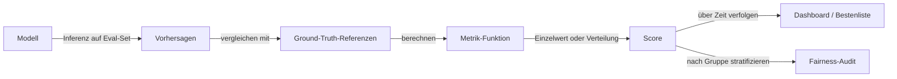

# Evaluierungsmetriken

## Definition

Evaluierungsmetriken sind die quantitativen Werkzeuge, die anzeigen, wie gut ein Modell eine gegebene Aufgabe bewältigt — und ob es sich verbessert, verschlechtert oder die für die Bereitstellung erforderliche Hürde erfüllt. Die Wahl der Metrik bestimmt direkt, was Sie beim Training optimieren und was Sie beim Vergleich von Modellen berichten. Die falsche Metrik zu verwenden kann blinde Flecken erzeugen: ein Modell mit 99% Genauigkeit auf einem klassenunbalancierten Datensatz kann schlechter abschneiden als eine Zufalls-Baseline bei der Minderheitsklasse; ein hoher BLEU-Score garantiert nicht, dass eine Übersetzung flüssig oder treu ist.

Metriken variieren nach Aufgabenfamilie. Für **Klassifizierung** sind die Hauptmetriken Genauigkeit, Präzision, Recall, F1 und AUC-ROC — jede erfasst einen anderen Kompromiss zwischen falsch-positiven und falsch-negativen Ergebnissen. Für **Generierungs**-Aufgaben (Übersetzung, Zusammenfassung, Textgenerierung) messen n-Gramm-Überlappungsmetriken wie BLEU und ROUGE oberflächliche Ähnlichkeit zu Referenzausgaben; BERTScore und gelernte Metriken (z. B. FActScore) bewerten semantische Treue. Für **Retrieval** messen precision@k, recall@k und MRR (Mean Reciprocal Rank), wie gut ein System relevante Dokumente findet. Für **LLMs** bei offener Generierung sind automatisierte Metriken oft unzureichend — menschliche Präferenzbewertungen (gesammelt durch paarweise Vergleiche) bleiben der Goldstandard für Qualität, Ton und Hilfsbereitschaft.

Evaluierung verbindet sich direkt mit [Benchmarks](/docs/benchmarks) — standardisierten Datensätzen und Protokollen, die reproduzierbare Vergleiche über Modelle hinweg ermöglichen — und mit [Bias in KI](/docs/bias-in-ai), wo Fairness-Metriken Standard-Metriken nach demografischer Gruppe stratifizieren, um ungleiche Leistung zu erkennen. In der Produktion endet die Evaluierung nicht beim Modell-Launch: A/B-Tests, Überwachungs-Dashboards und periodische Audits verfolgen Metrik-Drift und erkennen Regressionen oder Verteilungsverschiebungen über die Zeit.

## Funktionsweise

### Metrik-Berechnung



### Klassifizierungsmetriken im Detail

Für binäre Klassifizierung ist die Konfusionsmatrix (TP, TN, FP, FN) die Grundlage. **Präzision** = TP / (TP + FP) — wenn das Modell positiv sagt, wie oft stimmt es? **Recall** = TP / (TP + FN) — von allen tatsächlichen Positiven, wie viele hat das Modell erfasst? **F1** ist ihr harmonisches Mittel und balanciert beide. **AUC-ROC** misst die Ranking-Fähigkeit des Modells über alle Schwellen hinweg, invariant gegenüber Klassenungleichgewicht. Für Mehrklassen-Probleme behandelt Makro-Mittelung alle Klassen gleich; Mikro-Mittelung gewichtet nach Klassenhäufigkeit.

### Generierungsmetriken im Detail

BLEU zählt n-Gramm-Überlappungen zwischen einer Modellausgabe und einer oder mehreren Referenzen und bestraft Ausgaben kürzer als die Referenz (Brevity Penalty). ROUGE-L misst die längste gemeinsame Teilsequenz. Beide sind schnell und deterministisch, belohnen aber oberflächliche Überlappung, nicht semantische Korrektheit. **BERTScore** verwendet vortrainierte Embeddings, um Bedeutung zu vergleichen. **Menschliche Evaluierung** (ausgelagerte paarweise Vergleiche oder Expertenbewertungen zu Dimensionen wie Flüssigkeit, Faktizität und Hilfsbereitschaft) liefert das zuverlässigste Signal für offene Generierung, ist aber langsam und teuer.

## Wann verwenden / Wann NICHT verwenden

| Verwenden wenn | Vermeiden wenn |
|----------|------------|
| Modelle trainiert oder verglichen werden, wo eine klare Ground Truth existiert | Keine zuverlässige Ground Truth vorhanden ist und stattdessen menschliches Urteil benötigt wird |
| Qualität über Zeit in der Produktionsüberwachung verfolgt wird | Eine einzelne aggregierte Metrik wichtige Subgruppen-Fehler verbergen würde |
| Fairness oder Sicherheit durch Stratifizierung von Metriken über Gruppen geprüft wird | Die Metrik nicht dem Produktziel entspricht (z. B. BLEU optimieren, wenn Benutzer Flüssigkeit schätzen) |
| Automatisierte [Benchmark](/docs/benchmarks)-Evaluierungen für reproduzierbare Vergleiche ausgeführt werden | Die Aufgabe so offen ist, dass automatisierte Metriken schlecht mit menschlichem Urteil korrelieren |

## Vergleiche

| Aufgabe | Gängige Metriken | Wann menschliche Evaluierung benötigt wird |
|------|---------------|--------------------------|
| Binäre Klassifizierung | Genauigkeit, F1, AUC-ROC | Selten — Metriken sind klar definiert |
| Multi-Label-Klassifizierung | Mikro/Makro F1, Subset-Genauigkeit | Wenn die Label-Taxonomie mehrdeutig ist |
| Übersetzung / Zusammenfassung | BLEU, ROUGE, BERTScore | Wenn Flüssigkeit oder Faktizität kritisch wichtig ist |
| Retrieval / RAG | Recall@k, MRR, NDCG | Wenn Relevanz subjektiv ist |
| Offene LLM-Generierung | LLM-als-Richter, menschliche Präferenz | Fast immer für Qualitätsbewertung |

## Vor- und Nachteile

| Vorteile | Nachteile |
|------|------|
| Automatisierte Metriken ermöglichen schnelle, günstige, reproduzierbare Evaluierung | Stimmen möglicherweise nicht mit echter Benutzerzufriedenheit oder Produktzielen überein |
| Ermöglichen systematische Vergleiche über Modellversionen und Durchläufe | Eine einzelne Metrik kann Fehler bei wichtigen Subgruppen verbergen |
| Fairness-Metriken zeigen ungleiche Leistung vor der Bereitstellung auf | Eine Metrik zu spielen ist einfacher als die zugrunde liegende Qualität zu verbessern |
| Produktionsmetriken erfassen Drift und Regressionen in bereitgestellten Systemen | Menschliche Evaluierung ist teuer und schwer zu skalieren |

## Code-Beispiele

### Klassifizierungsmetriken mit scikit-learn (Python)

```python
from sklearn.metrics import (
    classification_report,
    roc_auc_score,
    confusion_matrix,
)
import numpy as np

# Simulated predictions
np.random.seed(0)
y_true = np.random.randint(0, 2, size=200)
y_pred = np.where(np.random.rand(200) > 0.3, y_true, 1 - y_true)  # ~70% accurate
y_prob = np.clip(y_pred + np.random.randn(200) * 0.2, 0, 1)

print("Classification report:")
print(classification_report(y_true, y_pred, target_names=["negative", "positive"]))

print(f"AUC-ROC: {roc_auc_score(y_true, y_prob):.4f}")
print(f"Confusion matrix:\n{confusion_matrix(y_true, y_pred)}")
```

## Praktische Ressourcen

- [Hugging Face – Evaluate Bibliothek](https://huggingface.co/docs/evaluate/) — Einheitliche Bibliothek für 50+ Metriken mit konsistenter API
- [Papers with Code – Metriken](https://paperswithcode.com/task/image-classification) — Metrik-Definitionen verknüpft mit Benchmark-Ergebnissen
- [BERTScore Paper (Zhang et al., 2019)](https://arxiv.org/abs/1904.09675) — Embedding-basierte Generierungsevaluierung
- [BLEU: A Method for Automatic Evaluation of Machine Translation](https://aclanthology.org/P02-1040/) — Originales BLEU-Paper
- [Evaluation of Large Language Models (Umfrage)](https://arxiv.org/abs/2307.03109) — Umfassender Überblick über LLM-Evaluierungsansätze

## Siehe auch

- [Benchmarks](/docs/benchmarks)
- [Bias in KI](/docs/bias-in-ai)
