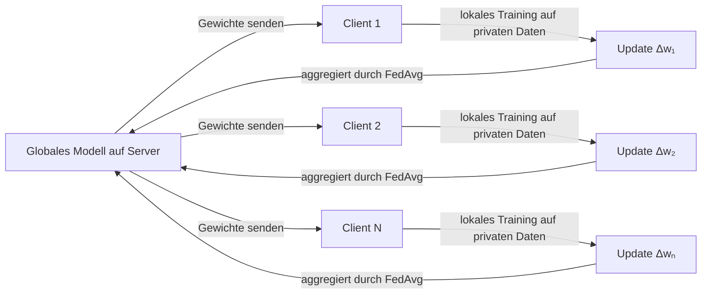

# Föderiertes Lernen

## Definition

Föderiertes Lernen (FL) ist ein verteiltes Machine-Learning-Paradigma, bei dem ein Modell über viele Geräte oder Organisationssilos hinweg trainiert wird, ohne dass die Rohdaten jemals ihre Quelle verlassen. Anstatt sensible Daten auf einem Server zu zentralisieren, trainiert jeder Teilnehmer lokal und teilt nur Modell-Updates — Gradienten oder Gewichts-Deltas — mit einem zentralen Koordinator. Der Koordinator aggregiert diese Updates, um ein gemeinsames globales Modell zu verbessern, und verteilt es dann für die nächste Runde.

Der Ansatz wurde von Google (McMahan et al., 2017) eingeführt, um Nächstes-Wort-Vorhersage-Modelle auf Android-Telefonen zu trainieren, ohne Benutzertastenanschläge hochzuladen. Der wichtigste Datenschutzvorteil besteht darin, dass Rohdaten auf dem Gerät oder innerhalb der Organisationsgrenze verbleiben. Allerdings können Modell-Updates durch Inferenzangriffe noch Informationen über Trainingsdaten preisgeben; Techniken wie **Differentieller Datenschutz** (Hinzufügen von kalibriertem Rauschen zu Updates) und **Sichere Aggregation** (kryptografische Aggregation, die verhindert, dass der Server individuelle Updates sieht) bieten stärkere Garantien.

Föderiertes Lernen wird eingesetzt, wenn Daten rechtlich, ethisch oder praktisch nicht gebündelt werden können — Gesundheitseinrichtungen, die an Diagnosemodellen zusammenarbeiten, Banken, die betrugserkenner über Filialen hinweg trainieren, oder Smartphones, die On-Device-Sprachmodelle verbessern. Es überschneidet sich mit [Machine-Learning](/docs/fundamentals/machine-learning)-Grundlagen und wirft wichtige Bedenken auf, die in [KI-Ethik](/docs/ai-ethics) diskutiert werden. Schlüsselherausforderungen umfassen **statistische Heterogenität** (nicht-IID-Daten über Clients), **System-Heterogenität** (variierende Gerätekompetenz und -verfügbarkeit) und **Kommunikationseffizienz** (Minimierung der Bandbreite für Update-Übertragung).

## Funktionsweise

### Die föderierte Runde

Jede Trainingsrunde folgt demselben Muster: Der Server sendet das aktuelle globale Modell aus, ausgewählte Clients trainieren lokal, und ihre Updates werden zurückgesendet und aggregiert.



### FedAvg-Aggregation

Der häufigste Aggregationsalgorithmus, **FedAvg**, berechnet einen gewichteten Durchschnitt der Client-Modellgewichte, wobei jeder Client nach der Größe seines lokalen Datensatzes gewichtet wird:

```
w_global = Σ (nₖ / n_total) · wₖ
```

Clients führen mehrere lokale SGD-Schritte aus, bevor sie Updates senden, was die Anzahl der Kommunikationsrunden reduziert.

### Datenschutz-Verbesserungen

**Differentieller Datenschutz (DP)** schneidet den Gradienten jedes Clients ab und fügt vor der Übertragung Gaußsches Rauschen hinzu, was den Einfluss begrenzt, den die Daten eines einzelnen Benutzers auf das Modell haben können. **Sichere Aggregation** verwendet kryptografische Protokolle, sodass der Server nur die Summe der Updates sieht, nie individuelle Client-Updates.

### Herausforderungen

**Nicht-IID-Daten** bedeuten, dass lokale Datensätze stark verzerrt sein können (z. B. ein Krankenhaus, das nur seltene Krankheiten sieht), was dazu führt, dass lokale Modelle vom globalen Optimum abweichen. Algorithmen wie FedProx und SCAFFOLD fügen proximale Terme oder Kontrollvariaten hinzu, um diese Drift entgegenzuwirken. **Client-Dropout** (Geräte gehen während einer Runde offline) erfordert robuste Aggregation, die partielle Teilnahme handhabt.

## Wann verwenden / Wann NICHT verwenden

| Szenario | Föderiertes Lernen verwenden | Föderiertes Lernen vermeiden |
|---|---|---|
| Daten können ihre Quelle nicht verlassen (rechtlich, regulatorisch) | Ja — Kernanwendungsfall | Nein — wenn Daten gebündelt werden können, ist zentralisiertes Training einfacher |
| Mobile/Edge-Geräte mit lokalen Daten | Ja — Telefone, Wearables, IoT-Sensoren | Nein — wenn Geräte keine Rechenleistung für lokales Training haben |
| Cross-Organisation-Zusammenarbeit bei sensiblen Daten | Ja — Krankenhäuser, Banken, Regierungsbehörden | Nein — wenn Organisationen nicht einmal Modell-Updates teilen wollen |
| Kleine Anzahl von Teilnehmern mit stabilen Verbindungen | Teilweise — FL funktioniert, fügt aber Overhead hinzu | Zentralisiertes Training bevorzugen, wenn Datenteilung erlaubt ist |
| Echtzeit, niedrig-latente Modell-Updates | Nein — Multi-Runden-Kommunikation fügt Verzögerung hinzu | — |

## Vergleiche

| Ansatz | Datenlage | Datenschutz | Kommunikationskosten | Skalierbarkeit |
|---|---|---|---|---|
| Zentralisiertes Training | Zentraler Server | Niedrig (Daten exponiert) | Niedrig | Hoch |
| Föderiertes Lernen | Auf Gerät / Silo | Mittel–Hoch | Hoch | Mittel |
| Split Learning | Verteilte Schichten | Mittel | Mittel | Mittel |
| FL + Differentieller Datenschutz | Auf Gerät / Silo | Hoch | Hoch | Mittel |

## Vor- und Nachteile

| Vorteile | Nachteile |
|---|---|
| Rohdaten verlassen nie das Gerät oder die Organisation | Modell-Updates können noch private Informationen preisgeben |
| Ermöglicht Zusammenarbeit ohne Datenteilung | Nicht-IID-Daten verursachen Client-Drift und verschlechtern die Konvergenz |
| Skaliert auf Millionen von Geräten (z. B. Android) | Hoher Kommunikationsaufwand über viele Runden |
| Kompatibel mit Differentiellem Datenschutz für stärkere Garantien | Nachzügler und abgestürzte Clients erschweren die Aggregation |

## Code-Beispiele

Simuliertes föderiertes Training mit FedAvg mit Flower:

```python
import flwr as fl
import torch
import torch.nn as nn
from torch.utils.data import DataLoader, TensorDataset

# Simple model
class Net(nn.Module):
    def __init__(self):
        super().__init__()
        self.fc = nn.Linear(20, 1)
    def forward(self, x):
        return self.fc(x)

# Flower client: wraps local training
class FedClient(fl.client.NumPyClient):
    def __init__(self, data):
        self.model = Net()
        self.loader = DataLoader(data, batch_size=32, shuffle=True)

    def get_parameters(self, config):
        return [p.detach().numpy() for p in self.model.parameters()]

    def set_parameters(self, parameters):
        for p, w in zip(self.model.parameters(), parameters):
            p.data = torch.tensor(w)

    def fit(self, parameters, config):
        self.set_parameters(parameters)
        opt = torch.optim.SGD(self.model.parameters(), lr=0.01)
        loss_fn = nn.MSELoss()
        for x, y in self.loader:
            opt.zero_grad()
            loss_fn(self.model(x), y).backward()
            opt.step()
        return self.get_parameters(config), len(self.loader.dataset), {}

    def evaluate(self, parameters, config):
        self.set_parameters(parameters)
        # Simplified: return dummy loss
        return 0.0, len(self.loader.dataset), {"accuracy": 0.0}

# Simulate client with synthetic data
data = TensorDataset(torch.randn(100, 20), torch.randn(100, 1))
client = FedClient(data)

# Start Flower client (connect to a running Flower server)
# fl.client.start_numpy_client(server_address="localhost:8080", client=client)
print("Client ready. In a real scenario, call fl.client.start_numpy_client().")
```

## Praktische Ressourcen

- [Communication-Efficient Learning of Deep Networks (McMahan et al., 2017)](https://arxiv.org/abs/1602.05629) — Originales FedAvg-Paper von Google
- [TensorFlow Federated](https://www.tensorflow.org/federated) — Googles Open-Source-Framework für föderierte Berechnungen
- [Flower (flwr)](https://flower.dev/) — Framework-agnostische FL-Bibliothek mit Unterstützung für PyTorch, TensorFlow, JAX
- [PySyft](https://github.com/OpenMined/PySyft) — Datenschutzerhaltende ML mit Differentiellem Datenschutz und sicherer Aggregation

## Siehe auch

- [Machine Learning](/docs/fundamentals/machine-learning)
- [Datenschutz und KI-Ethik](/docs/ai-ethics)
