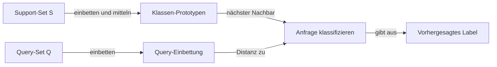
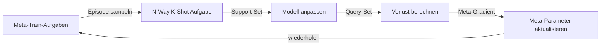

# Few-Shot Learning

## Definition

Few-Shot Learning ist die Fähigkeit eines Modells, auf neue Aufgaben oder Klassen aus einer sehr kleinen Anzahl beschrifteter Beispiele zu verallgemeinern — typischerweise 1 bis 5 pro Klasse (1-Shot, 5-Shot). Anstatt Hunderte oder Tausende beschrifteter Stichproben zu benötigen, nutzen Few-Shot-Lernsysteme Vorwissen (aus Vor-Training oder Meta-Training), um maximale Information aus minimalen Daten zu extrahieren. Die Herausforderung unterscheidet sich vom Standard-Supervised-Learning: Das Modell muss sich zur Testzeit **schnell anpassen**, nicht nur einen großen Trainingssatz anpassen.

Zwei Hauptparadigmen haben sich herausgebildet. **Meta-Learning** (Lernen zu lernen) trainiert Modelle über viele verschiedene Few-Shot-Aufgaben aus einem Meta-Train-Set, sodass das Modell explizit lernt, wie es sich anpassen kann. MAML (Model-Agnostic Meta-Learning) optimiert für eine Parameterinitialisierung, die in wenigen Gradientenschritten auf jede neue Aufgabe fine-getuned werden kann. **Metrikbasierte** Methoden (Prototypische Netze, Matching Networks) lernen einen Einbettungsraum, wo Klassifikation auf Nearest-Neighbor-Suche relativ zu Klassen-Prototypen reduziert wird, die aus Support-Beispielen berechnet werden.

Das dritte Paradigma — **In-Context Learning** — ist spezifisch für große [LLMs](/docs/llms): Die Support-Beispiele werden einfach als Demonstrationen dem Prompt vorangestellt, und das Modell konditioniert darauf ohne Gradient-Updates. GPT-3 hat diesen Ansatz populär gemacht und demonstriert, dass ausreichend große Sprachmodelle neue Aufgaben aus nur einer Handvoll Beispiele im Kontextfenster durchführen können. Few-Shot Learning liegt zwischen [Transfer Learning](/docs/transfer-learning) (das mehr beschriftete Zieldaten erfordert) und [Zero-Shot Learning](/docs/zero-shot-learning) (das keine benötigt).

## Funktionsweise

### Episodische Aufgabenstruktur

Jede Few-Shot-Aufgabe wird durch ein **Support-Set** (N Klassen × K Beispiele = N-Way K-Shot) und ein **Query-Set** (zu klassifizierende Beispiele) definiert. Das Modell passt sich an das Support-Set an und sagt Labels für das Query-Set vorher.

### Meta-Learning (MAML)

MAML lernt eine Modellinitialisierung θ, sodass einige Gradientenschritte auf dem Support-Set jeder neuen Aufgabe gute Leistung auf dem Query-Set dieser Aufgabe ergibt. Das Meta-Ziel ist: θ aktualisieren, sodass θ − α·∇L_task über alle gesampelten Aufgaben gut ist.

### Metrikbasierte Methoden

Prototypische Netze berechnen einen **Prototyp** für jede Klasse, indem der Durchschnitt der Einbettungen ihrer Support-Beispiele genommen wird. Query-Beispiele werden nach ihrer Distanz zum nächsten Prototyp im Einbettungsraum klassifiziert.

### In-Context Few-Shot (LLMs)

Es finden keine Gradient-Updates statt. Der Prompt enthält die Support-Beispiele als Demonstrationen formatiert, und das Modell vervollständigt die Anfrage basierend auf Mustererkennung aus dem Vor-Training.



### Episodisches Training



## Wann verwenden / Wann NICHT verwenden

| Szenario | Few-Shot Learning verwenden | Few-Shot Learning vermeiden |
|---|---|---|
| Nur 1–20 beschriftete Beispiele pro Klasse | Ja — speziell für Datenmangel | Nein — Standard Supervised Learning wenn Daten ausreichend |
| LLM-Inferenz mit Beispielen im Prompt | Ja — In-Context Few-Shot ist bei Inferenz kostenlos | Nein — Fine-Tuning ist besser für konsistente, hochvolumige Aufgaben |
| Schnelle Anpassung an neue Klassen ohne Neutraining | Ja — prototypische Netze oder MAML | Nein — wenn neue Klassen stabil sind und beschriftete Daten gesammelt werden können |
| Völlig neue Domäne ohne vortrainiertes Modell | Nein — Vor-Training ist eine Voraussetzung | — |
| Hohe Genauigkeit auf einem festen, gut beschrifteten Datensatz | Nein — Supervised Learning übertrifft | — |

## Vergleiche

| Ansatz | Benötigte Beispiele | Anpassungsmechanismus | Gradient-Updates zur Testzeit |
|---|---|---|---|
| Zero-Shot Learning | 0 | Prompt / Textbeschreibung | Nein |
| Few-Shot Learning (In-Context) | 1–10 | In-Context-Demonstrationen | Nein |
| Few-Shot Learning (MAML) | 1–10 | Innere Schleife Gradientenschritte | Ja (wenige Schritte) |
| Transfer Learning / Fine-Tuning | 100–10K+ | Voll oder partielles Fine-Tuning | Ja (viele Schritte) |
| Supervised Learning | 1K–1M+ | Standard SGD | Ja |

## Vor- und Nachteile

| Vorteile | Nachteile |
|---|---|
| Verallgemeinert auf neue Aufgaben mit minimalen beschrifteten Daten | Leistung typischerweise unter vollständig überwachten Ansätzen |
| In-Context Few-Shot erfordert kein Training — nur Prompting | Sensitiv gegenüber Prompt-Format und Beispielreihenfolge bei LLMs |
| Meta-Learning ermöglicht schnelle Anpassung über Domänen | Meta-Training ist rechenintensiv (viele Aufgaben erforderlich) |
| Nützlich für seltene Kategorien und Personalisierung | Support-Set-Qualität beeinflusst Vorhersagen stark |

## Code-Beispiele

Prototypisches Netzwerk-Inferenz (Few-Shot-Bildklassifizierung):

```python
import torch
import torch.nn as nn

class PrototypicalNet(nn.Module):
    """Simple CNN encoder for few-shot image classification."""
    def __init__(self, embedding_dim=64):
        super().__init__()
        self.encoder = nn.Sequential(
            nn.Conv2d(1, 32, 3, padding=1), nn.ReLU(), nn.MaxPool2d(2),
            nn.Conv2d(32, 64, 3, padding=1), nn.ReLU(), nn.AdaptiveAvgPool2d(4),
            nn.Flatten(),
            nn.Linear(64 * 4 * 4, embedding_dim),
        )

    def forward(self, x):
        return self.encoder(x)

def prototypical_predict(model, support_images, support_labels, query_images, n_classes):
    """
    support_images: (N*K, C, H, W) — K examples per class, N classes
    support_labels: (N*K,)
    query_images:   (Q, C, H, W)
    Returns predicted labels for query_images.
    """
    model.eval()
    with torch.no_grad():
        support_emb = model(support_images)   # (N*K, D)
        query_emb   = model(query_images)     # (Q, D)

        # Compute class prototypes (mean embedding per class)
        prototypes = torch.stack([
            support_emb[support_labels == c].mean(0)
            for c in range(n_classes)
        ])  # (N, D)

        # Euclidean distance from each query to each prototype
        dists = torch.cdist(query_emb, prototypes)  # (Q, N)
        return dists.argmin(dim=1)  # Nearest prototype = predicted class

# Example: 5-way 1-shot, 10 query images (28x28 grayscale)
model = PrototypicalNet(embedding_dim=64)
support = torch.randn(5, 1, 28, 28)   # 1 example per class
labels  = torch.arange(5)             # Classes 0–4
queries = torch.randn(10, 1, 28, 28)

preds = prototypical_predict(model, support, labels, queries, n_classes=5)
print("Predicted labels:", preds)
```

In-Context Few-Shot mit einem LLM über die OpenAI API:

```python
from openai import OpenAI

client = OpenAI()

# 3-shot sentiment classification via chat messages
response = client.chat.completions.create(
    model="gpt-4o-mini",
    messages=[
        {"role": "system", "content": "Classify the sentiment as positive or negative."},
        {"role": "user",   "content": "Review: 'Absolutely loved this movie!' Sentiment:"},
        {"role": "assistant", "content": "positive"},
        {"role": "user",   "content": "Review: 'Terrible experience, never coming back.' Sentiment:"},
        {"role": "assistant", "content": "negative"},
        {"role": "user",   "content": "Review: 'Best product I have ever bought.' Sentiment:"},
        {"role": "assistant", "content": "positive"},
        {"role": "user",   "content": "Review: 'Waste of money, very disappointed.' Sentiment:"},
    ]
)
print(response.choices[0].message.content)  # Expected: negative
```

## Praktische Ressourcen

- [Model-Agnostic Meta-Learning (MAML) (Finn et al., 2017)](https://arxiv.org/abs/1703.03400) — Grundlegendes Meta-Learning-Paper für schnelle Few-Shot-Anpassung
- [Prototypical Networks (Snell et al., 2017)](https://arxiv.org/abs/1703.05175) — Einfache und effektive metrikbasierte Few-Shot-Klassifizierung
- [Language Models are Few-Shot Learners (Brown et al., 2020)](https://arxiv.org/abs/2005.14165) — GPT-3-Paper, das In-Context Few-Shot Learning im großen Maßstab demonstriert
- [learn2learn Bibliothek](https://learn2learn.net/) — PyTorch-Toolkit für Meta-Learning-Algorithmen einschließlich MAML

## Siehe auch

- [Zero-Shot Learning](/docs/zero-shot-learning)
- [LLMs](/docs/llms)
- [Transfer Learning](/docs/transfer-learning)
