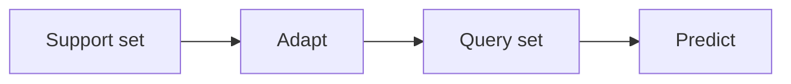

# Few-Shot Learning

## Definition

Few-Shot-Lernen zielt darauf ab, sich schnell aus einer kleinen Anzahl gelabelter Beispiele anzupassen (z. B. 1–5 pro Klasse). Meta-learning (z. B. MAML) trains models to be good at few-shot adaptation.

Es befindet sich zwischen [transfer learning](/docs/transfer-learning) (mehr Zieldaten) and [zero-shot](/docs/zero-shot-learning) (keine Zielbeispiele). [LLMs](/docs/llms) do few-shot implicitly via in-context examples in the prompt; classical few-shot uses episodic meta-training (z. B. MAML) sodass das model learns to adapt from a Support-Set.

## Funktionsweise

Each task has a **Support-Set** (wenige gelabelte Beispiele, z. B. 1–5 pro Klasse) and a **Query-Set** (vorherzusagende Beispiele). **Adapt**: the model uses the Support-Set to adapt (z. B. compute prototypes, or take a few gradient steps in MAML). **Predict**: the adapted model predicts labels für den Query-Set. **Episodic training**: sample many few-shot tasks from a meta-train set; für jeden, adapt auf dem task Support-Set and optimize so that predictions auf dem Query-Set improve. At test time, the model gets a new task’s Support-Set and predicts on its Query-Set. For LLMs, "adapt" is just conditioning auf dem support examples in the prompt (in-context few-shot).

## Anwendungsfälle

Few-shot learning gilt, wenn you have only a handful of examples pro Klasse or task (including in-context LLM prompts).

- Classifying rare classes with only a wenige gelabelte Beispiele
- LLM in-context learning (z. B. 1–5 examples in the prompt)
- Rapid adaptation in robotics or personalization mit minimalem data

## Externe Dokumentation

- [Model-Agnostic Meta-Learning (MAML) (Finn et al.)](https://arxiv.org/abs/1703.03400)
- [Hugging Face – Few-shot learning](https://huggingface.co/docs/transformers/tasks/summarization#few-shot-summarization)

## Siehe auch

- [Zero-shot learning](/docs/zero-shot-learning)
- [LLMs](/docs/llms)
- [Transfer learning](/docs/transfer-learning)
