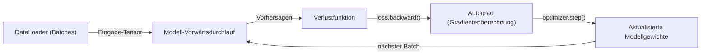
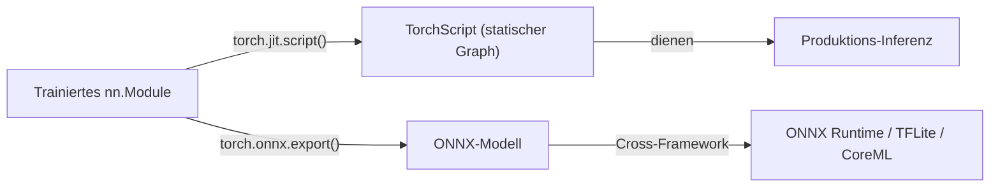

# PyTorch

## Definition

PyTorch ist ein Python-first-[Deep-Learning](/docs/fundamentals/deep-learning)-Framework, das von Meta AI entwickelt wurde und durch dynamische Berechnungsgraphen und ein imperatives Programmiermodell gekennzeichnet ist. Jede Operation wird sofort ausgeführt (Eager-Modus), und der Berechnungsgraph für die Rückwärtspropagation wird on-the-fly aufgebaut. Dies macht es einfach, neuronalen Netzwerkcode mit Standard-Python-Tools zu schreiben, auszuführen und zu debuggen — Print-Anweisungen, Debugger und der Python-REPL funktionieren genau wie erwartet.

PyTorch ist zum dominanten Framework in der Forschung geworden und bildet das Fundament des modernen ML-Ökosystems: Die Transformers-Bibliothek von [Hugging Face](/docs/tools/huggingface) verwendet standardmäßig PyTorch, die meisten akademischen Paper veröffentlichen PyTorch-Implementierungen, und Bibliotheken wie torchvision, torchaudio, torchtext und PyTorch Geometric erweitern es auf Computer Vision, Audio, Text und Graph-Domänen. Das Framework unterstützt CPU, GPU, Apple Silicon (MPS-Backend) und Multi-GPU-Training über `torch.distributed`, mit Higher-Level-Wrappern wie HuggingFace Accelerate und PyTorch Lightning, die verteilte Boilerplate reduzieren.

Verglichen mit [TensorFlow](/docs/frameworks/tensorflow) wird PyTorch für Forschung und schnelles Prototyping aufgrund seiner Python-nativen Debugging-Erfahrung und schnelleren Iterationszyklen bevorzugt. TensorFlow behält einen Vorteil bei Mobile-Deployment (TFLite), TPU-Training und Produktions-Pipeline-Tooling. Für Deployment bietet PyTorch TorchScript (statischer Graph für Produktion), ONNX-Export (Cross-Framework-Interoperabilität) und PyTorch Mobile. Die meiste [LLM](/docs/llms)-Training- und Fine-Tuning-Arbeit findet in PyTorch über das HuggingFace-Ökosystem statt.

## Funktionsweise

### Trainingsschleife



### Deployment-Pipeline



### Wichtige Abstraktionen

**`nn.Module`** — Basisklasse für alle Modelle; `__init__` (Schichten) und `forward` (Berechnung) definieren. **`autograd`** — automatische Differentiation; `loss.backward()` berechnet Gradienten für alle Parameter. **`DataLoader`** — Batching, Mischen und Multi-Prozess-Datenladen. **`torch.optim`** — Optimierer (Adam, SGD, AdamW). **`torch.distributed`** — Daten-paralleles und Modell-paralleles verteiltes Training.

## Wann verwenden / Wann NICHT verwenden

| Szenario | PyTorch verwenden | PyTorch NICHT verwenden |
|----------|------------|-------------------|
| Forschung und Experimentieren mit neuen Architekturen | Ja — Eager-Modus, Python-natürliches Debugging | |
| HuggingFace-Modelle fine-tunen | Ja — Standard-Backend für HuggingFace | |
| LLM-Training und -Inferenz-Workloads | Ja — dominant im LLM-Ökosystem | |
| Mobile oder Edge-Deployment (iOS, Android) | | [TensorFlow Lite](/docs/frameworks/tensorflow) ist dafür ausgereifter |
| Training auf Google TPUs | | [TensorFlow](/docs/frameworks/tensorflow) oder JAX haben bessere TPU-Unterstützung |
| Produktions-ML-Pipelines mit verwaltetem Serving | | TF Serving + TFX bieten einen integriertere Stack |

## Vergleiche

| Funktion | PyTorch | TensorFlow / Keras |
|---------|---------|-------------------|
| Ausführungsmodus | Eager (Standard) + TorchScript | Eager (Standard) + tf.function |
| Debugging-Erfahrung | Python-nativ (pdb, print) | tf.function kann Fehler verschleiern |
| Forschungsannahme | Dominant | Abnehmend |
| Mobile / Edge | PyTorch Mobile (experimentell) | TFLite (erstklassig) |
| HuggingFace-Ökosystem | Standard-Backend | Unterstützt aber sekundär |
| TPU-Unterstützung | Über PyTorch/XLA | Erstklassig |
| High-Level-API | Lightning, Ignite (Drittanbieter) | Keras (eingebaut) |

## Vor- und Nachteile

| Vorteile | Nachteile |
|------|------|
| Python-natürliches Debugging mit Eager Execution | Verteiltes Training erfordert mehr manuelles Setup |
| Dominant in der Forschung; die meisten Paper veröffentlichen PyTorch-Code | Keine eingebaute High-Level-Trainings-API (Lightning oder ähnliches benötigt) |
| Fundament des HuggingFace-Ökosystems | Mobile-Deployment weniger ausgereift als TFLite |
| Flexibel; einfach benutzerdefinierte Schichten und Verluste zu implementieren | Modell-Serialisierung (TorchScript) hat Einschränkungen vs. SavedModel |

## Codebeispiele

```python
import torch
import torch.nn as nn
from torch.utils.data import DataLoader, TensorDataset

# Einfaches Feedforward-Netzwerk definieren
class MLP(nn.Module):
    def __init__(self, in_features: int, hidden: int, num_classes: int):
        super().__init__()
        self.net = nn.Sequential(
            nn.Linear(in_features, hidden),
            nn.ReLU(),
            nn.Linear(hidden, num_classes),
        )

    def forward(self, x: torch.Tensor) -> torch.Tensor:
        return self.net(x)

model = MLP(in_features=784, hidden=256, num_classes=10)
optimizer = torch.optim.AdamW(model.parameters(), lr=1e-3)
loss_fn = nn.CrossEntropyLoss()

# Explizite Trainingsschleife
for epoch in range(5):
    for x_batch, y_batch in train_loader:
        optimizer.zero_grad()
        logits = model(x_batch)
        loss = loss_fn(logits, y_batch)
        loss.backward()          # Gradienten berechnen
        optimizer.step()         # Gewichte aktualisieren

# Für Cross-Framework-Deployment exportieren
dummy_input = torch.randn(1, 784)
torch.onnx.export(model, dummy_input, "mlp.onnx")
```

## Praktische Ressourcen

- [PyTorch — Erste Schritte](https://pytorch.org/get-started/locally/) — Installation und Schnellstart
- [PyTorch-Tutorials](https://pytorch.org/tutorials/) — Offizielle Tutorials von Grundlagen bis verteiltem Training
- [PyTorch-Dokumentation](https://pytorch.org/docs/stable/) — Vollständige API-Referenz
- [HuggingFace Accelerate](https://huggingface.co/docs/accelerate) — Verteiltes und Mixed-Precision-Training-Wrapper
- [PyTorch Lightning](https://lightning.ai/docs/pytorch/stable/) — High-Level-Trainings-Framework auf Basis von PyTorch

## Siehe auch

- [TensorFlow](/docs/frameworks/tensorflow)
- [Hugging Face](/docs/tools/huggingface)
- [Deep Learning](/docs/fundamentals/deep-learning)
