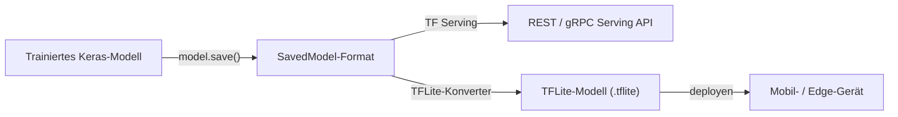

# TensorFlow

## Definition

TensorFlow ist Googles Open-Source-[Deep-Learning](/docs/fundamentals/deep-learning)-Framework, das mit starkem Fokus auf Produktions-Deployment entwickelt wurde. Ursprünglich 2015 veröffentlicht, hat es sich zu einer End-to-End-Plattform entwickelt, die Datenpipelines (`tf.data`), Modellbau (Keras), verteiltes Training (`tf.distribute`) und Serving (TensorFlow Serving, Vertex AI) abdeckt. Die high-level Keras-API ist die primäre Schnittstelle für die meisten Praktiker und bietet sequenzielle und funktionale Modellkonstruktionsmuster, die Boilerplate reduzieren.

TensorFlow unterstützt eine breite Palette von Hardware-Zielen: CPUs, NVIDIA-GPUs, Google TPUs und mobile/Edge-Geräte durch TensorFlow Lite. Diese Hardware-Breite, kombiniert mit SavedModel — einem standardisierten Modell-Serialisierungsformat — macht TensorFlow zum Framework der Wahl, wenn das Deployment-Ziel Cloud, On-Premises-Serving-Infrastruktur und On-Device-Inferenz (iOS, Android, Mikrocontroller) innerhalb desselben Projekts umfasst.

Verglichen mit [PyTorch](/docs/frameworks/pytorch) war TensorFlow historisch gesehen stärker bei Produktionspipelines, TPU-Training und mobilem Deployment, während PyTorch in der Forschung für seine imperative Debugging-Erfahrung bevorzugt wurde. Seit TensorFlow 2.x Eager Execution als Standard eingeführt hat, hat sich die tägliche Entwicklungserfahrung angenähert, aber die Ökosystem-Unterschiede bleiben bestehen: TF Serving, TFLite und TensorFlow Extended (TFX) sind produktionsreife Komponenten ohne direktes PyTorch-Äquivalent.

## Funktionsweise

### Trainings-Pipeline


### Deployment-Pipeline



### Wichtige Komponenten

**Keras** — High-Level-API zur Definition von Schichten, Modellen und Trainingsschleifen. **`tf.data`** — leistungsfähiges Laden, Mischen, Batchen und Augmentieren von Daten. **`tf.distribute`** — Multi-GPU- und Multi-Host-verteilte Trainingsstrategien. **SavedModel** — portables Serialisierungsformat für Inferenz und Serving. **TensorFlow Lite** — quantisierte Modelle für mobile und Edge-Geräte. **TensorFlow Hub** — vortrainierte Modelle für [Transfer Learning](/docs/transfer-learning).

## Wann verwenden / Wann NICHT verwenden

| Szenario | TensorFlow verwenden | TensorFlow NICHT verwenden |
|----------|---------------|----------------------|
| Produktions-ML-Pipelines mit TF Serving | Ja — native Integration | |
| Mobile und Edge-Deployment via TFLite | Ja — beste Edge-Unterstützung | |
| Training auf Google TPUs | Ja — TPU-Unterstützung ist erstklassig | |
| Schnelle Forschungs-Iteration und benutzerdefinierte Architekturen | | [PyTorch](/docs/frameworks/pytorch) hat eine natürlichere Debugging-Erfahrung |
| HuggingFace Transformers-Modelle laden | | Die meisten HuggingFace-Modelle verwenden standardmäßig PyTorch; einige unterstützen TF |
| RL-Forschung und Umgebungen | | PyTorch ist in der RL-Forschung weiter verbreitet |

## Vergleiche

| Funktion | TensorFlow / Keras | PyTorch |
|---------|-------------------|---------|
| Primärer Anwendungsfall | Produktionspipelines, Mobile, TPU | Forschung, schnelles Prototyping |
| High-Level-API | Keras (eingebaut) | Lightning, Ignite (Drittanbieter) |
| Ausführungsmodus | Eager (Standard) + Graph (tf.function) | Eager (Standard) + TorchScript |
| Mobile / Edge | TFLite (erstklassig) | PyTorch Mobile (experimentell) |
| TPU-Unterstützung | Erstklassig | Über XLA / PyTorch/XLA |
| Ökosystem | TFX, TF Serving, TF Hub | HuggingFace, torchvision, ONNX |
| Forschungsannahme | Abnehmend | Dominant |

## Vor- und Nachteile

| Vorteile | Nachteile |
|------|------|
| Reifes Produktionsökosystem (TF Serving, TFX, TFLite) | Graph-Modus und `tf.function` erhöhen die Debugging-Komplexität |
| Erstklassige TPU- und Mobile-Deployment-Unterstützung | Steilere Lernkurve für benutzerdefinierte Forschungscode |
| SavedModel ist ein portables, versioniertes Format | HuggingFace-Ökosystem verwendet standardmäßig PyTorch |
| Keras bietet eine saubere High-Level-API | Einige APIs sind noch im Fluss über TF-Versionen |

## Codebeispiele

```python
import tensorflow as tf
from tensorflow import keras

# Einfachen Bildklassifikator mit der Keras Functional API erstellen
inputs = keras.Input(shape=(28, 28, 1))
x = keras.layers.Conv2D(32, 3, activation="relu")(inputs)
x = keras.layers.GlobalAveragePooling2D()(x)
outputs = keras.layers.Dense(10, activation="softmax")(x)
model = keras.Model(inputs, outputs)

model.compile(
    optimizer="adam",
    loss="sparse_categorical_crossentropy",
    metrics=["accuracy"],
)

# Daten mit tf.data laden und batchen
(x_train, y_train), (x_test, y_test) = keras.datasets.mnist.load_data()
x_train = x_train[..., tf.newaxis] / 255.0

dataset = tf.data.Dataset.from_tensor_slices((x_train, y_train))
dataset = dataset.shuffle(10000).batch(64).prefetch(tf.data.AUTOTUNE)

model.fit(dataset, epochs=5)

# Für Serving exportieren
model.save("mnist_model")  # SavedModel-Format
```

## Praktische Ressourcen

- [TensorFlow — Erste Schritte](https://www.tensorflow.org/tutorials) — Offizielle Tutorials zu Keras und tf.data
- [Keras-Dokumentation](https://keras.io/) — Vollständige Keras-API-Referenz und Anleitungen
- [TensorFlow Lite — Inferenzleitfaden](https://www.tensorflow.org/lite/guide) — Mobile und Edge-Deployment
- [TensorFlow Hub](https://tfhub.dev/) — Vortrainierte Modelle für Transfer Learning
- [TensorFlow Extended (TFX)](https://www.tensorflow.org/tfx) — Produktions-ML-Pipelines

## Siehe auch

- [PyTorch](/docs/frameworks/pytorch)
- [Deep Learning](/docs/fundamentals/deep-learning)
- [Infrastruktur](/docs/infrastructure)
