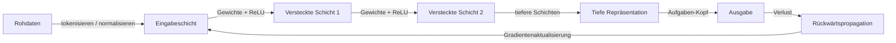

# Deep Learning

## Definition

Deep Learning verwendet neuronale Netze mit vielen Schichten, um hierarchische Repräsentationen aus Daten zu lernen. Es hat den Fortschritt in Vision, Sprache und anderen Bereichen durch Skalierung von Daten und Rechenkapazität vorangetrieben.

Es erweitert [maschinelles Lernen](/docs/fundamentals/machine-learning) durch die Verwendung differenzierbarer, geschichteter Modelle (siehe [neuronale Netze](/docs/neural-networks)), die Merkmale automatisch statt handgefertigte lernen. Tiefe ermöglicht es dem Modell, zunehmend abstrakte Repräsentationen aufzubauen (z.B. Kanten -> Texturen -> Teile -> Objekte in der Vision).

Das definierende Merkmal des Deep Learning ist **End-to-End-Lernen**: Roheingaben (Pixel, Tokens, Audiosamples) werden durch aufeinanderfolgende nichtlineare Schichten transformiert, und die gesamte Pipeline wird gemeinsam durch Gradientenabstieg optimiert. Dies beseitigt den Bedarf an domänenspezifischem Feature-Engineering, auf das traditionelles ML angewiesen ist. Der Kompromiss ist, dass tiefe Modelle erheblich mehr Daten und Rechenkapazität benötigen — GPUs, TPUs und großen Speicher — und schwerer zu interpretieren sind als klassische Modelle.

## Funktionsweise



### Vorwärtsdurchlauf

**Daten** werden der Eingabeschicht zugeführt. Jede Schicht wendet eine lineare Transformation (Matrizenmultiplikation + Bias) gefolgt von einer Nichtlinearität (z.B. ReLU) an. Das Stapeln von Schichten produziert progressiv abstraktere **Repräsentationen**. Die letzte Schicht bildet auf die Aufgabenausgabe ab (Klassenscores, Regressionswert oder Token-Logits).

### Rückwärtsdurchlauf und Optimierung

Der **Verlust** (z.B. Cross-Entropy für Klassifikation) wird zwischen Vorhersagen und Zielen berechnet. **Rückwärtspropagation** verwendet die Kettenregel, um Gradienten des Verlustes bezüglich jedes Gewichts im Netzwerk zu berechnen. Ein Optimierer (SGD, Adam) aktualisiert dann die Gewichte in der Richtung, die den Verlust reduziert.

### Architekturen

Die Architekturwahl passt die Konnektivität an den Datentyp an: [CNNs](/docs/neural-networks/cnn) nutzen räumliche Lokalität für Bilder; [RNNs](/docs/neural-networks/rnn) verarbeiten variable-Länge-Sequenzen; [Transformer](/docs/transformers) verwenden globale Self-Attention und dominieren jetzt sowohl Vision- als auch Sprachaufgaben im großen Maßstab.

## Wann verwenden / Wann NICHT verwenden

| Szenario | Deep Learning verwenden? | Hinweise |
|---|---|---|
| Groß angelegte Bild- oder Video-Erkennung | Ja | CNNs sind das Standard-Backbone |
| Textverstehen oder -generierung | Ja | Transformer setzen State-of-the-Art im gesamten NLP |
| Kleiner strukturierter/tabellarischer Datensatz | Nein | Gradient Boosting übertrifft typischerweise |
| Vollständige Modellinterpretierbarkeit benötigt | Nein | Tiefe Modelle sind weitgehend Black Boxes |
| Begrenzte Rechenkapazität / Edge-Deployment | Mit Vorsicht | Quantisierung oder destillierte Modelle verwenden |
| Sprach- und Audio-Erkennung | Ja | Tiefe Modelle übertreffen klassische Signalverarbeitung |

## Vergleiche

| Aspekt | Klassisches ML | Deep Learning |
|---|---|---|
| Feature-Engineering | Manuell | Automatisch (End-to-End) |
| Datenanforderungen | Niedrig bis mittel | Hoch |
| Rechenanforderungen | Niedrig | Hoch (GPU/TPU) |
| Interpretierbarkeit | Hoch (z.B. Bäume) | Niedrig |
| Leistung auf unstrukturierten Daten | Moderat | Sehr hoch |

## Vor- und Nachteile

| Vorteile | Nachteile |
|---|---|
| Automatisches Merkmal-Lernen | Datenintensiv |
| State-of-the-Art bei Vision und Sprache | Erfordert GPU/TPU |
| End-to-End-Optimierung | Schwer zu interpretieren |
| Transfer Learning reduziert Datenbedarf | Lange Trainingszeiten |

## Codebeispiele

```python
# Feedforward-Netzwerk mit PyTorch für Bildklassifikation (MNIST)
import torch
import torch.nn as nn
import torch.optim as optim
from torchvision import datasets, transforms
from torch.utils.data import DataLoader

# Datenlader
transform = transforms.Compose([
    transforms.ToTensor(),
    transforms.Normalize((0.5,), (0.5,))
])
train_loader = DataLoader(
    datasets.MNIST('.', train=True, download=True, transform=transform),
    batch_size=64, shuffle=True
)
test_loader = DataLoader(
    datasets.MNIST('.', train=False, download=True, transform=transform),
    batch_size=1000
)

# Modelldefinition
class MLP(nn.Module):
    def __init__(self):
        super().__init__()
        self.net = nn.Sequential(
            nn.Flatten(),
            nn.Linear(28 * 28, 256), nn.ReLU(),
            nn.Linear(256, 128),     nn.ReLU(),
            nn.Linear(128, 10),
        )

    def forward(self, x):
        return self.net(x)

device  = "cuda" if torch.cuda.is_available() else "cpu"
model   = MLP().to(device)
opt     = optim.Adam(model.parameters(), lr=1e-3)
loss_fn = nn.CrossEntropyLoss()

# Training
for epoch in range(3):
    model.train()
    for X, y in train_loader:
        X, y = X.to(device), y.to(device)
        opt.zero_grad()
        loss_fn(model(X), y).backward()
        opt.step()

# Evaluation
model.train(False)
correct = sum(
    (model(X.to(device)).argmax(1) == y.to(device)).sum().item()
    for X, y in test_loader
)
print(f"Test-Genauigkeit: {correct / len(test_loader.dataset):.2%}")
```

## Praktische Ressourcen

- [Deep Learning (Goodfellow et al.)](https://www.deeplearningbook.org/) — Kostenloses Online-Lehrbuch mit tiefgehender Theorie
- [PyTorch – Einführung](https://pytorch.org/tutorials/beginner/deep_learning_60min_blitz.html) — Praktisches 60-Minuten-Deep-Learning-Tutorial
- [fast.ai – Praktisches Deep Learning](https://course.fast.ai/) — Top-down-Kurs mit realen Projekten und Code

## Siehe auch

- [Neuronale Netze](/docs/neural-networks)
- [Transformer](/docs/transformers)
- [Frameworks (PyTorch, TensorFlow)](/docs/frameworks/pytorch)
