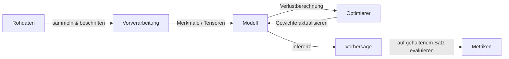

# KI-Grundlagen

## Definition

KI-Grundlagen umfassen die Kernideen hinter künstlicher Intelligenz: was wir unter Lernen, Repräsentation und Generalisierung verstehen. Dies umfasst überwachtes und unüberwachtes Lernen, Optimierung und die Beziehung zwischen Daten, Modellen und Zielen.

Diese Ideen bilden die Grundlage sowohl für klassisches [maschinelles Lernen](/docs/fundamentals/machine-learning) als auch für [Deep Learning](/docs/fundamentals/deep-learning). Ihr Verständnis hilft Ihnen, das richtige Paradigma auszuwählen, Ergebnisse zu interpretieren und über Grenzen nachzudenken (z.B. Datenanforderungen, Bias, Robustheit).

Im Herzen der KI liegt eine einfache Schleife: Sie sammeln Daten, die einen Aspekt der Welt kodieren, Sie definieren ein Ziel, das formalisiert, was "gut" bedeutet, und Sie führen einen Optimierer aus, der ein Modell anpasst, bis es das Ziel auf gehaltenen Beispielen erfüllt. Alles andere — neuronale Architekturen, Regularisierungstechniken, Alignment-Algorithmen — ist eine Verfeinerung dieser Kernschleife. Das Entwickeln von Intuition für jede Komponente hilft Ihnen, Fehler schnell zu diagnostizieren und fundierte Entwurfsentscheidungen beim Aufbau realer Systeme zu treffen.

## Funktionsweise



### Datensammlung und Vorverarbeitung

**Daten** werden gesammelt oder beschriftet; sie müssen repräsentativ für die reale Verteilung sein, auf die das Modell treffen wird. Die Vorverarbeitung transformiert Roheingaben (Bilder, Text, tabellarische Zeilen) in Merkmale oder Tensoren, die das Modell verarbeiten kann.

### Modellauswahl und Training

Ein **Modell** (z.B. eine lineare Funktion, ein Entscheidungsbaum oder ein neuronales Netz) wird basierend auf Datentyp und Aufgabe ausgewählt. Ein Ziel (Verlust für überwachtes/unüberwachtes, Belohnung für RL) wird mit einem Algorithmus wie Gradientenabstieg optimiert. Der **Optimierer** aktualisiert Modellparameter, um den Verlust auf Trainingsdaten zu minimieren.

### Evaluation und Generalisierung

Das Ergebnis ist ein angepasstes Modell, das auf neue Eingaben generalisieren muss. Die Evaluation verwendet Train-/Validierungs-/Test-Splits. Wenn das Modell auf Trainingsdaten gut, aber auf dem Testsatz schlecht abschneidet, overfit es. Techniken wie Cross-Validation, Regularisierung und Early Stopping lösen dies. Mathematische Grundlagen — Wahrscheinlichkeit, lineare Algebra, Analysis — verbinden jeden Schritt.

## Wann verwenden / Wann NICHT verwenden

| Szenario | KI/ML verwenden? | Hinweise |
|---|---|---|
| Komplexe Mustererkennung aus großen Daten | Ja | ML glänzt, wenn Regeln schwer zu kodieren sind |
| Wohldefinierte regelbasierte Logik (z.B. Steuerberechnungen) | Nein | Deterministischer Code ist einfacher und auditierbarer |
| Beschriftete Daten sind verfügbar und reichlich | Ja | Überwachtes Lernen funktioniert hier am besten |
| Daten sind sehr knapp (\<wenige hundert Beispiele) | Mit Vorsicht | Few-Shot- oder Transfer Learning kann noch gelten |
| Echtzeit-Entscheidungen mit strengen Garantien | Nein | ML-Modelle sind probabilistisch; mit Fallbacks verwenden |
| Erkundung oder Empfehlung mit Benutzer-Feedback | Ja | RL und kollaboratives Filtern glänzen hier |

## Vergleiche

| Konzept | Beschreibung | Typische Daten | Beschriftungen erforderlich |
|---|---|---|---|
| Überwachtes Lernen | Aus beschrifteten Beispielen lernen | Strukturiert, Bilder, Text | Ja |
| Unüberwachtes Lernen | Struktur ohne Beschriftungen finden | Beliebig | Nein |
| Verstärkendes Lernen | Aus Belohnungssignalen lernen | Sequenziell/interaktiv | Nein (verwendet Belohnungen) |
| Klassische Regelsysteme | Handkodierte Logik | Beliebig | Nein |

## Codebeispiele

```python
# Minimale überwachte Lernpipeline mit scikit-learn
from sklearn.datasets import load_iris
from sklearn.model_selection import train_test_split
from sklearn.preprocessing import StandardScaler
from sklearn.linear_model import LogisticRegression
from sklearn.metrics import accuracy_score

# 1. Daten laden
X, y = load_iris(return_X_y=True)

# 2. In Trainings-/Testsplit aufteilen
X_train, X_test, y_train, y_test = train_test_split(
    X, y, test_size=0.2, random_state=42
)

# 3. Vorverarbeiten
scaler = StandardScaler()
X_train = scaler.fit_transform(X_train)
X_test = scaler.transform(X_test)

# 4. Modell trainieren
model = LogisticRegression(max_iter=200)
model.fit(X_train, y_train)

# 5. Evaluieren
preds = model.predict(X_test)
print(f"Genauigkeit: {accuracy_score(y_test, preds):.2%}")
```

## Praktische Ressourcen

- [Google ML Crash Course](https://developers.google.com/machine-learning/crash-course) — Umfassende Einführung in ML-Konzepte mit interaktiven Übungen
- [MIT 6.S191 – Einführung in Deep Learning](http://introtodeeplearning.com/) — Folien, Videos und Labs, die den gesamten Deep-Learning-Stack abdecken
- [fast.ai – Praktisches Deep Learning für Codierer](https://course.fast.ai/) — Top-down, Code-first-Einführung, ideal für Praktiker

## Siehe auch

- [Maschinelles Lernen](/docs/fundamentals/machine-learning)
- [Deep Learning](/docs/fundamentals/deep-learning)
- [Neuronale Netze](/docs/neural-networks)
