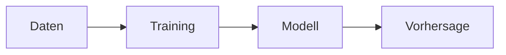

# Maschinelles Lernen

## Definition

Maschinelles Lernen (ML) ist die Erforschung von Algorithmen, die sich durch Erfahrung (Daten) verbessern. Wichtige Paradigmen sind **überwachtes Lernen** (Lernen aus gelabelten Beispielen), **unüberwachtes Lernen** (Strukturen ohne Labels finden) und **bestärkendes Lernen** (Lernen aus Belohnungen).

ML wird gegenüber handcodierten Regeln bevorzugt, wenn das Problem zu komplex ist, um es explizit zu spezifizieren, oder wenn Daten reichlich vorhanden sind. Es liegt zwischen klassischer KI (symbolische Regeln) und [Deep Learning](/docs/fundamentals/deep-learning) (große neuronale Netze); viele reale Systeme kombinieren ML-Modelle mit Pipelines und Geschäftslogik.

## Funktionsweise

**Training:** Sie wählen eine Repräsentation (z. B. lineares Modell, Baum oder neuronales Netz) und ein Ziel (Verlust für überwacht/unüberwacht, Belohnung für RL). Ein Optimierer (z. B. Gradientenabstieg) aktualisiert die Modellparameter, um den Verlust zu minimieren oder die Belohnung auf den Trainingsdaten zu maximieren. **Modell:** Das Ergebnis ist ein angepasstes Modell (Gewichte, Struktur), das Muster in den Daten erfasst. **Vorhersage:** Zur Inferenzzeit werden neue Eingaben in das Modell eingespeist, um Ausgaben (Labels, Scores oder Aktionen) zu erhalten. Die Evaluation verwendet Train/Validierung/Test-Splits, um die Generalisierung einzuschätzen und Überanpassung zu vermeiden.

## Anwendungsfälle

Klassisches ML glänzt bei strukturierten oder tabellarischen Daten mit klaren Labels oder Zielen.

- Spam-Klassifikation, Betrugserkennung und andere überwachte Klassifikationsaufgaben
- Empfehlungssysteme und kollaboratives Filtern
- Prognosen und Zeitreihenvorhersage

## Externe Dokumentation

- [Google ML-Crashkurs](https://developers.google.com/machine-learning/crash-course)
- [Scikit-learn – Benutzerhandbuch](https://scikit-learn.org/stable/user_guide.html) — Klassisches ML in der Praxis

## Siehe auch

- [Deep Learning](/docs/fundamentals/deep-learning)
- [Bestärkendes Lernen](/docs/rl)
- [Evaluationsmetriken](/docs/evaluation-metrics)
