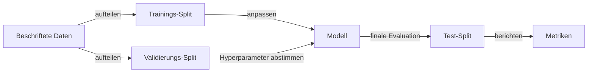

# Maschinelles Lernen

## Definition

Maschinelles Lernen (ML) ist die Wissenschaft von Algorithmen, die sich mit Erfahrung (Daten) verbessern. Wichtige Paradigmen umfassen **überwachtes Lernen** (Lernen aus beschrifteten Beispielen), **unüberwachtes Lernen** (Struktur ohne Beschriftungen finden) und **verstärkendes Lernen** (Lernen aus Belohnungen).

ML wird gegenüber handkodierten Regeln bevorzugt, wenn das Problem zu komplex ist, um es explizit zu spezifizieren, oder wenn Daten reichlich vorhanden sind. Es liegt zwischen klassischer KI (symbolische Regeln) und [Deep Learning](/docs/fundamentals/deep-learning) (große neuronale Netze); viele reale Systeme kombinieren ML-Modelle mit Pipelines und Geschäftslogik.

Die Stärke von ML liegt in seiner Fähigkeit zur Generalisierung: Ein auf einer Teilmenge von Beispielen trainiertes Modell kann genaue Vorhersagen über neue, ungesehene Daten machen. Diese Generalisierung ist nur möglich, wenn die Trainingsverteilung für die reale Welt repräsentativ ist, das Modell angemessen regularisiert ist, um kein Rauschen zu memorieren, und die Evaluation rigoros auf gehaltenen Daten durchgeführt wird. Das Verständnis des Bias-Varianz-Tradeoffs, der Cross-Validation und des geeigneten Feature-Engineerings ist daher genauso wichtig wie die Algorithmenwahl.

## Funktionsweise



### Training

Sie wählen eine Repräsentation (z.B. lineares Modell, Baum oder neuronales Netz) und ein Ziel (Verlust für überwachtes/unüberwachtes, Belohnung für RL). Ein Optimierer (z.B. Gradientenabstieg oder ein Baumanpassungsalgorithmus) aktualisiert die Modellparameter, um den Verlust auf Trainingsdaten zu minimieren.

### Validierung und Hyperparameter-Tuning

Nach dem anfänglichen Training wird die Leistung auf dem **Validierungs**-Satz gemessen. Hyperparameter (Lernrate, Baumtiefe, Regularisierungsstärke) werden basierend auf den Validierungsergebnissen angepasst. Cross-Validation liefert zuverlässigere Schätzungen, wenn die Daten begrenzt sind.

### Test-Evaluation

Der **Test-Split** wird nur einmal am Ende berührt, um eine unvoreingenommene Schätzung der Generalisierung zu erhalten. Metriken wie Genauigkeit, F1, AUC oder RMSE werden basierend auf dem Aufgabentyp berichtet. Das trainierte **Modell** wird für die Inferenz auf neuen Eingaben eingesetzt.

## Wann verwenden / Wann NICHT verwenden

| Szenario | ML verwenden? | Hinweise |
|---|---|---|
| Strukturierte/tabellarische Daten mit klarem Ziel | Ja | Entscheidungsbäume, Gradient Boosting, lineare Modelle glänzen hier |
| Komplexe unstrukturierte Daten (Bilder, Rohtext) | Deep Learning verwenden | Klassisches ML benötigt handgefertigte Merkmale |
| Sehr kleiner Datensatz (\<100 Beispiele) | Mit Vorsicht | Einfache Modelle und Cross-Validation bevorzugen |
| Modellinterpretierbarkeit benötigt (z.B. Vorschriften) | Ja | Lineare Modelle und Entscheidungsbäume sind auditierbar |
| Regeln können vollständig von Domänenexperten spezifiziert werden | Nein | Regelbasierte Systeme sind vorhersehbarer |
| Belohnungsbasierte interaktive Aufgabe (Spiele, Steuerung) | RL verwenden | Überwachtes ML benötigt beschriftete Paare |

## Vergleiche

| Paradigma | Beschriftungen erforderlich | Datentyp | Typische Algorithmen | Beispielaufgabe |
|---|---|---|---|---|
| Überwachtes Lernen | Ja | Beliebig | Logistische Regression, SVM, XGBoost, neuronales Netz | Spam-Erkennung, Bildklassifikation |
| Unüberwachtes Lernen | Nein | Beliebig | K-Means, DBSCAN, PCA, Autoencoder | Kundensegmentierung, Anomalieerkennung |
| Verstärkendes Lernen | Nein (verwendet Belohnungen) | Sequenziell/interaktiv | Q-Learning, PPO, SAC | Spielen, robotische Steuerung |

## Vor- und Nachteile

| Vorteile | Nachteile |
|---|---|
| Generalisiert aus Beispielen ohne explizite Regeln | Benötigt qualitativ hochwertige beschriftete Daten |
| Skaliert gut mit mehr Daten | Außerhalb der Trainingsverteilung brüchig |
| Große Bibliothek interpretierbarer Algorithmen (sklearn) | Feature-Engineering ist oft noch erforderlich |
| Effiziente Inferenz nach dem Training | Kann im Daten vorhandene Biases kodieren |

## Codebeispiele

```python
# Überwachtes Lernen mit scikit-learn: Gradient Boosting auf tabellarischen Daten
from sklearn.datasets import load_breast_cancer
from sklearn.model_selection import train_test_split, cross_val_score
from sklearn.ensemble import GradientBoostingClassifier
from sklearn.preprocessing import StandardScaler
from sklearn.metrics import classification_report
import numpy as np

# Datensatz laden
X, y = load_breast_cancer(return_X_y=True)
X_train, X_test, y_train, y_test = train_test_split(
    X, y, test_size=0.2, random_state=42, stratify=y
)

# Merkmale skalieren
scaler = StandardScaler()
X_train_sc = scaler.fit_transform(X_train)
X_test_sc = scaler.transform(X_test)

# Gradient-Boosting-Klassifikator trainieren
clf = GradientBoostingClassifier(n_estimators=100, learning_rate=0.1, max_depth=3)
clf.fit(X_train_sc, y_train)

# Cross-Validation-Schätzung
cv_scores = cross_val_score(clf, X_train_sc, y_train, cv=5)
print(f"CV-Genauigkeit: {np.mean(cv_scores):.2%} ± {np.std(cv_scores):.2%}")

# Finale Evaluation auf gehaltenem Testsatz
print(classification_report(y_test, clf.predict(X_test_sc)))
```

## Praktische Ressourcen

- [Google ML Crash Course](https://developers.google.com/machine-learning/crash-course) — Interaktive Einführung in ML-Konzepte mit Codelabs
- [Scikit-learn – Benutzerhandbuch](https://scikit-learn.org/stable/user_guide.html) — Umfassende Anleitung zu klassischem ML in der Praxis
- [Hands-On Machine Learning (Géron)](https://www.oreilly.com/library/view/hands-on-machine-learning/9781098125967/) — Praktisches Buch, das sowohl klassisches ML als auch Deep Learning abdeckt

## Siehe auch

- [Deep Learning](/docs/fundamentals/deep-learning)
- [Verstärkendes Lernen](/docs/rl)
- [Evaluierungsmetriken](/docs/evaluation-metrics)
