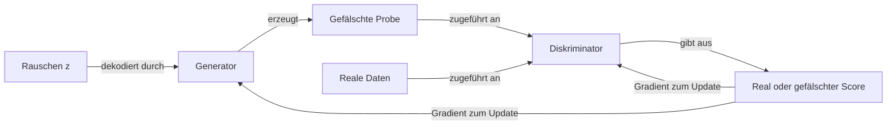

# Generative Adversarial Networks (GANs)

## Definition

Generative Adversarial Networks (GANs), eingeführt von Goodfellow et al. im Jahr 2014, trainieren zwei neuronale Netze im Wettbewerb: einen **Generator**, der synthetische Proben aus zufälligem Rauschen erzeugt, und einen **Diskriminator**, der versucht, generierte Proben von realen zu unterscheiden. Diese adversarische Dynamik treibt den Generator an, zunehmend realistische Ausgaben zu erzeugen, ohne eine explizite Likelihoodfunktion oder einen vordefinierten Rauschplan zu benötigen.

Das Trainingsziel ist ein Min-Max-Spiel: Der Generator minimiert die Fähigkeit des Diskriminators, Fälschungen zu identifizieren, während der Diskriminator seine Klassifizierungsgenauigkeit maximiert. Beim Gleichgewicht (Nash-Gleichgewicht) werden die Ausgaben des Generators von realen Daten nicht mehr zu unterscheiden sein. In der Praxis ist das Erreichen dieses Gleichgewichts schwierig — das Training ist anfällig für **Mode Collapse** (Generator erzeugt begrenzte Vielfalt) und **Diskriminator/Generator-Ungleichgewicht** (eine Seite dominiert zu früh).

GANs waren der dominierende generative Ansatz vor [Diffusionsmodellen](/docs/diffusion-models) und bleiben relevant für Stiltransfer, Domänenadaption und Datenaugmentierung. Im Vergleich zu [VAEs](/docs/vaes) erzeugen GANs typischerweise schärfere Bilder auf Kosten von Trainingsinstabilität und begrenzter Vielfalt. Architekturverbesserungen (DCGAN, StyleGAN, BigGAN) und Trainingstechniken (Spectral Normalization, Wasserstein-Verlust, Progressive Growing) haben Stabilität und Ausgabequalität erheblich verbessert.

## Funktionsweise

### Generator

Nimmt einen zufälligen **Rauschvektor z** (aus einer Gaußschen oder gleichmäßigen Verteilung gesampelt) und bildet ihn durch ein neuronales Netz (typischerweise transponierte Faltungen für Bilder) auf eine **gefälschte Probe** ab — z. B. ein Bild.

### Diskriminator

Empfängt entweder eine **reale Probe** aus den Trainingsdaten oder eine **gefälschte Probe** vom Generator. Er gibt einen skalaren Score aus (reale oder gefälschte Wahrscheinlichkeit). Sein Verlust ist eine binäre Kreuzentropie zwischen vorhergesagten und echten Labels.

### Trainingsschleife



Training wechselt ab: (1) Diskriminator aktualisieren, um reale von gefälschten besser zu unterscheiden, dann (2) Generator aktualisieren, um den Diskriminator besser zu täuschen. Der Generator sieht nie direkt reale Daten — er empfängt nur Gradientensignal vom Diskriminator.

### Schlüsselvarianten

| Variante | Schlüsselinnovation |
|---|---|
| DCGAN | Convolutional-Architektur für Bilderzeugung |
| WGAN | Wasserstein-Distanz-Verlust für stabileres Training |
| StyleGAN | Style-basierter Generator für hochwertige Gesichter |
| CycleGAN | Ungepaarte Bild-zu-Bild-Übersetzung |
| Conditional GAN | Generierung auf ein Klassen-Label oder Attribut konditionieren |

## Wann verwenden / Wann NICHT verwenden

| Szenario | GANs verwenden | GANs vermeiden |
|---|---|---|
| Scharfe, fotorealistische Bilderzeugung | Ja — GANs erzeugen knackige, hochfrequente Details | Nein — wenn Trainingsstabilität Priorität hat, Diffusion verwenden |
| Stiltransfer und Domänenadaption | Ja — CycleGAN exzelliert bei ungepaarter Bildübersetzung | Nein — wenn Vielfalt und Abdeckung benötigt werden, ist Diffusion besser |
| Datenaugmentierung für seltene Klassen | Ja — GANs können zielgerichtete synthetische Proben erzeugen | Nein — wenn Mode Collapse bei begrenzten Daten ein Risiko ist |
| Stabiler, reproduzierbarer Training-Pipeline | Nein — GAN-Training ist notorisch heikel | — |
| Dichteabschätzung oder Likelihood-Evaluierung | Nein — GANs liefern keine expliziten Likelihoods | — |

## Vergleiche

| Modell | Training | Probenqualität | Vielfalt | Stabilität |
|---|---|---|---|---|
| GAN | Adversarisches Min-Max | Scharf, hochauflösend | Anfällig für Mode Collapse | Schwierig |
| VAE | ELBO (Rekonstruktion + KL) | Unscharf, glatt | Gute Abdeckung | Stabil |
| Diffusion | Denoising Score Matching | Sehr scharf, vielfältig | Ausgezeichnet | Stabil |
| Flow-basiert | Exakte Likelihood | Scharf | Gut | Stabil |

## Vor- und Nachteile

| Vorteile | Nachteile |
|---|---|
| Erzeugt scharfe, hochfrequente Bilddetails | Mode Collapse — Generator ignoriert möglicherweise Teile der Datenverteilung |
| Keine explizite Likelihood erforderlich | Diskriminator/Generator-Balance ist schwer zu halten |
| Hochflexibel — viele Varianten für verschiedene Aufgaben | Evaluierung ist schwierig; FID/IS sind unvollkommene Proxys |
| Schnelle Inferenz (einzelner Forward Pass) | Training ist instabil; sensitiv gegenüber Hyperparametern |

## Code-Beispiele

Minimales DCGAN-Training auf MNIST mit PyTorch:

```python
import torch
import torch.nn as nn
from torchvision import datasets, transforms
from torch.utils.data import DataLoader

# Generator: noise → 28x28 image
class Generator(nn.Module):
    def __init__(self, latent_dim=100):
        super().__init__()
        self.net = nn.Sequential(
            nn.Linear(latent_dim, 256), nn.ReLU(),
            nn.Linear(256, 512), nn.ReLU(),
            nn.Linear(512, 28 * 28), nn.Tanh(),
        )
    def forward(self, z):
        return self.net(z).view(-1, 1, 28, 28)

# Discriminator: image → real/fake score
class Discriminator(nn.Module):
    def __init__(self):
        super().__init__()
        self.net = nn.Sequential(
            nn.Flatten(),
            nn.Linear(28 * 28, 512), nn.LeakyReLU(0.2),
            nn.Linear(512, 256), nn.LeakyReLU(0.2),
            nn.Linear(256, 1), nn.Sigmoid(),
        )
    def forward(self, x):
        return self.net(x)

latent_dim = 100
G, D = Generator(latent_dim), Discriminator()
opt_G = torch.optim.Adam(G.parameters(), lr=2e-4, betas=(0.5, 0.999))
opt_D = torch.optim.Adam(D.parameters(), lr=2e-4, betas=(0.5, 0.999))
bce = nn.BCELoss()

loader = DataLoader(
    datasets.MNIST(".", download=True, transform=transforms.ToTensor()),
    batch_size=128, shuffle=True
)

for epoch in range(5):
    for real, _ in loader:
        batch = real.size(0)
        real = real * 2 - 1  # Scale to [-1, 1]

        # --- Train discriminator ---
        z = torch.randn(batch, latent_dim)
        fake = G(z).detach()
        loss_D = bce(D(real), torch.ones(batch, 1)) + bce(D(fake), torch.zeros(batch, 1))
        opt_D.zero_grad(); loss_D.backward(); opt_D.step()

        # --- Train generator ---
        z = torch.randn(batch, latent_dim)
        loss_G = bce(D(G(z)), torch.ones(batch, 1))
        opt_G.zero_grad(); loss_G.backward(); opt_G.step()

    print(f"Epoch {epoch+1} | D loss: {loss_D.item():.3f} | G loss: {loss_G.item():.3f}")
```

## Praktische Ressourcen

- [Generative Adversarial Networks (Goodfellow et al., 2014)](https://arxiv.org/abs/1406.2661) — Originales GAN-Paper, das das Min-Max-Framework einführt
- [PyTorch – DCGAN Tutorial](https://pytorch.org/tutorials/beginner/dcgan_faces_tutorial.html) — Offizielles Tutorial mit Convolutional GAN auf CelebA
- [StyleGAN2 (Karras et al.)](https://arxiv.org/abs/1912.04958) — Modernste Architektur für hochauflösende Gesichtssynthese
- [GAN Lab (interaktive Visualisierung)](https://poloclub.github.io/ganlab/) — Browser-basierte Visualisierung der GAN-Trainingsdynamik

## Siehe auch

- [Diffusionsmodelle](/docs/diffusion-models)
- [VAEs](/docs/vaes)
