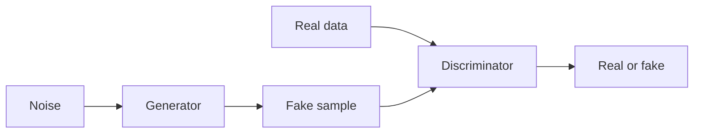

# Generative Adversarial Networks (GANs)

## Definition

GANs trainieren einen Generator und einen Diskriminator in einem Spiel: der Generator erzeugt Proben; der Diskriminator versucht, sie von echten Daten zu unterscheiden. Training pushes the generator toward realistic outputs.

They waren der dominierende generative Ansatz vor [diffusion models](/docs/diffusion-models). Im Vergleich zu [VAEs](/docs/vaes), GANs often produce sharper images but training can be unstable (mode collapse, discriminator/generator balance). Still used for style transfer, data augmentation, and some image editing.

## Funktionsweise

**Generator:** Takes **noise** (Zufallsvektor) and outputs a **fake sample** (z. B. image). **Discriminator:** Receives **real data** and **fake sample**, outputs **real or fake** (or a score). Training is a **min-max game**: the generator tries to maximize the discriminator’s loss (fool it), the discriminator tries to minimize it (tell real from fake). In der Praxis you alternate gradient steps. Variants (DCGAN, StyleGAN, etc.) use better architectures and training tricks (z. B. spectral norm, progressive growing) for stability and quality.

## Anwendungsfälle

GANs are used for generative and discriminative tasks wenn Sie want adversarisch training and sharp samples (images, audio, data aug).

- Image generation and editing (z. B. StyleGAN, face synthesis)
- Data augmentation and synthetic data for training
- Domain adaptation and style transfer

## Externe Dokumentation

- [Generative Adversarial Networks (Goodfellow et al.)](https://arxiv.org/abs/1406.2661)
- [PyTorch – DCGAN tutorial](https://pytorch.org/tutorials/beginner/dcgan_faces_tutorial.html)

## Siehe auch

- [Diffusion models](/docs/diffusion-models)
- [VAEs](/docs/vaes)
