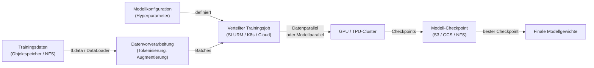
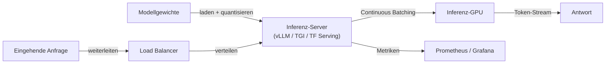

# Infrastruktur

## Definition

KI-Infrastruktur umfasst die Hardware-, Netzwerk- und Softwaresysteme, die zum Training und zur Bereitstellung großer Machine-Learning-Modelle in großem Maßstab erforderlich sind. Auf der Hardware-Seite bedeutet das GPUs (NVIDIA H100/A100, Consumer-RTX-Serie), TPUs (Googles benutzerdefinierte KI-Beschleuniger) und entstehende inferenz-spezifische Chips (AWS Inferentia, Groq LPU). Auf der Software-Seite umfasst es verteilte Trainings-Frameworks, Job-Scheduler, Modell-Serving-Stacks und Observability-Tooling.

Der Maßstab der erforderlichen Infrastruktur wird primär von [LLMs](/docs/llms) und großen Vision-Modellen getrieben. Das Training eines Frontier-Modells kann Tausende von GPUs erfordern, die wochenlang laufen, was sorgfältige Aufmerksamkeit auf Inter-Knoten-Vernetzung (NVLink, InfiniBand), Speicher-I/O (parallele Dateisysteme wie Lustre, Cloud-Objektspeicher mit Hochbandbreiten-Konnektoren) und Fehlertoleranz (automatische Checkpointing, Preemption-Behandlung) erfordert. Das effiziente Serving dieser trainierten Modelle erfordert unterschiedliche Hardware-Optimierungen: [Quantisierung](/docs/quantization), Speculative Decoding und Continuous Batching reduzieren Pro-Token-Kosten und Latenz.

[Frameworks](/docs/frameworks/pytorch) wie PyTorch, JAX und TensorFlow bieten das Programmiermodell zum Ausdrücken neuronaler Netzwerkberechnungen; die Infrastruktur liefert das Substrat. Cloud-Anbieter (AWS, GCP, Azure) bieten verwaltete KI-Infrastruktur (SageMaker, Vertex AI, Azure ML) an, die Cluster-Bereitstellung, Job-Scheduling und Experiment-Tracking handhabt, während On-Premises-Bereitstellungen Orchestratoren wie SLURM oder Kubernetes mit GPU-Geräte-Plugins verwenden.

## Funktionsweise

### Training-Pipeline



### Serving-Pipeline



### Schlüsselkonzepte

**Datenparallelismus** — Modell auf allen Geräten replizieren; Daten über Geräte aufteilen; Gradienten synchronisieren. **Modellparallelismus** — Modellschichten über Geräte aufteilen; notwendig, wenn das Modell nicht auf eine einzelne GPU passt. **Pipeline-Parallelismus** — Modell in Stufen über Geräte aufteilen; Berechnung und Kommunikation überlappen. **Continuous Batching** — Gleichzeitige Inferenzanfragen dynamisch gruppieren, um die GPU-Auslastung zu maximieren. **KV-Cache** — Attention-Key/Value-Tensoren zwischen Token cachen, um Neuberechnung zu vermeiden.

## Wann verwenden / Wann NICHT verwenden

| Szenario | In dedizierte Infrastruktur investieren | Cloud / verwaltete Dienste verwenden |
|----------|-----------------------------------|------------------------------|
| Proprietäre Frontier-Modelle trainieren | Ja — Kosten und Kontrolle im großen Maßstab | |
| Regulierte Umgebungen (Datensouveränität) | Ja — On-Prem garantiert Datensitz | |
| Gelegentliches Fine-Tuning oder Inferenz | | Cloud-Spot-Instanzen oder verwaltete APIs sind günstiger |
| Öffentlich zugängliche Modelle bei variablem Last Serving | | Auto-Scaling Cloud Serving ist einfacher zu verwalten |
| Forschung mit häufigen GPU-Bedarfen | | Cloud-Reserved-Instanzen oder akademische Cluster reichen aus |

## Vor- und Nachteile

| Vorteile | Nachteile |
|------|------|
| Vollständige Kontrolle über Hardware, Daten und Sicherheit | Hohe Kapital- und Betriebskosten für On-Prem-Cluster |
| Vorhersagbare Kosten bei hoher Auslastung | Erfordert Expertise in verteilten Systemen und MLOps |
| Niedrigste Latenz bei Co-Location mit Diensten | Überbereitstellungsrisiko bei schwankenden Workloads |
| Keine Egress-Kosten oder API-Rate-Limits | GPU-Versorgungsengpässe und lange Beschaffungsvorlaufzeiten |

## Code-Beispiele

```python
# PyTorch DistributedDataParallel (DDP) training — minimal example
import torch
import torch.distributed as dist
import torch.multiprocessing as mp
from torch.nn.parallel import DistributedDataParallel as DDP
from torch.utils.data.distributed import DistributedSampler

def train(rank: int, world_size: int):
    dist.init_process_group("nccl", rank=rank, world_size=world_size)
    torch.cuda.set_device(rank)

    model = MyModel().to(rank)
    model = DDP(model, device_ids=[rank])          # wrap for distributed sync

    sampler = DistributedSampler(dataset, num_replicas=world_size, rank=rank)
    loader = DataLoader(dataset, batch_size=64, sampler=sampler)

    optimizer = torch.optim.AdamW(model.parameters(), lr=1e-4)
    for epoch in range(10):
        sampler.set_epoch(epoch)                   # ensure different shuffles
        for x, y in loader:
            x, y = x.to(rank), y.to(rank)
            loss = loss_fn(model(x), y)
            loss.backward()
            optimizer.step()
            optimizer.zero_grad()

    dist.destroy_process_group()

if __name__ == "__main__":
    mp.spawn(train, args=(torch.cuda.device_count(),), nprocs=torch.cuda.device_count())
```

## Praktische Ressourcen

- [PyTorch — Distributed Training Overview](https://pytorch.org/tutorials/beginner/distributed_overview.html) — DDP, FSDP und RPC
- [Google Cloud — TPU Quickstart](https://cloud.google.com/tpu/docs/quick-starts) — Training auf TPU-Pods ausführen
- [vLLM Dokumentation](https://docs.vllm.ai/) — Hochdurchsatz-LLM-Inferenz-Server
- [NVIDIA — Megatron-LM](https://github.com/NVIDIA/Megatron-LM) — Großmaßstäblicher Modellparallelismus für LLM-Training
- [Kubernetes — GPU Scheduling](https://kubernetes.io/docs/tasks/manage-gpus/scheduling-gpus/) — GPU-Workloads auf K8s ausführen

## Siehe auch

- [Lokale Inferenz](/docs/local-inference)
- [Edge Reasoning](/docs/edge-reasoning)
- [Modellkomprimierung](/docs/model-compression)
- [Quantisierung](/docs/quantization)
- [MLOps](/docs/mlops)
- [Frameworks](/docs/frameworks/pytorch)
