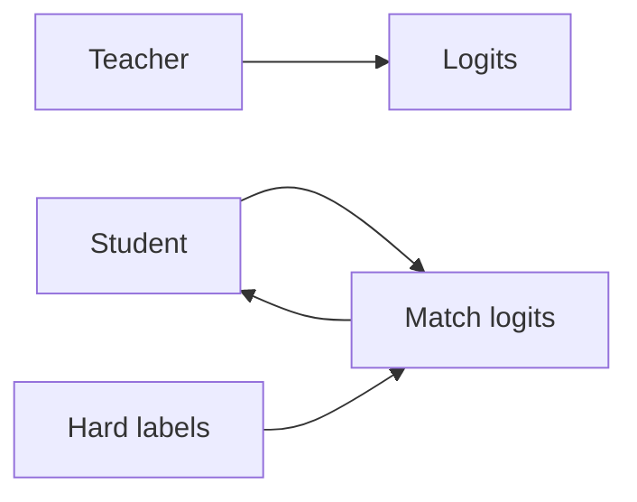

# Wissensdestillation

## Definition

Wissensdestillation trainiert ein kleineres Schülermodell, die Ausgaben abzugleichen (und manchmal Zwischendarstellungen) eines größeren Lehrermodells. Der Schüler gains aus dem teacher’s soft labels and can run with less compute.

Es ist ein [model compression](/docs/model-compression) technique that preserves more of the teacher’s behavior als das Training des Schülers nur auf harten Labels. Used for BERT → DistilBERT, large [LLMs](/docs/llms) → smaller variants, and [transfer learning](/docs/transfer-learning) from ensembles.

## Funktionsweise

The **teacher** (großes Modell) erzeugt **logits** (oder Einbettungen) auf Trainingsdaten. The **student** (kleineres Modell) wird darauf trainiert **nachzuahmen** the teacher’s logits (z. B. KL divergence with temperature scaling) in addition to or anstatt **hard labels** (ground truth). Temperature softens the teacher distribution sodass das student learns from dark knowledge (relative scores across classes). Optionally, intermediate layers or attention can be nachzuahmened. Der Schüler is trained with a mix of distillation loss and task loss; after training it runs mit dem student’s capacity and latency.

## Anwendungsfälle

Knowledge distillation passt, wenn you want a small, fast student that approximates a large teacher for deployment.

- Training smaller, faster models that approximate large ones (z. B. BERT → DistilBERT)
- Enabling deployment wenn die teacher is too heavy for production
- Transferring knowledge from ensembles or from multiple teachers

## Externe Dokumentation

- [Distilling the Knowledge in a Neural Network (Hinton et al.)](https://arxiv.org/abs/1503.02531)
- [Hugging Face – Distillation](https://huggingface.co/docs/transformers/tasks/distillation)

## Siehe auch

- [Model compression](/docs/model-compression)
- [Transfer learning](/docs/transfer-learning)
