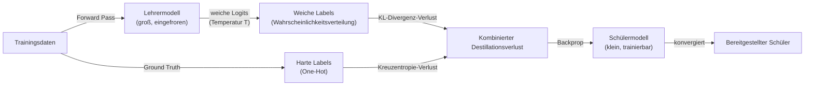
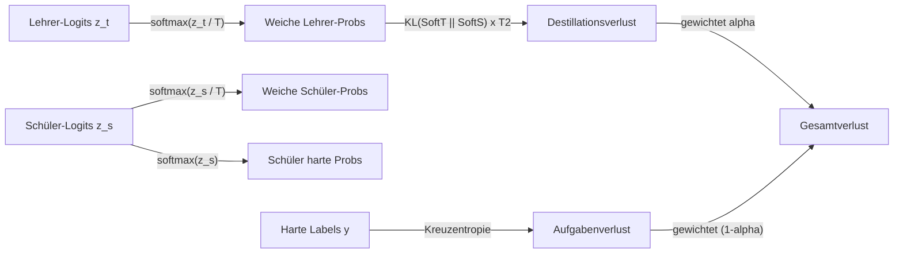

# Wissensdestillation

## Definition

Wissensdestillation ist eine [Modellkomprimierungs](/docs/model-compression)-Technik, bei der ein kleineres **Schüler**-Modell trainiert wird, das Verhalten eines größeren, leistungsfähigeren **Lehrer**-Modells zu reproduzieren. Anstatt das Schülermodell nur auf harten Labels (der Ground-Truth-Klasse oder Token) zu trainieren, setzt die Destillation das Schülermodell den **weichen Ausgaben** des Lehrers aus — Wahrscheinlichkeitsverteilungen über alle Klassen oder Token — die reichhaltigere Informationen über die internen Repräsentationen des Modells und die relativen Ähnlichkeiten zwischen Konzepten enthalten. Dieses zusätzliche Signal ermöglicht es dem Schüler, Genauigkeitsniveaus zu erreichen, die ohne die Destillation deutlich mehr Daten oder Kapazität erfordern würden.

Das Konzept wurde von Hinton et al. im Jahr 2015 formalisiert und seitdem breit angewendet: BERT (110M Parameter) wurde in DistilBERT (66M, ~97% von BERTs Leistung behaltend) destilliert, GPT-Modelle wurden in kleinere chat-fähige Varianten destilliert und Ensemble-Modelle wurden in einzelne Netze destilliert. Über die Klassifizierung hinaus gilt die Destillation für Sequenzgenerierung (Ausgabeverteilungen Token für Token abgleichen), Zwischen-Feature-Matching (versteckte Zustände zwischen Lehrer und Schüler ausrichten) und Attention-Transfer (Attention-Maps in Transformer-Modellen abgleichen).

Wissensdestillation ist komplementär zu [Quantisierung](/docs/quantization) und [Pruning](/docs/pruning) in der Komprimierungs-Pipeline. Ein typischer Produktions-Workflow destilliert ein großes Modell in ein kleineres, quantisiert dann das Schülermodell für die Bereitstellung. Im Gegensatz zu Pruning (das ein bestehendes Modell modifiziert) und Quantisierung (die die numerische Darstellung ändert) erstellt die Destillation ein grundlegend anderes, zwecktrainiertes Modell, dessen Architektur frei gestaltet werden kann.

## Funktionsweise

### Training-Pipeline



### Verlustfunktions-Zerlegung



### Destillationsvarianten

| Variante | Was abgeglichen wird | Anwendungsfall |
|---------|----------------|---------|
| Antwortbasiert (Hinton) | Ausgabe-Logits (weiche Labels) | Klassifizierung, Generierung |
| Feature-basiert | Intermediäre versteckte Zustände | Strukturelle Komprimierung |
| Attention-Transfer | Attention-Gewichtskarten | Transformer-Head-Komprimierung |
| Datenfreie Destillation | Synthetische Daten, generiert vom Lehrer | Kein Zugang zu Originaldaten |
| Online-Destillation | Gegenseitiges Lernen zwischen Peers | Kein starker Lehrer erforderlich |

## Wann verwenden / Wann NICHT verwenden

| Szenario | Wissensdestillation verwenden | Wissensdestillation NICHT verwenden |
|----------|--------------------------|------------------------------------|
| Kleines Modell mit nahezu Lehrer-Genauigkeit benötigt | Ja — Destillation ist die genaueste Komprimierungsmethode | |
| Schüler für eine spezifische Aufgabe fine-tunen | Ja — aufgabenspezifische Destillation ist sehr effektiv | |
| Ensemble-Modelle in ein einzelnes Netz komprimieren | Ja — kanonischer Anwendungsfall | |
| Schnelle Komprimierung ohne Neutraining benötigt | | PTQ [Quantisierung](/docs/quantization) stattdessen verwenden |
| Kein Zugang zu Trainingsdaten | | Datenfreie Destillation ist komplex; Quantisierung ist einfacher |
| Bestehendes Modell ohne Architekturänderung prunen | | [Pruning](/docs/pruning) ist angemessener |

## Vor- und Nachteile

| Vorteile | Nachteile |
|------|------|
| Schüler-Architektur ist uneingeschränkt — kann frei gestaltet werden | Erfordert erheblichen Trainings-Rechenaufwand (vollständiger Trainingsdurchlauf) |
| Erreicht oft bessere Genauigkeit als Pruning bei gleicher Komprimierungsrate | Erfordert Zugang zum Lehrer zur Trainingszeit |
| Weiche Labels liefern reichhaltigeres Signal als harte Labels allein | Kapazitätslücke Lehrer-Schüler kann Transfereffektivität begrenzen |
| Komplementär zu Quantisierung und Pruning | Hyperparameter-Abstimmung (Temperatur, Verlustgewicht) fügt Komplexität hinzu |

## Code-Beispiele

```python
# Knowledge distillation training loop in PyTorch
import torch
import torch.nn.functional as F

def distillation_loss(
    student_logits: torch.Tensor,
    teacher_logits: torch.Tensor,
    hard_labels: torch.Tensor,
    temperature: float = 4.0,
    alpha: float = 0.7,
) -> torch.Tensor:
    """Combine KL-divergence distillation loss with cross-entropy task loss."""
    # Soft targets from teacher (scaled by temperature)
    soft_teacher = F.softmax(teacher_logits / temperature, dim=-1)
    soft_student = F.log_softmax(student_logits / temperature, dim=-1)

    # Distillation loss: KL divergence between soft distributions
    # Multiply by T^2 to maintain gradient magnitude relative to task loss
    loss_kl = F.kl_div(soft_student, soft_teacher, reduction="batchmean") * (temperature ** 2)

    # Task loss: standard cross-entropy with hard labels
    loss_ce = F.cross_entropy(student_logits, hard_labels)

    return alpha * loss_kl + (1 - alpha) * loss_ce


# Training setup: teacher is frozen, student is updated
teacher.train(False)   # set teacher to inference mode (no gradient updates)
student.train(True)

for x_batch, y_batch in train_loader:
    with torch.no_grad():
        teacher_logits = teacher(x_batch)   # get soft labels from frozen teacher

    student_logits = student(x_batch)       # student forward pass

    loss = distillation_loss(
        student_logits, teacher_logits, y_batch,
        temperature=4.0,
        alpha=0.7,
    )

    optimizer.zero_grad()
    loss.backward()
    optimizer.step()
```

## Praktische Ressourcen

- [Distilling the Knowledge in a Neural Network (Hinton et al., 2015)](https://arxiv.org/abs/1503.02531) — Originales Paper, das weiche Ziele und Temperatur einführt
- [DistilBERT Paper](https://arxiv.org/abs/1910.01108) — BERT auf 40% weniger Parameter mit 97% der Leistung destillieren
- [Hugging Face — Destillationsleitfaden](https://huggingface.co/docs/transformers/tasks/distillation) — Praktische Anleitung mit Transformers
- [TinyBERT Paper](https://arxiv.org/abs/1909.10351) — Attention- und Feature-basierte Destillation für BERT

## Siehe auch

- [Modellkomprimierung](/docs/model-compression)
- [Transfer Learning](/docs/transfer-learning)
