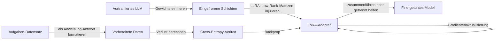

# Fine-Tuning

## Definition

Fine-Tuning setzt das Training eines vortrainierten Modells auf aufgabenspezifischen oder domänenspezifischen Daten fort. Vollständiges Fine-Tuning aktualisiert alle Parameter; parametereffiziente Methoden (z.B. LoRA, Adapter) aktualisieren eine kleine Teilmenge, um die Kosten zu reduzieren.

Verwenden Sie es, wenn Sie stabiles, aufgabenspezifisches Verhalten oder Stil benötigen (z.B. Domänensprache, Ausgabeformat) und genügend beschriftete Daten haben. Für häufig aktualisiertes Wissen oder einmalige Fragen sind [RAG](/docs/rag) oder [Prompt-Engineering](/docs/prompt-engineering) oft besser. Siehe [LLMs](/docs/llms) für die vollständige Trainings-Pipeline.

Parametereffiziente Fine-Tuning (PEFT)-Methoden, insbesondere **LoRA** (Low-Rank Adaptation), haben Fine-Tuning auf Consumer-Hardware praktikabel gemacht. LoRA friert die ursprünglichen Modellgewichte ein und injiziert trainierbare Low-Rank-Matrizen in die Attention-Projektionen; nur diese kleinen Matrizen werden aktualisiert und gespeichert. Das ursprüngliche Modell kann über viele LoRA-Adapter hinweg geteilt werden, jeder für eine andere Aufgabe oder Domäne spezialisiert. Quantisiertes LoRA (QLoRA) kombiniert 4-Bit-Quantisierung mit LoRA, was Fine-Tuning von 7B–70B-Modellen auf einer einzigen Consumer-GPU ermöglicht. Dies senkt die Hürde zur Domänenanpassung im Vergleich zum vollständigen Fine-Tuning erheblich.

## Funktionsweise



### Von einem Basismodell starten

Sie starten von einem **Basismodell** (z.B. einem vortrainierten [LLM](/docs/llms)) und einem **Datensatz** von Aufgabenbeispielen. Der Datensatz wird als Anweisung-Antwort-Paare formatiert (für Instruction-Tuning) oder als roher Domänentext (für fortgesetztes Vortraining).

### LoRA: Low-Rank-Adaptation

Anstatt alle Parameter zu aktualisieren, fügt LoRA trainierbare Matrizen A und B (wo Rang r ≪ d) zu Gewichtsmatrizen hinzu. Nur A und B werden trainiert; die ursprünglichen Gewichte sind eingefroren. Dies reduziert trainierbare Parameter um 99%+ und erreicht dabei nahezu vollständige Fine-Tuning-Qualität. Adapter können zur Inferenzzeit ohne Overhead in das Basismodell zusammengeführt werden.

### Validierung und Stoppen

Der **Validierungsverlust** auf einem gehaltenen Split leitet frühzeitiges Stoppen. Overfitting ist bei kleinen Datensätzen häufig; Techniken wie Gradientenklipping, kleine Lernraten (1e-4 bis 1e-5) und kurzes Training (1–3 Epochen) sind Standardpraxis.

## Wann verwenden / Wann NICHT verwenden

| Szenario | Fine-Tuning verwenden? | Hinweise |
|---|---|---|
| Domänenanpassung (rechtlich, medizinisch, Code) | Ja | Wenige hundert Beispiele können das Modellverhalten erheblich verändern |
| Konsistentes Ausgabeformat (JSON, Tabellen) | Ja | Zuverlässiger als Prompting allein |
| Häufig sich änderndes Wissen | Nein | RAG ist günstiger und aktueller |
| Einmalige Frage-Antwort | Nein | Few-Shot-Prompting reicht aus |
| Halluzinationen bei bekannten Fakten reduzieren | Teilweise | Für beste Ergebnisse mit RAG kombinieren |
| Budgetbeschränkt (\< $50) | Ja (LoRA) | QLoRA macht es auf Consumer-Hardware machbar |

## Vergleiche

| Methode | Aktualisierungen | Kosten | Qualität | Wann verwenden |
|---|---|---|---|---|
| Zero-Shot-Prompting | Keine | Niedrigste | Basislinie | Allgemeine Aufgaben |
| Few-Shot-Prompting | Keine | Niedrig | Gut | Formatanleitungen |
| Vollständiges Fine-Tuning | Alle Parameter | Sehr hoch | Bestes | Große Daten, maximale Leistung |
| LoRA Fine-Tuning | ~0,1–1% Parameter | Niedrig bis moderat | Nahezu vollständig | Praktische Domänenanpassung |
| RAG | Keine | Moderat (Retrieval) | Gut für Wissen | Live oder große Wissensdatenbanken |

## Vor- und Nachteile

| Vorteile | Nachteile |
|---|---|
| Starke aufgabenspezifische Leistung | Erfordert kuratierte beschriftete Daten |
| LoRA/QLoRA ist günstig und zugänglich | Risiko des katastrophalen Vergessens |
| Eingebautes Verhalten (kein Prompt-Engineering-Overhead) | Fine-getunete Modelle können immer noch halluzinieren |
| Portable Adapter-Dateien (MB, nicht GB) | Evaluation ist schwieriger als Prompting |

## Codebeispiele

```python
# LoRA Fine-Tuning mit Hugging Face PEFT und TRL (SFTTrainer)
# pip install transformers peft trl datasets bitsandbytes accelerate
from transformers import AutoTokenizer, AutoModelForCausalLM, BitsAndBytesConfig
from peft import LoraConfig, get_peft_model, TaskType
from trl import SFTTrainer, SFTConfig
from datasets import Dataset

# Kleiner Spielzeug-Datensatz — durch Domänendaten ersetzen
data = [
    {"text": "USER: What is LoRA? ASSISTANT: LoRA is a parameter-efficient fine-tuning technique that injects trainable low-rank matrices into frozen model weights."},
    {"text": "USER: Why use LoRA? ASSISTANT: LoRA reduces trainable parameters by 99%+ while achieving near-full fine-tuning quality, making it feasible on consumer GPUs."},
]
dataset = Dataset.from_list(data)

model_name = "facebook/opt-125m"  # winziges Modell zur Illustration; durch llama-3, mistral usw. ersetzen
tokenizer  = AutoTokenizer.from_pretrained(model_name)
tokenizer.pad_token = tokenizer.eos_token

# Modell laden (BitsAndBytesConfig für 4-Bit QLoRA bei größeren Modellen hinzufügen)
model = AutoModelForCausalLM.from_pretrained(model_name)

# LoRA-Konfiguration
lora_config = LoraConfig(
    task_type=TaskType.CAUSAL_LM,
    r=8,            # Rang
    lora_alpha=32,
    target_modules=["q_proj", "v_proj"],
    lora_dropout=0.05,
)
model = get_peft_model(model, lora_config)
model.print_trainable_parameters()   # druckt z.B. "trainable params: 0.05%"

# Trainieren
training_args = SFTConfig(
    output_dir="./lora-output",
    num_train_epochs=3,
    per_device_train_batch_size=1,
    logging_steps=1,
    save_strategy="no",
    dataset_text_field="text",
    max_seq_length=128,
)
trainer = SFTTrainer(model=model, train_dataset=dataset, args=training_args)
trainer.train()
print("Fine-Tuning abgeschlossen.")
```

## Praktische Ressourcen

- [Hugging Face – Ein vortrainiertes Modell fine-tunen](https://huggingface.co/docs/transformers/training) — Umfassende Anleitung mit Trainer-API
- [OpenAI – Fine-Tuning](https://platform.openai.com/docs/guides/fine-tuning) — API-basiertes Fine-Tuning für GPT-Modelle
- [PEFT-Bibliotheksdokumentation](https://huggingface.co/docs/peft) — LoRA, Adapter und andere PEFT-Methoden

## Siehe auch

- [LLMs](/docs/llms)
- [Prompt-Engineering](/docs/prompt-engineering)
