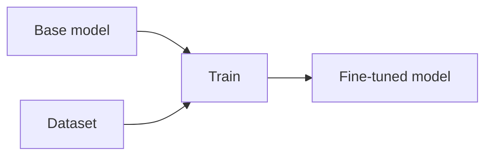

# Fine-Tuning

## Definition

Feinabstimmung setzt das Training eines vortrainierten Modells mit aufgaben- oder domänenspezifischen Daten fort. Full Feinabstimmung updates all parameters; parameter-efficient methods (z. B. LoRA, adapters) update a small subset to reduce cost.

Verwenden Sie es, wenn Sie brauchen stable, task-specific behavior or style (z. B. domain language, output format) and have enough labeled data. For frequently updated knowledge or one-off questions, [RAG](/docs/rag) or [prompt engineering](/docs/prompt-engineering) werden oft better. See [LLMs](/docs/llms) for die vollständige training pipeline.

## Funktionsweise

You start from a **base model** (z. B. ein vortrainiertes [LLM](/docs/llms)) and a **dataset** of task examples. You define a **loss** (z. B. cross-entropy for classification, next-token for generation) and run optimization (z. B. Adam) on your data. Das Ergebnis ist ein **feinabgestimmt model** whose weights are updated (fully or only adapters/LoRA). **Instruction tuning** uses (instruction, response) pairs sodass das model learns to follow prompts; **domain Feinabstimmung** uses in-domain text or labeled tasks. Validation and early stopping prevent overfitting; often only 1–5% of parameters are updated with LoRA to save compute.

## Anwendungsfälle

Fine-tuning is das richtige tool wenn Sie need a model to follow a specific style, domain, or task better than prompting alone.

- Adapting a base model to a specific domain (z. B. legal, medical)
- Teaching a consistent output format or style (z. B. JSON, tone)
- Improving performance on a narrow task mit begrenztem labeled data

## Externe Dokumentation

- [Hugging Face – Fine-tune ein vortrainiertes model](https://huggingface.co/docs/transformers/training)
- [OpenAI – Fine-tuning](https://platform.openai.com/docs/guides/fine-tuning)

## Siehe auch

- [LLMs](/docs/llms)
- [Prompt engineering](/docs/prompt-engineering)
