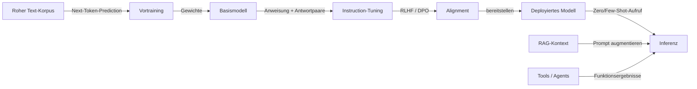

# Große Sprachmodelle (LLMs)

## Definition

Große Sprachmodelle sind transformer-basierte Modelle, die auf massiven Text- (und manchmal multimodalen) Daten trainiert wurden. Sie zeigen emergente Fähigkeiten: Few-Shot-Lernen, Reasoning und Tool-Nutzung bei Skalierung und Alignment (z.B. über RLHF).

Ein nützliches mentales Modell: **Vortraining** lernt Next-Token-Prediction auf riesigen Korpora und gibt dem Modell breites Wissen und Sprachfähigkeit. **Instruction-Tuning** (und ähnliches) trainiert das Modell, Benutzeranweisungen und -formate zuverlässig zu befolgen. **Alignment** (z.B. RLHF, DPO) formt das Verhalten, um hilfreich, ehrlich und sicher zu sein. Zur Inferenzzeit können Sie das Modell Zero-Shot, Few-Shot verwenden oder es mit Retrieval (RAG) oder Tools (Agents) augmentieren.

"Emergente Fähigkeiten" ist die wichtigste unterscheidende Eigenschaft von LLMs: Fähigkeiten, die nicht explizit trainiert wurden, aber mit der Skalierung entstehen. Chain-of-Thought-Reasoning, mehrstufige Arithmetik, Code-Synthese und In-Context-Lernen aus einer Handvoll Beispielen entstehen alle ab bestimmten Modellgrößen und Datenmengen. Dies macht LLMs grundlegend anders als eng trainierte Aufgabenmodelle — ein einzelnes LLM kann Dutzende spezialisierter Klassifizierer durch sorgfältiges [Prompt-Engineering](/docs/prompt-engineering), [Fine-Tuning](/docs/llms/fine-tuning) oder [RAG](/docs/rag) ersetzen. Die praktische Konsequenz ist, dass LLM-gesteuerte Anwendungen eine andere Evaluierungsdisziplin erfordern: Neben der Genauigkeit müssen Sie auf Halluzinationen, Ablehnungsverhalten, Toxizität und Robustheit gegenüber Verteilungsverschiebungen testen.

## Funktionsweise



### Vortraining

Das **Basismodell** wird auf Billionen von Tokens mit Next-Token-Prediction (Cross-Entropy-Verlust) trainiert. Diese Phase ist rechenintensiv (Tausende von GPU-Tagen) und produziert ein Modell mit breitem Weltwissen und sprachlicher Flüssigkeit.

### Instruction-Tuning und Alignment

**Instruction-Tuning** verwendet (Anweisung, Antwort)-Paare, damit das Modell lernt, Prompts zuverlässig zu befolgen. **Alignment** (RLHF, DPO, Constitutional AI) verwendet menschliches Feedback oder KI-generierte Signale, um hilfreiche, ehrliche und sichere Antworten zu belohnen und schädliche zu bestrafen.

### Inferenz-Augmentierung

Zur Inferenzzeit kann das deployierte Modell Zero-Shot, Few-Shot oder augmentiert aufgerufen werden. **RAG** injiziert abgerufene Dokumente in den Prompt-Kontext. **Agents** geben dem Modell Zugang zu externen Tools (Suche, Code-Ausführung, APIs) und laufen weiter, bis eine Aufgabe abgeschlossen ist.

## Wann verwenden / Wann NICHT verwenden

| Szenario | LLM verwenden? | Hinweise |
|---|---|---|
| Natürlichsprachliche Aufgaben (Zusammenfassung, QA, Chat) | Ja | LLMs sind die Standardwahl |
| Strukturierte Vorhersage (z.B. eine SQL-Tabelle füllen) | Mit Vorsicht | Fine-getunete oder geprompte LLMs funktionieren; Ausgaben validieren |
| Strikte Determinismus erforderlich (z.B. Abrechnungslogik) | Nein | Deterministischen Code verwenden; LLMs sind probabilistisch |
| Häufig aktualisierte Wissensbasis | RAG verwenden | Fine-Tuning ist teuer für sich schnell ändernde Daten |
| Enge Aufgabe mit reichlichen beschrifteten Daten | Mit Vorsicht | Ein kleineres fine-getuntes Modell kann günstiger und schneller sein |
| Niedrige Latenz, hoher Durchsatz in der Produktion | Mit Vorsicht | Kosten pro Token profilieren; destillierte Modelle können ausreichen |

## Vergleiche

| Ansatz | Am besten für | Benötigte Daten | Kosten |
|---|---|---|---|
| Zero-Shot-Prompting | Schnelles Prototyping, allgemeine Aufgaben | Keine | Niedrig (API-Aufrufe) |
| Few-Shot-Prompting | Konsistentes Format, seltene Aufgaben | Wenige Beispiele | Niedrig |
| RAG | Wissensintensives QA, Live-Daten | Retrieval-Korpus | Moderat |
| Fine-Tuning | Domänenanpassung, spezifischer Stil | Hunderte bis Tausende | Hoch (Training) |

## Vor- und Nachteile

| Vorteile | Nachteile |
|---|---|
| Flexibel, ein Modell für viele Aufgaben | Kosten und Latenz |
| Starke Few-Shot-Leistung | Halluzination und Bias |
| Ermöglicht Agents und Tool-Nutzung | Erfordert sorgfältige Evaluation |
| Verbessert sich schnell mit neuen Releases | Nichtdeterministische Ausgaben |

## Codebeispiele

```python
# Zero-Shot und Few-Shot Prompting mit dem OpenAI SDK
from openai import OpenAI

client = OpenAI()  # OPENAI_API_KEY aus der Umgebung

def call_llm(messages: list[dict], model: str = "gpt-4o-mini") -> str:
    response = client.chat.completions.create(
        model=model,
        messages=messages,
        temperature=0.0,
        max_tokens=256,
    )
    return response.choices[0].message.content.strip()

# Zero-Shot-Beispiel
zero_shot = call_llm([
    {"role": "system", "content": "Classify the sentiment of the input as positive or negative. Reply with one word."},
    {"role": "user",   "content": "The delivery was fast and the product quality exceeded my expectations!"},
])
print(f"Zero-Shot: {zero_shot}")

# Few-Shot-Beispiel
few_shot_messages = [
    {"role": "system", "content": "Classify sentiment. Reply with one word."},
    {"role": "user",   "content": "Horrible service."},
    {"role": "assistant", "content": "Negative"},
    {"role": "user",   "content": "Best purchase I have ever made!"},
    {"role": "assistant", "content": "Positive"},
    {"role": "user",   "content": "It arrived late but the item is fine."},
]
few_shot = call_llm(few_shot_messages)
print(f"Few-Shot: {few_shot}")
```

## Praktische Ressourcen

- [OpenAI – Modellübersicht](https://platform.openai.com/docs/models) — GPT-Modellfamilien und -fähigkeiten
- [Google AI for Developers](https://ai.google.dev/) — Gemini-Modelle, APIs und Anleitungen
- [Anthropic – Modelle](https://www.anthropic.com/product) — Claude-Dokumentation und API
- [Hugging Face – NLP-Kurs](https://huggingface.co/learn/nlp-course/) — Von Transformern zu fine-getunten LLMs

## Siehe auch

- [Fine-Tuning](/docs/llms/fine-tuning)
- [Prompt-Engineering](/docs/prompt-engineering)
- [RAG](/docs/rag)
- [Agents](/docs/agents)
