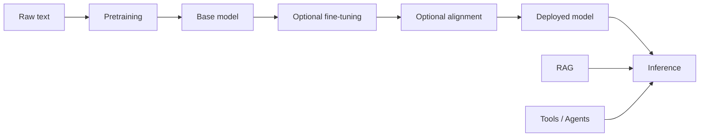

# Große Sprachmodelle (LLMs)

## Definition

Große Sprachmodelle sind transformerbasierte Modelle, die auf massiven Text- (und manchmal multimodalen) Daten trainiert werden. They exhibit emergent abilities: few-shot learning, Schlussfolgern, and tool use when scaled and aligned (z. B. via RLHF).

Ein nützliches mentales Modell: **Vortraining** lernt Next-Token-Vorhersage auf großen Korpora und verleiht dem Modell breites Wissen und Sprachfähigkeit. **Instruktionsabstimmung** (und ähnliches) trainiert das Modell, Benutzeranweisungen und -formate zu befolgen. **Alignment** (z. B. RLHF, DPO) shapes behavior to be helpful, honest, and safe. Zur Inferenzzeit können Sie das Modell Zero-Shot, Few-Shot verwenden oder mit Retrieval (RAG) oder Werkzeugen (Agenten) erweitern.

## Funktionsweise

**Pretraining** learns Next-Token-Vorhersage on large corpora and erzeugt a base model. **Optional Feinabstimmung** (z. B. [Feinabstimmung](/docs/llms/fine-tuning)) adapts it to tasks or instruction formats; **alignment** (z. B. RLHF, DPO) optimizes human preference and safety. The **deployed model** is then used at **inference** time. You can call it zero-shot (no examples), few-shot (with [prompt engineering](/docs/llms/prompt-engineering)), or augment it with [RAG](/docs/rag) (Abruf as context) or [agents](/docs/agents) (tools and loops). Das Diagramm fasst zusammen the training pipeline and the two main inference augmentations.

## Anwendungsfälle

LLMs are used wherever you need flexible language understanding or generation, from chat to code to analysis.

- Chat, summarization, and translation
- Code assistance and generation
- Question answering and research assistance (often with RAG or tools)

## Vor- und Nachteile

| Pros | Cons |
|------|------|
| Flexible, one model for many tasks | Cost and latency |
| Strong few-shot performance | Hallucination, bias |
| Enables agents and tool use | Requires careful evaluation |

## Externe Dokumentation

- [OpenAI – Models overview](https://platform.openai.com/docs/models) — GPT and capabilities
- [Google AI for Developers](https://ai.google.dev/) — Gemini and APIs
- [Anthropic – Models](https://www.anthropic.com/product) — Claude and documentation
- [Hugging Face – NLP course](https://huggingface.co/learn/nlp-course/) — From transformers to LLMs

## Siehe auch

- [Fine-tuning](/docs/llms/fine-tuning)
- [Prompt engineering](/docs/llms/prompt-engineering)
- [RAG](/docs/rag)
- [Agents](/docs/agents)
