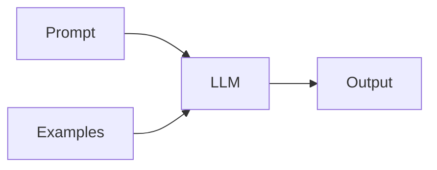

# Prompt-Engineering

## Definition

Prompt Engineering ist die Praxis, Eingabetexte (Prompts) zu gestalten, um gewünschtes Verhalten von LLMs zu erzielen: Aufgabenformat, Few-Shot-Beispiele, Chain-of-Thought, Rollenspiel und Einschränkungen.

Es ist the primary way to steer [LLMs](/docs/llms) without [Feinabstimmung](/docs/llms/fine-tuning): you control context, format, and examples in the prompt. Combined with [RAG](/docs/rag), prompts often include retrieved passages; with [agents](/docs/agents), they define tool use and Schlussfolgern style.

## Funktionsweise

You compose a **prompt** (system message, task description, constraints) und optional **examples** (few-shot). The **LLM** takes this as input and erzeugt an **output**. **Zero-shot** uses only instructions; **few-shot** adds example input-output pairs sodass das model infers the task. **Chain-of-thought** (see [CoT](/docs/reasoning-patterns/cot)) asks the model to “think Schritt für Schritt” to improve Schlussfolgern. **Structured output** (z. B. “respond in JSON”) can be enforced via parsing or API options. Iterate on prompt wording and examples, and evaluate on a dev set to improve reliability.

## Anwendungsfälle

Prompt engineering ist immer wichtig, wenn you call an LLM: it shapes behavior, format, and Schlussfolgern without changing weights.

- Steering chat and task completion (role, format, examples)
- Eliciting Schlussfolgern (chain-of-thought) for math or logic
- Constraining outputs (JSON, length, tone) for APIs or UX

## Externe Dokumentation

- [OpenAI – Prompt engineering guide](https://platform.openai.com/docs/guides/prompt-engineering)
- [Anthropic – Prompt Entwurf](https://docs.anthropic.com/en/docs/build-with-claude/prompt-engineering/overview)

## Siehe auch

- [LLMs](/docs/llms)
- [Chain-of-thought](/docs/reasoning-patterns/cot)
- [RAG](/docs/rag)
