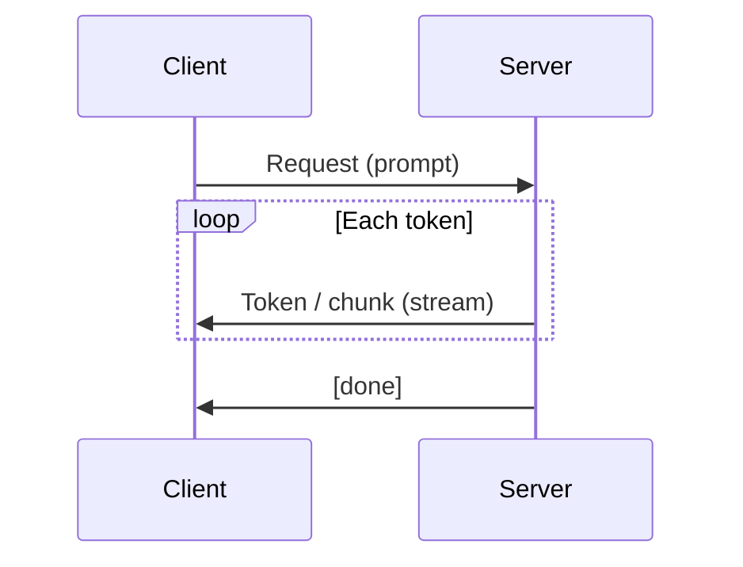

# Streaming (LLMs)

## Definition

Streaming bedeutet die Rückgabe von [LLM](/docs/llms) Ausgabe **Token für Token** (oder Stück für Stück) bei der Generierung, anstatt auf die vollständige Antwort zu warten. Benutzer sehen Text inkrementell erscheinen, was die **wahrgenommene Latenz** senkt und Chat- und Assistenz- [use cases](/docs/llms).

Es ist supported by most LLM APIs (OpenAI, Anthropic, Gemini, open-source servers like vLLM) via Server-Sent Events (SSE) or similar protocols. The same [prompt engineering](/docs/prompt-engineering) and [RAG](/docs/rag) or [agents](/docs/agents) patterns apply; only the response delivery is incremental.

## Funktionsweise

The **client** sends a request mit dem prompt (and optional [RAG](/docs/rag) context or tool results). The **server** runs the model autoregressively and, anstatt buffering die vollständige output, **pushes** each new token (or a small chunk of tokens) to the client as soon as it is generated. The client **renders** tokens as they arrive (z. B. in a chat UI). Connection stays open until the model emits an end-of-sequence token or the client stops the stream.

## Anwendungsfälle

Streaming ist der Standard für chat and any interactive use where users expect to see progress immediately.

- Chat UIs and assistants where text should appear as it is generated
- Long-form generation (summaries, code) to show progress and allow early cancellation
- Reducing perceived latency when full response would take several seconds

## Externe Dokumentation

- [OpenAI – Streaming](https://platform.openai.com/docs/api-reference/streaming)
- [Anthropic – Streaming](https://docs.anthropic.com/en/api/streaming)
- [vLLM – Streaming](https://docs.vllm.ai/en/latest/serving/openai_compatible_server.html#streaming)

## Siehe auch

- [LLMs](/docs/llms)
- [Prompt engineering](/docs/prompt-engineering)
- [Local inference](/docs/local-inference)
