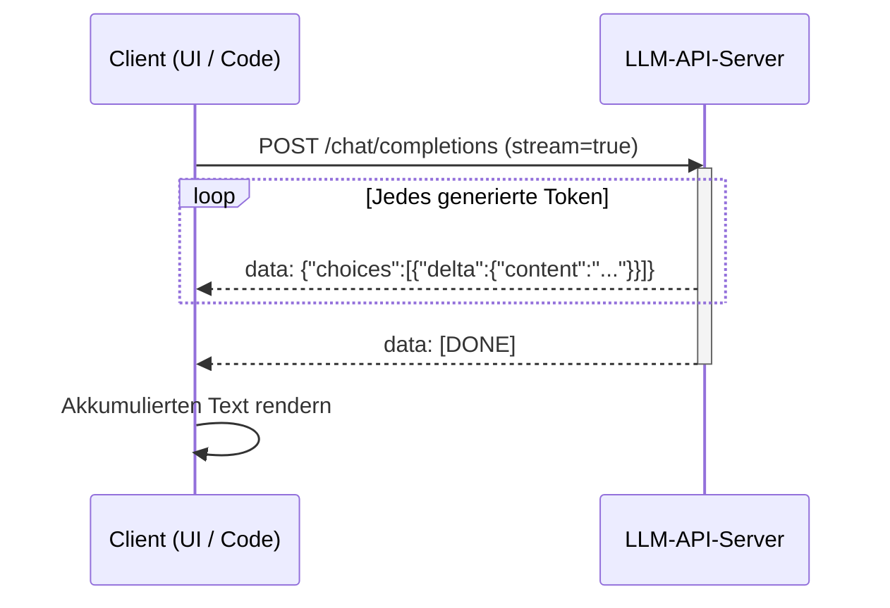

# Streaming (LLMs)

## Definition

Streaming bedeutet, [LLM](/docs/llms)-Ausgaben **Token für Token** (oder Chunk für Chunk) zurückzugeben, während sie generiert werden, anstatt auf die vollständige Antwort zu warten. Benutzer sehen, wie Text inkrementell erscheint, was die **wahrgenommene Latenz** senkt und Chat- und Assistenten-[Anwendungsfälle](/docs/llms) verbessert.

Es wird von den meisten LLM-APIs (OpenAI, Anthropic, Gemini, Open-Source-Server wie vLLM) über Server-Sent Events (SSE) oder ähnliche Protokolle unterstützt. Dieselben [Prompt-Engineering](/docs/prompt-engineering)- und [RAG](/docs/rag)- oder [Agents](/docs/agents)-Muster gelten; nur die Antwortlieferung ist inkrementell.

Der Benutzerfreundlichkeitsunterschied zwischen Streaming und Nicht-Streaming ist in der Praxis groß: Eine Antwort, die 10 Sekunden zum Abschluss braucht, fühlt sich nahezu sofort an, wenn das erste Token innerhalb von 200 ms ankommt. Diese "Time to First Token" (TTFT)-Metrik ist für interaktive Anwendungen genauso wichtig wie der Durchsatz. Streaming ermöglicht auch **frühzeitige Stornierung** — wenn das Modell beginnt, eine zielverfehlende Antwort zu generieren, kann der Benutzer oder die Anwendung den Stream sofort stoppen, was Rechenzeit spart. Für lang-formige Ausgaben wie Code-Generierung oder Dokumenterstellung bietet Streaming sichtbaren Fortschritt, der das Vertrauen der Benutzer aufbaut.

## Funktionsweise



### Serverseitige Generierung

Der **Client** sendet eine Anfrage mit dem Prompt (und optionalem [RAG](/docs/rag)-Kontext oder Tool-Ergebnissen) mit `stream=True`. Der **Server** führt das Modell autoregressiv aus und anstatt die vollständige Ausgabe zu puffern, **schiebt** er jedes neue Token (oder einen kleinen Chunk von Tokens) als SSE-Ereignis an den Client, sobald es generiert wird.

### Clientseitige Darstellung

Der Client **empfängt** und **rendert** Tokens, wenn sie ankommen (z.B. durch Anhängen an eine Chat-UI). Jedes SSE-Ereignis enthält ein JSON-Delta mit dem neuen Inhaltsfragment. Die Verbindung bleibt offen, bis das Modell ein End-of-Sequence-Token ausgibt oder der Server `[DONE]` sendet.

### Stornierung und Fehlerbehandlung

Der Client kann die Verbindung jederzeit schließen, um die Generierung zu stornieren. Produktionsimplementierungen sollten partielle Antworten ordnungsgemäß behandeln (z.B. unvollständige JSON-Tool-Aufrufe) und Wiederverbindungslogik für unterbrochene Verbindungen implementieren.

## Wann verwenden / Wann NICHT verwenden

| Szenario | Streaming verwenden? | Hinweise |
|---|---|---|
| Chat- und Assistenten-UIs | Ja | Standard für alle interaktiven Textausgaben |
| Langform-Inhaltsgenerierung | Ja | Zeigt Fortschritt, ermöglicht frühzeitige Stornierung |
| Batch-Verarbeitung / Offline-Jobs | Nein | Nicht-Streaming ist einfacher und gleich schnell |
| Strukturierten JSON-Output parsen | Mit Vorsicht | Nur parsen, wenn `[DONE]` empfangen wurde |
| Tool-Aufruf-Ergebnisse, die von vollständiger Ausgabe abhängen | Nein | Auf vollständige Antwort warten, bevor gehandelt wird |
| Webhook / Async-Pipelines | Nein | Fire-and-Forget ist einfacher |

## Vergleiche

| Funktion | Streaming | Nicht-Streaming |
|---|---|---|
| Zeit bis zum ersten Token | Sehr niedrig | Hoch (wartet auf vollständige Antwort) |
| Wahrgenommene Latenz | Niedrig | Hoch |
| Frühzeitige Stornierung | Ja | Nein |
| Implementierungskomplexität | Moderat | Niedrig |
| Am besten für | Interaktive UI, lange Antworten | Batch-Jobs, kurze Antworten |

## Vor- und Nachteile

| Vorteile | Nachteile |
|---|---|
| Dramatisch niedrigere wahrgenommene Latenz | Komplexere Client-Implementierung |
| Ermöglicht frühzeitige Stornierung | Partielle Ausgabe erschwert strukturiertes Parsen |
| Bessere Benutzerfreundlichkeit für Chat-UIs | Erfordert persistente Verbindung |
| Ermöglicht progressives Rendering langer Ausgaben | Fehlerwiederherstellung ist komplexer |

## Codebeispiele

```python
# Streaming-Chat-Vervollständigung mit OpenAI SDK
from openai import OpenAI
import sys

client = OpenAI()  # OPENAI_API_KEY aus der Umgebung

def stream_response(prompt: str, system: str = "You are a helpful assistant.") -> str:
    """Tokens zu stdout streamen und den vollständigen akkumulierten Text zurückgeben."""
    full_text = []

    stream = client.chat.completions.create(
        model="gpt-4o-mini",
        messages=[
            {"role": "system",  "content": system},
            {"role": "user",    "content": prompt},
        ],
        stream=True,
        temperature=0.7,
        max_tokens=512,
    )

    for chunk in stream:
        delta = chunk.choices[0].delta
        if delta.content:
            print(delta.content, end="", flush=True)
            full_text.append(delta.content)

    print()  # Zeilenumbruch nach Stream-Ende
    return "".join(full_text)


# Beispielverwendung
if __name__ == "__main__":
    prompt = "Explain token streaming in LLMs in three short paragraphs."
    result = stream_response(prompt)
    print(f"\nGesamtzeichen: {len(result)}")
```

## Praktische Ressourcen

- [OpenAI – Streaming](https://platform.openai.com/docs/api-reference/streaming) — Offizielle OpenAI Streaming-API-Referenz
- [Anthropic – Streaming](https://docs.anthropic.com/en/api/streaming) — Claude-Streaming-Dokumentation
- [vLLM – Streaming](https://docs.vllm.ai/en/latest/serving/openai_compatible_server.html#streaming) — Open-Source-Serving mit Streaming-Unterstützung

## Siehe auch

- [LLMs](/docs/llms)
- [Prompt-Engineering](/docs/prompt-engineering)
- [Lokale Inferenz](/docs/local-inference)
